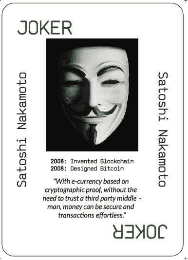

# 这场荒谬的说唱之战总结了支持和反对加密货币的观点

> 原文：<https://www.freecodecamp.org/news/this-absurd-rap-battle-summarizes-the-arguments-for-and-against-cryptocurrency/>

一个说唱战斗小组复活了亚历山大·汉密尔顿，这样他就可以对抗中本聪了。

在一场愚蠢的(PG 级)说唱之战中，汉密尔顿和 Satoshi 讨论了集中式和分散式货币背后的优点。

亚历山大·汉密尔顿是美国的开国元勋之一，他是乔治·华盛顿政府的第一任财政部长。他是律师、银行家，也是财政和货币政策集中控制的倡导者。

是的，他还是百老汇剧中的那个汉密尔顿。

汉密尔顿由史诗说唱战斗的历史名人埃皮克洛德(EpicLloyd)饰演。)

中本聪是区块链和比特币加密货币的创造者。没有人知道他长什么样，或者他是否是一个真实的人。(是的——这一点在说唱之战中得到了解决)。

Satoshi Nakamoto's [Programmer Playing Card](https://www.freecodecamp.org/news/shop).

中本聪由一个未加掩饰的 TimothyDeLaGhetto 扮演。

在 6 分钟的视频中，说唱歌手们互相交换意识形态上的打击。

汉密尔顿提出了比特币的高交易成本、可扩展性问题和能耗问题。

中本聪抨击了无法追踪的现金是如何助长犯罪的，以及巨型银行的存在是如何需要纳税人救助的。

以下是完整视频:

[https://www.youtube.com/embed/JaMJi1_1tkA?feature=oembed](https://www.youtube.com/embed/JaMJi1_1tkA?feature=oembed)

以下是完整的歌词，以防你不想被人看到坐在办公桌前手拿火枪看亚历山大·汉密尔顿说唱。(但是真的——你应该看。)

[亚历山大·汉密尔顿]
在我们开始之前，每个人都帮我一个忙，
读一读我写的小东西，叫做《联邦党人文集》。
我解释说，如果没有一个强有力的中央政府来维持国家的生存，一个国家是不可能生存的
，
当我创立中央银行的时候，杰弗逊说我坏话，
现在每张 10 美元的钞票上都印着我的脸。当美国缺钱的时候，我挺过去了，
现在一些神经病制造密码，我们的国家倒退了？

【中本聪】
分散货币。是的，是我发明的。
我敢肯定，许多政府希望他们已经阻止了它
他们的国家现金是他们如何保持控制，
但人民的自由是我的最终目标。
我是假名吗？一群男人？这都不重要。我发明了比特币，因为菲亚特是一场灾难。日本人还是该死的全息图？我是 crypto 开放季开始的原因。

有人知道这个密码是什么意思吗？
对我来说，听起来像是新的快速破产计划，
一群来自全国各地的傻瓜
投资他们甚至不了解的东西，
购买莱特币，Dash，比特币现金，
这一切都将崩溃，并在一瞬间消失。所有这些没有支持的钱都是不理智的恶作剧，我会笑到我的国家银行。

[中本聪]
哈哈哈哈哈哈，耶哥们，超级搞笑，
好像现在银行还在帮人赚钱。
富人越来越富，我们像绵羊一样跟随，
银行服务于华尔街，加密服务于所有街道，
对加密的兴趣正在迅速上升
你目前的兴趣是什么？半个百分点？
对不起，银行已经过了巅峰时期
但我希望信息加密，而不是被黑客攻击和泄露。

[亚历山大·汉密尔顿]
如果这个密码系统是我们的救星，
它需要集中化，需要监管。
如果我们的中央数据库…你怎么说，“被黑了？”
保险公司只会立案让你退钱。
因为事实上，它是被追踪的，钱会留下痕迹。
中央货币强势，加密货币弱势。无法追踪的钱——哇，太聪明了。你地址中的一个错别字？现在一去不复返了。

[中本聪]
密码很脆弱？这就是你的教训的精髓？
你的钱留下痕迹？是啊，走向衰退。
一群富有的白人创造了这个系统。
他们为什么要改变这一切，因为这让他们成为了富人！
电影大亨们极力反对录像机。马车制造商都对汽车恨之入骨。那么，我为什么要接受银行的建议呢？我不需要救助来生存。谢了。

【中本聪的备份歌手】
这个系统太破了。我们需要那个加密令牌。

【亚历山大·汉密尔顿的备份歌手】
系统没有被破坏。我们能信任加密令牌吗？

它必须是集中的！

【中本聪】
放权！

【亚历山大汉密尔顿】
集权！

【中本聪】
放权！

我们需要控制！

[中本聪]
自由企业！

【辩论主持人】
给我拿来事实。
请作证。

[中本聪]菲亚特是政府控制民众的方式。

政府保护它的人民。所有这些都是显而易见的。他们维护和平，因此他们保持控制。
你想让我们被没人知道的秘密矿工统治。

哦，又是那个“强大的中央政府”了。他们保护人民，但只保护他们的公民。
加密没有国界，它是真正的全球货币。
以及对急需审查的人的抵制。

银行通过承担责任来赢得信任。
你知道一把钥匙，我们明确地知道客户。
真正的聪恕请起立？
不，当 crypto 崩溃时，你仍然会躲起来。

[中本聪]
你不需要相信人民，你只需要相信准则。每个记录都在网络中，你只是其中的一个节点。
当你发现一个漏洞时，会有一个软件更新。
现在尝试更新现金。去吧，我等着。

【亚历山大汉密尔顿】
等等？现金管用！你马上付钱。加密是一种糟糕得多的交易媒介。
不能比特币牙医，不能比特币我的早餐。
甚至不能在比特币大会上使用比特币。

没有一种货币是从普遍采用开始的。
地方把它变成一个选项需要时间。
再加上数十亿人没有银行账户。没有存款，没有利息，没有退票的支票。

你在拯救世界？但是你付出的代价是什么？
你创造的唯一变化是气候变化。
遍布大地的电网。
过热，没人需要，希望全部被禁。

【中本聪】
来自纸币之王，虚伪！
对于一式三份的账单和表格，你正在毁掉所有的树。
不喜欢我的异能用法？别再针对我的权利了。
我拥有自己购买的电力，市场决定价格。

如果这是秘密之夜，天会变得很黑。他们用你的货币犯罪，那是你的克星。

[中本聪]大多数犯罪都是本杰明干的，而不是区块链。大多数美元带有微量可卡因是有原因的。

你的工作证明呢？那纯粹是推测。那些暗网黑市需要更多的监管。

世界上最大的货币。而这个让情况变得更糟？
180 现在，比特币是第 181 个。

不是货币本身，而是方法，伙计。没有一个中心计划，你无法建造持久的东西。

[中本聪]
加密是对集中式模型的一种平衡。
导致事情分崩离析。这个中心不能关闭。

如果你最终遇到问题，我会为你感到难过，孩子。

[中本聪]
我有 99 个问题，但一点也不算。