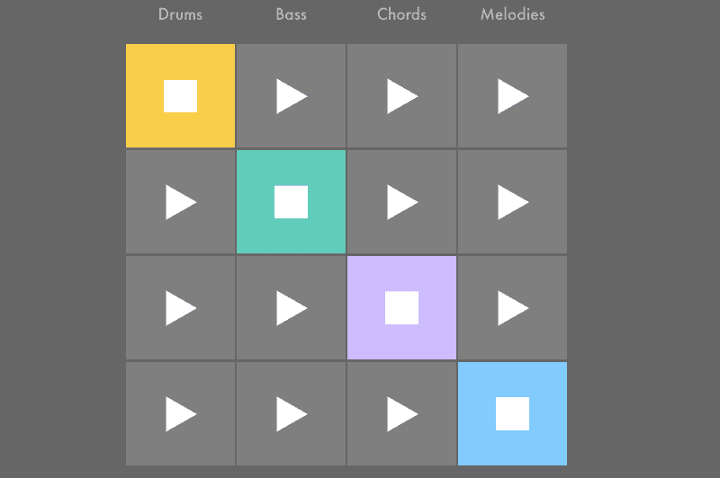
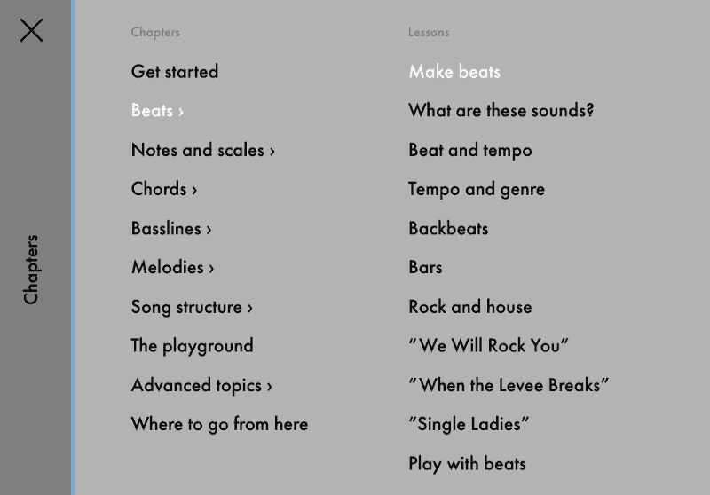
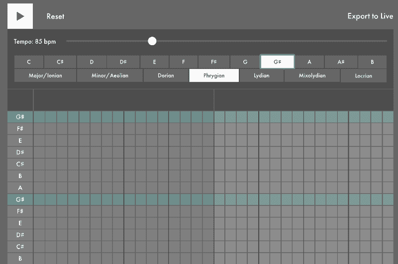
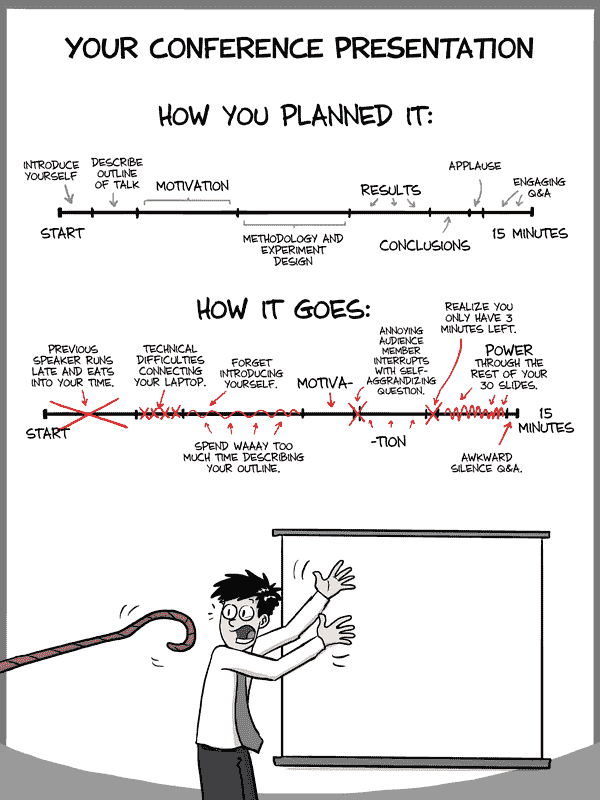
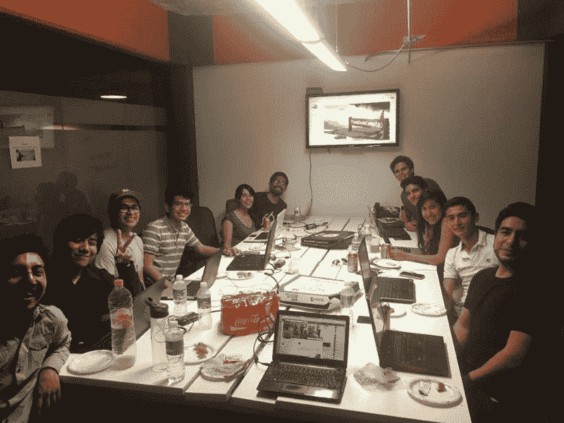

# 这个免费的课程可以在不到一个小时的时间里教会你音乐编程的基础知识

> 原文：<https://www.freecodecamp.org/news/this-free-course-can-teach-you-music-programming-basics-in-less-than-an-hour-67f8a6f283f/>

总部位于柏林的音乐软件公司 Ableton 刚刚发布了一个可以在你的浏览器上运行的免费互动音乐课程。

他们的 web 应用程序让我印象深刻的一点是它的构建非常好。例如，如果您更改标签，音乐将淡出，然后当您返回时再淡入。如果您启动一个序列器，然后向下滚动并启动另一个序列器，它会自动暂停第一个序列器。

它也有有趣的，易于理解的音乐编程界面。

如果你喜欢听音乐，但不太了解音乐在结构层面上是如何运作的，[这门课是为你准备的](https://fcc.im/2pzQ3uY)。

它会教你一些流行歌曲中的原则，如奎因的“我们会摇滚你”和比约克的“我的军队”。

我喜欢学习如何创作基本节拍，并注意到自己在回放过程中现场调整它们时咧嘴笑了。

本课程也略微涉及旋律、音阶和一些高级主题。

如果你已经是一名音乐家，你可以直接跳到他们的[在线游乐场](https://fcc.im/2r14bxj)开始创作循环。

这是交互式在线学习的一个很好的例子。我很兴奋地看到在浏览器中还可以交互式地教授其他什么技能。

### 这里有三个值得你花时间的链接:

1.  9 个永远消失的热门在线课程…以及如何找到它们( [7 分钟阅读](https://fcc.im/2plfKDj))
2.  如何制作完美的 app 图标( [5 分钟阅读](https://fcc.im/2r0LABK))
3.  专业前端开发人员 Jesse Weigel 最近开始在我们的 YouTube 频道上进行直播。在这个视频中，他将带领你设计和构建一系列的实体 UI 卡元素( [44 分钟观看](https://fcc.im/2q6H6Km))

### 想到这一天:

> 一般来说，软件系统只有在实际应用中被使用过，并多次失败后，才能正常工作—戴夫·帕纳斯

### 今日趣事:

网络漫画作者[博士漫画](https://fcc.im/2qsR9wE)

### 今日学习小组:

墨西哥城自由代码营

编码快乐！

–昆西·拉森，自由代码营的老师

如果你从这些邮件中获得了价值，请考虑[支持我们的非营利组织](http://bit.ly/donate-to-fcc)。