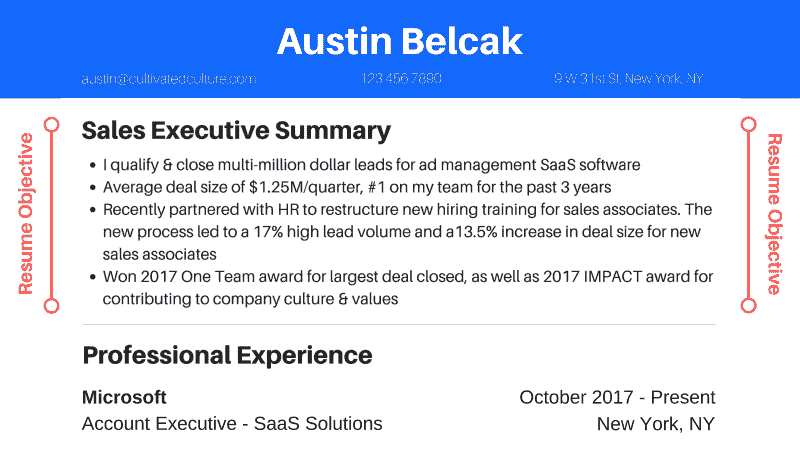
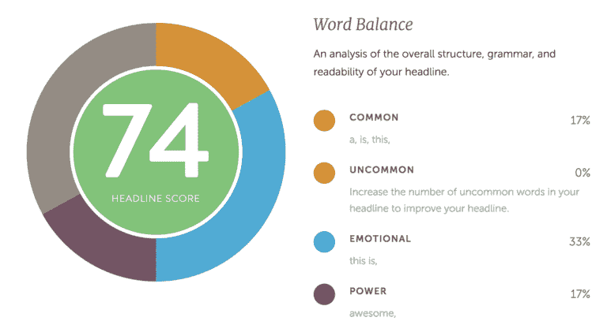
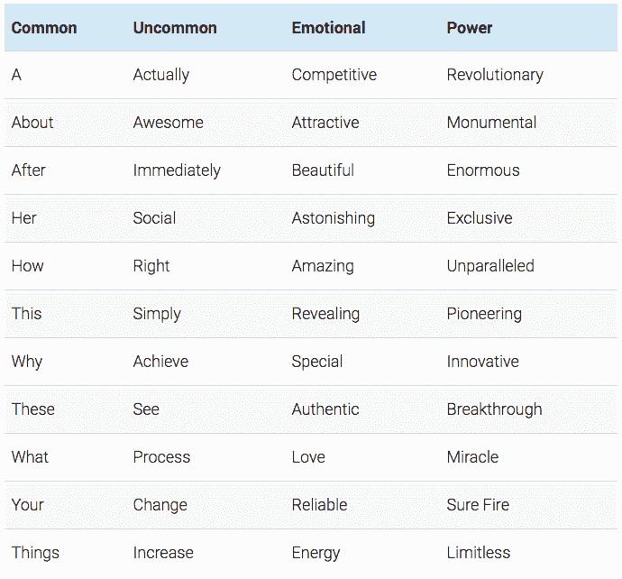
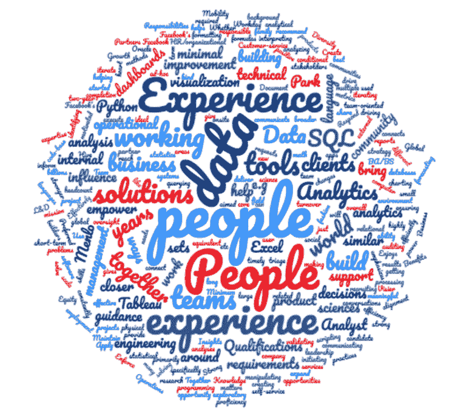

# 这是你被录用所需要的唯一的简历客观建议

> 原文：<https://www.freecodecamp.org/news/this-is-the-only-resume-objective-advice-you-need-to-get-hired-8b7b52d80b3a/>

奥斯汀·贝尔卡克

# 这是你被录用所需要的唯一的简历客观建议

#### 对简历的这一部分稍加调整，你的面试率会提高两倍——以下是实现这一点的方法。

一份好的简历目标是获得面试机会和把你的申请扔进垃圾桶的区别。

原因如下:

你可能听说过雇主平均花 6 秒钟浏览你的简历。但是你知道他们大部分时间在哪里度过吗？

扫描简历目标。

这是他们确定候选人资格(或取消候选人资格)的最简单的方法，这就是为什么你要以一种容易理解的方式构建你的目标，并从第一枪就抓住你的潜在雇主是至关重要的。

朋友，这说起来容易做起来难。如果你在谷歌上搜索“简历目标”，你可能会遇到一堆相互矛盾的建议，让你感到疑惑:

*   你应该使用简历目标、摘要还是简介？
*   这一部分应该是书面段落还是简短的项目符号？
*   你应该包括什么信息(以及你应该省略什么)？
*   您如何将通用模板应用于您的具体情况和行业？

至少我在找工作的时候寻求帮助的时候是这样的感觉。本文旨在改变这种情况。这将是你制作简历的一站式服务，它可以实现一个目标:让你获得面试和工作机会。

以下是我们将要讲述的内容:

*   为什么简历目标对击败竞争对手和获得面试机会至关重要
*   制作简历目标的三个简单步骤让你第一次被录用
*   人们在目标上犯的四个令人难以置信的常见错误让他们失去了面试的机会
*   不同行业和场景的三个简历目标示例

一旦你写完这篇文章，就去看看这篇关于写简历的指南，这将会让你真正被录用(第一次)。

### 什么是简历目标(为什么你应该关心)？

您的简历目标是出现在简历上您的姓名和联系信息下方的第一部分:

一个高效的目标包括 3-5 个与工作描述最相关的经历和令人信服的结果。

其他职业网站和“专家”可能会提倡不同的形式。自从创建了 Cultivated Culture，我的办公桌上就有数千份简历，这让我有机会测试每种风格，收集数据，并监控成功。我将在本文中向您介绍的子弹式格式优于其他所有格式。

它专门设计来吸引读者，突出他们用来确定候选人资格的信息，并以易于理解的格式交付。以下是项目符号式和段落式简历目标的快速对比(针对对外销售职位):

**项目符号样式示例**

*   管理一个由六个人组成的对外销售团队，平均完成 123%的配额，并负责去年 40%的净新销售额
*   重组了推介流程，纳入了“挑战者销售”方法，使销售额增加了 15%，平均交易规模增加了 29%
*   拥抱的创始人，这是一个专注于将多元化和包容性融入我们公司文化核心的内部团队

**段落样式示例**

在[公司]，我负责管理一个由六名销售人员组成的团队，他们有着持续超额完成定额的记录，去年为公司贡献了大约 40%的净销售额。

最近，我重组了我们的销售推介流程，从最初接触到结束，融入了“挑战者销售”的思维模式。与之前的流程相比，它帮助我们将销售通过率提高了 15%，并将平均交易规模提高了 29%。

最后，多元化和包容性是我的一大爱好。我创建了一个名为“拥抱”的小组，旨在帮助将多样性和包容性作为我们公司文化的核心支柱。

看到子弹样式是如何从第一颗子弹就把你钩住，而且更容易消化了吗？这就是我们想要的。在一个平均空缺职位有 300 多份申请的世界里，尽早抓住注意力并让信息非常容易理解是你在竞争中脱颖而出的关键。

也就是说，并非所有子弹式的目标都是平等的。如果你的文章不够吸引人，没有传达出读者想要的信息，你的简历就会被扔掉。这里有一个好的和不好的要点式简历目标的例子:

**“坏”例子**

*   负责管理由六名对外销售助理组成的团队
*   重组了我们的推介流程，以增加销售额和收入
*   帮助成立了一个内部小组，致力于提高对多元化和包容性的认识

这些要点非常模糊，没有提供任何切实的价值。这些子弹可能适用于 2018 年进步公司的任何销售经理——这个人没有希望在申请人中脱颖而出。让我们看看如何重新措辞，让这个人的简历目标更加突出:

**“好”的例子**

*   管理一个由六个人组成的对外销售团队，平均完成 123%的配额，并负责去年 40%的净新销售额
*   重组了推介流程，纳入了“挑战者销售”方法，使销售额增加了 15%，平均交易规模增加了 29%
*   “拥抱”的创始人，这是一个专注于将多元化和包容性融入公司文化核心的内部团队

如果你是一名招聘经理，正在翻阅你的第五叠简历，哪一份会引起你的注意？

### 制作简历目标的三个步骤

现在，我将向你展示一个简单的 3 步公式，你可以用它来确保你写的目标能穿透废话，简单地得到结果:

#### 1.阅读你正在寻找的角色的工作描述

为了确保我们目标中的信息具有相关性和说服力，我们需要了解公司真正想要的是什么。

这个职位空缺是有具体原因的。从高层次上来说，公司正在寻找能够胜任特定行动和活动的人。深入挖掘，我们可能会发现公司需要这个人来帮助他们解决问题，克服障碍，或者只是执行活动来帮助增加收入。

要回答这个高层次的问题，最好从工作描述(JD)开始。JD 会给我们一种“硬”资格的感觉，例如:

*   多年的经验
*   精通某些工具、平台或编程语言
*   根据关键绩效指标跟踪成功记录

诸如此类。

阅读 JD 时，站在招聘经理的角度想想。你会立即寻找什么信息来确定这个人是否合格？按什么顺序？

让我们来看看脸书的[数据分析师这一角色。这里有几个要点突出了该角色所需的“硬”技能:](http://webcache.googleusercontent.com/search?q=cache:https://www.facebook.com/careers/jobs/a0I1H00000MoYNaUAN/)

*   *负责确保脸书人事数据团队的效率，确定需要改进的领域，并制定长期和临时解决方案。理想的候选人应该有很强的技术、分析和操作背景。要求精通 SQL 和 Tableau。*
*   *使用工具和编程语言，如 Tableau、Hive、Oracle、R、Python、Excel、Workday、Visier 和许多其他内部工具，大规模高效工作*
*   *维护用于驱动自助服务工具的代码库(SQL ),并推荐改进机会*
*   *3 年以上 SQL(或旨在查询关系数据库的类似语言)经验*
*   *3 年以上使用数据可视化工具的经验*
*   *2 年以上使用 R、Python 或类似脚本语言的经验*

基于此，我们知道我们的项目符号应该提到拥有 3 年以上的 SQL、Tableau 和 Python 经验，以及使用这些工具进行分析所产生的实际结果。

这个策略会给你一个起点，让你准确地确定你需要包括哪些内容，以便通过资格“眼”测试。然而，这仅仅是开始。JD 只能告诉我们关于这个角色的一些信息，其他人都可以访问它。

如果你真的想在竞争中脱颖而出，我们必须深入一点。真正了解公司为什么要招聘这个职位的最好方法是与实际团队中的人交谈——可能管理你的人，或者如果你被录用，可能坐在你对面的同事。

这些人能够向您提供内部信息，例如:

> 这个职位的名称是“客户经理”，但这个角色的侧重点将与其他高级工程师不同。我们在我们的中端客户中发现了巨大的收入机会，但是我们当前所有的 AE 都完全被服务于我们的顶级客户所耗尽。这个角色将专注于抓住中端客户，并将其增长 3 到 5 倍。”

**或**

> “我们的项目管理团队正在努力弥合销售和工程之间的差距。销售人员在那里销售不存在的东西，而工程人员希望将他们的资源集中在客户不一定要求的功能上。老板希望这位新员工在销售/工程之间有一些联络经验，以帮助我们重新确定优先顺序，并让每个人都达成共识，这样我们就不会泄露生产力和收入。”

这些段落包含了一些对求职者来说非常有价值的信息。这些东西你永远不会从网上的工作描述中推断出来。但是它有一个附带条件…

为了获得这些信息，你需要学会如何与虚拟的陌生人取得联系并建立关系。我不会在这篇文章中深究细节，但是[这里有一个关于建立联系的大规模指南](https://cultivatedculture.com/how-to-get-a-job-anywhere-no-connections/)包括所有你需要的策略、工具和模板，把陌生人变成忠实的拥护者。

在招聘你想要的职位的公司里，与有影响力的人取得联系将有助于你进一步完善你的建议，这样他们就能直接说出公司想要填补的空缺。

#### 2.将工作描述与你的背景进行比较

在浏览了职位描述和一些信息性的面试后，你需要思考哪些经验符合公司的要求。

**选择合适的体验**

请记住，我们的简历目标是吸引读者并预先证明我们自己。也就是说，我们在这一部分的结构将与我们在体验部分的结构有所不同。理想情况下，你想要符合这种形式的体验:

**Bullet 1:** 我们的背景概述，包括 JD 语言、工具/硬技能和多年经验

**第 2 点:**突出展示在 JD 中使用硬/软技能的具体项目

**第 3 点:**强调另一个展示在 JD 中使用技能的项目

**Bullet 4:** 突出文化契合度和软技能

这种形式在第一个项目中直接证明你的资格，使用接下来的两个展示具体的案例研究(证明你的价值)，最后验证你的适应和合作能力。我们的下一步是以一种令人信服的方式来写这些。

**如何写出极具说服力的项目符号**

现在我需要你引导你内心的营销者。文案是一个非常深奥的话题，所以我不会完全投入进去，而是给你两个快速公式，你每次都可以用它们写出高效的文章。

**1)问题、行动、结果**

最好的简历项目符号遵循一个简单的三部分结构:

*   问题
*   一个动作
*   结果(定量/可测量)

项目符号的第一部分突出了问题，中间部分说明了你采取的行动，结尾部分包括了你取得的可衡量的/量化的结果。重要的是要注意，在某些情况下，没有问题需要强调，在这种情况下，你只需要说明采取的行动和产生的结果。

下面是一些利用 PAR 技术的项目符号示例:

**通用简历目标示例**

*   通过漏斗审计，我们发现并解决了两个关键问题，每月节省了 10 万美元。这导致总销售额增加了 17%,而单位销售成本降低了 10%。两个月后，客户与我们重新签订了 20%的合同。
*   在患者出院过程中发现了夸大再入院率的差距。领导整个团队的培训，以说明问题并详述我创建的新流程。接下来的一个月，再入院率下降了 7%。每个病人 1257 美元)。
*   超过年度增长配额 135%(我团队中的第一名)，在第三季度和第四季度占整个团队销售额的 80%

2)使用正确的语言

Coschedule 把文案变成了一门绝对的科学。[这篇关于单词平衡和选择的文章](https://coschedule.com/blog/how-to-write-the-best-headlines-that-will-increase-traffic/#word-balance)与撰写有效的简历非常相关，他们的[标题分析工具](https://coschedule.com/headline-analyzer)非常适合检查你的单词平衡:

以下是他们的建议:

*   常用词应该占你文章的 20-30%
*   生僻字应该占 10-20%
*   情感词汇应该占 10-15%
*   你应该在你的文章中至少包含一个单词

以下是每种单词类型的一些示例:

如果你将*问题、行动、结果*公式与 Coschedule 推荐的单词平衡结合起来，你很有可能为你的简历目标找到一个绝妙的点子。

#### 3)“黑掉”在线申请算法

除了说服招聘经理，你为简历目标选择的词语对于帮助你击败大多数公司使用的求职者跟踪软件也至关重要。

当你点击在线申请上的“提交”时，它通常不会被送到人的手中。取而代之的是，它被一个叫做申请人跟踪系统的软件扫描，该软件根据特定的关键词、短语和经验选择合格的候选人。这里有一个很棒的视频，介绍了 ATS 以及它如何影响您的应用:

当他说只有少数几份简历真的到了一个真正的人手里时，他不是在开玩笑。Workopolis 的一项调查显示，求职者跟踪系统通过程序删除了 98%的简历。

如果你想进入那 2%,你需要仔细选择你的简历目标中包含的单词和短语。这里有一个快速的方法，你可以用它来增加打败系统的机会:

1.转到您想要的角色的在线职位描述。

2.突出显示与角色相关的所有文本，并复制它

3.转到[单词云](https://www.wordclouds.com/)，将职位描述粘贴到工具中，并创建一个单词云

云将为你提供在职位描述中出现频率最高(更有可能被求职者跟踪软件考虑在内)的单词的可视化表示。这是我之前提到的来自脸书的数据分析师角色的词云:

这个词在云中出现的越大，在职位描述中出现的频率就越高。如果你更喜欢精确的单词统计，你可以点击工具中的“单词列表”，单词云会告诉你每个单词出现的确切次数。对于上面的云，我们有:

9 个人

8 数据

7 个人

6 经验

6 经验

4 个解决方案

4 工作

4 个团队

4 个工具

3 分析

3 个一起

3 商业

3 个客户

3 世界

3 年

3 构建

3 数据

3 SQL

我们希望尽可能多地将这些词纳入简历的目标项目中，因为这些正是申请人跟踪软件所寻找的。

### 让人们失去面试机会的常见简历客观错误

尽管遵循了上面的建议，我仍然看到人们在简历目标上犯错误，这影响了他们在竞争中胜出和获得面试的机会。以下是最常见的错误以及如何避免它们:

#### 错误 1: 写一堵文字墙

根据我收集的数据，段落式的简历目标表现不佳。招聘经理正在整理数百份简历，他们最不想做的事情就是阅读一篇 500 字的关于你生活经历的文章。

你简历目标的完美长度是 3-5 个项目，每个不超过 50 个单词。实现这一点的最简单的方法是进行一次头脑风暴(只是写——不要担心长度、用词等)。)把你的想法写在纸上。然后返回并修改每一条，以达到最佳的长度、单词平衡和信息传递。

#### **错误 2:** 以第一人称“负责”开头

避免以“负责……”开头，不要使用第一人称——“我做了”、“我管理了”、“我合作了”，等等。这可能看起来有点俗气，但这两种方式都显得不专业，而且会降低你带来的价值的清晰度。

**怎么办:**总是用动词开始你的项目符号，用动词本身替换任何“I [blank]”。例如:

*   你应该写“管理一个超过年度配额 27%(公司排名第二)的 6 人团队，而不是“负责管理一个 6 人团队来发展现有业务。”
*   你应该写“创建了一个新的入职流程，将从握手到付款的时间减少了 47% (7 天)，而不是“我创建了一个新的流程，帮助提高了入职效率。”

#### 错误三:关注你自己和你的目标，而不是公司。

我不想打击你，但是雇主并不真正关心你想要什么。他们关心自己，关心他们需要什么来解决问题和推动收入。如果你的简历目标集中在你和你想要的东西上，它很可能会被扔掉。

**取而代之的是什么:**利用工作描述和你进行的信息面试中的信息，准确地理解公司为什么要招聘这个职位。然后定位你的项目符号，使其直接符合需求。

#### 错误四:没有在简历中使用简历目标。

相反，做什么:这听起来很明显，但是你会惊讶于有多少人的简历直接从联系信息变成了职业经历。

不管你用的是哪种简历格式，职业经历部分往往包含大量信息。你不希望读者不得不寻找他们正在寻找的信息，你想把它放在他们的鼻子底下。

简历的目标是一个巨大的机会来预先证明自己的资格，并从竞争中脱颖而出。不要想当然。

### 通用简历客观示例(针对 3 个不同的行业和职位)

既然你已经知道了如何从头开始构思一份高效的简历目标，让我们来看几个不同行业和角色的精彩目标的例子:

#### **示例#1 —前端 Web 开发人员**

密码管理和数字钱包初创公司 Dashlane 正在招聘一名前端开发人员。以下是他们的描述:

你热衷于在网络上实现高质量、数据驱动的用户界面/UX 体验。您对客户端和服务器端 Javascript 有着强烈的热情。您将专注于为我们的支付结算、销售线索生成表单、付费登录页面活动等创造美好的用户体验，同时积极扩展和优化我们的专有网站和电子邮件后端技术，以及我们的许多持续集成和部署工具。合格的候选人将:

*   不仅要拥有自己开发的功能，还要拥有 Dashlane 网站的所有方面以及 FED 团队拥有的其他项目(即电子邮件项目、帮助中心、博客、第三方集成工具)
*   *与市场营销、设计、质量保证和其他开发人员合作，确保制作精美的 UX/用户界面体验和有效的实施，以获得结果并快速交付*
*   *3 年以上专业前端 Web 开发经验*
*   *html 5 和 CSS3(即 Flexbox、模板引擎、CSS 预处理)*
*   *Javascript 高级技能(不是 jQuery，我们写香草 ES6)*
*   *精通使用 Node.js 或类似工具的服务器端编程和原理*
*   版本控制的工作知识(即 Git、Mercurial 等)
*   *有启动经验者优先*

以下是该职位强有力的简历目标:

**前端开发总结**

*   前端开发人员，在 HTML5、CSS3、Javascript ES6 和 Node.js 中拥有 4 年设计、构建和实现 web 应用程序的经验(在两家初创公司)
*   对[ *当前公司* ]的 UX 销售漏斗进行了全面审核和检修。重新设计电子邮件捕获、感谢页面和结账流程，使订户增加了 49%，销售转换率增加了 34%(与之前的设计相比)
*   与销售、营销和 QA 合作重建电子邮件后端，并在[*以前的公司*与 CRM 集成。三个主要阶段均提前至少两周完成。
*   通过麻省理工学院、斯坦福大学和普林斯顿大学的课程学习自我策划的设计心理学课程

虽然软件/web 开发的“成功”是相当客观的，但是拥有来自其他团队的经过证明的结果有助于加强这个案例:

*   第一颗子弹击中了经验配额，创业公司对经验的偏好，以及特定编程语言的“硬技能”
*   第二个要点提到了一种体验，这种体验与 Dashlane 寻找的东西直接相关。他们希望有人能帮助他们改善线索捕捉和结账流程，这个人引用了一个在这方面做得非常出色的经验(他们从营销或销售中获得的)
*   第三点表明这个人不羞于成为团队成员，并且有理解需求、管理期望和提前交付的经验(这种情况很少见)
*   最后，这个人说明他们渴望通过在私人时间参加相关课程来学习和磨练自己的技能

现在让我们来看看另一个非常不同类型的角色的简历目标示例:

#### **示例 2 —营销总监**

位置智能初创公司 Monaeo 正在招聘一名增长型营销总监。以下是他们的描述:

作为销售线索挖掘主管，您将制定战略并执行整合的销售线索挖掘计划。你将向创始人汇报，并与销售、营销、设计和工程等跨职能团队密切合作，以发展我们的全球客户。

对你来说，这将是一个拥有显著独立性的机会，可以解决具有挑战性的问题，定义设计流程，并产生直接的&切实的影响。合格的候选人将:

*   *推动所有潜在客户开发工作，包括制定战略、开发预测、执行和衡量结果*
*   *创建、管理和监控所有潜在客户创造计划的绩效，包括电子邮件活动、内容营销、培养计划、网络研讨会、活动、合作伙伴渠道、SEO、SEM/付费渠道以及其他增加收入的机会*
*   *模型和预测结果；进行 A/B 测试，并使用数据驱动的方法来完善和增强结果，以达到 KPI 目标，如询价、MQL 和销售活跃渠道*
*   *在 B2B 和 B2B2C SaaS 市场营销方面拥有 5 年以上的经验，并拥有推动销售线索生成角色增长的良好记录*
*   了解 B2B 营销方法(尤其是潜在客户开发)、Martech 工具(如 Hubspot、Marketo、Intercom、Yesware 等)。)和策略

对于这个职位来说，一份好的简历目标应该是这样的:

**增长营销总结**

*   成长型营销人员，拥有 6 年以上设计创新性潜在客户拓展活动的经验，为之前的三家公司带来了平均 587%的月度潜在客户增长
*   在[ *当前公司* ]中，Hubspot 中的结构化 A/B 销售线索形式测试导致每日订户增加了 17%，ConvertKit evergreen 活动在 14 天内预热了销售线索，并将销售率提高了 23%(每月增加约 156 笔销售)。
*   在[*前一家公司*]时，肩扛行业内的系统合作伙伴网络研讨会外联活动将每日合格销售线索增加了 37% (345 条增量销售线索)，并将总单位销售成本降低了 13%
*   擅长创建有效的电子邮件活动、合作伙伴网络研讨会和搜索引擎营销/PPC 来推动结果。精通 martech 工具，如 ConvertKit、Intercom、Hubspot、Yesware、Hootsuite、Google Analytics 等

营销角色是这种简历目标的主要候选人，因为他们的成功标准很容易衡量。这个目标很重要，因为:

*   第一点符合经验标准，并立即证明了价值的跟踪记录
*   第二项和第三项更详细地分析了这些结果，并展示了这个人不是一个只会耍一招的人。他们正在利用多种渠道和平台，寻找创造性的方法来推动真正的结果
*   最后一个要点是一个关键词，通过公司在职位描述中要求的所有平台和渠道，预先确定这个人的资格

最后，我们来看看一个不依赖具体、客观的成功标准的角色:

#### **示例#3 —平面设计师**

总部位于纽约的杂货递送服务公司 FreshDirect 正在招聘一名平面设计师。以下是他们的工作描述:

你将为创意团队的战略和创新设计做出贡献，以支持面向内部客户和合作伙伴的消费者销售和参与，包括消费者营销、商品销售、网站和人力资源团队。候选人应该准备好卷起袖子，参与我们所做的一切，从数字和印刷营销材料，到横幅广告和网站资产，特别关注电子邮件、网站和内容营销工作，以服务于客户参与、转化和保留。合格的候选人将:

*   *在高级设计师的指导下，根据需要构思和设计电子邮件、印刷品、其他数字和移动材料，包括横幅广告、社交媒体图片、照片润饰和裁剪、登录页面，以满足客户需求*
*   *从行业内和网络上寻找并分享设计和数字营销创新*
*   4-6 年数字和/或印刷设计、艺术或相关领域的工作经验。有直销领域经验者优先
*   *对 Adobe Creative Suite 有深入的了解和经验，包括 Photoshop、Illustrator 和 InDesign*

一份好的简历目标可能是这样的:

**平面设计总结**

*   拥有 6 年以上“专注于转化”的平面设计经验的设计师，被证明能够提高多个初创公司的参与度、转化率和保留率
*   为公寓租赁公司推介“找到你的位置”活动——设计使注册人数增加了 46%,在社交媒体上获得了 57，000 次分享，并在 Business Insider、Forbes 等媒体上获得了位置。
*   热衷于研究和测试以转换为中心的设计，特别是利用 Reddit 来试验新的风格，并跟踪不同概念的传播/曝光

有些角色，比如平面设计，不太关注量化指标。也就是说，你仍然需要一种方法来证明你的价值。这个目标是有效的，因为:

*   第一点符合体验要求，但也引入了“以转化为中心”的设计概念，该公司在提到“服务于客户参与、转化和保留”时提到了这一点
*   第二点证明了它的价值。平面设计师没有配额并不代表他们不能衡量自己作品的影响力。所需要做的就是走访销售或营销部门，并在活动结束后听取他们的汇报。在 BuzzSumo 上追踪社交分享和提及次数也很容易。
*   最后一点表明，这个人在办公室之外对自己的手艺很投入，他们把平面设计视为一门科学。他们紧跟设计的新趋势，并在现实世界中进行测试，看看结果如何。谈论一个积极进取的人！

### 把所有的放在一起

咻！这是一大堆信息——希望它不会辜负你简历目标的一站式服务。我想确保我涵盖了每一个细节，这样你就可以开始采取行动，真正取得成果。

不过，这个目标只是你简历的一部分。制作一份始终在竞争中脱颖而出的简历需要付出更多的努力。当你准备好的时候，我建议你看看我的简历指南，它能让你获得工作。

#### 想要一份没有关系，没有“经验”，没有网上申请的梦想工作的内部信息吗？

点击此处获取我的学生在谷歌、微软、亚马逊等公司求职时使用的 5 个免费策略，无需在线申请。