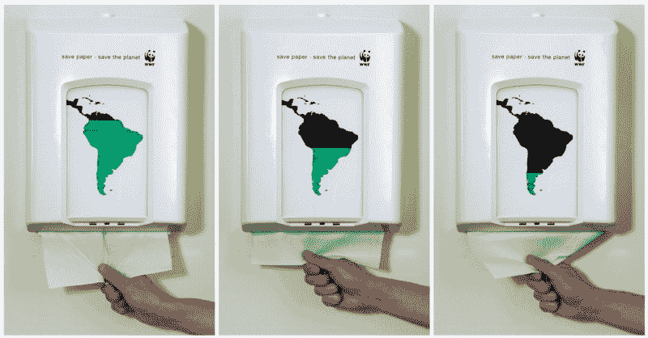
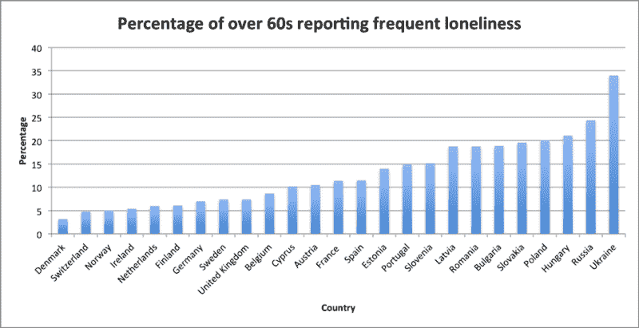
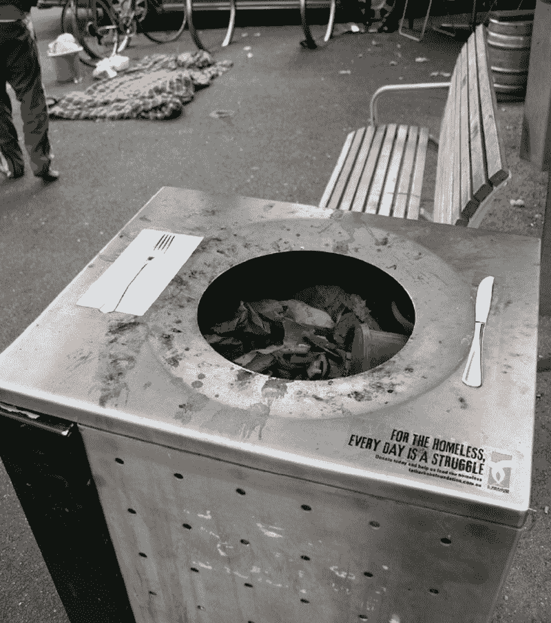
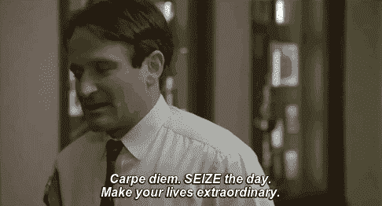

# 这是你需要知道的关于社会责任编程的事情

> 原文：<https://www.freecodecamp.org/news/this-is-what-you-need-to-know-about-socially-responsible-programming-1085d31faec1/>

by ?? Anton de Regt

[Image credit](https://adsoftheworld.com/media/print/wwf_lungs)

# 这是你需要知道的关于社会责任编程的事情

#### 你的才华比你银行账户上的许多零更有价值

最近，我看到了很多关于人们获得第一份开发人员工作的故事。像[这个](https://forum.freecodecamp.org/t/got-my-first-developer-job/138772)或者[这个](https://forum.freecodecamp.org/t/finally-got-my-first-developer-job-mid-level/127622)或者[这个](https://medium.freecodecamp.org/how-i-got-my-first-dev-job-and-what-im-going-to-do-next-4837b1e9c89c)。这是个好消息，但是…

他们的重点似乎是在学会如何编码后，在 IT 行业获得高薪工作。我认为他们没有意识到他们所学的东西的潜力。编程不仅仅是收入来源。代码可以创造世界，也可以毁灭世界。但是你为什么要在乎我要说什么？

我尝试过用不同的方式帮助社会。我志愿为红十字会或当地体育俱乐部这样的机构服务。我给慈善机构捐了钱。但是是时候采取不同的方法了。原因是我没有赚大钱的天赋。因此，捐钱对我来说不是最有效的方法。我也没有和红十字会志愿者一起折叠行军床的特殊天赋。

与早期回报社会的尝试不同的是，我现在专注于自己的才能。几年前，我通过学习计算机科学获得了这些天赋。我不为科技公司工作。但是在空闲时间，我喜欢做一些小项目。所以，我的新方法是用我的编程技能来编写对社会负责的代码。

### 什么是社会责任编程？

我们先把它缩写成 SRP。通过做 SRP，你不是把钱捐给了社会，而是捐赠了你的编程技能。

> "如果我有办法，我有责任雇用他们."― [特里·布鲁克斯](https://www.goodreads.com/author/show/9629.Terry_Brooks)

所有的程序员都有这种惊人的技能，可以把任何东西变成有价值的东西。他们凭空造东西。我一直觉得创造一些东西非常有意义。为科技公司工作肯定更有回报，因为你创造的东西正被许多人使用。

如果我告诉你有一种更有意义的方式来使用你的手指呢？如果你甚至不需要为大型科技公司工作呢？有什么比用你的代码扰乱世界更有意义的呢？

答案是:用你的代码扰乱这个世界，同时让它变得更好。这就是我所说的社会责任规划(SRP)。在这篇文章中，我会告诉你关于它的一切，我会解释为什么你应该关心。

[source](https://adsoftheworld.com/media/ambient/paper_dispenser)

你不一定要成为一个著名的程序员才能开始达到 SRP 的高水平。几年前，我学习计算机科学。获得学位后，我不知道如何通过编码来改善这个世界。所以，我决定做点别的。新冒险开始几个月后，我错过了编程。所以我开始了一些自由代码营课程的项目。

这些项目重新点燃了我对编程的热爱，从那以后我再也没有失去它。我不认为自己是一个特别有天赋的程序员。我喜欢编码，JavaScript 让构建运行在手机和桌面上的令人敬畏的东西变得超级容易。

目前，我正在和一个朋友合作一个项目，将老年人和年轻人联系起来。这个项目的目标是减少老年人的孤独感。

[Loneliness of elderly in Europe](https://flipchartfairytales.wordpress.com/2013/10/21/jeremy-hunts-granny-friendly-societies/)

### 阅读本文的要求

要有资格阅读这篇文章，你必须满足以下标准之一:

*   我至少建过一次网站
*   我至少开发过一次 Android/iOS 应用
*   我学过计算机科学
*   我认识阿达·洛芙莱斯
*   其他编码经验

如果你没有任何编程经验，不要担心。从自由代码营的课程开始，几个月后再回来。

此外，请随意用你可能拥有的任何其他技能来代替编程。如果你有编码经验，并且符合这篇文章的所有要求，请继续阅读。

### 目标

SRP 的目标是为你的用户创造价值。价值通常是通过帮助用户解决问题而创造的。与 SRP 一样，它也关注一个问题。但并不是每个问题都合格。

找不到[出租车](https://www.uber.com/)的问题不符合条件。没时间[煮](https://www.seamless.com/)的问题不符合条件。同样，懒得从沙发上起来的问题也不符合条件。当然，我夸张了。

当一个游戏让来自世界各地的孩子走到户外时，它绝对是一个对社会负责的游戏。做得好口袋妖怪 GO！

> “这个世界呼唤社会公正，但当谈到社会责任时，你有时甚至听不到蟋蟀的鸣叫。”― [**迪安·孔茨**](https://www.goodreads.com/author/show/9355.Dean_Koontz)

不可能写下一个合格问题的清单。不同的个人或社会对问题的严重性会有不同的看法。当有疑问时，问问你自己，你是否可以认为你有道德义务在某个特定问题上提供帮助。如果答案是肯定的，大多数情况下，着手一个项目是个好主意。

例如，你可能觉得向慈善机构捐款或帮助老人过马路是一种道德义务。符合条件的问题不一定是全球性问题。

你的解决方案也可以非常简单，比如定制一个免费的网站模板。在这篇文章的最后，我会列举几个社会责任项目的例子。要获得灵感，请看这个关于社会中典型社会问题的链接。

SRP 的目标是建造一些可以帮助任何数量的人、动物、树木或者……基本上任何东西的东西。但是为什么帮助社会如此重要呢？

### **为什么 SRP 很重要**

现在我要用道德声明轰炸你…

如果你需要帮助，难道你不想要吗？

难道你不想让人们用他们的技能做一些对世界有益的事情吗？

工作的主要动机应该是在银行账户上生成数字吗？

> “成功人士有社会责任让世界变得更美好，而不仅仅是索取。”——[**凯莉·安德伍德**](https://www.brainyquote.com/quotes/quotes/c/carrieunde471313.html)

你有天赋。我知道你有，因为你有资格写这篇文章！你有能力让生活变得更好。

我们都被困在这个星球上(至少现在是这样)，所以与其捐钱，不如贡献你的时间。这种方法要有效得多，尤其是如果你把你的才能用在工作上的话。

如果你正在读这篇文章，你会说英语，有互联网接入和一点空闲时间。通过这些指标，我敢说你的生活比地球上至少一半的人口都要好。差不多有 40 亿人！这意味着有足够多的人可以享受你的帮助。这些人值得你的关注。程序员尤其有能力帮助他们，我稍后会解释你如何做到这一点。

很酷的一点是，SRP 不只是帮助别人，它也让你受益。对我来说，我负责任的最重要的原因如下:

1.  我对自己感觉很好
2.  它给我的生活增添了目标感和意义
3.  我可以帮助其他有需要的人，让事情有所不同

现在是时候了解如何从 SRP 开始了。

[source](https://adsoftheworld.com/media/ambient/the_father_bob_maguire_foundation_bins)

### 如何为社会编码

这一切都始于睁开你的眼睛，让你周围的人发现一个合格的问题。最好的方法是改变你的日常生活。去你从未去过的地方。

例如，去当地的[聚会](https://www.meetup.com/)。聚会是我开阔眼界的新方式。我甚至向 AmsterdamJS Meetup 发送了一个 5 分钟的闪电谈话提议，它被接受了！

一旦你睁开眼睛，你会开始注意到一些可以从几行代码中获益的东西。从简单的项目开始获取经验，并不断升级您的项目。

时间是稀缺的，但要有所作为，你必须在你的项目上投入时间。确保你每周至少投入一定数量的时间。我每周至少花 2 个小时在我的 SRP 项目上，大部分时间更多。给自己定下任何目标，并坚持下去。

如果你想要一个有趣又简单的方法来记录你在不同的项目上花了多少时间，试试 WakaTime。当然，你的空闲时间是有限的，但是有一个解决办法。问问你的老板是否愿意每周给你几个小时来做一个对社会负责的项目。聪明的老板接受这一点，这样他们就可以向客户展示他们对社会有多好。

你准备好一些例子了吗？

### 社会项目的例子

有很多很酷的例子，人们建立了应用程序或网站，让世界变得更美好。下面列出的例子非常先进。不要被吓倒，相反，看着它获得灵感。

#### 教学

汗学院的使命是向任何地方的任何人提供免费的世界级教育。它教授从数学到历史的一系列课题。

freeCodeCamp 是一个帮助你学习编码的社区。一旦你学会了编码，你就可以通过为开源项目做贡献来获得经验。非营利组织实际上使用这些程序。

#### 指导

Ankommen App 是难民在进入德国的最初几周了解德国的指南。

iRecycle 可以告诉你如何、在哪里以及何时回收任何东西。

#### 比赛

[树木星球 2](https://play.google.com/store/apps/details?id=treeplanet.dev.treeplanet2&hl=en) 把虚拟的树变成真实的树。该应用程序的目的是种植一棵虚拟的树。这款游戏需要用户施肥、浇水并保护它免受伐木工人的伤害。当用户在他们的手机上种植一棵树时，一棵真实的生命之树也被种植和照料。《树木星球 2》声称已经在 10 个不同的国家种植了 50 万棵真树。

[拯救儿童地震反应](https://itunes.apple.com/hk/app/save-children-earthquake-response/id395153026?mt=8)是一款关于灾难的模拟游戏。它的目标是传播救灾意识。

### 最后的想法

我不是说你应该辞掉工作去做慈善。我要说的是:开始思考如何解决你在环境中看到的问题。这可能是一个个人问题，这没关系，只要你能用你的才华帮助某人或某事！你能想到什么？

[source](https://giphy.com/gifs/robin-williams-moviegif-moviequote-f56Z2mFv6ipLa)