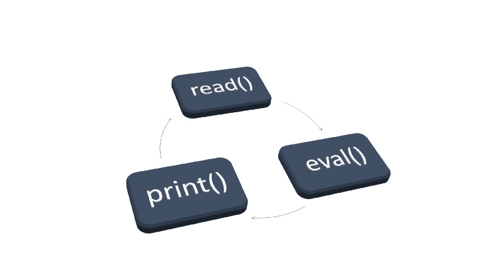

# 这就是你的读取-评估-打印循环如此神奇的原因

> 原文：<https://www.freecodecamp.org/news/this-is-why-your-read-eval-print-loop-is-so-amazing-cf0362003983/>

作者:约伯特

# 这就是你的读取-评估-打印循环如此神奇的原因

让技术社区如此特别的一件事是，我们总是在寻找更有效的工作方式。每个人都有自己最喜欢的工具，这些工具可以让他们运行得更好。作为一名专业的 UI 开发人员，Chrome DevTools 和 node . js read-eval-print-loop(REPL)成为我早期最喜欢的工具。我注意到它们让我工作更有效率，让我更快地学习新东西。

The three phases of the REPL process

这让我很好奇为什么这个工具如此有用。我可以很容易地找到大量解释什么是回复以及**如何使用回复**的博客帖子，例如[在这里](https://clojure.org/guides/repl/introduction)或者[在这里](http://blogish.nomistech.com/repl-based-development/)。但是这里的这篇文章是专门针对 **why** (比如为什么 REPLs 对开发者来说是一个如此伟大的工具)。

> “学校不再将 Java 作为教学语言的首要原因是 Hello-world 项目的高门槛。”

> —斯图尔特·哈洛威

### 什么是 REPL？

REPL 代表*读取-评估-打印-循环*，这基本上就是它的全部内容。

您的应用程序运行时处于特定的状态，REPL 帮助您与它进行交互。REPL 将*读取*，*评估*命令，*打印*结果，然后返回起点读取您的下一个输入。*评估*步骤可能会改变您的运行时。这个过程可以看作是对您的应用程序的一次访问，以查询它的当前状态。

换句话说，REPL 让你的**运行时间更加有形**，并允许你**测试关于它的假设**。

根据 Stuart Halloway 的说法，Java 中缺少 REPL 是学校开始转向其他语言教授编程的最重要原因。一些人甚至使用 REPL 来[编写更好的单元测试](https://danlebrero.com/2018/11/26/repl-driven-development-immediate-feedback-for-you-backend/)。

### 我今天已经在使用 REPL 工具了吗？

这个基本的解释可能会让你想起一些你每天都在使用的工具。如果您知道并使用以下工具之一，答案是“是”:

*   你的浏览器的开发工具(如 [Chrome DevTools](https://developers.google.com/web/tools/chrome-devtools/)
*   您的终端/外壳
*   jupyter 笔记本
*   Clojure 的 REPL 进程
*   Repl.it，jsfiddle.net 还是 jsbin.com
*   在线正则表达式验证器

### 为什么 REPL 如此有用？

这个问题让我夜不能寐，因为我不明白最初是什么让我们效率低下。我开始研究一些常见的心理影响，并试图将它们与我和 REPL 的日常互动联系起来。以下是我的三大假设:

#### 在流动中

> “心流”是一种精神状态，在这种状态下，从事某项活动的人完全沉浸在一种精力充沛的专注感中，完全投入，并享受活动的过程。([来源](https://en.wikipedia.org/wiki/Flow_(psychology)))

我想我们都很熟悉这种状态，它让我们非常有效率，基本上时间过得很快。不幸的是，很容易“失去”心流，例如当你被打断或者当你不得不等待一段时间的时候。我了解到这可能发生得很快:[研究人员发现](https://psychology.stackexchange.com/questions/1664/what-is-the-threshold-where-actions-are-perceived-as-instant)一秒钟大约是用户思想流动保持不间断的极限。

REPL 不需要编译或部署您的代码。这导致非常短的响应时间(< 100 毫秒)。因此，你能够测试你的假设，而不会丢失流程。

This is what we want to avoid (source: [XKCD](https://xkcd.com/303/))

#### 正面强化

> 积极强化包括在一个行为之后增加一个强化刺激，使该行为更有可能再次发生。([来源](https://www.verywellmind.com/what-is-positive-reinforcement-2795412))

这是最吸引我的效果。当某些行为在过去受到奖励时，你的大脑会倾向于这些行为。这种奖励可以是你的老板在一个月的出色表现后给你的奖金，或者是一句简单的“干得好！”从你的滑雪教练那里。

每次你的 REPL 实验成功了，你解决了一个难题/问题，你的大脑也感觉得到了回报！在公共 IDE 中编写代码时也会发生这种情况。但是 REPL 响应速度更快，允许你更频繁地迭代。所以，更多的实验导致更多的强化。这种效果会让你更频繁地使用 REPL，让你的注意力集中在球上(而不是通过查看电子邮件来分散注意力)。

#### 数字健忘症

> 使用互联网搜索引擎很容易忘记网上可以找到的信息的倾向。([来源](https://en.wikipedia.org/wiki/Google_effect))

我不得不承认，我经常混淆 Java、Python 和 JavaScript 语法，因为这些信息在互联网上随处可见。我会问自己“在 JavaScript 中，我需要使用 *add()* 、 *append()* 或 *push()* 向数组添加新元素吗？”。因此，对我来说，这种影响的一个例子是回忆 API 和语言引用的方法名。

在 REPL 中，我可以通过自动完成功能立即看到可用的功能:

The code-completion feature of the Node.js REPL

最棒的是，这超越了编程语言的标准对象。这适用于所有的框架和模块，这使得 REPL 比你的 IDE 更强大！不再需要比较模块和 API 引用的版本号:

> "真理只能在一个地方找到:代码."

> 罗伯特·c·马丁，干净的代码

source: [arungupta.me](http://blog.arungupta.me/jdk9-repl-getting-started/)

我希望这篇文章能帮助你理解你的大脑是如何工作的，以及 REPL 如何帮助你变得更有效率。

我很好奇你是否同意我的假设，或者你是否知道更多的工具来成为一个更高效的开发者。

2019 年 2 月 13 日更新:

我还写了一篇博文,内容是关于在 Cloud Foundry 环境中使用 REPLs 的。

如果你想看 REPL 的表演，请观看由 [DJ Adams](https://people.sap.com/dj.adams.sap) 制作的视频