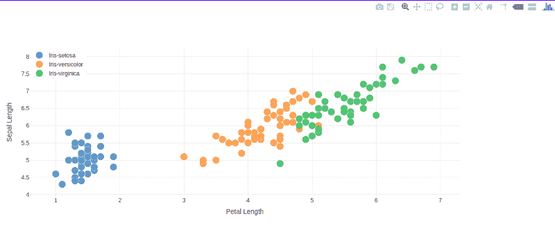

# 这个 Dash 的快速介绍会让你在 5 分钟内进入“你好世界”

> 原文：<https://www.freecodecamp.org/news/this-quick-intro-to-dash-will-get-you-to-hello-world-in-under-5-minutes-86f8ae22ca27/>

作者:Anuj Pahade

# 这个 Dash 的快速介绍会让你在 5 分钟内进入“你好世界”


Photo by [Chris Liverani](https://unsplash.com/@chrisliverani?utm_source=medium&utm_medium=referral) on [Unsplash](https://unsplash.com?utm_source=medium&utm_medium=referral)

[Dash](https://plot.ly/products/dash/) 是一个开源库，用于在 Python 中创建反应式应用。您可以使用 Dash 在浏览器中创建令人惊叹的仪表板。

[虹膜数据集](https://gist.github.com/curran/a08a1080b88344b0c8a7)可以被称为数据集的‘hello world’。在本文中，我们将学习如何构建一个简单的 Dash 应用程序，其中我们将使用虹膜数据集。这个数据集是干净的，这对我们有好处，这样我们可以专注于 dashing 而不是清理数据。

### 仪表板设置

要构建很酷的应用，你需要热库。

如果您还没有安装 Dash，那么在您的终端中运行这些[命令](https://dash.plot.ly/installation):

`pip install dash==0.21.1 # The core dash backend`
`pip install dash-renderer==0.12.1 # The dash front-end`
`pip install dash-html-components==0.10.1 # HTML components`
`pip install dash-core-components==0.22.1 # Supercharged components`


以下列身份运行您的应用:

```
python helloiris.py
```

清楚你的 Python 版本。

### 应用程序布局

我们可以用`dash_html_components`库和`dash_core_components`库来构建布局。如上图所示，我已经导入了它们。`dash_html_components`是针对所有 HTML 标签的，而后一个是针对用 React.js 构建的交互组件的。说到这里，让我们用 Dash 在浏览器中写点东西:

```
app.layout = html.Div(children=[    html.H1(children='Iris visualization'),    html.Div(    '''        Built with Dash: A web application framework for Python.    ''')])
```

是啊！就是这么简单。等效的 HTML 代码如下所示:

```
<div> <h1> Iris visualization &lt;/h1> <div> Built with Dash: A web application framework for Python. </div></div>
```

注意第一个`Div`中的`children`属性。它用于定义标签中元素的`list`。这是一个位置参数(总是放在第一位)，可以跳过，正如你在上面的下一个`H1`和`Div`中看到的。

我们可以用**风格**吗？我听到你问了。嗯，当然！Dash 允许你像在 HTML 的`<sty` le >标签中一样编写样式字典。它还允许您编写内联 CSS 和链接外部 CSS 文件。以下是我们的做法。

#### **文体词典**

让我们创建一个名为颜色的字典。

```
colors = {         'background': '#0000FF',         'color': '#FFA500'}
```

可以使用所示的`style`属性将它附加到一个元素上。

```
app.layout = html.Div(style=colors,children=[    html.H1(children='Iris visualization'),    html.Div(    '''        Built with Dash: A web application framework for Python.    ''')])
```

#### **内联 CSS**

在 Dash 中，字典的键是`camelCased`。所以我们用`textAlign`代替`text-align`。同样，HTML 标签的`class`属性是`className`，如果你使用 React，你可能会知道。

```
app.layout = html.Div(style=colors,children=[    html.H1(children='Iris visualization',style = {'textAlign':'center'}),
```

```
html.Div(style={'textAlign':'center'},children='''        Built with Dash: A web application framework for Python.    ''')])
```

#### **外部 CSS**

我们可以创建一个想要包含在 Dash 应用程序中的 CSS 文件的 URL 或路径列表，然后使用`app.css.append_css`来包含它们。

```
external_css = ["https://maxcdn.bootstrapcdn.com/font-awesome/4.7.0/css/font-awesome.min.css",              "https://maxcdn.bootstrapcdn.com/bootstrap/4.0.0/css/bootstrap.min.css" ]
```

```
for css in external_css:    app.css.append_css({"external_url": css})
```

我们可以通过使用`app.scripts.append_script`以完全相同的方式包含 JavaScript

希望你陪我到现在！这是我们的 helloiris.py 文件的样子:

```
import dashimport dash_core_components as dccimport dash_html_components as html
```

```
app = dash.Dash()
```

```
#External CSSexternal_css = ["https://maxcdn.bootstrapcdn.com/font-awesome/4.7.0/css/font-awesome.min.css",                "https://maxcdn.bootstrapcdn.com/bootstrap/4.0.0/css/bootstrap.min.css", ]
```

```
for css in external_css:    app.css.append_css({"external_url": css})
```

```
#External JavaScriptexternal_js = ["http://code.jquery.com/jquery-3.3.1.min.js",               "https://maxcdn.bootstrapcdn.com/bootstrap/4.0.0/js/bootstrap.min.js"]
```

```
for js in external_js:    app.scripts.append_script({"external_url": js})
```

```
#Internal CSScolors = {         'background': '#0000FF',         'color': '#FFA500'}
```

```
#Our app's Layoutapp.layout = html.Div(style=colors,children=[    html.H1(children='Iris visualization',style={'textAlign':'center'}),
```

```
html.Div(style={'textAlign':'center'},children='''     Built with Dash: A web application framework for Python.    ''')])
```

```
if __name__ == '__main__':    app.run_server(debug=True)
```

### 让我们得到一些数据

假设您熟悉 pandas，我们将使用这个 Python 库在我们的应用程序中导入 iris.csv 文件。如果你不知道这个数据集是关于什么的，那么我推荐你从[这里](https://archive.ics.uci.edu/ml/datasets/iris)阅读并下载。

```
import pandas as pd
```

```
header_names =[ 'sepal_length', 'sepal_width', 'petal_length', 'petal_width', 'class']
```

```
df = pd.read_csv('path/to/Iris.csv',names=header_names)
```

既然我们的数据已经加载到了`df`数据帧中，现在是可视化的时候了。

### 数据可视化

还记得我跟你说过的交互组件吗？`dash_core_components`图书馆？这就是我们在这里要用的。

```
import plotly.graph_objs as go
```

让我们给我们的`app.layout`添加一个新组件。这次它不是一个 HTML 标签，而是一个交互式图表。Dash 使用 [Plotly](https://plot.ly/) 来绘制图形。

```
dcc.Graph(        id='Iris Viz',        figure={            'data': [                go.Scatter(                    x=df[df['class'] == i]['petal_length'],                    y=df[df['class'] == i]['sepal_length'],                    mode='markers',                    opacity=0.7,                    marker={                        'size': 15,                        'line': {'width': 0.5, 'color': 'white'}                    },                    name=i                ) for i in df['class'].unique()            ],            'layout': go.Layout(                xaxis={'title': 'Petal Length'},                yaxis={'title': 'Sepal Length'},                margin={'l': 200, 'b': 40, 't': 100, 'r': 200},                legend={'x': 0, 'y': 1},                hovermode='closest'            )        }    )
```



This is how the graph looks like.

哇哦。用 Python 写了一整段！别担心。不难理解。让我们一条一条地过一遍:

`dcc.Graph`有一个`id`参数，用于在将来删除或覆盖或任何其他目的时引用图形。

`figure`参数与 [plotly.py](https://plot.ly/) 中使用的参数相同。它接受两个参数，`data`和`layout`。

在`data`中，我们可以指定在哪个轴上绘制数据帧的哪些列。我们也可以指定模式，例如:**标记**，然后是标记的属性，如**宽度**、**线条**(表示边框)。

在`layout`中，我们定义了轴标签、图例位置、图表边距(左、上、下、右)等等。

不是这个。这些图形是[交互式的](https://dash-stock-tickers.plot.ly/)，可以通过用户输入来操作。

好吧，那么这个夏天让我们去构建一些很酷的 DashApps 吧！

请继续关注我的下一篇文章。这不是我第一次编码或者做 app，但这是我第一篇关于 Medium 的文章！我认为掌声和推荐会激励我:)

请随时通过电子邮件联系我:anujp5678[at]gmail[dot]com

或者在 LinkedIn 上联系我[https://www.linkedin.com/in/anuj-pahade/](https://www.linkedin.com/in/anuj-pahade/)

保持潇洒和快乐的编码！