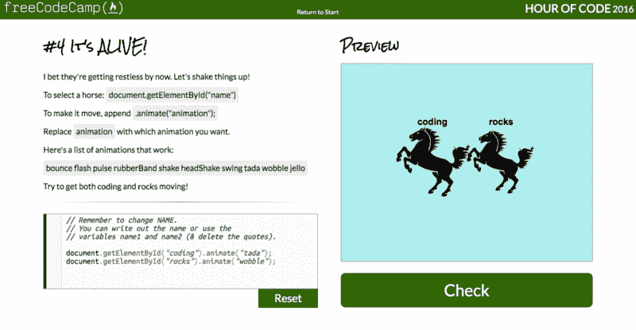
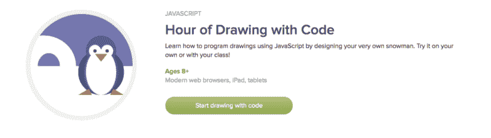
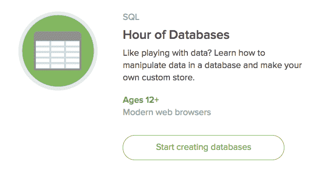
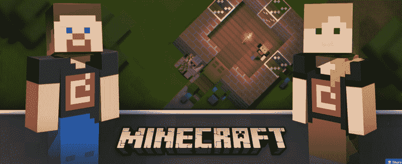

# 本周和你的孩子一起做一个小时的代码

> 原文：<https://www.freecodecamp.org/news/this-week-do-an-hour-of-code-with-your-kids-45cdb576a152/>

“代码一小时”始于 2013 年，目标是让孩子们对编程和计算机科学感兴趣。

这个为期一周的活动鼓励老师和家长花一个小时和他们的孩子一起编写代码。

这已经成为全世界的一个巨大运动，有像马拉拉甚至奥巴马总统这样的著名参与者。

今年，编码时间是从 12 月 5 日到 11 日。

一个孩子一个小时能学到多少编程知识？不是很多。但是我们的目标是帮助他们获得乐趣，并发现他们内心想要学习更多的渴望。

为了省去你拼凑适合孩子的课程的麻烦，一些组织已经设计了特殊的一小时挑战。你和你的孩子可以解决其中的一个或多个问题。

### 自由代码营的前端代码挑战小时

我们的开源社区专注于帮助成年人学习编码，这样他们就可以得到开发人员的工作。但是我们也想帮助孩子们在很小的时候就对编程感兴趣。所以我们也创造了一个一小时的编码挑战。

孩子们不需要创建帐户或做任何准备。他们可以直接去我们的[小时代码](http://freecodecamp.com/hour-of-code)页面开始。

这些特殊的编码挑战集中在使用 JavaScript 的前端开发上。它们是完全开源的。

上周，两名刚刚完成第一个 1200 小时自由代码营课程的营员会面，设计并编写这些挑战:

*   Cindy Hsu 是不列颠哥伦比亚大学计算机科学专业的一年级学生。除了编写大量代码，她还喜欢视频游戏，经常在 Twitch 上观看直播。
*   Danny Libin 是一名药剂师，他长期以来一直对技术感兴趣，最近[对编程](https://github.com/Daynil)更加认真了。

这里有[一个挑战](http://www.freecodecamp.com/hour-of-code)的链接。

### 可汗学院的代码绘画时间

你可以用 JavaScript 在你的浏览器里做各种各样的图形。

这一小时的代码挑战将引导你的孩子使用各种形状来堆雪人。

这里有[一个挑战](https://www.khanacademy.org/computing/hour-of-code/hour-of-drawing-code/v/welcome-hour-of-code)的链接。

### 可汗学院的 SQL 小时

这个更高级的挑战给了孩子们一个学习关系数据库如何工作的机会。

它提供了几个概念性的视频，以及创建简单 SQL 查询的说明。

这里有[一个挑战](https://www.khanacademy.org/computing/hour-of-code/hour-of-sql/v/welcome-to-sql)的链接。

### 代码挑战的《我的世界》难题小时

这是一个有趣的使用 Scratch 编程语言的编码挑战，这是一种专门为孩子们学习基本编程概念而设计的语言。

这里有[一个挑战](https://studio.code.org/s/minecraft/stage/1/puzzle/1)的链接。

记住:编码时间是从 12 月 5 日到 11 日，但是你可以随时坐下来和你的孩子一起编码。？

编码快乐！

感谢您在百忙之中抽出时间阅读我的文章。如果你喜欢，点击？所以其他人会在媒体上看到这个。

