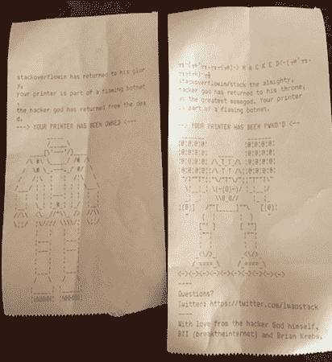

# 那些旧工作已经一去不复返了。让我们为下一步做好准备。

> 原文：<https://www.freecodecamp.org/news/those-old-jobs-are-gone-forever-lets-gear-up-for-what-s-next-3ac373092fa5/>

这里有三个值得你花时间的链接:

1.  那些旧工作已经一去不复返了。让我们为下一步做好准备。( [7 分钟读数](http://bit.ly/2kHCY3x))
2.  一位数据科学家玩了 47000 场炉石游戏，然后为它们建立了漂亮的数据可视化。( [6 分钟读数](http://bit.ly/2kN6gNF))
3.  数学天才是脆弱的。我们需要停止摧毁它。( [6 分钟读数](http://bit.ly/2liwfti))

额外收获:IMDb 关闭了它的论坛。这是一个开发者在 2001 年设计它们的方式。( [30 分钟读数](http://bit.ly/2jYWicW))

### 想到这一天:

> “我终于明白了‘向上兼容’意味着什么。这意味着我们可以保留所有过去的错误。”——丹尼·范·塔索

### 每日一图:

一个黑客[接管了 15 万台打印机](http://bit.ly/2kN1AHx)并开始用它们打印 ASCII 艺术。

### 今日学习小组:

[墨尔本自由代码营](http://bit.ly/2kC9Kk4)

编码快乐！

–昆西·拉森，自由代码营的老师