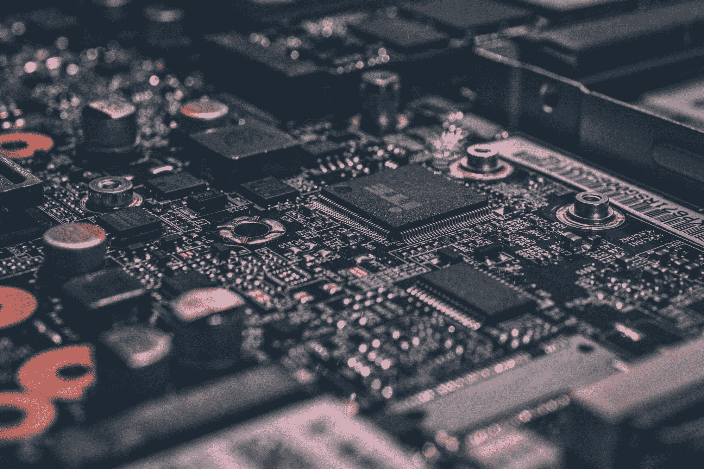
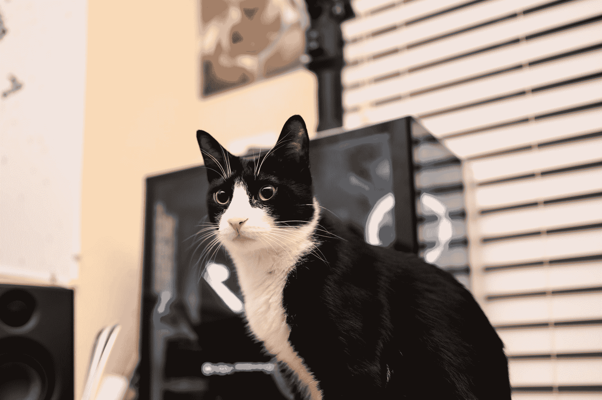
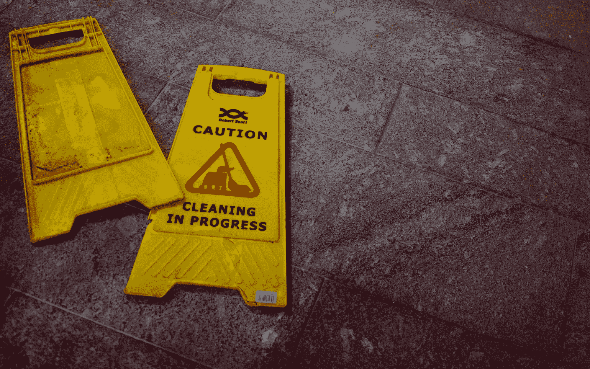

# 我从阅读《实用程序员》中学到了什么

> 原文：<https://www.freecodecamp.org/news/thought-on-the-pragmatic-programmer/>

*简而言之:古老而黄金。*

1999 年出版的《实用程序员》是一本关于如何成为实用程序员的书。真正的意思是“优秀的程序员”。

是的，它是大约 20 年前出版的。但这本书仍然提供了许多与程序员或软件工程师非常相关的见解，就像现在一些人所说的那样。

你可能以前听说过这本书，并质疑它到底是关于什么的。好了，今天我就和大家分享一下我在看书的时候学到的一些有趣的东西。

## 成为一名程序员不仅仅需要技术技能

Photo by [Alexandre Debiève](https://unsplash.com/@alexkixa?utm_source=ghost&utm_medium=referral&utm_campaign=api-credit) / [Unsplash](https://unsplash.com/?utm_source=ghost&utm_medium=referral&utm_campaign=api-credit)

当阅读书名时，你可能会期望它给出许多技术课程。但事实上并非如此。这本书之所以在 20 年后仍有意义，是因为它告诉我们，成为一名程序员并不全靠技术实力。而我们往往忽略了这个事实。

这本书告诉我们，编程不仅仅是技术能力。

## 猫吃了我的源代码

Photo by [Chen Zhao](https://unsplash.com/@chen93?utm_source=ghost&utm_medium=referral&utm_campaign=api-credit) / [Unsplash](https://unsplash.com/?utm_source=ghost&utm_medium=referral&utm_campaign=api-credit)

这是本书的第一章，是一个非常有趣的概念。

还记得有一天我们没有完成作业，我们说是狗吃了吗？(其实我不记得了，因为我总是写完作业？)

这一章教给我们的实际上是责任。当你对某事负有责任时，你应该做好被追究责任的准备。

如果你犯了错误，不能履行那些责任，你必须弥补它，并找到解决办法。不要编造借口，玩指手画脚的游戏。你不能只是去工作，告诉每个人**一只猫刚刚吃了你的源代码**。

**提供选项，不要找蹩脚的借口。**

## 都是因为一扇破窗户

Photo by [Paweł Czerwiński](https://unsplash.com/@pawel_czerwinski?utm_source=ghost&utm_medium=referral&utm_campaign=api-credit) / [Unsplash](https://unsplash.com/?utm_source=ghost&utm_medium=referral&utm_campaign=api-credit)

在这本书里，有一个故事是关于一个城区变得非常脏乱和破败，都是因为一扇破窗户。

这很像我们的代码:当我们看到一些肮脏的代码(我们可以把它看作是一扇破碎的窗户)，我们可能会开始认为让代码变脏没什么。我们可以晚点再去，但大多数时候我们从来不去。

尽量不要让“破窗户”无人修理。当您发现这种代码时，请尽快修复它。当你继续认为没有人有时间去修复那些坏掉的代码时，你还不如去给自己买一个垃圾箱来保存你的代码。

这一章讨论的内容其实很简单:它是关于**主动性和保管好你的东西**。

## 采取主动，成为催化剂

Photo by [Braden Collum](https://unsplash.com/@bradencollum?utm_source=ghost&utm_medium=referral&utm_campaign=api-credit) / [Unsplash](https://unsplash.com/?utm_source=ghost&utm_medium=referral&utm_campaign=api-credit)

也可能有这样的时候，你知道有些事情是好的，或者有些事情需要去做。它出现在你的脑海中，你只是对自己说这是正确的事情。

如果你只是不停地想，什么都不会发生。或者，如果你只是要求它在项目时间表中，你可能会遇到巨大的功能开发请求和技术债务。因此，它在又一年的讨论中结束。

是时候加强你的游戏了。量力而行，不要过度，也要做到**合理**。一旦你有了完整的想法，把它展示给人们。他们可能会想，“是的，如果我们有它，可能会更好。”

向他们展示未来的一瞥，人们就会团结在你周围。**成为变革的催化剂**。

## 更重要的是，这本书还教我们一些作为程序员经常忘记的基础知识。

有时候，我们对工作钻研得越深，越容易忘记很久以前学过的基本知识。

忙于追逐功能和新的技术改进，我们经常忘记，在深入研究之前，我们实际上需要事先注意更多的事情。

### 干净的代码

Photo by [Oliver Hale](https://unsplash.com/@4themorningshoot?utm_source=ghost&utm_medium=referral&utm_campaign=api-credit) / [Unsplash](https://unsplash.com/?utm_source=ghost&utm_medium=referral&utm_campaign=api-credit)

我们经常忘记的一个最基本的原则是干净的代码。随着功能越来越多，代码库变得越来越大，技术债务也越来越多。

但是我们必须记住，每次编写代码时，都要保持代码的一致性和整洁。

书中提到的一件事就是干原则(不要重复自己)。它与代码的可重用性有关。复制是邪恶的，这是事实。重复代码会使维护代码变得非常困难，并且当您需要更改某个特性或修复某个 bug 时，它会导致混乱。

还记得你需要修改一些代码的时候吗？你意识到有些代码和你刚刚修改的那位非常相似？所以你也要改变那一部分，另一部分也要改变，然后可能这一部分也要改变…你明白了。

### 找到正确的工具

Photo by [Cesar Carlevarino Aragon](https://unsplash.com/@carlevarino?utm_source=ghost&utm_medium=referral&utm_campaign=api-credit) / [Unsplash](https://unsplash.com/?utm_source=ghost&utm_medium=referral&utm_campaign=api-credit)

就像伐木工人一样，找到正确合适的工具非常重要。在樵夫开始砍树之前。他们必须决定——他们需要电锯吗？还是一把斧子就够了？或者他们可以使用一把全新的光剑。但是用菜刀砍树可能需要一些时间。

对于程序员来说也是如此:这本书告诉我们，在开始工作之前找到合适的工具非常重要(比如一个好的代码编辑器)。我们不应该直接去编码。

例如，实际上可以使用 Windows 记事本编码，并使用控制台编译。但是它是适合你的工具吗？试着找到你最习惯使用的最好的编辑器。学习和掌握它，它会让你的生产力提高几倍。

书中提到了几个编辑器，比如 Emacs 或者 Vim。但是现在你可以找到更现代的代码编辑器，比如 Visual Studio Code。找一个适合你的。这就像你对咖啡的口味——有些人喜欢拿铁，有些人喜欢卡布奇诺。

### 不要通过巧合来编程

这是书中提到的非常重要的一点。在我们所有的编程旅程中，可能有过我们只是盲目地、出乎意料地编码的时候……但不知何故，它就工作了。

你可能不确定你实际上在做什么，所以你不断地添加越来越多的代码，它仍然工作。也就是说，直到有一天出现了一个问题，你试图删除一些代码块，它完全打破了一切。你不确定是哪块造成的。

依赖未知是非常危险的。当您不确定代码应该做什么时，请尝试简化它，并确保代码本身是可靠的，而不仅仅是偶然可靠的。

只依赖你有把握的东西。不要靠巧合编程。

### 单元测试

如今，测试是一个热门话题。而且没错，这也是 20 年前的一个重要话题(而且永远都是)。

但是现在有时人们会忘记单元测试。他们可能刚刚完成他们的代码，他们认为一切正常...直到代码在生产中因为边缘情况而中断。

为了保持稳定性和安全重构，我们总是需要通过编写单元测试来保护我们的代码。如果你的测试只涵盖快乐之路，这是远远不够的。对你的代码进行无情的测试，记住你的代码没有完成，直到你覆盖了所有可用的测试。

单元测试将帮助你确信你的代码已经真正完成。

### 取得所有权

我想谈的最后一件事。众所周知，程序员喜欢以代码的形式留下“遗产”。是的，大多数时候是不好的。

作为一名程序员，我们应该为自己的工作感到自豪。我们应该为我们被赋予的责任和我们一直在努力的代码感到自豪。

当我们最终能够为我们的代码感到自豪并拥有它时，我们将能够留下一份好的遗产。人们会将我们的代码视为签名。当他们看到我们的代码时，他们会知道这将是由专业人员编写的可靠而优秀的代码。

## 收尾工作

这本书涵盖了更多我在这里没有讨论的话题，比如需求和团队合作。如果你对探索这些话题感兴趣，你应该试着找到并阅读这本书！

不过，我只想提一点:尽管我很喜欢这本书，但从这本书的历史(20 年)来看，有些东西似乎不太相关。它谈到了像 Prolog 这样的旧语言，谈到 OOP 就像它是一个真正的新概念一样——所以这些奇怪的东西似乎不太对劲。

但不能责怪它，因为它已经有几十年的历史了。

除此之外，书中涉及的大部分内容仍然与当前的编程时代密切相关，就像我上面提到的那些主题。

如果我试图总结这本书的所有内容，我会说它基本上涵盖了我在网上读到的关于成为一名更好的工程师的所有内容。

感谢您阅读我关于务实程序员的文章！希望它能让你对你作为程序员或软件工程师的旅程有所了解。如果你有兴趣了解更多，就去拿本书。

*附:这篇文章是我自己写的，没有借助任何第三方的广告或营销手段。封面照片取自亚马逊网站。*