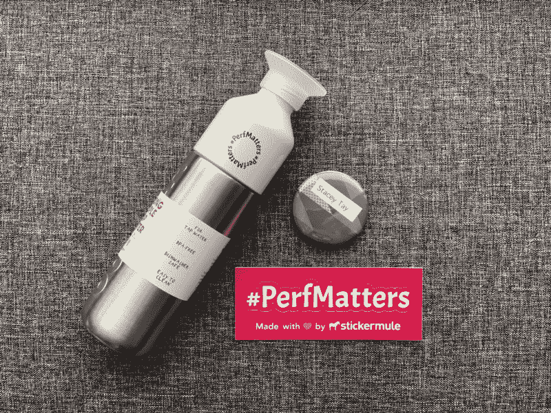
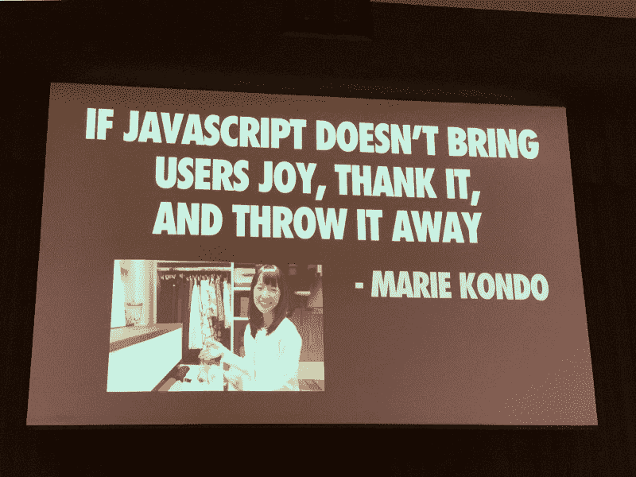

# 我从参加#PerfMatters 会议中学到了什么

> 原文：<https://www.freecodecamp.org/news/thoughts-and-learnings-from-perfmatters-2019-c5d4daa8519/>

作者 Stacey Tay

# 我从参加#PerfMatters 会议中学到了什么

#### 来自 *a* 前端 web 性能会议的笔记

本周，我有幸参加了一个关于前端 web 性能的会议。我以前从未参加过会议，但我很高兴能参加，因为它承诺了一个[惊人的演讲者阵容](https://perfmattersconf.com/2019)和[主题](https://perfmattersconf.com/schedule/)。

大约一年前，我开始钻研 web 性能，所以我认为这将是一个加深我的知识和认识社区中其他人的好机会。

这篇文章由三部分组成:

(1)我参加会议的经历，

(2)我在会议上了解到的一些情况，以及

(3)离别的思念。

### 关于会议体验的思考

#### 每个人都很友好，平易近人

我是一个人去的，这是一次相当可怕的经历，因为我通常是一个害羞的人，需要一段时间来热身。但是，我制定了一个规则，午餐时不要独自坐着，每天至少和两个人交谈。我很高兴我做到了，因为我遇到的每个人都很好，和他们聊天很有趣。

我最终遇到了很多人，谈论了从 [PRPL 模式](https://developers.google.com/web/fundamentals/performance/prpl-pattern/)到 [Cloudflare workers](https://blog.cloudflare.com/introducing-cloudflare-workers/) 的各种事情，以更好地服务于澳大利亚的用户(从美国的服务器)，函数式编程在前端 web 开发中越来越流行，以及如何开始滑雪(与性能无关，如果你想知道的话)。

#### 这些演讲绝对令人惊叹

所有的演讲者都以这样或那样的形式谈论了一些与 web 性能相关的东西，很明显，他们在演示中付出了很多努力。詹娜·泽根的[演讲](https://perfmattersconf.com/talks/#jenna)涵盖了一长串表演技巧，她的每一点都配有一首歌词，这是如此有趣的信息。她告诉我她每首歌花了大约 15 分钟，而实际上有超过 30 分钟？

> 会谈的视频应该很快就会在 [@perfmattersconf](https://mobile.twitter.com/perfmattersconf) 上公布，但许多幻灯片已经在 [#perfmattersconf](https://mobile.twitter.com/hashtag/perfmattersconf) 上发布了。

#### 讲座涵盖了 web 性能工作的许多方面

提高网页的性能不仅仅是一次性的审计，修复使网页运行缓慢的问题，然后继续前进。在一个组织中，需要所有利益相关者——商业、设计、工程、营销、产品——的共同努力才能快速发展并保持下去。

会谈不仅仅是关于我们如何提高*的 TTI 或装载时间，这很重要。但是，他们也涵盖了**的其他重要部分，让尽可能多的人可以访问和使用网络**。从[人们如何看待绩效](https://mobile.twitter.com/GemmaPetrie/status/1113508695428612097)到[赋予绩效文化](https://perfmatters.alfre.do)，从 [**特权如何定义绩效**](https://mobile.twitter.com/fox/status/1113675170374475776?s=20) 到[绩效与可及性的交集](https://noti.st/ericwbailey/Yfyaxa)。*

*

❤️ Thoughtful swag from the conference ♻️* 

### *所学表演技巧和诀窍的非详尽列表*

*其中一些，如果不是全部，可能是常识，但许多对我来说是新的。*

#### *绩效文化*

*   *[**用工具**](https://perfmattersconf.com/talks/#greg) 赋能开发者，实现更好的性能。此外，[将绩效作为发展过程的一部分](https://perfmatters.alfre.do/#/27)。*
*   ***将您的网站与竞争对手的网站进行比较**以获得管理层对驾驶表现的认可。使用 [WebPagetest 的并排视频比较](https://www.webpagetest.org/video/)你的网页与竞争对手的加载旅程，简洁地推动你的观点。*
*   ***用[谷歌的测试我的网站工具](https://www.thinkwithgoogle.com/feature/testmysite)衡量提高网站速度的潜在年收入收益**。*

#### *网络性能*

*   *[**延迟对网络请求的带宽**](http://www.stuartcheshire.org/rants/latency.html) 有极大的影响。*
*   *SVG 动画 **非常适合制作加载器动画**，因为它们(相对)较小。*
*   *[**如果可能的话把你的页面压缩到 14KB** ，避免因为 TCP 慢启动](https://calendar.perfplanet.com/2018/tcp-slow-start/)造成多次往返。*
*   ***并非所有的 cdn 都像预期的那样进行 [HTTP/2 优先级排序](https://github.com/andydavies/http2-prioritization-issues)。***
*   *如果你不得不使用网络字体，[扎克·莱瑟曼](https://mobile.twitter.com/zachleat)写了一个[很棒的关于如何很好地加载它们的指南](https://www.zachleat.com/web/comprehensive-webfonts/)。*
*   ***感知性能受 ***持续时间*** (一个过程所花费的实际持续时间，简称为“性能”)、 ***响应性*** 、 ***流畅度*** (感知的一个过程的流畅度)、以及 ***容差*** (用户期望一个过程花费多长时间)。[幻灯片](https://docs.google.com/presentation/d/1mMgpxtnyqBJsyhY5jOmh1DF0eqOPEijCH23ef9uya3U/edit)来自[杰玛·佩特里](https://gemmapetrie.com)和[希瑟·麦戈](https://mobile.twitter.com/HeatherMcGaw)关于*衡量感知绩效以确定产品工作优先级*的演讲。***

#### *一些整洁的工具*

*   *Chrome 的[代码覆盖工具](https://developers.google.com/web/updates/2017/04/devtools-release-notes#coverage) 有助于确定何时何地进行代码拆分。与页面互动一下，看看数字是如何变化的，根据[蒂姆·卡尔德克](https://timkadlec.com)的说法，大约 45%的未使用代码是正常的，超过这个数字进行优化的边际收益会递减。*
*   *Chrome 的[覆盖网络资源](https://developers.google.com/web/updates/2018/01/devtools#overrides) 功能允许开发者返回本地保存的文件，这对于动态调试非常有用。*
*   *[**【谷歌文档】电子表格做批量网页测试审核**](https://calendar.perfplanet.com/2014/driving-webpagetest-from-a-google-docs-spreadsheet/) **。***
*   *[**在线 JavaScript AST explorer**](https://astexplorer.net) (好吧，这个和 web 性能并不完全相关，但是我在会议期间发现了它，并且无法停止玩它)。*
*   *[**请求图**](http://requestmap.webperf.tools/render/190405_F1_ab827a1745d3fb3eac56185132ebb952) 从网页创建网络图，用于可视化第三方请求。*

### *离别的思绪*

*如果我从会议中得到了一个最重要的主题，那就是要擅长 web 性能，理解[如何](https://www.slideshare.net/KatrinaSylorMiller/happy-browser-happy-user-perfmatters-conference-2019)[*浏览器如何*](https://github.com/ksylor/happy-browser-happy-user) (比如[渲染](https://developers.google.com/web/fundamentals/performance/critical-rendering-path/render-tree-construction)如何发生以及[关键渲染路径](https://developers.google.com/web/fundamentals/performance/critical-rendering-path/))是至关重要的。但是，**性能并不仅仅停留在技术收益上**。*

> *获得所有利益相关者的认可，而不仅仅是工程，对于提高和保持性能至关重要，因为 web 性能不仅仅是尽可能快地加载页面。*

*还有**感知性能**要考虑，然后确定性能的进一步改进是否会带来**额外的重大业务或用户改进**。记住**性能只是用户体验**的*一部分*很重要。*

*我在会议期间没有拍太多照片(提醒自己下次一定要拍更多照片)，但我还是拍到了这张照片。*

*

*✨ Slide from Addy Osmani’s [talk](https://perfmattersconf.com/talks/#addy) on The Cost Of JavaScript ?** 

*如果你对 web 性能感兴趣，或者只是对一般的 web 开发感兴趣，那么这将是一个令人惊奇的会议，你可以去[看看](https://mobile.twitter.com/perfmattersconf)，它也将在明年举行！还有一个[奖学金项目](https://perfmattersconf.com/diversity/)面向那些没有经济援助无法参加的学生。期待明年在那里见到你！*

**感谢[易慧](https://www.freecodecamp.org/news/thoughts-and-learnings-from-perfmatters-2019-c5d4daa8519/undefined)、[陈静雯](https://www.freecodecamp.org/news/thoughts-and-learnings-from-perfmatters-2019-c5d4daa8519/undefined)和[姚辉蔡美儿](https://www.freecodecamp.org/news/thoughts-and-learnings-from-perfmatters-2019-c5d4daa8519/undefined)阅读之前的草稿并分享他们的反馈。**