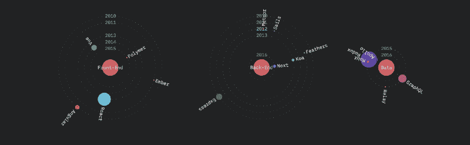
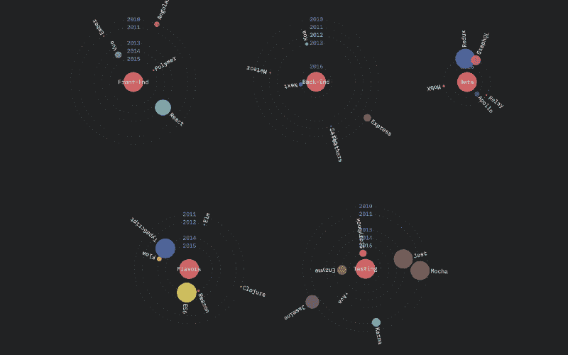
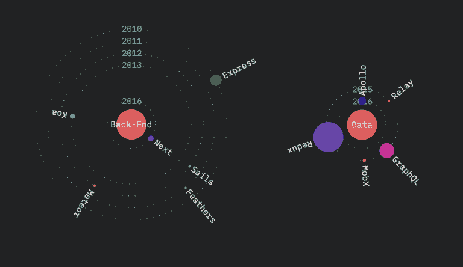
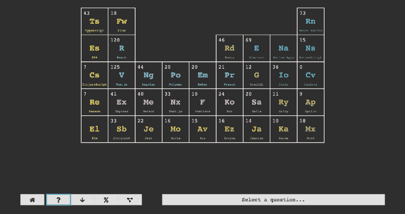
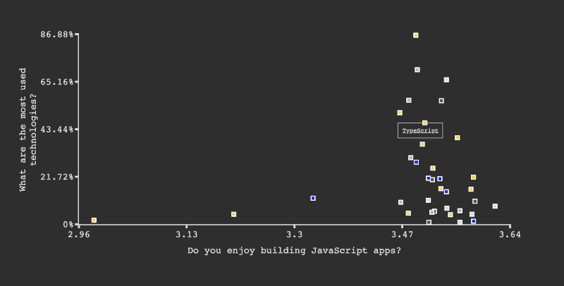
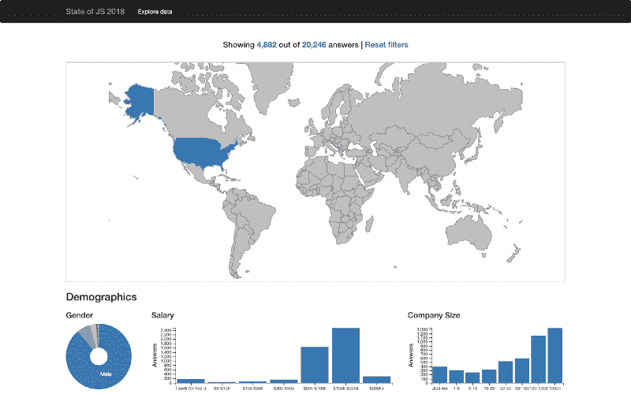

# 另外三种可视化 JavaScript 状态的方法

> 原文：<https://www.freecodecamp.org/news/three-more-ways-to-visualize-the-state-of-javascript-1f91ee452d07/>

萨沙·格里菲

# 另外三种可视化 JavaScript 状态的方法

#### 我们允许社区访问我们的数据。这是结果

上个月，我们宣布了 JavaScript Dataviz 竞赛的[状态:我们让 JavaScript 社区访问 JavaScript 2018 年调查](https://medium.com/@sachagreif/announcing-the-state-of-javascript-2018-data-visualization-contest-4d75abad96c8)数据的[状态(你可以](http://2018.stateofjs.com)[在这里找到它](https://www.kaggle.com/sachag/state-of-javascript-2018)，作为回报，我们要求你与我们分享你创建的任何新的可视化。

我们根据三个主要标准来评判参赛作品:

1.  努力:你在想象中投入了多少时间和精力。
2.  有用性:你的工作有多有见地或有用。
3.  原创:展示创新思维或纯粹娱乐的作品！

所以，事不宜迟，这里是三个竞赛获胜者赢得了一件非常独家的 JS x [DotJS](https://dotjs.io) t 恤！

### JS 状态:银河版

格雷格的《JS:银河版的状态》符合所有三个条件:很明显，想出这个概念并添加一些视觉上的修饰需要一些努力；这很有用，因为它揭示了一些在调查中甚至没有的信息(当每个库第一次发布时)；而且肯定很有创意！

我特别喜欢这种可视化，因为它使用*移动速度*作为一个有意义的指标来传达对一项技术的兴趣程度。

我想我从来没有见过数据可视化利用这个维度，它无疑打开了许多数字媒体独有的可能性！

### JS 元素周期表的状态

托马斯拿了我们的元素周期表的主题，只是运行它。[他自己对 JavaScript 元素周期表](https://state-of-js.netlify.com/)的理解是完全动画化的，并且呈现出非常有趣的数据点，例如:

*   哪种技术有最好的文档？
*   哪些技术最容易学？
*   什么技术的动力最大？

不仅如此，你甚至可以根据人们对整个 JavaScript 生态系统的看法来设计其中的一个问题！

如果您曾经想知道不喜欢使用 JavaScript 的开发人员最常用的技术是什么，现在您可以找到答案了！

### 鲁本·瓦尔塞卡的人口数据探索

Ruben 的数据可视化为我们的结果提供了详细的国别细分。

挪威的女性 JavaScript 开发人员比日本同行挣得多吗？回答:是的，他们有！多亏了鲁本，我们现在有了数据来证明这一点。

祝贺我们的三位获奖者，感谢所有参与的人！你可以在这个 GitHub 主题中查看完整的提交列表[，并关注即将到来的更多 JS 新闻状态！](https://github.com/StateOfJS/StateOfJS/issues/151)