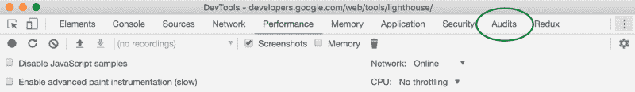
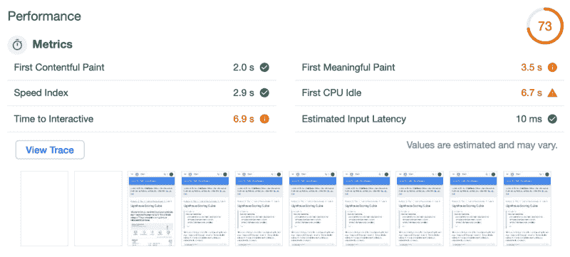
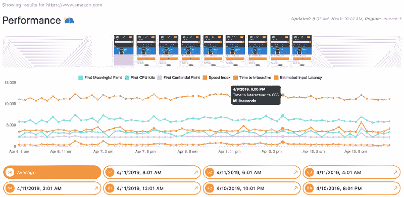

# 如何用灯塔分析网站性能

> 原文：<https://www.freecodecamp.org/news/three-ways-to-analyze-website-performance-with-lighthouse-8d100966c04b/>

亚当·汉森

# 如何用灯塔分析网站性能

#### 手动、编程或自动审核网站性能

Cityscape Birds Eye View

Lighthouse 是 Google 的一个开源项目，它提供了一种测量网页性能的方法。它具有用于再现各种条件的可配置设置。例如，您可以设置要模拟的网络和设备类型。

> 您给 Lighthouse 一个 URL 来审计，它对页面运行一系列审计，然后生成一个关于页面表现如何的报告。在此基础上，使用失败的审计作为如何改进页面的指标。每个审计都有一个参考文档，解释为什么审计很重要，以及如何修复它。[灯塔](https://developers.google.com/web/tools/lighthouse/)

有很多原因让你想要测量性能，但是最重要的一个是关于对 SEO 的影响。我将在本文的[中更详细地介绍这一点以及如何解决某些指标。](https://medium.freecodecamp.org/taming-performance-in-todays-web-app-with-lighthouse-webpack-and-react-loadable-components-b2d3fa04e0ab)

### 用 Chrome DevTools 运行 Lighthouse

您可以使用 Chrome DevTools 浏览器扩展手动运行性能审计。只需从您想要测试的网页启动扩展，然后选择“审计”面板。

Chrome DevTools “Audits” Panel

在多种审核中，您可以选择“绩效”。您还可以选择模拟设备类型和网络节流。在[light house project Github repo](https://github.com/GoogleChrome/lighthouse/blob/master/docs/throttling.md)中可以找到一些专门关于节流的信息。

点击“运行审计”下一步。完成后，Lighthouse 会在扩展 UI 中提供一个报告。

Lighthouse Performance Report

此报告概述了重要指标、机会和总体绩效得分。缩略图说明了页面加载的生命周期。这一切意味着什么？谷歌提供了大量的[文档，描述了每个指标](https://developers.google.com/web/tools/lighthouse/audits)，如何处理它们以及[的总体表现得分](https://developers.google.com/web/tools/lighthouse/v3/scoring)。

Chrome DevTools 面板的左上方有一个下载图标，您可以使用它来下载 JSON 格式的完整报告。然后，您可以使用它通过 [Lighthouse Report Viewer](https://github.com/GoogleChrome/lighthouse#using-the-node-cli) 创建一个 PDF 报告。

由于大量的因素会影响页面加载的生命周期，因此批量比较结果非常重要。例如，平均运行 5 次将提供更好的洞察力。

### 以编程方式运行 Lighthouse

对于我们标准的“普通”情况，以上应该足够了。运行 Lighthouse 的另一种方法是通过 NPM 安装开源包，并遵循 [CLI 文档](https://github.com/GoogleChrome/lighthouse#using-the-node-cli)中的说明。例如，如果您希望在构建管道中以编程方式运行审核，这可能是有益的。

与上面类似，您也可以通过遵循[文档以编程方式使用节点模块](https://github.com/GoogleChrome/lighthouse/blob/master/docs/readme.md#using-programmatically)来运行 Lighthouse。您可以用 Lighthouse 创建一个成熟的 Node.js 应用程序吗？！

### 随着时间的推移自动运行灯塔

现在我们是职业选手了，让我们更上一层楼。Lighthouse 文档中列出了许多[集成，所以让我们来看看其中的一个。](https://github.com/GoogleChrome/lighthouse#lighthouse-integrations)

#### 使用“Foo”运行 Lighthouse 并比较一段时间内的结果

在许多开发人员定期部署应用程序变更的工程环境中，随着时间的推移监控网站性能以将变更集与性能降级或改进相关联可能很重要。另一个例子是团队主动提高搜索引擎优化排名或其他原因的表现。在这些情况下，监控网站几天、几周、几个月的性能是非常重要的。

您可以在 [www.foo.software](https://www.foo.software) 添加要跟踪的 URL，并监控性能变化。当性能下降到用户定义的阈值以下时，当性能恢复正常时，以及当改进被自动识别时，Foo 还提供电子邮件、Slack 或 PagerDuty 通知！

最棒的是，你可以[免费创建一个账户](https://www.foo.software/register)！注册并登录后，单击顶部导航栏中的“页面”链接。您可以在这里添加要监控的 URL。Foo 保存结果并显示一个时间表图表，提供重要指标的可视化。您可以在日、周、月之间切换，并深入查看详细报告。

Amazon Example Foo Lighthouse Timeline Chart

### 结论

Lighthouse 正在成为网站性能衡量的行业标准。有一些值得一读的关于 Lighthouse 的文档，提供了重要指标的细节。