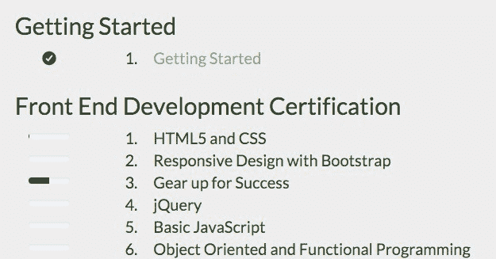
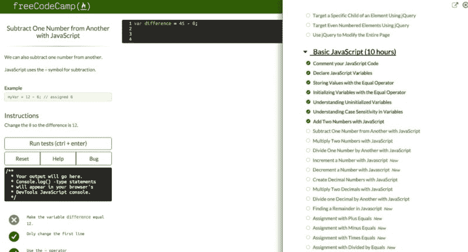
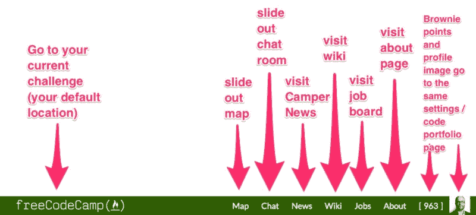

# 朝着简单的方向修补

> 原文：<https://www.freecodecamp.org/news/tinkering-toward-simplicity-6a15fb9dcdcb/>

自由代码营一直致力于尊重你的时间。最近，我们通过简化我们开源社区的网站做到了这一点，以减少混乱——尤其是对新手。

我们明白，任何时候你改变一些东西，你都有可能让你的常客们措手不及。所以我们花了很多时间来考虑每一个变化，权衡它们的利弊。

#### 简化我们社区的行话

我们的社区已经积累了各种术语来描述各种类型的编码挑战:路点、篝火、滑索、定点跳伞、远足。这些行话对我们的影响和对你们一样大，但有几个令人信服的理由让我们放弃它们:

1.  这些行话对我们社区之外的开发人员没有任何意义。你的新同事会理解你建立的“前端开发项目”比“滑索”好得多
2.  这些行话让新来的人感到困惑，尤其是非英语母语的人——他们现在代表了我们社区的五分之一以上——他们不理解他们来自 camp 的词源。
3.  这些行话并没有传达多少关于我们底层编码挑战的信息。“算法挑战”不言自明。“篝火”不是。

也就是说，有几个术语我们无法舍弃:

> **Camper** :自由代码营开源社区成员。

> **露营地**:一群位于同一城市的露营者，聚在一起编码。

> **印象分**:一个营员的分数。当你完成一项挑战或在我们的聊天室里帮助其他露营者时，你就赢得了布朗尼积分。

#### 简化我们的挑战地图

Before: The old challenge map, with progress bars and numbers next to each section.

许多我们的帮助聊天老手要求我们停止对我们的挑战进行编号。困惑的露营者会在“第 45 号”上寻求帮助——不清楚挑战在哪个部分。

露营者经常会错误地说出他们的印象分数。其他人甚至会尝试将他们之前完成的部分的所有挑战相加，以便“计算出”他们正在进行的挑战的数量。

我们最有帮助的营员必须在每次对话开始时就试图确定营员需要帮助的挑战。

通过删除这些数字，您可以引用挑战的唯一方式是通过它的名称，这是明确的。

After: Our simplified collapsible challenge map.

我们还取消了挑战地图上的进度条，因为它们传递了错误的信息:一个人对某个主题的知识已经很全面了。在实践中，总是有更多的东西需要学习，我们的挑战也将相应地继续扩大。

#### 简化我们的用户界面

Free Code Camp’s redesign features a slide-out challenge map, larger fonts, a high-contrast background, and explicit, icon-free buttons.

自由代码营的目标一直很简单:帮助你学习足够好的编码，以获得一份编码工作。我们希望我们的 web 应用程序看起来同样简单。

我们旧的用户界面是一堆引导面板和大屏幕。这些给我们的整体设计增加了层次，但是以对比和水平空间为代价。

我们从 Quora 和 Digital Ocean 获得了灵感——这两个设计良好的 web 应用程序成功地将复杂性隐藏在干净、平易近人的用户界面后面。

现在，你在自由代码营可以做的一切都只需点击一下鼠标。

#### 根据您的反馈采取行动

来自我们社区的反馈——比如在我们的[子编辑](https://www.reddit.com/r/FreeCodeCamp)上——帮助我们快速调整并修复了我们新设计中的一些错误。

你们立刻指出的一件事是，使用我们新的挑战地图需要太多的滚动。不到一天，我们的贡献者就解决了生产问题。

将来，你可以在我们发布新功能之前，通过使用[beta.freecodecamp.com](http://beta.freecodecamp.com)对它们进行反馈。

#### 前进的道路

学习编码很难。学习编码的界面应该很简单。

我们将继续支持高级用户，同时保持新用户的自由代码阵营简单。我们将通过把这些新特性的复杂性隐藏在一个简单的用户界面后面来做到这一点。

留意以下特征:

*   更多热键
*   API 和 webhooks 集成选项
*   更多代码组合数据可视化
*   离线模式
*   教师模式
*   一个协作的类似 CodePen 的沙盒编辑器
*   挑战现场结对编程
*   夜间模式

我们邀请你在 GitHub 上[追踪这些特性，甚至你自己也可以获得一些开源贡献。](https://github.com/FreeCodeCamp/freecodecamp/milestones)

*如果您喜欢，请点击？下面。关注我和免费代码营，获取更多关于技术的文章。*

