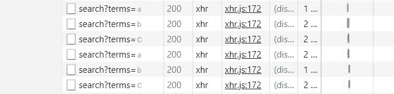

# 提高 React 应用程序性能的技巧

> 原文：<https://www.freecodecamp.org/news/tips-to-enhance-the-performance-of-your-react-app/>

ReactJS 是一个开源框架，它促进了 web 和移动应用程序 UI 界面的开发。开发人员在全球范围内使用该框架来构建最先进的应用程序，这些应用程序随后会产生收入并扩大业务受众。

然而，用 React 构建一个优秀的用户界面是不够的，你必须添加额外的亮点，使应用程序更加完善，功能更加强大，并且明显优于竞争对手。

这正是我要帮助你的，因为我描述了一些提高 React 应用程序性能的关键方法。

### 1.善用身份

当使用 React 构建移动应用程序时，可以使用 React.useMemo 包装函数和变量。这样做提供了记忆它们的能力，以便它们在未来的渲染中保持一致。

当函数和变量没有被记忆时，对它们的任何引用都可能从未来的渲染中消失。在你利用函数和变量的每一种情况下，记忆有助于消除浪费的过程和操作。

***例如:***

比方说，我们正在准备一个定制的钩子，将 URL 列表作为参数。使用钩子，我们可以将它们收集到一个 promise 对象数组中，并使用 Promise.all 解析它们。承诺列表现在映射到 URL 数组，从那里获取 URL。

```
import React from 'react'
import axios from 'axios'

export const useApp = ({ urls }) => {
  const [results, setResults] = React.useState(null)

  const promises = urls.map(axios.get)

  React.useEffect(() => {
    Promise.all(promises).then(setResults)
  }, [])

  return { results }
}

const App = () => {
  const urls = [
    'https://clinicaltables.nlm.nih.gov/api/icd10cm/v3/search?terms=a',
    'https://clinicaltables.nlm.nih.gov/api/icd10cm/v3/search?terms=b',
    'https://clinicaltables.nlm.nih.gov/api/icd10cm/v3/search?terms=c',
  ]

  useApp({ urls })

  return null
}

export default App 
```

因为我们想从 3 个 url 获取数据，所以应该只发送 3 个请求，每个 URL 一个。然而，当通过 Google Chrome 上的 inspect element 功能查看时，我们发现发送了 6 个请求，而不是假设的 3 个。发生这种情况是因为 urls 参数没有保留其先前的身份。当应用程序被重新渲染时，它每次都实例化一个新的数组，因为 React 将其视为不同的值。



要解决这个问题，我们可以使用前面提到的 React.useMemo。当使用 React.useMemo 时，promise 对象的数组不会在每次新的呈现中重新计算，除非包含 URL 列表的数组发生了变化。只要它保持不变，身份就保持不变。

**下面是将 React.useMemo 应用于本例时发生的情况:**

```
const useApp = ({ urls }) => {
  const [results, setResults] = React.useState(null)

  const promises = urls.map((url) => axios.get(url))

  React.useEffect(() => {
    Promise.all(promises).then(setResults)
  }, [])

  return { results }
}

const App = () => {
  const urls = React.useMemo(() => {
    return [
      'https://clinicaltables.nlm.nih.gov/api/icd10cm/v3/search?terms=a',
      'https://clinicaltables.nlm.nih.gov/api/icd10cm/v3/search?terms=b',
    ]
  }, [])

  const { results } = useApp({ urls })

  return null
}
```

它将发送 6 个请求，因为我们只记住了 URL 数组。在运行钩子时，promises 变量也被实例化。因此，为了只发送 3 个请求，我们还必须记住承诺变量。

```
const promises = React.useMemo(() => {
  return urls.map((url) => axios.get(url))
}, [urls])
```

> 在记住了 URL 数组和 promises 变量之后，我们得到的是:


### 2.将道具合并到儿童

有时，开发人员会遇到这样的情况，他们更喜欢在渲染之前将道具与子道具合并。为了方便起见，react 允许查看包括其他元素在内的所有 React 元素的属性，还允许显示它们的键。

因此开发人员可以选择用新的元素包装子元素，并在其中插入新的道具，或者他们可以简单地用 React 合并这些道具。

比方说，我们有一个应用程序组件，它使用一个 useModal，并提供通过使用打开、关闭、打开和激活等控件来管理模态的能力。在将道具合并到子对象之前，我们可以将它们传递给一个提供一些附加功能的 VisbilityControl 组件。

```
import React from 'react'

const UserContext = React.createContext({
  user: {
    firstName: 'Kelly',
    email: 'frogLover123@gmail.com',
  },
  activated: true,
})

const VisibilityControl = ({ children, opened, close }) => {
  const ctx = React.useContext(UserContext)
  return React.cloneElement(children, {
    opened: ctx.activated ? opened : false,
    onClick: close,
  })
}

export const useModal = ({ urls } = {}) => {
  const [opened, setOpened] = React.useState(false)
  const open = () => setOpened(true)
  const close = () => setOpened(false)

  return {
    opened,
    open,
    close,
  }
}

const App = ({ children }) => {
  const modal = useModal()

  return (
    <div>
      <button type="button" onClick={modal.opened ? modal.close : modal.open}>
        {modal.opened ? 'Close' : 'Open'} the Modal
      </button>
      <VisibilityControl {...modal}>{children}</VisibilityControl>
    </div>
  )
}

const Window = ({ opened }) => {
  if (!opened) return null
  return (
    <div style={{ border: '1px solid teal', padding: 12 }}>
      <h2>I am a window</h2>
    </div>
  )
}

export default () => (
  <App>
    <Window />
  </App>
)
```

使用可见性控件允许开发人员在允许子控件使用打开的控件之前确定激活的控件是否为真。如果通过秘密路线使用可见性控制功能，可以选择阻止未激活的用户访问内容。

### 3.制造更大的减速器

可以将一个或多个缩减器组合成一个更大的缩减器来帮助提升 react app。

比方说，您想构建一个大型应用程序，提供对各种小型服务的访问。你会如何着手开发这样一个应用程序？

**有两个选项:**

1.我们可以为应用中的每个微服务提供一个独立的部分，从那里可以直接管理其状态和上下文。

2.或者，我们可以将所有状态合并成一个大的状态，并在同一个环境中管理它们。

> 第一种方法似乎非常繁琐，所以很明显，第二种方法是可行的。

**现在我们有三个减速器来组合-**

frogsreducer.js，authreducer.js，最后是 ownersreducer.js.

**先说 authReducer.js**

```
const authReducer = (state, action) => {
  switch (action.type) {
    case 'set-authenticated':
      return { ...state, authenticated: action.authenticated }
    default:
      return state
  }
}

export default authReducer

ownersReducer.js
```

**ownersReducer.js**

```
const ownersReducer = (state, action) => {
  switch (action.type) {
    case 'add-owner':
      return {
        ...state,
        profiles: [...state.profiles, action.owner],
      }
    case 'add-owner-id':
      return { ...state, ids: [...state.ids, action.id] }
    default:
      return state
  }
}

export default ownersReducer
```

**frogsReducer.js**

```
const frogsReducer = (state, action) => {
  switch (action.type) {
    case 'add-frog':
      return {
        ...state,
        profiles: [...state.profiles, action.frog],
      }
    case 'add-frog-id':
      return { ...state, ids: [...state.ids, action.id] }
    default:
      return state
  }
}

export default frogsReducer
```

> 现在我们可以把这三个都放到主应用程序文件中，并定义它们的状态:

**App.js**

```
import React from 'react'
import authReducer from './authReducer'
import ownersReducer from './ownersReducer'
import frogsReducer from './frogsReducer'

const initialState = {
  auth: {
    authenticated: false,
  },
  owners: {
    profiles: [],
    ids: [],
  },
  frogs: {
    profiles: [],
    ids: [],
  },
}

function rootReducer(state, action) {
  return {
    auth: authReducer(state.auth, action),
    owners: ownersReducer(state.owners, action),
    frogs: frogsReducer(state.frogs, action),
  }
}

const useApp = () => {
  const [state, dispatch] = React.useReducer(rootReducer, initialState)

  const addFrog = (frog) => {
    dispatch({ type: 'add-frog', frog })
    dispatch({ type: 'add-frog-id', id: frog.id })
  }

  const addOwner = (owner) => {
    dispatch({ type: 'add-owner', owner })
    dispatch({ type: 'add-owner-id', id: owner.id })
  }

  React.useEffect(() => {
    console.log(state)
  }, [state])

  return {
    ...state,
    addFrog,
    addOwner,
  }
}

const App = () => {
  const { addFrog, addOwner } = useApp()

  const onAddFrog = () => {
    addFrog({
      name: 'giant_frog123',
      id: 'jakn39eaz01',
    })
  }

  const onAddOwner = () => {
    addOwner({
      name: 'bob_the_frog_lover',
      id: 'oaopskd2103z',
    })
  }

  return (
    <>
      <div>
        <button type="button" onClick={onAddFrog}>
          add frog
        </button>
        <button type="button" onClick={onAddOwner}>
          add owner
        </button>
      </div>
    </>
  )
}
export default () => <App />

This is what it looks like combining all three reducers into one large reducer, along with rootReducer

function rootReducer(state, action) {
  return {
    auth: authReducer(state.auth, action),
    owners: ownersReducer(state.owners, action),
    frogs: frogsReducer(state.frogs, action),
  }
```

这就是将所有三个 Reducer 和 rootReducer 组合成一个大 reducer 的样子。

### 使用 Sentry 分析错误


任何移动 app 开发项目都可以从 [Sentry 中受益匪浅。](https://sentry.io/welcome/)它提供了开发人员在使用 React 构建应用程序时处理错误和异常所需的一切。Sentry 可以识别所有错误，并将它们显示在一个中心位置，以便可以一次访问和分析所有错误。

React 上的 Sentry 很容易上手。用 npm install @sentry/browser 设置好就行了。完成后，开发人员可以登录 sentry.io，在一个仪表板上分析项目的所有错误报告。

来自哨兵的错误报告非常详细。它们提供各种重要信息，包括用户的设备信息、浏览器、URL、堆栈跟踪、错误处理方式、源代码、IP 地址、跟踪错误来源的面包屑、错误函数名等等。

### 5.将 Axios 用于 HTTP 请求

虽然 Axios 通常用于 HTTP 请求。我觉得提到这一点很重要，因为开发人员使用其他请求库(如 React 应用程序的 fetch)实际上并不常见。

Windows.fetch 不支持 Internet Explorer 11(尽管大多数人并不在乎)。但不管怎样，Axios 也能在那里工作，并提供中途取消请求的功能。

### 最后的话

上面提到的 5 种方法可以大大提高 React 应用程序的速度。它有助于开发者、你所在的企业，当然还有那些最终会使用它的人。但老实说，React 应用的成功主要取决于开发人员。

作为消费者，你希望你的应用程序有更好的性能，所以这是成功的标志。作为一名开发人员，这些方法可以让你的应用程序更容易开发，而效率是提高生产力的关键。

**ValueCoders 是一家软件开发专家 [IT 外包公司](https://www.valuecoders.com/)。如果你正在寻找离岸 React 程序员或者[雇佣安卓开发者](https://www.valuecoders.com/hire-developers/hire-android-developers)，请随时联系。**

另外，我希望这篇文章能帮助你学习新的东西，更深入地了解如何制作完美的 react 应用程序。