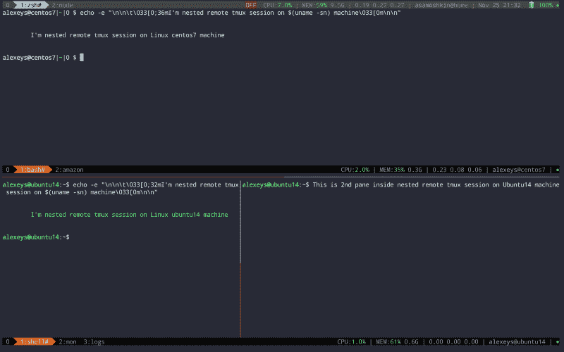
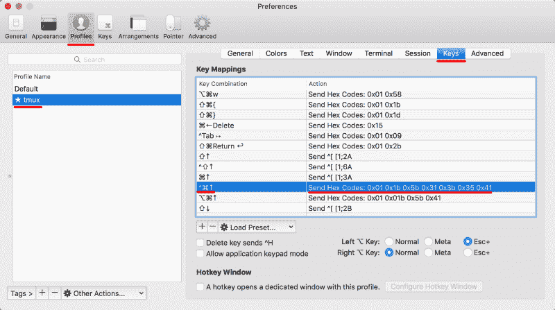
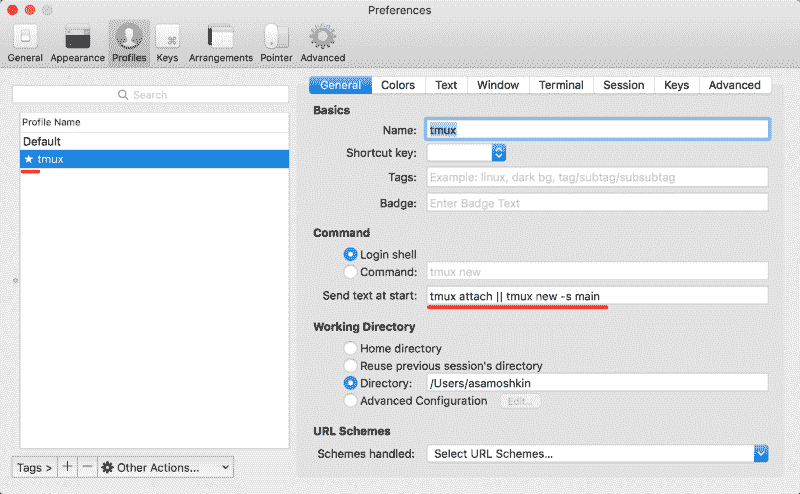

# 实践中的 tmux:ITER m2 和 tmux

> 原文：<https://www.freecodecamp.org/news/tmux-in-practice-iterm2-and-tmux-integration-7fb0991c6c01/>

阿列克谢·萨莫什金

# 实践中的 tmux:ITER m2 和 tmux

#### 在本地使用 iterm2 与 tmux 的优缺点。如何设置 iTerm2 配置文件以覆盖按键映射来触发模拟 tmux 动作

这是活跃的文章系列中的第二部分。



tmux experience inside full-screen iTerm with 2 remote sessions nested in a local one

所以你在 OSX 上使用 iTerm2 终端仿真器。您已经听说了 tmux，并决定尝试一下。这里谷歌一下，那里谷歌一下，过一会儿你就掌握了终端复用、窗口、窗格分割等概念，并理解了远程机器上 tmux 的使用，以保持会话状态并经受住突然的断开连接。

在某些时候，您可能想知道 tmux 在本地的使用情况。

> “鉴于 iTerm 已经可以在一个‘物理’窗口中创建多个虚拟窗口，可以拆分、交换和调整窗格大小，我真的需要在本地计算机上使用 tmux 而不是 iTerm 吗？”

当我学习 tmux 的时候，我一次又一次地回到同一个问题。没有一些实践，这是不清楚的。所以我决定试一试，今天我可以和你分享一下好处和缺点。

### iTerm2 与 tmux 在本地机器上的优缺点

#### **好处:**

*   **命名窗口。**类似于 iTerm 中的选项卡，但是您可以给它们命名
*   **包含系统范围信息的状态行。**包括 CPU、内存、在线/离线状态、电池、用户、主机和日期时间。
*   有了状态行和其中的一组命名窗口，我可以将 iTerm 切换到全屏模式。这让我可以在**一个不受干扰的环境**中工作，还能多得到 3 排座位。这些以前是由 OSX 菜单栏，iTerm 窗口框架和 iTerm 标签行。
*   **监视窗口的活动或寂静。**当我在一个窗格中运行一个长时间运行的命令时，我可以切换到另一个窗格，并在一段时间间隔内前一个窗格不再出现输出时得到通知
    iTerm 有[类似于](https://gitlab.com/gnachman/iterm2/wikis/TmuxIntegration)，但它只是在执行返回到命令提示符时通知您，并需要安装额外的[外壳集成](https://iterm2.com/documentation-shell-integration.html)
*   **重新定义窗格布局。**水平均匀、垂直均匀、主水平、主垂直和平铺
*   **能够在多个基于项目的本地 tmux 会话之间切换**以轻松切换上下文
*   如果你在本地和远程机器上都使用 tmux，你会得到**同样熟悉的终端环境**
*   当你使用 tmux 时，你对 iTerm2 独特特性的依赖要少得多
    这使得**更容易迁移到不同的终端仿真器**，无论它是在同一个操作系统上还是在另一个操作系统上(Linux)

#### **缺点:**

*   tmux 维护自己的回滚缓冲区。比在 iTerm 中更难访问和复制文本(只需用鼠标滚动和选择)
*   如果你在 tmux 中复制文本，它会存储在 tmux 自己的缓冲区中，默认情况下不会与你的操作系统剪贴板共享。为了 100%正确，与系统剪贴板共享在 iTerm2 中工作，但仅仅因为它支持 OSC 52 ANSI 转义序列，该序列允许 tmux 等应用程序访问和存储剪贴板中的数据。iTerm2 是一个特例。只需尝试在 OSX 默认终端运行的 tmux 中复制文本，该终端不支持 OSC52
*   如果你已经习惯了 iTerm 键绑定，**你需要学习并切换到 tmux 键绑定**，这很麻烦。不像⌘⌥- >的单次击键，你需要两个按键`s: pre` fix 后跟另一个按键，映射到特定的 tmux 动作。

就个人而言，我决定继续使用 tmux 及其特性，减少对 iTerm2 特定特性的依赖。事实上，现在我只是把 iTerm 作为通向 tmux 的隧道？

**回卷缓冲区和与操作系统剪贴板集成的问题非常重要**、**、**、**你甚至可以决定放弃采用 tmux。我们将在我以后的文章中讨论这些话题。**

### 覆盖 iTerm 键映射以触发 tmux 操作

今天，让我们看看如何在 tmux 环境中使用熟悉的 iTerm 键绑定。这个想法是在 iTerm 中映射击键来触发 tmux 动作。

最简单的方法就是进入`.tmux.conf`，将 tmux 动作映射到这些按键绑定。例如，要在 iTerm 中调整 pane 的大小，我们使用“`^⌘↑`”，让我们用一种有点天真的方式来映射 tmux 中的相同击键:

```
bind ^⌘↑ resize-pane -U
```

但是，上面的代码将无法工作，因为您不能在 tmux 键绑定中使用⌘，并且 SHIFT 的使用也非常有限。即使这是可能的，iTerm 也会在此之前拦截击键。

相反，我们设置新的 iTerm 配置文件，并覆盖键映射来发送预先配置的字节序列，这将在 tmux 中触发相应的操作。



Creating dedicated profile and override key mappings

例如，当按下`^⌘↑`时，字节序列`0x01 0x1b 0x5b 0x31 0x3b 0x35 0x41`通过终端发送到正在运行的 tmux 实例。它将它们解释为`C-a C-↑`键绑定，并根据我们的`.tmux.conf`配置触发`resize-pane -U`。

那你怎么得到那些十六进制代码呢？使用`showkey`、`od`或`hexdump`命令查看键盘按键的二进制表示:

```
$ showkey -aPress any keys - Ctrl-D will terminate this program
```

```
^A        1 0001 0x01^[[1;5A  27 0033 0x1b         91 0133 0x5b         49 0061 0x31         59 0073 0x3b         53 0065 0x35         65 0101 0x41
```

**注意** : `showkey`在 OSX 上不可用，但是在 Linux 远程机器上随时可以 SSH 并使用？。如果听起来开销很大，就用 o `d` 或 h `exdump.`

```
$ od -t x1
```

```
^A^[[1;5A   // press C-a C-↑ on your keyboar0000000 01 1b 5b 31 3b 35 410000007
```

你可以用这种方式重新映射任何键，但我只对最常见的键这样做，它们在 tmux 中有类似的动作。

一天结束时，我可以使用`⌘D`和`⌘⇧D`创建新的 tmux 窗格，使用`⌘⌥→ , ^`选项卡选择窗格以切换到最近使用的窗口，`⌘⇧`回车缩放窗格，`^⌘←`向左调整窗格大小，`⌘[` 选择前一个窗格，`⌘W`取消当前窗格，等等。所以，对于大多数常见的动作，我不需要与我的肌肉记忆作斗争。

对于所有其他没有对应的动作，我仍然使用 tmux 方式:`C-a`前缀后跟动作键。如果你对这种按键绑定的完整列表，以及所有这些是如何工作的感到好奇，请查看我的 [tmux-config](https://github.com/samoshkin/tmux-config#key-bindings) 库。

另外，我发现预定义的布局非常有用:水平、垂直、水平、垂直、平铺。我通常在主垂直布局中工作，并且需要前后交换次窗格和主窗格。这太常见了，所以我决定在 tmux `(prefix \)`和 iTerm `(⌘\)`中都设置一个键绑定。

```
# Swap panes back and forth with 1st pane# When in main-(horizontal|vertical) layouts, the biggest/widest panel is always @1bind \ if '[ #{pane_index} -eq 1 ]' \  'swap-pane -s "!"' \  'select-pane -t:.1 ; swap-pane -d -t 1 -s "!"'
```

作为一个额外的步骤，您可以将这个新的 iTerm 配置文件设置为默认值，并告诉它从一开始就跳转到 tmux 会话。



别忘了在全屏模式下运行你的 iTerm2。值了。

### iTerm2 和 tmux 之间的本机集成

iTerm 支持的 iTerm2 和 tmux 之间有一个[集成，您可能会感兴趣。](https://gitlab.com/gnachman/iterm2/wikis/TmuxIntegration)

其思想是 iTerm 仍然处理窗口和窗格管理，维护回滚缓冲区，照常复制/粘贴，但是所有的窗口都由 tmux 会话在幕后支持。它确实是 tmux 会话，但是由您熟悉的 iTerm 环境进行了抽象和封装。您可以关闭 iTerm，重新打开它并重新附加到以前的会话，而不会丢失状态。

但是，这对本地环境没有什么意义(只有在 iTerm 崩溃的情况下才有用，这种情况非常罕见)。就我个人而言，我不喜欢这种方法，因为它隐藏了我正在使用 tmux 的事实，并且只暴露了那些最常见的 tmux 特性，这些特性在 iTerm 中有类似的特性(创建窗口、拆分窗格、调整窗口/窗格的大小、关闭会话)。

### 资源和链接

tmux integration Wiki George nach man/ITER m2 git lab—[https://gitlab.com/gnachman/iterm2/wikis/TmuxIntegration](https://gitlab.com/gnachman/iterm2/wikis/TmuxIntegration)

用于 tmux 的 iTerm2 密钥映射—Dan Lowe—[http://tangled helix . com/blog/2012/04/28/ITER m2-key maps-for-tmux/](http://tangledhelix.com/blog/2012/04/28/iterm2-keymaps-for-tmux/)

iTerm2 中的自动启动 Tmux—Sao mate jina—Medium—[https://Medium . com/@ sasom/auto-Starting-Tmux-in-ITER m2-4276182d 452 a](https://medium.com/@sasom/auto-starting-tmux-in-iterm2-4276182d452a)

samoshkin/tmux-config: tmux 配置，为您的 Tmux 增压，打造舒适凉爽的终端环境—[https://github.com/samoshkin/tmux-config](https://github.com/samoshkin/tmux-config)