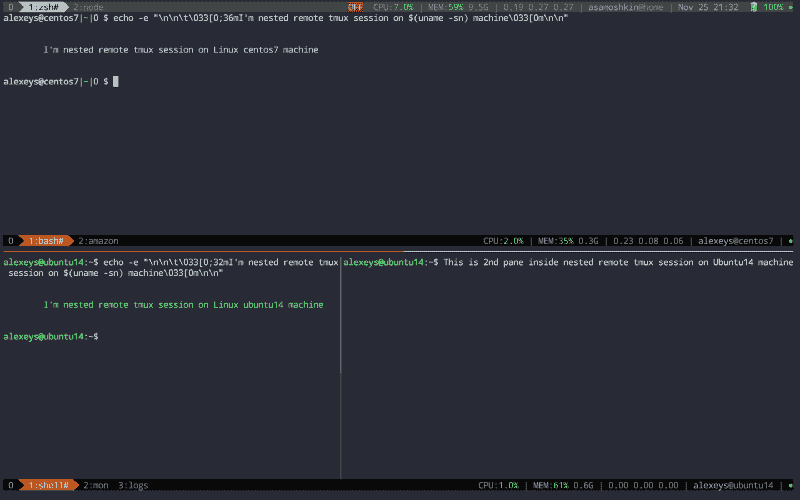

# 实践中的 Tmux:本地和嵌套远程 tmux 会话

> 原文：<https://www.freecodecamp.org/news/tmux-in-practice-local-and-nested-remote-tmux-sessions-4f7ba5db8795/>

阿列克谢·萨莫什金

# 实践中的 Tmux:本地和嵌套远程 tmux 会话

#### 我们将讨论 tmux 的特性、它们与本地和远程场景的相关性，以及如何设置和配置 tmux 来支持嵌套会话

这是我的 [tmux 实践](https://medium.com/@alexeysamoshkin/tmux-in-practice-series-of-posts-ae34f16cfab0)系列文章的第一部分。它是关于使用和配置 [tmux](https://github.com/tmux/tmux) v2，本地和远程 tmux 会话的使用，以及如何支持远程 tmux 会话嵌套在本地 tmux 会话中的场景。

在你开始阅读之前，这里有一个来自我的机器的[工作示例](https://github.com/samoshkin/tmux-config/)。我们在 iTerm2 内部的 OSX 上有一个本地 tmux 会话(以全屏模式运行)。本地会话有两个窗口:“zsh”和“node”。

“zsh”窗口分为两个窗格:在这两个窗格中，我们 SSH 到远程主机(CentOS7 和 Ubuntu14 ),并跳转到那里的远程 tmux 会话。

Ubuntu14 远程会话的底部窗格进一步分为 2 个窗格，我们有 3 个窗口:shell、mon 和 logs。



Nested tmux remote sessions happily coexist even in side-by-side panes in local tmux session

如果你想知道它们是如何协同工作的，请继续阅读。

### 特征

首先，让我们快速浏览一下 tmux 的特性和优点，了解它们与本地或远程场景的相关性。我们应该向自己澄清为什么我们需要这种“tmux 中的嵌套 tmux”的东西，因为乍一看这看起来很疯狂。

1.  **终端复用，命名为 windows，将窗口分割成几个窗格。当您决定增强您的终端仿真器时，这对于本地环境更有意义，否则它不支持上述特性。例如，iTerm 或 Terminator 已经能够多路复用终端。**
2.  使用一组预配置的窗口和窗格、它们的排列以及在内部运行的命令来设置和启动 tmux 会话，以**避免从头开始反复设置它们的麻烦。**例如:
    - "dev "会话，它包括带有两个特别用法窗格的" #1: shell "窗口
    - "#2: monitoring "窗口，带有`htop`和`sysdig`窗格的
    - "#3: log "窗口，带有`journalctl`和`tail -f app.log`窗格的
    - "#4: node "窗口，运行`node`服务器
    的 tmux 允许您编写脚本来实现这一点，如果您喜欢类似配置的方法，可以看看[tmuxinato 这与本地和远程场景都相关。](https://github.com/tmuxinator/tmuxinator)
3.  保持你的工作状态，这样你就可以脱离并以你离开时的状态继续工作。在本地处理多个项目时，您可以设置多个基于项目的 tmux 会话，并在远程机器上轻松切换上下文
    ，您可以在一个工作日结束时从会话中分离，并在晚上从家里回到同一个会话中。
4.  **幸免于突然掉线。**这是最重要的特征之一。假设，您通过 SSH 登录到远程主机，并且在那里有一个长时间运行的进程。如果 SSH 连接丢失或发生物理网络中断，SIGHUP 信号将被发送到远程 shell，它和它的所有子进程都将被终止。Tmux 使您的远程进程能够抵御这样的风险。

不太重要但仍值得一提的功能如下:

1.  **一旦您设置了 tmux 环境，您就不那么依赖父终端仿真器及其独特的功能集**，并且可以更方便地切换到另一个终端仿真器。假设我是 OSX 的 iTerm2 用户，我可以通过在 Linux 上安装我的 tmux 配置来迁移到 Terminator 或 konsole，并获得我已经习惯的完全相同的已知环境。
2.  **与您的同事分享您的远程会话，这样您就可以进行实时协作。我认为这在现实世界中很少使用，但听起来很酷。是啊，结对编程，还有其他很酷的时髦词。？**

所以，总结一下， **tmux 负责两件主要的事情**:

1.  终端多路复用、会话/窗口/窗格管理
2.  保持会话状态并在远程情况下保持连接断开

tmux 真正出彩的地方是(2)。关于(1)，[有些人认为](https://news.ycombinator.com/item?id=11283955)，tmux 打破了 Unix 的哲学，因为它试图做两件事，而不是做一件并且做好，而且(1)不应该是 tmux 的责任。

### 嵌套的本地和远程会话

因此，考虑到所有这些，有些人更喜欢在本地机器上使用 tmux，只在他们的终端模拟器上使用，首先用多路复用和窗口管理来增强它。那些大部分时间都在远程主机上使用 SSH 的人，利用了持久会话的特性和对网络断开的抵抗力。

但是本地和远程案例必须是互斥的吗？我能把它们结合起来吗？是的，通过 SSH 连接到远程主机并在那里启动 tmux 会话是合法的，尽管已经在本地的 tmux 环境中。

这被称为嵌套会话，但是有一些障碍:

首先，你面临一个问题:**既然所有的键绑定都被外部会话捕获和处理，你如何控制内部会话？**

最常见的解决方案是按两次`prefix`(prefix 是一个将 tmux 置于命令模式的键绑定，通常是`C-b`，但有些人更喜欢将其重新映射到类似屏幕的`C-a`)。第一个前缀击键被外部会话捕获，而第二个被传递给内部会话。不需要做额外的步骤，这是现成的。

但是，根键绑定(全局监听，而不是在命令模式下监听)仍然只被外部会话捕获。而且我发现双按`prefix`真的很烦。对我来说，按一次它甚至很烦人，在 iTerm2 中没有命令模式这种东西，我只需按下“`⌘⌥→`”来选择右边的窗格，而不是发送两个单独的键击`C-a RightArrow`。

另一个解决方案是设置两个单独的前缀，例如，`C-b`用于本地会话，而`C-a`用于远程会话。根据下面的配置，这意味着在本地按下`C-a`会将默认前缀`C-b`发送到远程会话。找到了这个解决方案[这里](https://simplyian.com/2014/03/29/using-tmux-remotely-within-a-local-tmux-session/)。

```
set -g prefix C-bbind-key -n C-a send-prefix
```

但是真的感觉像是:


更好的解决方案是在本地和远程会话中使用相同的键表——没有单独的前缀或双击前缀——并且在使用内部会话时，在外部会话中关闭所有的键绑定和前缀处理。[演职员表](http://stahlke.org/dan/tmux-nested/)和这个 [Github 问题](https://github.com/tmux/tmux/issues/237)。

因此，当我要在内部会话中工作时，我只需在外部会话中按下`F12`并切换`OFF`模式。发生这种情况时，外部会话会在状态行中显示`OFF`可视指示器，并更改状态行的可视样式，以进一步强调会话处于关闭模式。

以下是我最近制作的 [tmux 配置](https://github.com/samoshkin/tmux-config)的[要点](https://gist.github.com/samoshkin/05e65f7f1c9b55d3fc7690b59d678734)(仅包含相关部分):

基本上，我们为根键表设置了`F12`键绑定。按下时，我们将前缀设置为`None`，将当前键表切换到`off`，然后改变状态行的样式，并强制 tmux 刷新状态行。如果当前窗格复制模式存在，则采取额外的步骤来取消当前窗格复制模式。当我们切换到键表的`off`并关闭前缀处理时，外部会话根本不监听任何击键。所有击键都被传递到内部会话，不会被外部会话截获。

这些都很好，但是我们需要以某种方式返回，将外层会议恢复到正常工作模式。这就是为什么我们在键表`off`中设置了一个单键绑定`F12`，它恢复了初始`F12`按键的效果。

此外，我们为状态行配置了一个可视指示器，当当前键表为`off`时显示，否则隐藏。

总之，给定这种配置，您可以用一个窗口和两个窗格建立一个本地会话，其中包含到不同主机的嵌套远程会话(见本文开头的图片)。

### 特定于远程的会话配置

在前面的示例中，您可能会注意到外部会话的状态行位于顶部，而内部会话的状态行位于底部。这提供了一个很好的视觉区别，并且不会使状态行堆叠在彼此之上。

但是，如何应用不同的基于条件的配置呢？

嗯，那相当容易。我们可以通过`SSH_CLIENT`环境变量的存在来检测会话是远程的还是本地的。

```
if-shell 'test -n "$SSH_CLIENT"' \   'source-file ~/.tmux/tmux.remote.conf'
```

并且`~/.tmux/tmux.remote.conf`文件包含将仅应用于远程会话的配置。在那里，我们改变状态行的位置，并从中删除一些部件(如时钟和电池)，因为它们只是从本地会话复制相同的部件。

所以，就这样了。如果您想看看所有这些的运行情况，请查看我的 [tmux-config](https://github.com/samoshkin/tmux-config) 库。

### 资源和链接

tmux/tmux: tmux 源代码-[https://github . com/tmux/tmux](https://github.com/tmux/tmux)

在本地 Tmux 会话中远程使用 Tmux | simple Ian—[https://Simply Ian . com/2014/03/29/using-Tmux-remote-Within-a-Local-Tmux-Session/](https://simplyian.com/2014/03/29/using-tmux-remotely-within-a-local-tmux-session/)

嵌套的 tmux—[http://stahlke.org/dan/tmux-nested/](http://stahlke.org/dan/tmux-nested/)

切换所有键绑定问题# 237 tmux/tmux-[https://github . com/tmux/tmux/issues/237](https://github.com/tmux/tmux/issues/237)

samoshkin/tmux-config: tmux 配置，为您的 Tmux 增压，打造舒适凉爽的终端环境—[https://github.com/samoshkin/tmux-config](https://github.com/samoshkin/tmux-config)