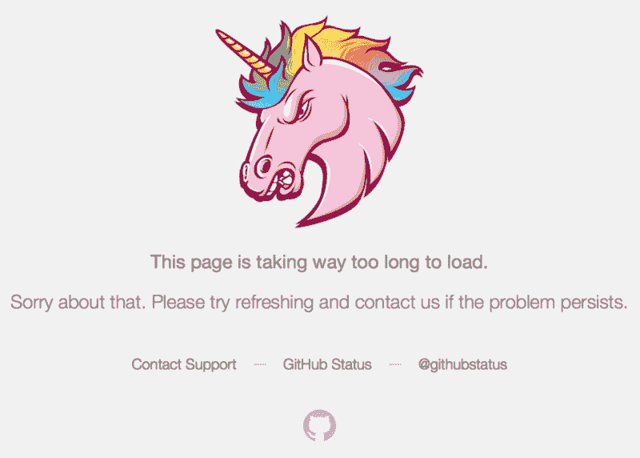
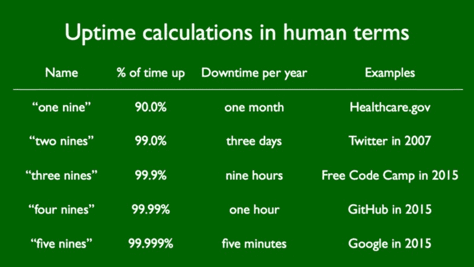
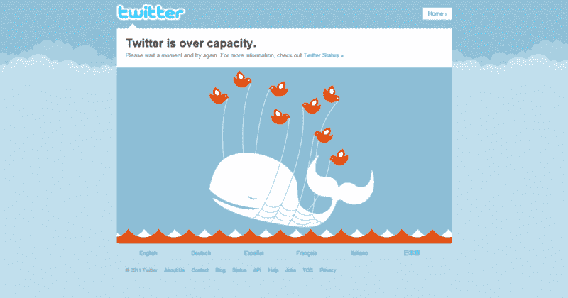
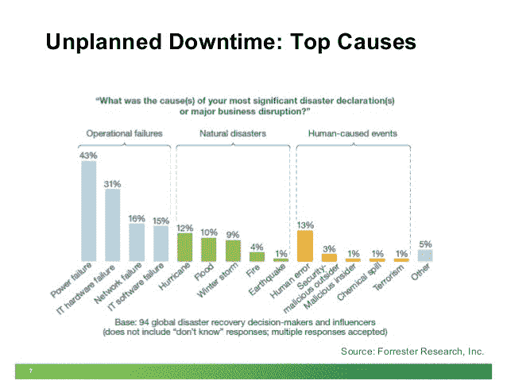

# 到 9999

> 原文：<https://www.freecodecamp.org/news/to-the-nine-nine-ninety-nines-9f6b08be72df/>

昨天，开源世界的中心 GitHub 宕机了三个小时。

如果你是软件开发的新手，一个网站宕机三个小时就能保证一篇文章，这似乎有点奇怪。

这次停电具有新闻价值有两个原因。首先，因为这种中断很少发生。GitHub 上一次大规模宕机是在 2010 年，当时其首席执行官意外地[破坏了其生产数据库](https://github.com/blog/744-today-s-outage)。

The last time GitHub’s 500 page was widely seen was way back in 2010.

第二，GitHub 现在是互联网上第 87 个访问量最大的网站，[价值 20 亿美元](http://www.wsj.com/articles/github-raises-250-million-at-2-billion-valuation-1438206722)，并且有一个近 500 人的[团队](https://github.com/about/team)——其中大部分是工程师。

一个由开发人员为开发人员建立的网站，拥有强大的工程文化，在一个工作日的中途崩溃——这是对 web 开发有多难的一个严峻的提醒。

在我们等待 GitHub 即将发布的停电事后分析(更新:[这是一次停电](https://github.com/blog/2101-update-on-1-28-service-outage))的同时，让我们探讨一下“可用性”的概念，并谈谈它为什么如此重要。

#### 高可用性—正常运行时间、停机时间和大量的 9

首先，让我们介绍一些你会听到开发人员乱说的术语。

**正常运行时间**是服务可用并响应请求的时间。你正在阅读这篇关于媒介的文章，这意味着媒介已经上升了。现在是媒体的正常运行时间。

正常运行时间的死对头是**停机时间**——当服务没有响应请求时。

除非某项服务被安排在**计划停机**(维护)——或者有网络连接问题——停机通常意味着服务器已经崩溃。在某个地方，一名开发人员正疯狂地试图恢复这些服务器，这样他们就可以挽救他们在当前雇主那里的职业前景。

**可用性**是正常运行时间与停机时间的比率。用“**九**来表达你会听到有人说“我们有五个 9 的正常运行时间。”这意味着服务在 99.999%的时间(正常运行时间)都可用，只有 0.001%的时间(停机时间)可用。

那么对于像你我这样的人类来说，这些数字看起来像什么呢？

高可用性的黄金标准通常被认为是五个九。

正如你所看到的，在同一年中总共下降超过一个小时会让你降到“三个九”抱歉，GitHub，我猜你今年会被困在“三个九”俱乐部的免费代码营里。

2016 年到目前为止，自由代码营实际上没有停机超过几秒钟，但我们计划全年每次停机几分钟(计划内停机)——通常在西半球的深夜。这大概总共会超过一个小时。

对我们来说，三个九就够了。因为实现高可用性很难，而且通常要花很多钱。

#### 为什么高可用性如此重要？

实现高可用性的成本很高。为您的可用性增加一个额外的 9 可能会涉及数百万美元的开发时间和冗余的基础设施。所以何必呢？

如果你看过 2010 年的电影《社交网络》，你可能还记得马克·扎克伯格的角色[谈论可用性](https://www.youtube.com/watch?v=36zhwwm3Lg0)的重要性的场景。“我们从不坠机。如果服务器出现故障，哪怕只有一天，我们的声誉都会遭到不可挽回的损失。”

你有没有看到这句话，然后想:“一天下来——哎呀，这已经让你一路跌到两个 9 了！”如果是这样，感谢你花时间阅读我的图表。

不管这句话是否夸张——Twitter 过去一直在崩溃，它没有“不可逆转地摧毁”它的声誉——倒下确实会让你看起来不那么专业，至少对其他开发者来说是这样。所以越少下去越好。

Twitter’s infamous “fail whale”. For curious readers, here’s a [one-hour talk](https://vimeo.com/53693402) on how they eventually solved their uptime woes by restructuring.

高可用性很重要的另一个原因是，停机可能会给一些公司造成数百万美元的收入损失。

亚马逊 2014 年的总收入为 810 亿美元。一年有 525600 分钟。因此，亚马逊每分钟销售价值 156，110 美元的商品。

“四个九的可用性”和“五个九的可用性”之间的差异大约是每年 47 分钟，这对亚马逊来说是超过 700 万美元的收入。

#### 我如何在不破产的情况下最大化正常运行时间？

There’re acts of God, and then there’re acts of humans.

这里有一些快速且便宜的方法，可以通过防止可避免的错误来最大化网站的正常运行时间:

*   编写自动化测试，如果可能的话，在部署新代码之前，使用持续集成工具来捕捉中断的测试。

We use Travis CI integrated into GitHub to ensure all our tests pass before we accept pull requests.

*   创建一个尽可能靠近生产网站的本地测试环境(一种方法是[使用 Docker](https://www.joyent.com/blog/spin-up-a-docker-dev-test-environment-in-60-minutes-or-less) )。
*   创建一个模拟您的生产环境的试运行环境，并让您的团队成员在那里进行 QA 修复和功能测试。
*   确保您的测试和试运行环境不能访问您的生产数据(这就是导致 GitHub 2010 年大停机的原因)。
*   不要在深夜将代码推向生产。大多数自由代码营的计划外停机都是由于熬夜后的错误判断(通常是我的错误判断)造成的。相信我——没有什么特性值得让产品崩溃。当有疑问时，考虑一下吧！

我希望这篇文章能激励你去追求适合你的 9 这个数字。

哦，如果你偶尔做了一些愚蠢的事情，让你的网站崩溃，不要对自己太苛刻。如果能发生在 GitHub 的牛逼工程师身上，那也能发生在任何人身上。

我只写编程和技术。如果你在推特上关注我，我不会浪费你的时间。？