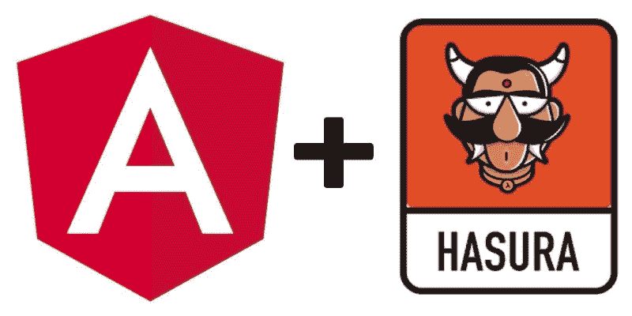
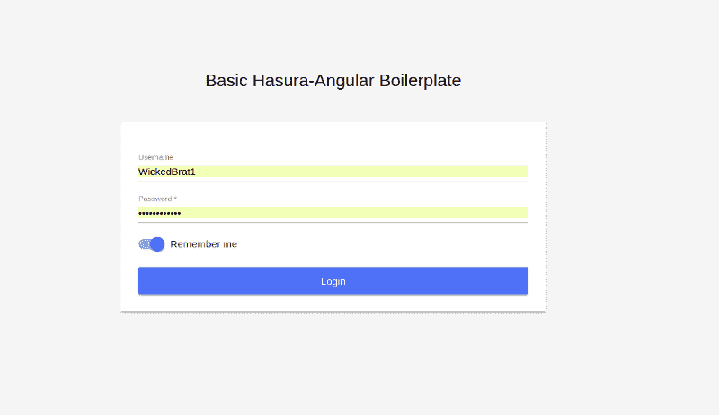
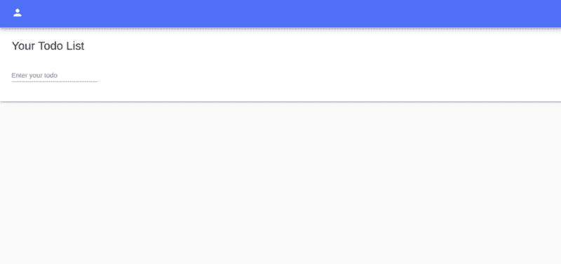
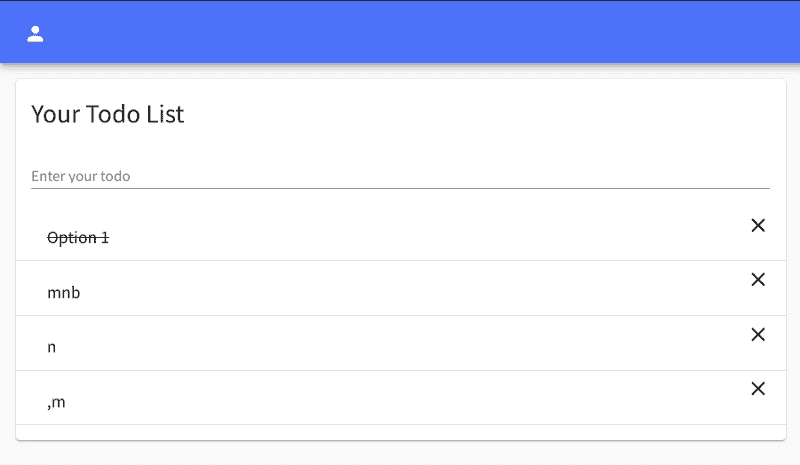

# 如何开始使用 Angular-Hasura 样板

> 原文：<https://www.freecodecamp.org/news/todo-boilerplates-with-hasura-on-angular-460db0040b4a/>

由 siddhant srivastav

# 如何开始使用 Angular-Hasura 样板

Angular + Hasura

这篇博客文章让你知道如何在 Hasura 和 Angular 的帮助下开始使用 GraphQL。我将向您提供关于 Angular 上的样板应用程序的信息，这些应用程序被配置为与 Hasura 在 Heroku 上部署的 GraphQL 引擎一起使用。

这篇文章背后的想法是给你一个创建应用程序的过程，以及它所使用的方法的想法。我们不会过多地讨论代码，只讨论启动和运行应用程序所需的部分。

让我们开始吧！

### 概观

我们有 3 种类型的样板文件:

#### 你好世界

这个样板文件只是一个 Angular 应用程序，其中已经设置了 GraphQL 和 headers。使用这个样板文件，您可以直接克隆应用程序并开始创建您的应用程序！

#### 基础

这个样板文件建立在 **hello-world** 样板文件的基础上，介绍了变异/查询的基本功能，并向您展示了如何编写它们以及使用它们的函数。

#### 先进的

这个样板文件建立在**基础**应用的基础上，已经完全具备了突变、查询和 Auth0 认证功能！这个样板文件是一个理想的应用程序，可以让你立刻开始创建新的应用程序。

### 哇哦。停下来。这里重要的东西…

要使用这些样板文件，需要一些重要的设置。他们在这里:

*   在 Heroku 创建一个实例。为此，请访问 [https://hasura.io](https://hasura.io)
*   设置环境变量:转到文件`environments/environment.ts`并更改端点和其他必需字段的值。在高级应用程序中，您需要使用 Auth0 提供的凭证。

### 样板文件

允许 Angular 与 Hasura 的 GraphQL 引擎交互的三个样板文件可以从 [Hasura 引擎报告](https://github.com/hasura/graphql-engine)中克隆出来。所有三个样板文件的共同步骤是:

*   克隆应用程序。
*   `cd <boilerplate-na`我>和
*   运行`npm install`来安装所有的依赖项。

#### 你好世界

hello-world 样板文件只不过是一个简单的 Angular 应用程序，带有 GraphQL 模块设置和已经设置好的 apollo 客户端。应用程序的目录结构如下所示。

hello world 应用程序有一个导入`graph-ql.module.ts`的 hello 模块。一旦 Hello 模块被激活，形成这个目录结构有助于我们初始化 GraphQL 模块。

但是我们为什么需要这样做呢？GraphQL 模块初始化头部并创建一个 Apollo 客户机。报头包含授权令牌和其他信息。我们希望仅在设置授权令牌时初始化该模块，否则我们需要再次刷新应用程序来设置模块中令牌的值。所有样板文件都遵循这种模式。

Hello 模块是从 App 模块激活的。

现在让我们更好地了解 GraphQL 模块。这个模块在三个样板文件中都是相同的，只是对标记做了一些小的调整。

#### 基本应用程序

基本的应用程序样板建立在 Hello World 样板之上。该应用程序的补充是查询和突变，为您提供了查询和突变是如何编写的例子。

这些查询是用`app/shared/operations.ts`编写的。共享模块被导入到基本模块，基本模块包含 HTML 和用于查询的函数。

Login Page

在**基础**应用中，登录由一个模拟认证器处理，该认证器设置一个硬编码会话，并允许您使用任何用户名和密码登录。

Todo List

Completed item

#### 高级样板文件

该样板文件建立在基本样板文件的基础上，并向应用程序添加了身份验证功能。

**通过 Auth0 认证**

*   前往[https://auth0.com](https://auth0.com)并签到。
*   登录后，创建一个新的应用程序并获取该应用程序的凭据。
*   打开应用程序的设置并添加回拨 url。对于开发:使用 url[http://localhost:4200](http://localhost:4200)，对于生产使用您网站的 URL。

现在转到`environments/environment.prod.ts`并替换环境变量。您现在可以使用高级样板文件了！

### 编码快乐！

### 关于我

我叫 **Siddhant Srivastav** ，我是阿拉哈巴德**印度** **信息技术学院的本科生。**

我热爱创作。我喜欢用 Python 和 JS 编写代码。我喜欢**开源**并为我感兴趣的项目做贡献。

你可以在 [LinkedIn](https://www.linkedin.com/in/siddhant-s-45065182/) 、 [Twitter](http://twitter.com/siddhantsme) 和 [GitHub](https://github.com/WickedBrat) 上关注我。