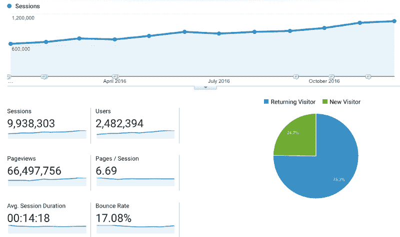
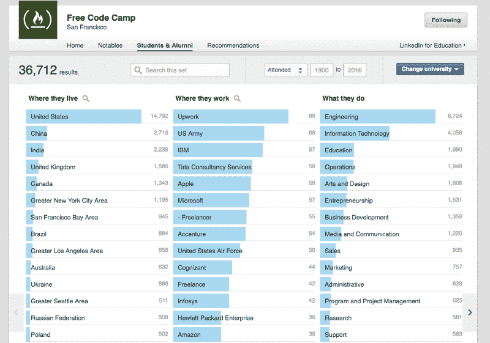

# 今夜与朋友和代码一起敲响 2017

> 原文：<https://www.freecodecamp.org/news/tonight-ring-in-2017-with-friends-and-code-1731c531c915/>

在过去的一年里，我们的社区发展了很多。

我们一起完成了数百万个编码挑战，并为非营利组织创建了几十个项目。

我们中的数千人得到了开发人员的工作。

超过 500 人已经承诺参加 2017 年的 [#100DaysOfCode 挑战](https://medium.freecodecamp.com/start-2017-with-the-100daysofcode-improved-and-updated-18ce604b237b#.fr40is5ix)。

加入他们，今晚加入我们。

从美国东部时间晚上 11 点开始，我们将欢迎像 Stack Overflow 创建者 Jeff Atwood 这样的客人参加我们的互动直播。

点击这里阅读本次活动[，点击这里](https://medium.freecodecamp.com/announcing-open2017-the-online-new-years-eve-event-for-developers-cf7bf57e6ac9#.xct77aq4j)查看我们的完整日程[。](https://www.freecodecamp.com/open2017/)

希望在那里见到你。

祝你和你的家人 2017 年快乐幸福！