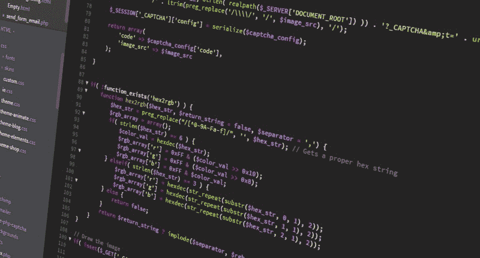

# 我希望在开始编码时就知道的工具

> 原文：<https://www.freecodecamp.org/news/tools-i-wish-i-had-known-about-when-i-started-coding-57849efd9248/>

作者马里奥·奥约斯

# 我希望在开始编码时就知道的工具

Photo by energepic.com from Pexels

在科技世界里，人们会告诉你使用成千上万的工具。你怎么知道从哪里开始？

作为一个相对来说最近才开始编码的人，这种大量的信息太多了，难以筛选。我发现自己安装的扩展在我的开发周期中并没有真正帮助我，甚至经常妨碍我的开发。

我绝不是专家，但随着时间的推移，我已经整理了一份工具清单，证明对我非常有用。如果你刚刚开始学习如何编程，这将有望为你提供一些指导。如果你是一个经验丰富的开发人员，希望你还能学到一些新东西。

我将把这篇文章分成 Chrome 扩展和 VS 代码扩展。我知道还有其他浏览器和其他文本编辑器，但是我敢打赌大多数工具也适用于您选择的平台，所以我们不要就我们的个人偏好展开宗教式的争论。

随意跳来跳去。

### Chrome 扩展

Photo by Caio Resende from Pexels

现在，我自称是一名 web 开发人员，我几乎生活在我的 Chrome 控制台中。以下是一些能让我少花时间的工具:

*   [WhatFont](https://chrome.google.com/webstore/detail/whatfont/jabopobgcpjmedljpbcaablpmlmfcogm?hl=en) —名字说明了一切。这是找出您最喜欢的网站正在使用的字体的简单方法，这样您就可以在自己的项目中借用它们。
*   [杀虫剂](https://chrome.google.com/webstore/detail/pesticide-for-chrome/bblbgcheenepgnnajgfpiicnbbdmmooh?hl=en)——用于查看你的`<d` iv > s 的轮廓和修改 CSS。当我试图了解盒子模型时，这是我的救命稻草。
*   Colorzilla —用于从网站上复制精确的颜色。这会将一种颜色直接复制到你的剪贴板上，这样你就不用花太多时间去寻找合适的 RGBA 组合了。
*   CSS Peeper —用于查看网站上使用的颜色和资源。一个很好的练习，尤其是在开始的时候，是克隆出你认为看起来很酷的网站。这让您可以一窥他们的配色方案，并让您看到他们的页面上还有什么其他资产。
*   Wappalyzer —用于查看网站上正在使用的技术。有没有想过一个网站使用的是什么样的框架或者托管在什么服务上？别再看了。
*   [React 开发工具](https://chrome.google.com/webstore/detail/react-developer-tools/fmkadmapgofadopljbjfkapdkoienihi?hl=en) —用于调试 React 应用程序。值得一提的是，这仅在您编写 React 应用程序时有用。
*   [Redux 开发工具](https://chrome.google.com/webstore/detail/redux-devtools/lmhkpmbekcpmknklioeibfkpmmfibljd?hl=en) —用于使用 Redux 调试应用程序。值得一提的是，这只有在应用程序中实现 Redux 时才有用。
*   [JSON 格式化程序](https://chrome.google.com/webstore/detail/json-formatter/bcjindcccaagfpapjjmafapmmgkkhgoa?hl=en) —用于使 JSON 在浏览器中看起来更干净。您是否曾经盯着难看的 JSON blob，试图弄清楚您想要的信息嵌套有多深？这使得它只需要 2 个小时而不是 3 个小时。
*   [Vimeo 重复和加速](https://chrome.google.com/webstore/detail/vimeo-repeat-speed/noonakfaafcdaagngpjehilgegefdima?hl=en) —用于加速 Vimeo 视频。如果你像大多数 web 开发人员一样观看视频教程，你就会知道以常规播放速度的 1.25 倍来消费它们是多么方便。YouTube 也有不同的版本。

### VS 代码扩展

Photo Courtesy of Pexels

Visual Studio 代码是我选择的编辑器。

人们喜欢他们的文本编辑器，我也不例外。然而，我敢打赌，这些扩展中的大部分也适用于您正在使用的任何编辑器。查看我最喜欢的扩展:

*   [自动重命名标签](https://marketplace.visualstudio.com/items?itemName=formulahendry.auto-rename-tag) —自动重命名成对的 HTML 标签。你创建了一个`<` p >标签。现在你想把它和它的 encl `osin` g < /p >标签改成别的。简单地改变一个，另一个就会跟上。理论上提高你的生产力 2 倍。
*   [HTML CSS 支持](https://marketplace.visualstudio.com/items?itemName=ecmel.vscode-html-css) —对 HTML 文档的 CSS 支持。这对于获得一些简洁的语法高亮显示和代码建议很有用，这样 CSS 只会让你一天中有几次想放弃编码。
*   [HTML 片段](https://marketplace.visualstudio.com/items?itemName=abusaidm.html-snippets) —有用的代码片段。又一个节省时间的好方法。把这个和 [Emmet](https://emmet.io/) 结合起来，你几乎不用再输入真正的 HTML 了。
*   [Babel ES6/ES7](https://marketplace.visualstudio.com/items?itemName=dzannotti.vscode-babel-coloring) —增加 JavaScript Babel 语法着色。如果您使用的是 Babel，这将使区分代码中发生的事情变得容易得多。如果您喜欢玩 JavaScript 的现代特性，这是一个不错的选择。
*   [括号对上色器](https://marketplace.visualstudio.com/items?itemName=CoenraadS.bracket-pair-colorizer) —为括号添加颜色，以便于块可视化。这对于那些没有准确关闭括号或圆括号的常见错误来说非常方便。
*   ESLint —将 ESLint 集成到 Visual Studio 代码中。这对于在编写代码时获得关于错误的提示很方便，并且根据您的配置，它可以帮助实施良好的编码风格。
*   [参考线](https://marketplace.visualstudio.com/items?itemName=spywhere.guides) —向代码添加额外的参考线。这是另一个视觉提示，以确保您正确地关闭括号。如果你看不出来，我是一个非常视觉化的人。
*   [JavaScript 控制台实用程序](https://marketplace.visualstudio.com/items?itemName=whtouche.vscode-js-console-utils) —使控制台日志记录更容易。如果您像大多数开发人员一样，您会发现自己在调试流程中登录到控制台(我知道我们应该使用调试器)。这个实用程序使得创建有用的`console.log()`语句变得容易。
*   [代码拼写检查器](https://marketplace.visualstudio.com/items?itemName=streetsidesoftware.code-spell-checker) —解释 camelCase 的拼写检查器。错误的另一个常见来源是随意使用变量或函数名。这个拼写检查器将查找不常见的单词，并且很好地解释了我们用 JavaScript 写东西的方式。
*   Git Lens —更容易看到何时、由谁进行了更改。当代码出错时，这是责备适当的人的好方法，因为这绝对不是你的错。
*   [路径智能感知](https://marketplace.visualstudio.com/items?itemName=christian-kohler.path-intellisense) —文件路径自动完成。这对于从其他文件导入东西非常方便。它使浏览你的文件树变得轻而易举。
*   [更漂亮的](https://marketplace.visualstudio.com/items?itemName=esbenp.prettier-vscode) —自动代码格式化程序。忘记那些你不得不手动缩进你的代码，让你的代码变得易读的日子吧。Prettier 将为您更快、更好地完成这项工作，这是您自己无法做到的。这款我怎么推荐都不为过。
*   [VSCode-Icons](https://marketplace.visualstudio.com/items?itemName=robertohuertasm.vscode-icons) —将图标添加到文件树中。如果看你的文件结构伤害了你的眼睛，这可能会有所帮助。对于你正在制作的任何类型的文件，都有一个有用的图标，这将使你更容易区分你在看什么。

### **总之**

您可能有自己的一套开发周期不可或缺的工具。希望我上面提到的一些工具能让你的工作流程更有效率。

然而，不要陷入在学会使用已经有的工具之前安装你遇到的每一个工具的陷阱，因为这可能是一个巨大的时间陷阱。

我鼓励你在下面的评论中留下你最喜欢的工具，这样我们就可以一起学习了。

如果你喜欢这篇文章，请给它一些掌声，看看我写的其他文章[这里](https://codeburst.io/how-i-cut-my-react-javascript-bundle-size-in-half-with-three-lines-of-code-fe7798ecbd3f)、[这里](https://medium.com/@mariohoyos/a-personal-case-for-gratitude-bff8345b3514)、[这里](https://codeburst.io/my-3-favorite-things-about-the-coding-bootcamp-experience-cd4e1a3fd3dc)和[这里](https://medium.com/@mariohoyos/life-is-too-short-to-be-miserable-and-why-i-left-a-six-figure-job-in-the-search-for-something-327ab84416a9)。另外，在推特上给我一个关注。