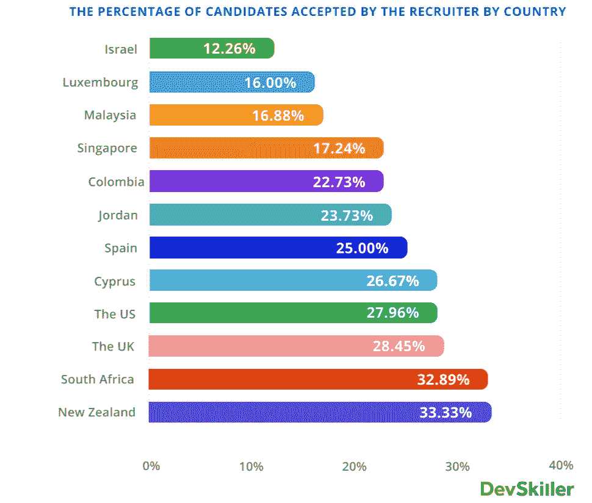
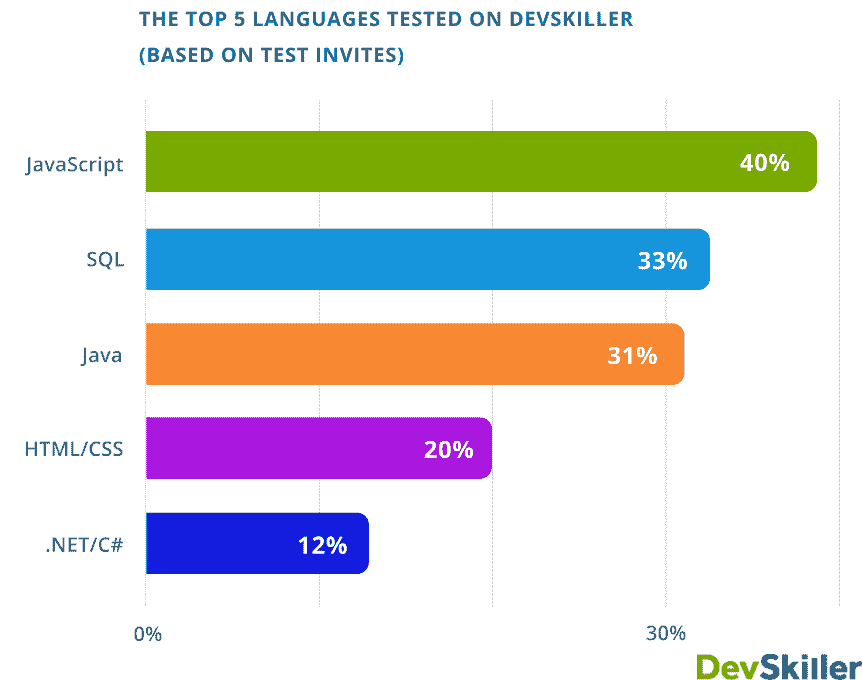
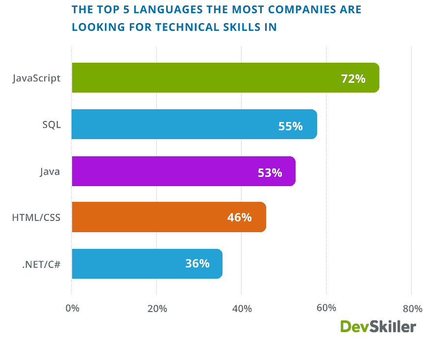
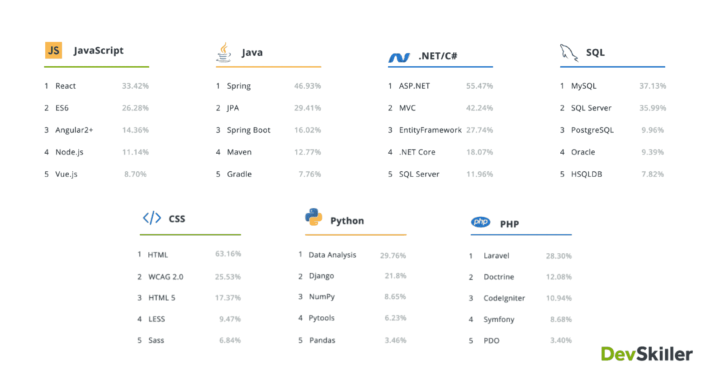
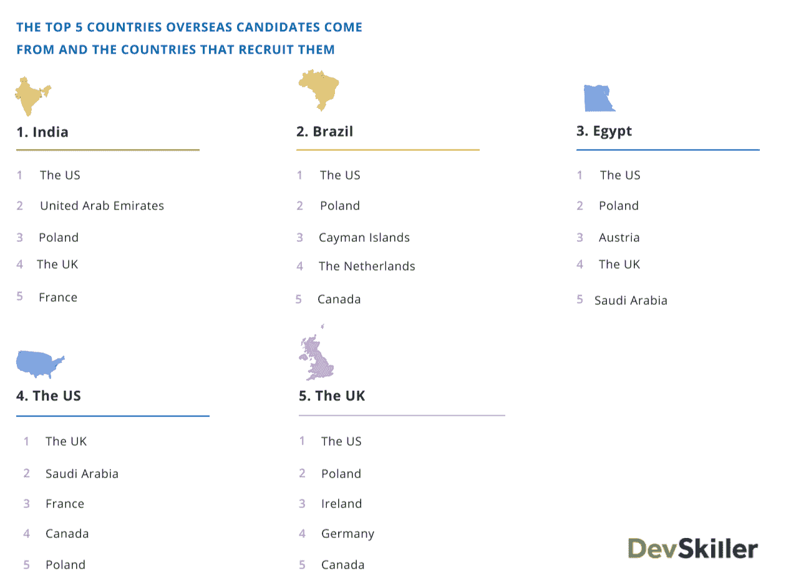
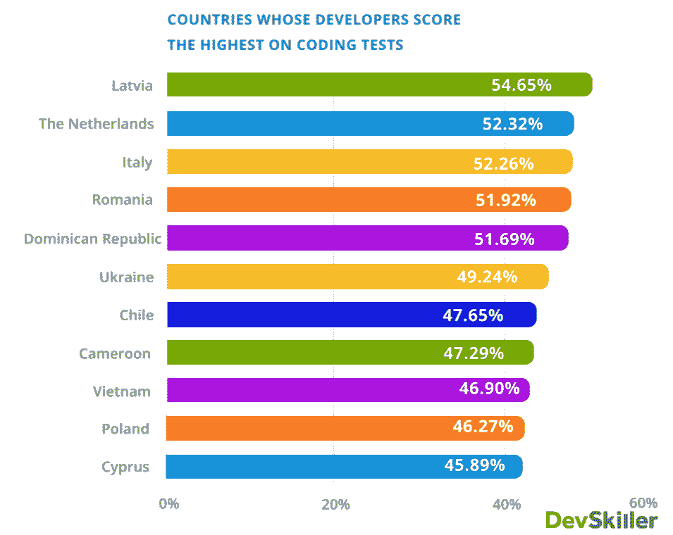
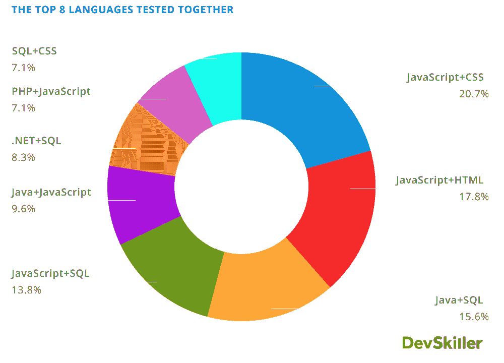

# 我们在全球进行了 213，000 次招聘编码测试。这是我们学到的。

> 原文：<https://www.freecodecamp.org/news/top-2020-it-skills/>

## 新的一年，新的十年，同样的行业。对吗？不完全是。

对开发人员的需求正在快速增长。

美国劳工统计局预测，未来十年对软件开发人员的需求将增长约 25%。这只是在美国。印度、尼日利亚、巴西和中国等一些市场的需求可能会增长得更快。

为了进一步利用这些令人鼓舞的数据，我所在的开发评估公司 DevSkiller 编写了这份报告。它分析了 2020 年新兴的 It 技能和趋势，以及它们对开发者职业的意义。

在今年的调查中，我们的样本量几乎增加了一倍。我们筛选和审查了发送给全球 143 个国家的开发人员的 213，782 份编码测试。由此，我们已经能够利用地理上的技术招聘洞察力来揭示技术招聘的国际流动。

这些编码测试表明了公司正在积极寻找的技能和他们最常去的地方。我们相信，随着时间的推移，利用历史数据的能力对于跟踪历史数据发生的模式将是非常宝贵的。

DevSkiller 的核心任务是为技术招聘决策者提供他们需要的工具和信息，以做出最佳聘用。我们连续第二年发表我们的分析，希望我们的发现也能帮助你。

在本文中，我将浏览数据集，并将焦点集中在我们发现的一些值得注意的发现上。

## 来自以色列的公司是最挑剔的

我们今年的报告结果证实，以色列公司是最挑剔的。以色列的公司只考虑他们测试的 12.26%的开发者。

如果你参加一个编码测试，不同国家的开发者往往会得到不同的分数。同时，并不是所有的雇主都对他们雇佣的候选人如此挑剔。这是为什么呢？

我们是一个全球化的社会，世界各国都用一系列对比标准来衡量他们的候选人。你被评估的地点最终会影响到你将如何被问责。

事实上，以色列的招聘人员可能在候选人身上寻找一些美国的招聘人员可能认为不太重要的东西。

供给和需求也可能发挥作用。对于任何一个职位空缺，可能会有很多人申请一个只有几个职位空缺的职位。这反过来会影响招聘人员的行为。

对于一些雇主来说，个人的 IT 技能只是一个开始。

由于以色列的经济在很大程度上是以科技为基础的，他们的选择性并不令人惊讶。以色列劳动力市场要求软件工程和开发方面的高学历，因此公司自然会寻求竞争优势。

去年，新加坡是最具选择性的，占近 20%，今年降至 17%左右。由于他们在教育方面的世界级经合组织排名，他们仍然保持在前五名。

## 72%的公司在寻找 JavaScript 开发人员，JS 是最受欢迎的 IT 技能测试(40%)

JavaScript 正式成为 2020 年最受欢迎的 IT 技能。

A chart showing 40% of tests on DevSkiller were in JavaScript - followed by SQL, Java, HTML/CSS and .NET/C#

这一发现值得注意，因为在 2019 年， [Java 占据了这一特殊荣誉的头把交椅](https://www.freecodecamp.org/news/what-we-learned-about-2019-developer-hiring-trends-from-analyzing-112-654-coding-tests-b05a3ba0ca7b/)。

这一发现证明了从事网络应用的开发者有着不可抗拒的需求。值得注意的是，这一事实是持续趋势的一部分，还是统计上的异常现象。

Stack Overflow 的 [2019 年开发者调查](https://insights.stackoverflow.com/survey/2019)也有类似的观点，该调查发现 JavaScript 是职业开发者中最受欢迎的语言。难怪它会在我们今年的 It 技能排行榜上名列前茅。

JavaScript、SQL 和 Java 仍然保持去年的前三名，证实了公司的需求仍然相当稳定。

虽然 Java 是历史上测试最多的语言，但它不在今年大多数公司寻求的前两大技术技能之列。

A chart showing JavaScript is the most widely sought technical skill by companies, followed by SQL, Java, HTML/CSS and .NET/C#.

显而易见的是，越来越多不同规模的公司正在寻找拥有 JavaScript 技术技能的开发人员。数据库 IT 技能对后端和前端开发人员都很重要，所以 SQL 保持第二的位置是有道理的。HTML、CSS 之类的前端技能排第四。

GitHub 的[The State of octo verse](https://octoverse.github.com/#top-languages)进一步证实了 JavaScript 在前端 IT 精英中的地位，在他们的报告中名列榜首。另一方面，SQL 仍然是首要的数据库 IT 技能，这与我们的调查结果一致。

正如 W3Techs(网络技术调查)所强调的，JavaScript 是最受欢迎的客户端语言，因为它在 95%的网站中很流行。惊人的数字。

从这些数据中我们可以得出的结论是，由于网络浏览器的普及，JavaScript 仍然是世界上最受欢迎的 IT 技能。

## React、Spring、ASP.NET、MySQL、HTML、数据分析和 Laravel 是它们各自技术栈中最受欢迎的技术

由于我们的测试是在考虑技术栈的情况下创建的，所以我们能够看到在它们各自的栈中最流行的 IT 技能、资源和技术是什么。

Rankings for different libraries and frameworks for the most popular programming languages.

React 已经在《黑客新闻》的[招聘趋势](https://www.hntrends.com/2019/nov-graphql-reaches-top-20.html)排行榜上名列前茅好几年了，所以看到它在 JavaScript 排行榜上名列前茅也就不足为奇了。

Spring 是 Java 技术栈中资源最多的工具，JPA 和 Spring Boot 位居第二和第三。

ASP.NET，流行的 web 应用程序框架是。网络技术栈。MVC 架构和实体框架分别在 42%和 28%的测试中使用。

在数据库领域，男女比例相当平均。将近 40%的 SQL 测试使用 MySQL，而大约三分之一的测试使用 SQL Server。

HTML 在 CSS 技术栈中占有重要地位，因为 CSS 和 HTML 紧密交织在一起。最值得注意的观察是，HTML 仍然作为一个单独的实体进行测试。这表明，虽然它可能容易学习，但需要掌握专业技能。

数据科学是 Python 的一个主要应用，因此数据分析是该堆栈中最常见的 it 技能是有道理的。

Laravel 是 PHP 堆栈中最强大的资源。列表中的其他人，Doctrine、CodeIgniter、Symphony 和 PDO，只在所有 PHP 测试中使用了相对较少的百分比。

## 美国是最大的国际招聘国，但仅是海外招聘的第四大劳动力市场

美国连续第二年成为科技领域最大的国际招聘机构。在我们去年的报告中，我们发现像美国这样的大国进行了大量的外部技术招聘，同时也是一个主要的全球人才库。

今年，最后一段摘录带有一个星号。

就向外国提供技术专业人员而言，美国不再是世界第二。印度、巴西和埃及占据了领奖台的位置，美国名列第四。

美国从印度和埃及等国家招募的新兵最多。这实际上从美国可获得的大量科技工作岗位上提振了这些国家的失业率。

《经济时报》的一份[报告](https://economictimes.indiatimes.com/jobs/overall-hiring-intention-of-indian-it-employers-weakens-survey/articleshow/71700788.cms?from=mdr)指出，在 2019 年 10 月至 2020 年 3 月期间，印度 IT 雇主的整体招聘意向下降了 6%左右。这个数字是说明印度 IT 专业人士为何一直在海外寻找下一个职业机会的关键指标。

有趣的是，印度雇主对美国科技公司的兴趣有所下降。尽管这种明显的下降，印度人仍然是美国最大的外国工作点击来源。尽管现任政府提出了重组移民的倡议，但美国劳动力市场在过去一年里变得更加强劲。

我们看到的是，除了发达经济体之间信息技术技能的有效配置之外，以外包为重点的国家也变得越来越重要。

A chart showing several major developer markets and which countries their overseas candidates come from

## 拉脱维亚开发者在编码测试中得分最高(54.65%)

拉脱维亚肯定有问题，这个波罗的海国家在我们的编码测试中获得了所有被评估国家的第一名。

2019 年，DevSkiller 测试了 140 多个国家，以找出谁的知识最重要。

欧洲国家总体得分相当高，在前十名中占据了六席。拉脱维亚在去年的基础上取得了 13%的显著进步。

那么是什么导致了拉脱维亚的突然崛起呢？是教育、考试的容易程度，还是两者兼而有之？新西兰已经能够有效地吸引全球人才，但他们的波罗的海同行却不能这么说。这真的意味着拉脱维亚人拥有世界上最好的信息技术技能吗？

测试标准可能是一个因素，拉脱维亚招聘人员可能会为候选人提供更易于管理的评估。部分原因也在于他们的教育和政治体系，他们总体上对 It 行业给予了很高的评价。

该地区与科技友好的爱沙尼亚一起，创造了一个快速发展的科技环境，世界其他地区开始注意到这一点。让我们看看他们是否能保持下去。

A chart showing that Latvian developers score the highest on tests, followed by The Netherlands and Italy.

## 大多数开发人员都会获得 JavaScript IT 技能评估，不管他们的主要关注点是什么

嗯，看到 JavaScript 再次出现在这个列表中真是令人惊讶。

2020 年可以被恰当地命名为 JavaScript 之年。

我们对今年一起测试的前八个语言对进行了规则测试，发现有一点变化。JavaScript + CSS 组合成为最受欢迎的组合，去年的冠军是 JavaScript + SQL，排名第三。

由此可见 JavaScript 与 CSS、HTML 搭配的前端技能的重要性。这些技术技能共同构成了坚实的前端开发堆栈的基础。

继去年的趋势之后，SQL 保留了四个条目，表明除了该角色所需的主要技能集之外，数据库技术技能的重要性。

连续第二年证明，在全栈开发中，显然需要 It 技能的组合。前端的 JavaScript 与 SQL 相结合，完善了服务器端的技术体系。

正如 StackOverflow 的编辑[明确指出的那样，](https://insights.stackoverflow.com/survey/2016#developer-profile-developer-occupations-back-end)“JavaScript 是世界上最常用的编程语言。”

A chart showing which languages were tested together.

## 这对明年及以后意味着什么

虽然这些数据是在过去一年中收集的，但它为未来一年提供了一些有趣的见解。

*   美国的劳动力市场仍在增长，随之而来的是 it 专业人员的机会数量——不过，对于没有美国护照的人来说，情况可能会稍微复杂一些。
*   到目前为止，以色列是招聘 it 人才时最挑剔的公司的所在地。
*   JavaScript 不会消失，这种传统技术的受欢迎程度和需求似乎只会上升。
*   像印度和埃及这样的国家可能会开始引进更多的外国人才。
*   熟悉 SQL 等数据库语言将大有帮助。

这些只是报告中的一些发现。如果你想了解这些见解的全貌，请查看完整的 [Devskiller 全球技术招聘&技能报告](https://devskiller.com/it-skills-report-2020/?utm_source=FreeCodeCamp&utm_medium=guest%20post&utm_campaign=BI%20report%202020)