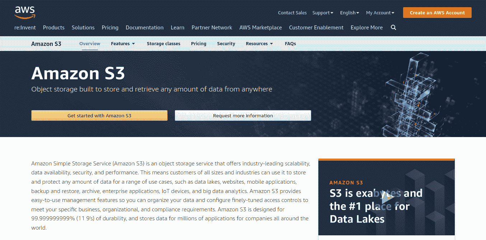
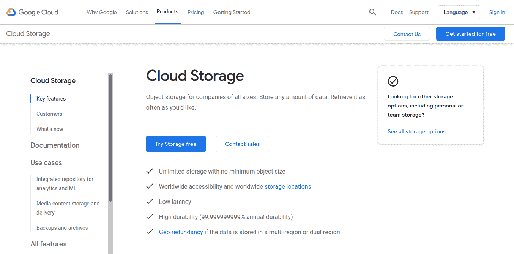
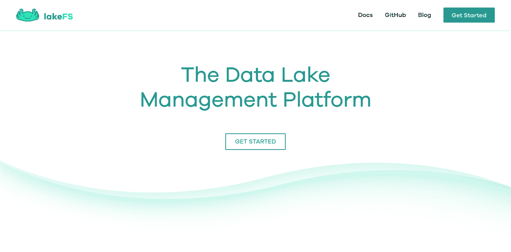
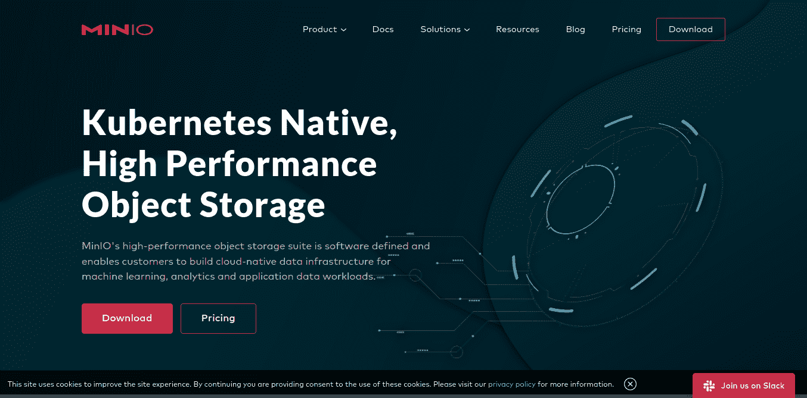
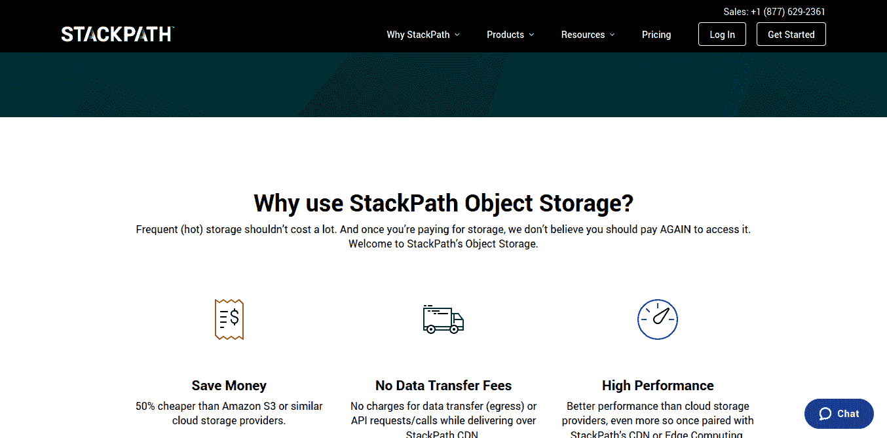

# 面向开发人员的五大对象存储工具

> 原文：<https://www.freecodecamp.org/news/top-5-object-storage-tools-for-developers/>

选择存储解决方案是开发人员(或开发团队)在构建 web 或移动应用程序时需要做出的最重要的决定之一。

你可以想象，有许多不同的存储选项。

在本文中，我们将简要讨论两种最常用的云解决方案:[块存储](https://www.ionos.com/digitalguide/server/know-how/what-is-block-storage/)(也称为 SAN 或存储区域网络)和[对象存储](https://lakefs.io/object-storage/)。之后，我们将讨论我推荐的前 5 个对象存储解决方案。

还有第三种常用的存储类型:文件系统存储。然而，这种机制也可以与 San 和对象存储同时存在，所以我们不会深入探讨。

## 什么是块存储？

块存储是通过光纤网络连接的硬盘驱动器网络。由于速度更快，这使它比铜缆有优势。

之所以称之为块存储，是因为该系统中的每个文件都被划分为存储在磁盘中的数据“块”。磁盘中的扇区保存着单独的数据块，这些数据块组合在一起就形成了整个文件。

因此，尽管使用 SAN 有一些优势，如高可扩展性，但它成本很高，而且随着网络的增长会变得异常复杂。

## 什么是对象存储？

对象存储的定义特性是，数据存储为[对象](https://techterms.com/definition/object)，而不是以块的形式存储文件。

通常，与用于块存储的块相比，这些对象会附加更多的数据。这些对象通常包括:

*   包含所有有效负载(即图像、视频、文本内容)的 blob
*   元数据，它告诉我们关于文件的更多信息(时间戳、权限、作者、版本等等)
*   全球唯一的 ID (UUID)

这种存储方式的一个主要优点是，由于它们的 UUID，对象很容易获得和找到。对于块存储，用户在获取所需数据之前需要经历特定的文件层次结构，这会大大降低数据检索的速度。

现在我们已经解决了这个问题，下面是我为开发人员列出的 5 个最常用的对象存储工具:

### [亚马逊 AWS S3](https://aws.amazon.com/s3/)

S3 是对象存储的先驱之一。它管理着来自全世界数百个行业的海量数据。

**特点**:

*   高可靠性和耐用性，因为它跨多个系统存储 S3 对象的副本。
*   允许您通过其 S3 存储类别来管理成本，该类别根据访问模式提供不同的费率。
*   为您的数据提供最高的安全性和保护。

### [谷歌云存储(GCS)](https://cloud.google.com/storage/)

Google 为各种规模的企业级别提供了四种不同的存储类型。当您跨每种存储类型移动数据时，它将为您提供数据生命周期。这样，您可以管理数据在必须删除之前应该存储多长时间。

**特点**:

*   您没有最小对象大小。
*   你可以进入世界各地的仓库。
*   非常高的耐用性和低延迟。
*   数据在几个地理位置上存在冗余。

### [LakeFS](https://lakefs.io/)

LakeFS 是一个与对象存储[数据湖](https://aws.amazon.com/big-data/datalakes-and-analytics/what-is-a-data-lake/)协同工作的开源工具。数据湖通常通过存储库集中存储原始格式的文件或 blobs。

数据湖本身受到实体之间缺乏频繁通信的限制。LakeFS 通过使用数据版本化解决了这个问题。

**特性:**

*   通过 S3 或 GCS，它允许使用模拟 Git 的系统扩展到 Pb 的大小。
*   您可以进行试验，因为它为您提供了一个数据开发环境。
*   因为它使用类似 Git 的方案，所以您可以在另一个分支中安全地使用新数据，而不会影响主分支。然后，一旦新数据的每个方面都通过检查(模式等),您就可以安全地合并它。).

### [MiniIO](https://min.io/)

MiniIO 是另一个开源解决方案。它利用了亚马逊 S3 API，这使得它非常适合需要超级严格安全性的大规模项目。

**特性:**

*   它自称是世界上最快的对象存储，因为它的读/写速度高达 183 GB。
*   它应用了 web 扩展原则——一个集群可以与其他集群联合起来，直到它形成多个数据中心。
*   这是 Kubernetes 友好。
*   因为它是开源的，用户可以改进并自由地重新发布。

### [堆栈路径](https://www.stackpath.com/products/object-storage/?source=affiliate&irgwc=1&clickid=Xtbytz2dXxyLTHDwUx0Mo3QWUkEw1B2PYT54UA0)

StackPath 提供内容交付网络服务[边缘计算](https://www.networkworld.com/article/3224893/what-is-edge-computing-and-how-it-s-changing-the-network.html)和 S3 兼容对象存储。它将自己标榜为比亚马逊 S3 和其他云提供商更便宜的选择。

**特点**:

*   它比竞争对手的服务快 6 倍，尤其是在与 CDN 或边缘计算平台结合使用时。
*   它是无服务器的，这意味着它不需要预热。
*   它有 45 个边缘位置，这意味着您的应用程序在世界各地都可用，在任何地方都具有相同的性能。

### 最后

这就是你要的——你可以在下一个 web 或移动项目中使用的顶级对象存储工具的简短列表。当可伸缩性是最重要的考虑因素时，对象存储确实被证明是一种存储数据的好方法。

感谢阅读这篇文章！我希望您对存储模型有所了解，尤其是对象存储。请随时通过 [LinkedIn](https://linkedin.com/in/rvvergara) 和 [Twitter](https://twitter.com/coachryanv) 与我联系。