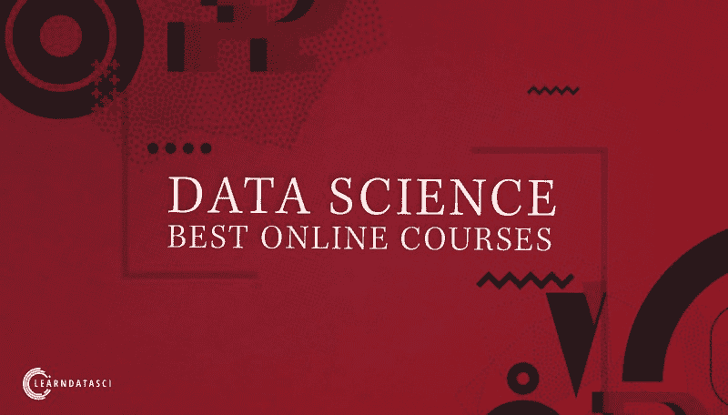
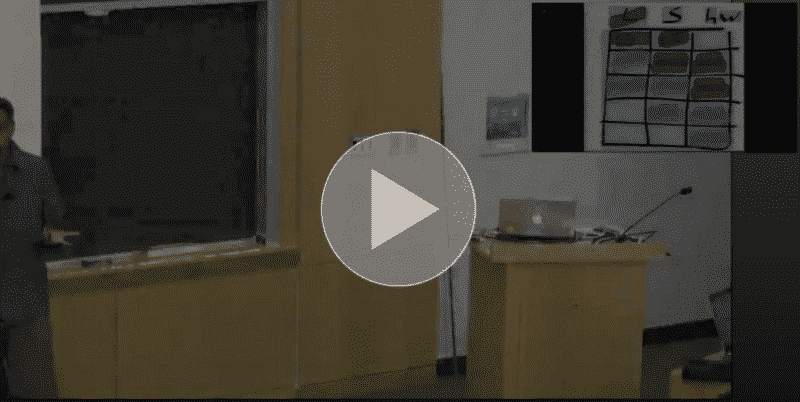
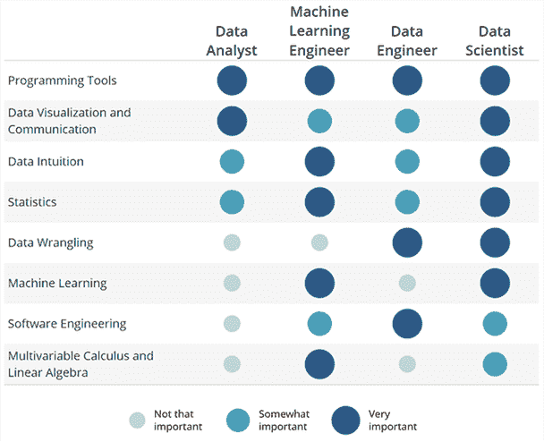
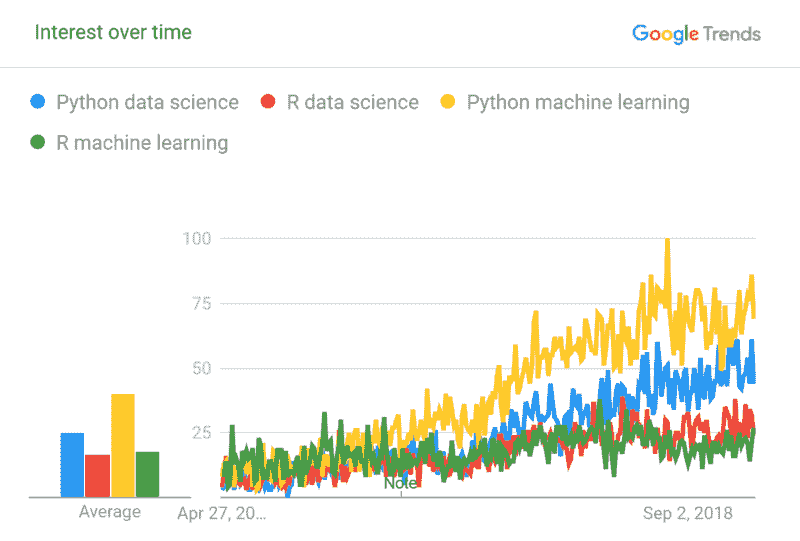

# 2019 年顶级在线数据科学课程

> 原文：<https://www.freecodecamp.org/news/top-7-online-data-science-courses-for-2019-e4afdc4693e7/>

经过 80 多个小时的观看课程视频、做测验和作业、阅读各种聚合器和论坛上的评论，我已经将最佳数据科学课程缩小到下面的列表中。

### TL；速度三角形定位法(dead reckoning)

最佳数据科学课程:

1.  [数据科学专业](https://www.learndatasci.com/out/coursera-data-science-specialization) — JHU @ Coursera
2.  [数据科学简介](https://www.learndatasci.com/out/metis-intro-data-science/) — Metis
3.  [应用数据科学与 Python 专业化](https://www.learndatasci.com/out/coursera-Applied-Data-Science-Python-Specialization) — UMich @ Coursera
4.  [数据请求](https://www.learndatasci.com/out/dataquest/)
5.  [统计和数据科学微大师](https://www.learndatasci.com/out/edx-statistics-and-data-science-micromasters/) — MIT @ edX
6.  数据科学 —哈佛大学
7.  [Python 数据科学和机器学习训练营](https://www.learndatasci.com/out/udemy-python-for-data-science-and-machine-learning-bootcamp/) — Udemy

### 标准

这里的选择更适合数据科学入门者，所以我根据以下标准筛选了课程:

*   本课程讲述了整个数据科学过程
*   该课程使用流行的开源编程工具和库
*   讲师涵盖了最基本、最流行的机器学习算法
*   这门课程很好地结合了理论和应用
*   该课程需要按需提供，或者每个月提供一次
*   有动手作业和项目
*   教员们迷人而有风度
*   这门课程的评分很高，一般来说，大于或等于 4.5/5

与四年前我第一次打开这个页面时相比，现在有了更多的数据科学课程，因此现在需要有一个实质性的过滤器来确定哪些课程是最好的。我希望您相信以下课程确实值得您花费时间和精力，因为要成为一名数据科学从业者，需要几个月(或更长时间)的学习和实践。

除了顶级的一般数据科学课程选择，我还为更具体的数据科学兴趣包括了一个单独的部分，如深度学习、SQL 和其他相关主题。这些课程采用更专业的方法，并不涵盖整个数据科学过程，但它们仍然是该主题的首选。这些额外的选择有利于在主菜之前、之后和期间补充营养。

### 学习时应该使用的资源

在线学习数据科学时，重要的是不仅要对自己实际在做什么有一个直观的了解，还要获得在独特问题上使用数据科学的充分实践。

除了下面列出的课程，我建议阅读两本书:

1.  [统计学习简介](https://www.learndatasci.com/out/amazon-introduction-statistical-learning/)—[免费提供](https://web.stanford.edu/~hastie/Papers/ESLII.pdf)——最广泛推荐给数据科学初学者的书籍之一。解释机器学习的基础知识以及一切是如何在幕后工作的
2.  [应用预测建模](https://www.learndatasci.com/out/amazon-applied-predictive-modeling/) —对真实世界数据集的整个建模过程的分解，其中每一步都有非常有用的提示

这两本教材的价值令人难以置信，提供了比仅仅单独上课好得多的基础。第一本书在教授大部分数据科学过程背后的直觉方面非常有效，如果你能够理解其中的几乎所有内容，那么你比大多数入门级的数据科学家都要好。

#### 快速提示

使用 Chrome 的[视频速度控制器](https://chrome.google.com/webstore/detail/video-speed-controller/nffaoalbilbmmfgbnbgppjihopabppdk?hl=en)来加速任何视频。我通常根据内容在 1.5x-2.5x 之间选择速度，并使用扩展附带的“s”(减速)和“d”(加速)快捷键。

现在来看一下每门课程的概述和回顾。

### 1.[数据科学专业](https://www.learndatasci.com/out/coursera-data-science-specialization) — JHU @ Coursera

本系列课程是该列表中注册人数最多、评价最高的课程之一。JHU 在平衡课程的广度和深度方面做得非常出色。本系列中包含的一项内容通常是许多数据科学课程所缺少的，那就是关于统计学的完整章节，这是数据科学的主干。

总的来说，数据科学专业化是使用 R 编程语言的理论和应用的理想结合。至于先决条件，你应该有一些编程经验(不一定是 R ),并且你对代数有很好的理解。以前的线性代数和/或微积分知识是不必要的，但它是有帮助的。

**价格** —免费或*49 美元/月*证书和分级材料
**提供商** —约翰·霍普金斯大学

**课程设置**:

1.  数据科学家的工具箱
2.  r 编程
3.  获取和清理数据
4.  探索性数据分析
5.  可重复的研究
6.  统计推断
7.  回归模型
8.  实用机器学习
9.  开发数据产品
10.  数据科学顶点

如果你对统计学生疏和/或想先学习更多 R，也可以看看 R 专业的[统计学。](https://www.learndatasci.com/out/coursera-statistics-with-r-specialization)

### 2.[数据科学简介](https://www.learndatasci.com/out/metis-intro-data-science/) — Metis

一门评分极高的课程 SwichUp 上的评分为 4.9/5，CourseReport 上的评分为 4.8/5——该课程由一家顶级公司的数据科学家现场教授。这是一门为期六周的数据科学课程，涵盖了整个数据科学过程中的所有内容，也是该列表中唯一的在线直播课程。此外，你不仅会在完成后获得一个证书，而且由于本课程也被认可，你还将获得继续教育单元。

每周有两个晚上，您将与讲师和其他学生一起学习数据科学，就像这是一门在线大学课程一样。你不仅可以问问题，而且老师还会在办公时间花额外的时间来进一步帮助那些可能有困难的学生。

**价格—**750 美元

课程设置:

1.  计算机科学、统计学、线性代数短期课程
2.  探索性数据分析和可视化
3.  数据建模:监督/非监督学习和模型评估
4.  数据建模:特征选择、工程和数据管道
5.  数据建模:高级监督/非监督学习
6.  数据建模:高级模型评估和数据管道|演示

作为先决条件，您需要了解 Python、一些线性代数和一些基本的统计学。如果你需要在这些领域中的任何一个领域工作，Metis 也有[初学者 Python 和数据科学数学](https://www.thisismetis.com/courses/beginner-python-and-math-for-data-science?utm_source=LDS&utm_medium=affiliate&utm_campaign=LDS2019affiliate)，这是一个单独的在线课程，只用于学习数据科学的 Python、统计、概率、线性代数和微积分。

### 3.[应用数据科学与 Python 专业化](https://www.learndatasci.com/out/coursera-Applied-Data-Science-Python-Specialization) — UMich @ Coursera

密歇根大学也推出了一个在线数据科学硕士学位课程，该课程专注于数据科学的应用领域。这意味着您将获得对常用数据科学 Python 库的有力介绍，如 matplotlib、pandas、nltk、scikit-learn 和 networkx，并学习如何在真实数据上使用它们。

本系列不包括数据科学所需的统计数据或各种机器学习算法的派生，但提供了如何在 Python 中使用和评估这些算法的全面分析。因此，我认为这更适合已经知道 R 和/或正在别处学习统计概念的人。

如果你对统计生疏，首先考虑一下 Python 专门化的[统计。您将学到数据科学所需的许多最重要的统计技能。](https://www.learndatasci.com/out/coursera-statistics-python-specialization/)

**价格** —免费或*49 美元/月*证书和分级材料
**提供商** —密歇根大学

**课程**:

1.  Python 中的数据科学简介
2.  Python 中的应用绘图、图表和数据表示
3.  Python 中的应用机器学习
4.  Python 中的应用文本挖掘
5.  Python 中的应用社会网络分析

要参加这些课程，您需要了解一些 Python 或一般的编程知识，实际上第一门课程中有几个很棒的讲座，讲述了一些更高级的 Python 特性，您将需要这些特性来有效地处理数据。

### 4.[数据请求](https://www.learndatasci.com/out/dataquest/)

Dataquest 本身就是一个极好的资源，但是即使你学习了这个列表中的其他课程，Dataquest 也是你在线学习的一个极好的补充。

Dataquest 放弃了视频课程，转而通过各种交互式教科书进行教学。数据科学专题讲座中的每个主题都附有几个浏览器内的交互式编码步骤，指导您应用您正在学习的确切主题。

> 基于视频的学习更加“被动”——看了两个小时的视频后，你很容易认为自己理解了一个概念，但当你实际上必须将所学付诸行动时，你却愣住了。— Dataquest 常见问题解答

对我来说，Dataquest 从其他互动平台中脱颖而出，因为课程组织得非常好，你可以通过参与成熟的数据科学项目来学习，并且有一个超级活跃和有用的 Slack 社区，你可以在那里提问。

该平台有一个主要的 Python 数据科学学习课程:

[**Python 路径中的数据科学家**](https://www.learndatasci.com/out/dataquest-data-scientist-python-path/)
该路径目前包含 31 门课程，涵盖了从 Python 的基础知识到统计学、机器学习的数学、深度学习等等。为了更好的学习体验，课程不断得到改进和更新。

**价格** — 1/3 的内容是免费的，基础版每月 29 美元，高级版每月 49 美元

以下是该课程的精简版:

1.  Python 从基础到高级
2.  Python 数据科学库— Pandas、NumPy、Matplotlib 等等
3.  可视化和讲故事
4.  有效的数据清理和探索性数据分析
5.  用于数据科学的命令行和 Git
6.  SQL —从基础到高级
7.  API 和网页抓取
8.  概率和统计——基础到中级
9.  机器学习的数学——线性代数和微积分
10.  使用 Python 的机器学习—回归、K-Means、决策树、深度学习等等
11.  自然语言处理
12.  火花和贴图-减少

此外，还有分散在整个课程中的完整的数据科学项目。每个项目的目标是让您应用到那时为止所学的一切，并让您熟悉在端到端数据科学战略上工作的感觉。

最后，如果你对用 R 学习数据科学更感兴趣，那么一定要看看 Dataquest 在 R path 中的新[数据分析师。Dataquest 订阅让您可以访问他们平台上的所有路径，因此您可以学习 R 或 Python(或者两者都学！).](https://www.learndatasci.com/out/dataquest-data-analyst-r/)

### 5.[统计和数据科学微大师](https://www.learndatasci.com/out/edx-statistics-and-data-science-micromasters/) — MIT @ edX

edX 的 MicroMasters 是高级的研究生课程，有真正的学分，你可以申请一些研究生学位。包含概率和统计课程使得麻省理工学院的这个系列成为一个非常全面的课程，能够直观地理解数据。

由于它的先进性，你应该有一元和多元微积分的经验，以及 Python 编程。不像这个列表中的其他一些课程那样，没有任何关于 Python 或 R 的介绍，所以在开始 ML 部分之前，他们建议学习[计算机科学和使用 Python 编程的介绍](https://www.learndatasci.com/out/edx-introduction-computer-science-and-programming-using-python/)来熟悉 Python。

**价格** —免费或*1350 美元*用于凭证和分级材料
**提供商** —密执安大学

**课程:**

1.  概率——不确定性和数据的科学
2.  社会科学中的数据分析——评估你的知识
3.  统计学基础
4.  用 Python 进行机器学习:从线性模型到深度学习
5.  统计学和数据科学顶点考试

ML 课程有几个有趣的项目，在整个系列的最后，你将专注于一个考试来结束一切。

### 6.数据科学 —哈佛大学

Screenshot from lecture: [https://matterhorn.dce.harvard.edu/engage/player/watch.html?id=e15f221c-5275-4f7f-b486-759a7d483bc8](https://matterhorn.dce.harvard.edu/engage/player/watch.html?id=e15f221c-5275-4f7f-b486-759a7d483bc8)

哈佛大学的这门课程将理论和应用完美结合，是初学者入门的最佳课程之一。它不像 Coursera 或 edX 那样是一个交互式平台，也不提供任何认证，但绝对值得你花时间，而且完全免费。

**课程:**

*   网页抓取，正则表达式，数据整形，数据清理，熊猫
*   探索性数据分析
*   熊猫、SQL 和数据语法
*   统计模型
*   讲故事和有效沟通
*   偏差和回归
*   分类，kNN，交叉验证，降维，主成分分析，MDS
*   SVM，评估，决策树和随机森林，集合方法，最佳实践
*   建议，MapReduce，Spark
*   贝叶斯定理，贝叶斯方法，文本数据
*   使聚集
*   有效演示
*   试验设计
*   深层网络
*   建筑数据科学

本课程使用 Python ,并且有许多讲座通过各种数据科学库的复杂性来解决现实世界中有趣的问题。这是仅有的真正触及数据科学过程每个部分的数据科学课程之一。

### 7. [Python 数据科学和机器学习训练营](https://www.learndatasci.com/out/udemy-python-for-data-science-and-machine-learning-bootcamp/) — Udemy

[也可用 R](https://www.learndatasci.com/out/udemy-data-science-and-machine-learning-bootcamp-with-r/) 。

物有所值的价格非常合理的球场。讲师出色地解释了所有数据科学项目所需的 Python、可视化和统计学习概念。与其他 Udemy 课程相比，本课程的一大好处是作业。在整个课程中，您将脱离并使用 Jupyter 笔记本练习册来巩固您的理解，然后讲师将播放解决方案视频来全面解释每个部分。

**课程:**

*   Python 速成班
*   用于数据分析的 python-Numpy，Pandas
*   用于数据可视化的 python-Matplotlib、Seaborn、Plotly、袖扣、地理绘图
*   数据顶点项目
*   机器学习——回归、kNN、树木和森林、SVM、K 均值、主成分分析
*   推荐系统
*   自然语言处理
*   大数据和火花
*   神经网络和深度学习

本课程更侧重于应用方面，缺少了一个关于统计学的部分。如果你打算上这门课，那么把它和一门独立的统计学和概率课程结合起来也是一个好主意。

另一门 Udemy 课程获得了荣誉提名:[数据科学 A-Z](https://www.learndatasci.com/out/udemy-data-science-a-z-real-life-data-science-exercises-included/) 。我确实很喜欢数据科学 A-Z，因为它覆盖面很广，但由于它使用了 Python/R 生态系统之外的其他工具，我不认为它像 *Python 那样适合数据科学和机器学习训练营*。

### 针对特定技能的其他顶级数据科学课程

[**深度学习专业化**](https://www.learndatasci.com/out/coursera-deep-learning-specialization/) **— Coursera**
由著名的[斯坦福机器学习课程](https://www.learndatasci.com/out/coursera-machine-learning/)的制作者吴恩达创建，这是互联网上评价最高的数据科学课程之一。本系列课程面向那些对理解和使用 Python 中的神经网络感兴趣的人。

[**SQL for Data Science**](https://www.coursera.org/learn/sql-for-data-science)**—Coursera**
将本教程与 [Mode Analytics SQL 教程](https://community.modeanalytics.com/sql/tutorial/introduction-to-sql/)相结合，全面介绍 SQL，这是数据科学的一项重要而必要的技能。

[**用于机器学习的数学**](https://www.coursera.org/specializations/mathematics-machine-learning) **— Coursera**
这是专门针对 ML 中使用的特定数学的评分最高的课程之一。如果你对机器学习所需的线性代数和微积分感到不舒服，那么选修这门课程，你会比其他更通用的数学课程节省一些时间。

[**如何赢得一场数据科学竞赛**](https://www.coursera.org/learn/competitive-data-science)**—Coursera**
[高级机器学习专业化](https://www.learndatasci.com/out/coursera-advanced-machine-learning-specialization/)中的课程之一。即使你不打算参加数据科学竞赛，这仍然是一门极好的课程，可以将你到目前为止所学的一切汇集在一起。这更像是一门高级课程，教你为什么应该选择某些 ML 算法背后的直觉，甚至回顾了最近赢得比赛的许多算法。

[**贝叶斯统计:从概念到数据分析**](https://www.learndatasci.com/out/coursera-bayesian-statistics-concept-data-analysis/) **— Coursera**
贝叶斯，相对于 Frequentist，统计学是数据科学需要学习的重要学科。我们中的许多人在大学里学过 Frequentist 统计学，甚至不知道它，本课程在比较和对比两者方面做了大量工作，使其更容易理解数据分析的贝叶斯方法。

[**Spark 和 Python 面向大数据与 py Spark**](https://www.learndatasci.com/out/udemy-spark-and-python-big-data-pyspark/)**—Udemy**
来自与上面列表中的 *Python 面向数据科学和机器学习训练营*相同的讲师，本课程将教您如何利用 Spark 和 Python 在 AWS 集群上执行数据分析和机器学习。讲师会给你一些模拟的咨询项目，然后对解决方案进行完整的演练，从而使本课程变得非常有趣和吸引人。

### 学习指南

#### 如何真正学习数据科学

当你参加这些课程的时候，你应该像对待大学课程一样致力于学习。在线学习数据科学的一个目标是最大限度地减少精神不适。很容易养成签到看几个视频就觉得自己在学习的习惯，但其实并没有真正学到多少东西，除非伤脑。

Vik Paruchuri(来自 [Dataquest](https://www.learndatasci.com/out/dataquest/) )制作了这个关于如何有效学习数据科学的有用视频:

从本质上来说，这可以归结为**做你正在学习的**，也就是说，当你参加一门课程并学习一项技能时，**立即将其应用到一个真实的项目中**。完成你真正感兴趣的真实项目有助于巩固你的理解，并证明你知道自己在做什么。

在线学习数据科学最令人不舒服的事情之一是，你永远不会真正知道自己什么时候学到了足够的知识。不像在正式的学校环境中，当你在网上学习时，你没有很多成功的好的晴雨表，比如通过或失败的测试或整个课程。项目通过首先向你展示你不知道的东西，然后在完成后作为知识的记录来帮助补救。

总而言之，项目应该是主要焦点，课程和[书籍](https://www.learndatasci.com/books/)应该作为补充。

当我刚开始学习数据科学和机器学习时，我(和很多人一样)是从尝试预测股票开始的。我找到了教授我想知道的东西的课程、书籍和论文，然后在我学习的时候将它们应用到我的项目中。我在如此短的时间内学到了如此多的东西，如果作为一门课程来安排，这似乎是一个不可思议的壮举。

事实证明，在我热爱的事情上工作是非常强大的。努力工作和不停地学习很容易，因为预测市场是我真正想完成的事情。

### 基本知识和技能

Source: Udacity

所有数据科学家都必须具备一套基本技能和知识水平，无论他们身处哪个行业。对于硬技能，你不仅需要精通数据科学的数学，还需要*理解*数据的技能和直觉。

你应该熟悉的数学:

*   代数学
*   统计学(频率主义者和贝叶斯)
*   可能性
*   线性代数
*   基础微积分
*   最佳化

此外，这些是您应该熟悉的基本编程技能:

*   Python 或者 R，
*   结构化查询语言
*   从各种来源提取数据，如 SQL 数据库、JSON、CSV、XML 和文本文件
*   清理和转换非结构化的杂乱数据
*   有效的数据可视化
*   机器学习-回归、聚类、kNN、SVM、树木和森林、集成、朴素贝叶斯

最后，这不全是硬技能；还有许多非常重要的软技能，其中许多是课程中没有教授的。这些是:

*   好奇心和创造力
*   沟通技巧——在团队面前演讲和展示，能够向非技术团队成员解释复杂的主题
*   解决问题——为业务问题提出分析性解决方案

### Python 与 R

浏览完列表后，你可能会注意到每门课程都是专门针对一种语言的:Python 或 r。那么你应该学习哪一门呢？

简答:只学 **Python** ，或者两者都学**。**

****

**Python 是一种令人难以置信的通用语言，它在数据科学、机器学习和统计学方面有着巨大的支持。不仅如此，你还可以做一些事情，比如构建网络应用程序，自动化任务，[抓取网页](https://www.learndatasci.com/tutorials/ultimate-guide-web-scraping-w-python-requests-and-beautifulsoup/)，创建图形用户界面，构建区块链，以及创建游戏。**

**因为 Python 可以做这么多事情，所以我觉得应该是你选择的语言。最终，*选择哪种语言学习数据科学并不重要，因为你会发现很多工作都在寻找这两种语言。那么为什么不选择一种几乎可以做任何事情的语言呢？***

**然而，从长远来看，我认为学习 R 也是非常有用的，因为许多统计学/ML 教科书使用 R 作为例子和练习。事实上，我在开头提到的两本书都使用了 R，除非有人把所有东西都翻译成 Python 并发布到 Github 上，否则你不会得到这本书的全部好处。一旦你学会了 Python，你就能很容易地学会 R。**

**查看[这个 StackExchange 答案](https://datascience.stackexchange.com/a/339),了解这两种语言在机器学习方面的不同之处。**

### **证书值得吗？**

**Udemy 与 edX、Coursera 和 Metis 等其他平台的一大区别是，后者在完成后提供证书，通常由大学的讲师授课。**

**一些证书，如 edX 和 Metis 的证书，甚至带有继续教育学分。除此之外，许多真正的好处，如访问评分作业和测试，只有在升级后才能获得。如果你需要保持动力来完成整个课程，承诺获得一个证书也是在冒险，这样你就不太可能放弃。我认为证书肯定有个人价值，但不幸的是，没有多少雇主那么看重它们。**

### **Coursera 和 edX 对 Udemy**

**Udemy 目前没有办法提供证书，所以我一般认为 Udemy 的课程更适合应用学习材料，而 Coursera 和 edX 通常更适合理论和基础材料。**

**每当我寻找一门关于特定工具的课程时，无论是 Spark、Hadoop、Postgres 还是 Flask web apps，我都倾向于首先搜索 Udemy，因为这些课程喜欢可操作的应用方法。相反，当我需要对某个主题有直观的理解时，比如 NLP、深度学习或贝叶斯统计，我会先搜索 edX 和 Coursera。**

### **包扎**

**数据科学是一个广阔、有趣且值得研究和参与的领域。你需要许多技能、广泛的知识和对数据的热情，才能成为公司想要雇用的有效的数据科学家，而且这需要的时间比大肆宣传的 YouTube 视频声称的要长。**

**如果你对数据科学的机器学习方面更感兴趣，请查看 2019 年的[前 5 名机器学习课程，作为本文的补充。](https://medium.freecodecamp.org/top-5-machine-learning-courses-for-2019-8a259572686e)**

**如果你有任何问题或建议，请在下面的评论中留下。**

**感谢阅读，祝学习愉快！**

***最初发表于[learndatasci.com](https://www.learndatasci.com/best-data-science-online-courses/)。***