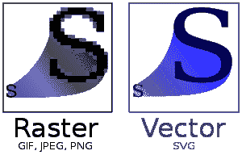

# 所有新前端开发人员应该具备的顶级技能

> 原文：<https://www.freecodecamp.org/news/top-skills-for-new-frontend-developers/>

作为前端开发人员，确保软件程序的用户界面正常运行是你的工作。

这是一项艰巨的工作，因为你必须确保每个组件都按照预期的方式工作，这样用户才能有良好的体验。

前端开发现在需求量很大。前端开发者管理软件的用户界面/ UX。这很重要，因为用户直接与应用程序的前端交互。

在本文中，我们将讨论初级前端开发人员可以培养的一些最有价值的技能。学习以下技能将有助于你的职业发展。

## 学习现代 JavaScript (ES6)

在过去的 25 年里，JavaScript 编程语言已经从 ES1 发展到了 ES6，并且在每个新版本中都包含了一些精彩的新功能。

2015 年，ES6 作为 JavaScript 的新标准化版本发布。ECMAScript 2015 是它的别称。而且 ES6 有很多新特性可以帮助你写出更好的代码。

它拥有面向对象的类、箭头函数、字符串文字等等，是 React 和 Vue 等现代库的基础。

### ES6 的有用功能

#### 解构分配

➡使用析构赋值可以将数组中的值或对象中的属性读入单个变量。

ES6 中析构赋值如何工作的示例:

```
let myName, myRole;
let array = ['Chaitanya', 'Web Developer'];
[myName, myRole] = array;        //positional assignment occurs here
console.log(myName, my Role);   //Chaitanya Web Developer
```

Destructuring an array

```
let myName, myRole;
let object = {myName:'Chaitanya', myRole:'Web Developer'};
({myName, myRole}=object); 
   //properties (keys) are matched with the local variable names

console.log(myName, myRole); 
   //Chaitanya Web Developer
```

Destructuring an object

#### 箭头函数表达式

➡箭头函数表达式是一种用于创建普通函数表达式的新语法。我们可以忽略该函数，使用箭头函数表达式返回一行代码。

ES6 中的箭头函数表达式示例:

```
let getName = ((firstName, lastName) => {
 let myRole = 'Web Developer';
 return `My name is ${firstName} ${lastName}
 I am a ${myRole}.`;
});
```

Arrow Function

#### 默认参数

javascript 中函数参数的默认值是未定义的。所以有时使用不同的值会更实际。我们可以使用默认的函数参数来做到这一点。

ES6 中默认参数的工作方式示例:

```
function add(number1, number2) {
 return number1+number2;
}

add (3,4);   //returns 7
add(3);     //returns NaN as number2 is undefined
```

Without ES6

```
function add(num1, num2=7) {
 return num1+num2;
}

add (5,2)   //returns 7
add(3)     //returns 10 as num2 has default value = 7
```

With ES6

### 如何学习 ES6

1.  [JavaScript ES6、ES7、ES8:在最前沿学习编码(全程)](https://youtu.be/nZ1DMMsyVyI)
2.  [ES6 Javascript 初学者教程| ES6 速成班](https://youtu.be/WZQc7RUAg18)
3.  [现代 JavaScript——学习 ES6+](https://www.freecodecamp.org/news/learn-modern-javascript/) 中的导入、导出、Let、Const 和承诺

## Web 性能和质量

关键是你的网站运行顺畅，没有错误。网站加载所需的时间受到与网站性能相关的多种因素的影响。

如果你的网站加载时间过长，你可以采取一些措施来提高网站的性能。

### 如何提高 web 性能:

1.  使用优化和较小的图像。TinyPNG 是压缩图像而不损失很多质量的好选择。
2.  删除不需要的 CSS 和 JavaScript，因为它们会让你的代码变得庞大。
3.  找一个好的主机提供商。一些值得一查的是 Linode、Digital Ocean 或 SiteGround。
4.  移除不需要的插件。我不建议使用超过 10 个插件，除非有必要。

不管你是否创建了有史以来最令人惊叹的网站。如果它不能有效地工作，不能迅速地把内容传递给你的用户，那就没关系了。

用户不喜欢网站加载等待超过 3 秒钟，那不是很多时间。因此，如果你的网站花费的时间超过这个时间，你的跳出率将会一飞冲天。

## Chrome 开发工具

Chrome 开发者工具包含在谷歌 Chrome 浏览器中，有经验的开发者一直使用它们来迭代、调试和分析网站。

### 谷歌 Chrome 开发工具包括:

1.  作为外壳与页面上的 JavaScript 交互或收集日志和诊断数据的控制台面板。
2.  帮助您创建响应网站的设备工具栏。
3.  用于管理 CSS 和文档对象模型(DOM)的元素。
4.  Web 性能洞察。
5.  安全和网络功能。

你可以在这里了解更多关于 Chrome DevTools 的信息。

Chrome DevTools 是非常有用的工具，只要你明白如何舒适地使用它们。你可以通过 freeCodeCamp 的这个 **[Chrome DevTools -速成班](https://www.youtube.com/watch?v=gTVpBbFWry8)** 来了解更多。

## 使用 Git 进行版本控制

Git，或**全球信息追踪器，**是一个开源的分布式版本控制系统。它是一种跟踪一组文件中的变化的软件，开发人员通常在软件开发期间一起处理源代码时使用它来进行协调。

在你辛苦编码之后，如果事情没有按照计划进行，你最不想做的事情就是从头开始工作。在这种情况下，Git 将帮助您回到软件的前一版本，而不会丢失任何代码。

了解 Git 的基础知识是一项你(以及你的潜在雇主和客户)会欣赏的技能。

### 如何学习 Git

1.  [Git 和 GitHub 初学者速成班](https://www.youtube.com/watch?v=RGOj5yH7evk)
2.  [Git 专业教程-工具&用 Git 掌握版本控制的概念](https://www.youtube.com/watch?v=Uszj_k0DGsg)

## 响应式设计

从智能手机、平板电脑到笔记本电脑和台式机，人们可以通过各种设备访问互联网，这些设备都有不同的屏幕尺寸。因此，响应式设计(帮助你设计适用于所有屏幕尺寸的应用程序)应该是你开发的任何应用程序或网站的重中之重。

💡**好玩的事实:**手机流量 **>** 桌面电脑流量。

### 响应式设计如何工作

具有手机友好功能、内容和媒体的网站被称为响应式网站。响应式网站会根据访问者使用的设备进行调整，包括智能手机、平板电脑和个人电脑。

### 响应式设计的最佳实践

1.  您应该使用可缩放矢量图形(SVG)。



Normal Images vs SVG

2.不要忘记导航条菜单。确保为小屏幕设备创建一个汉堡菜单。

3.像往常一样，在各种设备和浏览器上测试你的响应网站。你可以使用[谷歌手机友好测试](https://search.google.com/test/mobile-friendly)和[屏幕测试](http://mattkersley.com/responsive/)测试你的网站。

关于响应式设计要记住的一点是，它是像 Tailwind 和 Bootstrap 这样的 CSS 框架的内置特性。这意味着这些框架可以帮助你用更少的工作使网站对所有设备尺寸更敏感。

一个设计惊人但没有反应的网站在今天毫无价值。大多数人可能会在移动设备上访问你的应用或网站。

### 如何学习网站的响应式设计

1.  [响应式网页设计入门- HTML & CSS 教程](https://www.youtube.com/watch?v=srvUrASNj0s)
2.  [Bootstrap CSS 框架-初学者完全教程](https://www.youtube.com/watch?v=-qfEOE4vtxE)
3.  [UI / UX 设计教程——图玛](https://www.youtube.com/watch?v=c9Wg6Cb_YlU)中的线框、实体模型&设计

## 学习使用框架

CSS 和 JavaScript 框架是一组文件，它们通过提供标准特性来为您处理大量繁重的工作。您可以从一个已经包含大量 JavaScript 的代码文件开始，而不是从一个空白的文本页面开始。

JavaScript 和 CSS 框架正在改变开发人员编写代码的方式。有些框架是为了帮助你创建复杂的用户界面而构建的，而有些则是为了展示你的网站内容。

选择正确的框架和学习它一样重要。流行的框架并不总是一个好的选择，您应该根据您的具体需求选择一个。

也就是说，有一些需求非常高，真的值得学习。

### 推荐的 JavaScript 框架:

1.  **React** —这是一个免费开源的前端 JavaScript 框架，用于创建基于 UI 组件的用户界面。Meta 维护它。
2.  **Vue** — Vue.js 是一个开源的前端 JavaScript 框架，用于创建单页面应用和用户界面。尤雨溪创造了它。
3.  Svelte — Rich Harris 设计了 Svelte，这是一个免费开源的前端编译器，目前由 Vercel 维护。

### 推荐的 CSS 框架:

1.  **Bootstrap** — Bootstrap 是一个用于接口组件的开源框架，包括基于 CSS 和 JavaScript 的模板。
2.  Tailwind CSS — Tailwind CSS 是一个实用优先的 CSS 框架，它包含了用于创建定制 UI 设计的类。
3.  **布尔玛** —布尔玛是一个开源的 CSS 框架。它有很多内置的功能，可以帮助你用更少的 CSS 更快地完成工作。

## 这是一个总结！

感谢阅读这篇文章。我也定期在我的简讯 **[上写学习者](https://thelearners.substack.com/)** 。你可以直接在这里注册。**👇👇**

[https://thelearners.substack.com/embed](https://thelearners.substack.com/embed)