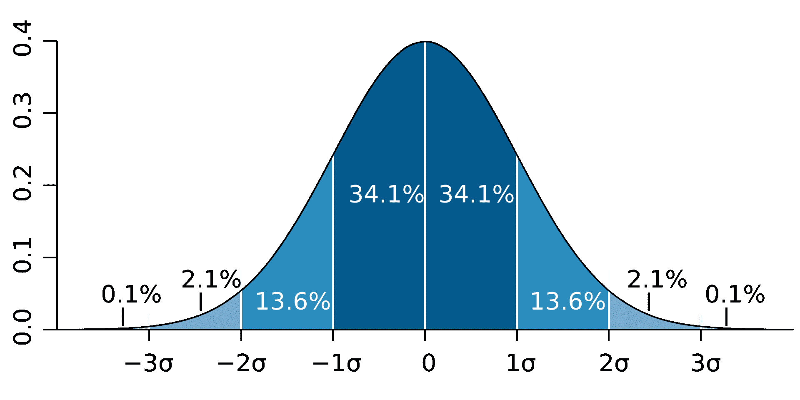
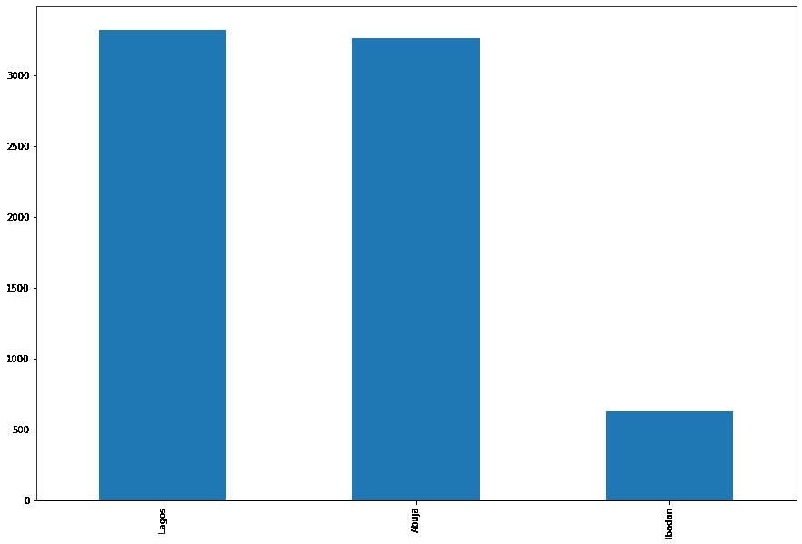
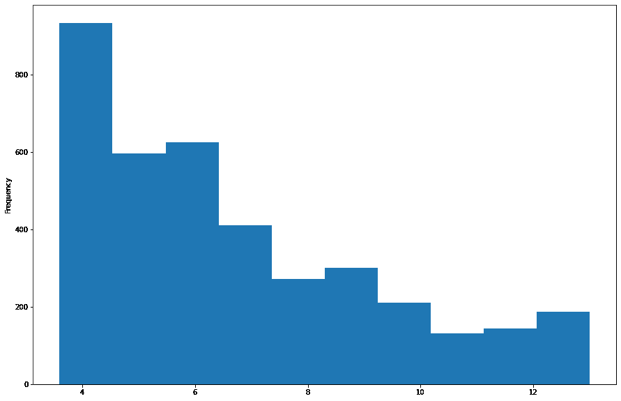
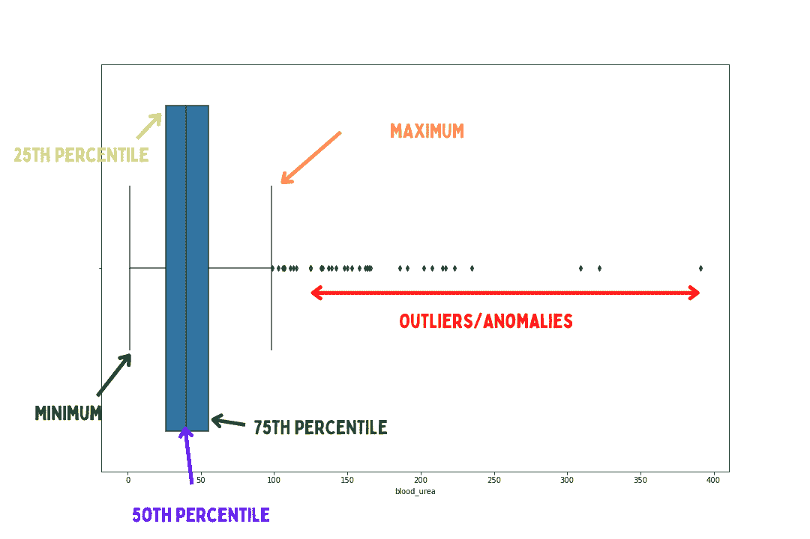

# 面向初学者的统计学——进入数据科学之前需要了解的顶级统计学概念

> 原文：<https://www.freecodecamp.org/news/top-statistics-concepts-to-know-before-getting-into-data-science/>

你可能听说过统计学是通向数据科学的大门，数据科学地图是从统计数据开始的。

也许你也从别人那里听说过，在学习数据科学之前，你必须先学习统计学。但随后你会思考，“既然我不是来自科学、技术、工程或数学(STEM)这样的技术背景，那么在进入数据科学之前，我需要学习统计学中的所有知识吗？”这些人会告诉你“是的！你得学统计学。”

好吧，这是我的答案:在开始数据科学之前，你不需要学习所有的统计学(尽管你需要学习一些基础知识)。

您也可以边学边学，而不是浪费时间在数据科学之前先学习统计学(也就是说，随着您在数据科学知识方面的进步，您总是可以学习更多的统计学概念)。

也就是说，在进入数据科学之前了解统计学基础知识是有帮助的。你确实可以说统计是通向数据科学的大门，因为它将帮助你对你的数据以及如何使用它有一些直觉。

在本文中，我们将了解在深入数据科学之前您需要了解的主要统计概念。就算你不是技术出身，我也尽量说的简单一点。我可以告诉你，你很兴奋，并准备好进入数据科学领域。让我们开始吧。

# 什么是统计学？

根据经济学家和抽样技术先驱阿瑟·里昂·鲍利的说法，统计数字是:

> "任何调查部门中相互关联的事实的数字陈述."

这基本上意味着统计帮助我们理解我们的数据，也帮助我们将数据中的结果传达给其他人。

统计方法(即在统计学中处理数据所采用的技术)分为两类:

1.  描述统计学
2.  推断统计学

**描述统计学**是一门统计学学科，通过数值或图形可视化来辅助我们总结数据。

描述性统计帮助我们识别和理解数据中的一些关键属性。它包括集中趋势、离差、箱线图、直方图等概念，我们将在本文后面讨论这些概念。

另一方面，推断统计学是统计学的一个分支，它帮助我们根据收集到的数据做出决策或预测。

推断统计学是一个更高级的话题，因为它需要对描述统计学有深刻的理解。它包括假设、概率等概念。

# 学习数据科学之前需要了解的主要统计概念

既然您现在已经熟悉了统计学的定义，那么让我们来看看您需要了解的一些统计学概念，这些概念将有助于指导您深入统计学领域。

最基本的概念包括:

## 什么是主题？

这是我们希望观察到的具体情况。可能是人，可能是动物，也可能是别的什么东西。它也被称为观察。

## 什么是人口？

群体是指我们感兴趣的整个主题集(也就是我们想要观察的主题)。假设您希望统计某个特定国家的女性人数。

## 什么是样本？

在现实中，观察一个群体几乎不是一个理想的情况(因为它可能是非常昂贵的执行，也很耗时)。

考虑以下场景:你希望观察世界上的每个女性。这种类型的观察执行起来可能很昂贵。然而，在统计学中，我们有一种叫做样本的东西，它是你想要研究的人群的一部分/子集。现在，我们可以使用样本对整个总体做出决策(推断统计)。

## 什么是参数？

这是一个群体的属性/汇总。考虑以下场景:你正在观察整个国家，你发现 90%的居民是男性，而 10%是女性。数值 90%和 10%是总体的数值汇总(即描述性统计)。因此，该汇总被称为总体参数。

## 什么是统计？

另一方面，统计(不要与统计混淆)是关于样本的属性。如前一个示例所述，我们不是处理总体，而是处理样本，因此数值被称为样本的统计量。

希望你现在对什么是总体、样本、统计和参数有一个相当好的理解。再来看看另一个我们都太熟悉的概念:**“数据”**。

**数据**，顾名思义，代表事实信息。也就是说，它向我们传达了一个信息。然而，它可以分为两类:

1.  定量数据。
2.  定性数据。

## 什么是量化数据？

这也称为数字数据。这些数据是一种可以计数或测量数值的数据。定量数据可以进一步分为两种类型:

**定量离散数据:**这些是可以计数但无法测量的数值数据。在鞋店数鞋子的数量是一个常见的例子。

**定量连续数据:**这是一种基于测量的数值数据。例如，测量玻璃圆筒的重量是连续的，而不是不连续的。

## 什么是定性数据？

这些是代表数据类别或组的数据种类。它们也被称为分类数据。它们通常是用文字写的。它们可以是特征、名称或其他任何东西。

一个常见的例子是一个人的名字，狗的品种，等等。但是，有些数据看起来是数字数据，但却被编码为分类数据。

例如，假设您想根据年龄对某一组人进行分组，并发现最低和最高年龄分别为 10 岁和 60 岁。然后，您将年龄分为 5 个类别(10-20 岁、21-30 岁、31-40 岁、41-50 岁、51-60 岁)，并为每个类别分配数值，其中 1 代表 10-20 岁，2 代表 21-30 岁，依此类推。

在这种情况下，数值将被视为分类数据，而不是定量数据。随着数据科学职业的发展，您将学习如何处理分类数据。

现在你知道了数据的类别。定量和定性数据可以在统计中使用这些水平的测量来处理。统计数据可分为 4 个计量级别，即:

1.  名义规模数据
2.  序数标度数据
3.  区间标度数据
4.  比例数据

定性数据可通过以下方式测量:

**名义规模数据:**这些是没有有序意义的分类数据类型。也就是说，它们不能被订购。

每一段数据代表一个单元。这种分类数据的一个例子包括颜色。把蓝色排在黄色之上不是很理想。处理名义数据时，每个数据点必须作为一个单独的单元来处理。

**序数标度数据:**序数标度数据由有序分类数据组成。数据排序的时候，有一种秩序感在里面。优秀、良好、满意和不满意等调查响应就是一个例子。将优秀置于良好之上是有道理的。

定量数据可通过以下方式测量:

**区间标度数据:**这些是有排序的数值数据，可以测量(例如找出数据之间的差异)。温标上的读数是区间数据的一个例子。

例如，你可以测量 4 摄氏度和 10 摄氏度之间的差异，10 度高于 4 度。但是，区间标度数据有两个例外:

1.  它没有起点(也就是说，它不是从零开始，温度值可以低于零)
2.  你弄不清它们的比例:比如说，声称 4 乘以 20 摄氏度就是 80 摄氏度，这是没有逻辑的。

**比例标度数据**:这些是数值型数据，具有区间标度数据的特征(即它们可以排序和测量)，但也解决了区间标度数据的例外(它们有一个起点，你也可以找到它们之间的比例)。

例如 20、68、90 或 80 的分数。我们可以对它排序，测量它，并找出值之间的比率。说 80 分比 20 分好 4 倍是有道理的。

既然我们已经讨论了数据的基本原理，让我们看看第一类统计学(描述性统计学)如何应用于数据。

如前所述，描述性统计需要用数字或图形来概括数据。让我们来看看一些您在定期处理数据时会遇到的最典型的数字和图形摘要。

## 均值 vs 中值 vs 众数–有什么区别？

Mean, Median, and Mode explained through illustration. Mode is the high point, Median is the half way point, and Mean is the average.

### 什么是意思？

当我们有一组像这样的数字数据(4，5，6，7，10)时，数据组中的每个值称为一个数据点。我们可能希望找到数据的平均值。

因此，平均值本质上是一组数据的平均值，计算方法是所有数据点的总和除以数据点的总数。

在我们上面的数据集中，它们的总和是 32，数据点的总数是 5。所以平均数，也就是平均值，是 6.4

平均值仅用于数字数据。寻找我们类别数据的平均值是不切实际的。

### 什么是中位数？

同样，给定一组值，我们可能希望发现中间的值。中位数用于计算中间的值。中位数也仅用于数字数据。

### 什么是模式？

这是出现频率最高的值(即出现次数最多的值)。该模式可用于数值或分类数据。

## 什么是离群值？

异常值是不同于其他数据点的数据点，当出现异常值时，会导致我们得出错误的结论。这里有一个典型的例子来说明异常值是如何有害的。

考虑以下场景:您有一台机器，它计算每天有多少顾客进入您的超市，因此读数是给定周的(20、23、26、27、302)。我们可以看到，数字 302 是一个异常值，因为它明显偏离了其他数据点。

异常值可能是由突然变化、机器故障或其他情况造成的。然而，当它们存在时，它们会导致我们做出不正确的决定，例如，如果您想要查找访问您的超市的消费者的平均数量，值 302 可能会导致您得出不正确的结果。上述数值的平均值为 75。

## 什么是标准差？

标准差是一个汇总值，它表示我们的数据点偏离平均值的程度。它用于确定我们数据的分布。

标准差越接近零，我们的数据点就越接近彼此。

标准差是一个非常有价值的总结，它告诉我们数据集中有一些异常值。它是这样工作的:

A chart of a Normal Distribution, with the number of standard deviations listed on the x axis.

在上图中，我们看到一个正态分布。34.1% + 34.1% = 68.2%的所有观察值在一个标准差或 1σ(读作一个适马)以内。

13.6% + 13.6% =其余观察值的 27.2%在两个标准差以内，即 2σ。诸如此类。

是的，如果你听说过六适马，这是一个工程概念，在质量保证过程中，六个标准差的可能性。这意味着除了最极端的异常值之外，您考虑了所有异常值。准确的说是所有可能性的 99.99966%。

现在我们已经掌握了一些数字汇总，让我们来看看一些常见的图形汇总。

## 什么是条形图？

条形图是一种用于分类数据的数据可视化类型。您可以使用它以图形方式显示分类数据的频率(即分类数据点出现的次数)。这里有一个例子:

## 什么是直方图？

直方图类似于条形图，因为它显示称为高度的数字数据的频率，但它将数字数据点分组到箱或范围中。

这是一个非常有效的可视化工具，因为它可以帮助您可视化数值数据的分布。你可以阅读更多[这里](https://www.cuemath.com/data/histograms/)了解更多关于直方图。

## 什么是箱线图？

另一个帮助您可视化数据分布的优秀可视化工具是箱线图。

例如，箱线图允许您直观地观察数据收集中是否有异常值。它包括最小值、第 25 个百分点、第 50 个百分点、第 75 个百分点和最大值等术语。箱线图如下所示:

Image by Ibrahim Ogunbiyi

所以让我们回顾一下上图中的内容:

**最小值**:最小值并不意味着我们数据集中的最小值。使用以下公式计算(Q1 -1.5*IQR)，其中:

*   Q1——意味着第 25 百分位
*   IQR-意味着四分位数范围(即第 75 百分位和第 25 百分位之间的差值)。

最低限度，它可以帮助我们检测数据点，也远远低于其他观察值。

例如，假设我们的数据点像这样分布[345，402，295，386，10]。我们可以看到，值 10 也是一个异常值，因为它是一个较低的值，远远低于其他观察值。

**第 25 百分位**是一个值，它告诉我们 25%的数据点低于该值，75%的数据点高于该值。第 25 个百分位数也称为第一个四分位数。

**第 50 百分位**是一个值，表示 50%的数据点低于该值，其余 50%高于该值。它也被称为第二个四分位数。

**第 75 百分位**是一个值，它告诉我们 75%的数据点低于该值，其余 25%高于该值。它也被称为第三个四分位数。

**最大值:**也和最小值一样，最大值并不意味着数据集中的最高值。使用公式(Q3 + 1.5*IQR)进行计算，其中:

*   Q3–表示第 75 百分位
*   IQR 意味着四分位数范围(即第 75 百分位和第 25 百分位之间的差值)。

使用最大值，它可以帮助我们检测也远高于其他观察值的数据点。

例如，假设我们的数据点像这样分布[645，40，25，38，42]。我们可以看到，值 645 也是一个异常值，因为它是一个远高于其他观察值的较高值。

我们已经看到了一些我们每天将要处理的图形摘要。让我们来看看本文将要讨论的最后一个主题:

## 数量变量之间有什么关联？

**变量**是代表观察集合的任何值(字母或数字，但通常是字母)。它有时被称为表中的一列。

如果一个变量的特定值很可能与另一个变量的特定值同时出现，则称两个变量相关。

为了研究两个数量变量之间的关联(通常称为相关性)，我们使用卡尔·皮尔逊公式进行计算，结果在-1 和+1 之间。

如果相关值接近 1，则表明两个变量正相关(即，随着一个变量增加，另一个变量也增加)。如果该值接近-1，则表明变量是负相关的(即一个变量增加，另一个变量减少)。最后，如果相关电流为 0，则变量之间没有相关性。

你可以阅读更多[这里](https://www.statisticshowto.com/probability-and-statistics/correlation-coefficient-formula/)了解更多关于相关性和卡尔·皮尔逊公式

## 什么是散点图？

我们可以用一种叫做散点图的图形来表示定量变量之间的相关性。

散点图如下所示:

[Scatter (XY) Plots (mathsisfun.com)](https://www.mathsisfun.com/data/scatter-xy-plots.html)

要了解散点图，您可以在此阅读更多[。](https://byjus.com/maths/scatter-plot/#:~:text=Scatter%20plots%20are%20the%20graphs,plotted%20on%20the%20Y%2Daxis.)

# 结论和了解更多信息

在本教程中，我们探讨了一些基本的统计概念，这些概念将帮助您更有效地处理数据。

但是学习不会就此停止——有几个你必须熟悉的基本主题。因为这只是一个开始，你可以通过查阅网上资源或者教材来深入钻研。

非常感谢您的阅读，并请分享该文章，以便希望进入数据科学的初学者也可以学习。