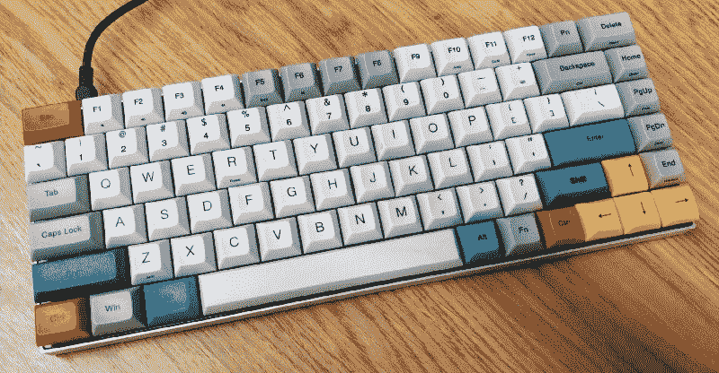
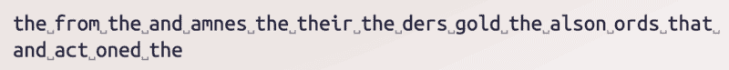
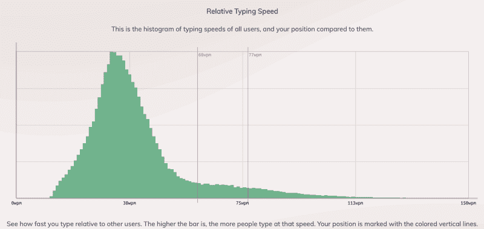
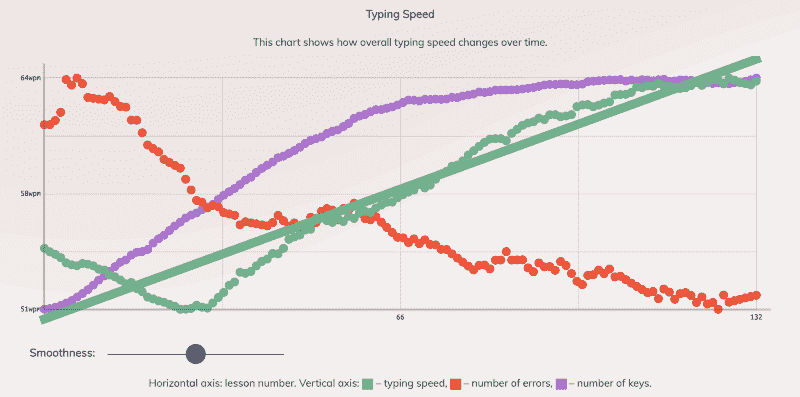
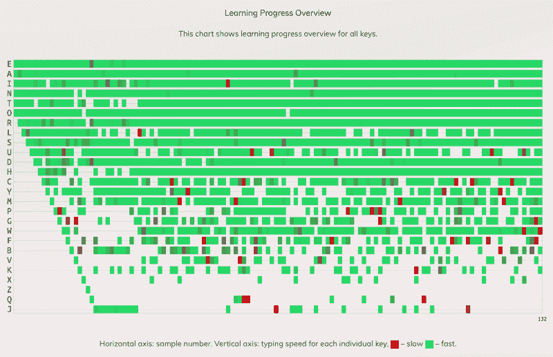
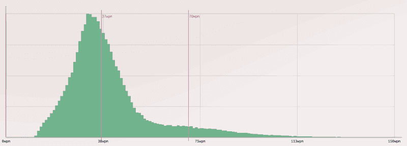
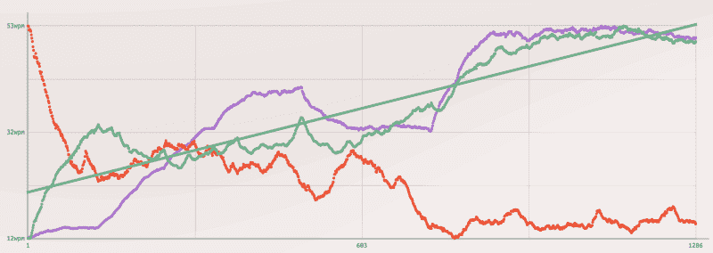
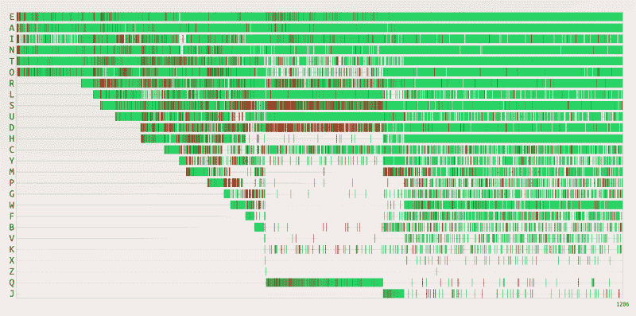
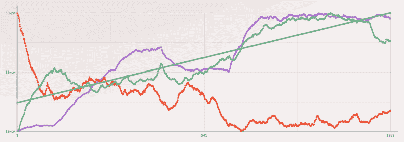

# 触摸打字感觉很好，但不适合我

> 原文：<https://www.freecodecamp.org/news/touch-typing-feels-good-but-isnt-for-me-2cfbafee2074/>

道格·阿库里

# 触摸打字感觉很好，但不适合我

#### 浅析学习触摸打字

我最近对“有键盘的人”的观察促使我写了这篇文章。这种观察就像一个亲戚在键盘上敲打着“寻寻觅觅”的键盘。或者一个朋友宣称他“用两个手指打字比用十个手指打字更熟练。”我围绕这个话题的谈话以强烈的观点结束，没有达成有效学习技能的协议。

当然，打字风格是个人选择。没有人会强迫你改变做法。好奇的人会识别并发现选择。我的好奇心让我开始转移注意力，提高我的打字水平。我问自己的问题是“在键盘后面这么多年，我自己的风格如何？我能做得更好吗？”

这篇文章探索了我的打字风格，并尝试用速度和误差测量来学习触摸打字。我将总结一下触摸打字**的感觉**是什么样的，以及为什么我可能不会改变我自学的打字策略。

### 动机

在键盘后面呆了 20 年，我认为我自己的打字风格是令人尴尬的低效和笨拙。我可以用许多因素来衡量这个观点。

*   我没有使用所有可用的手指。
*   我的手漂浮着，移动着寻找钥匙。
*   我看着键盘重新调整我的位置。

**从我自学的打字策略的这几点来看，我将它命名为:*浮动打字*** *。*我感觉我的速度还过得去，但没有精确的测量。让我们找出答案。

### 我的打字基线

要测量，我们需要一个工具。我选择了 keybr.com 网站进行打字速度和错误率的测试。我喜欢 keybr 的是它的严肃学习。没有打字游戏。它有算法可以检测学习密钥的弱点。记录英语中常见的成串字母的样本。用户界面清晰、直观，统计数据非常出色。

One sample capture from keybr.com.

我从我典型的打字风格开始。充其量，我的**浮动打字** 主要使用食指和中指。拇指放在空格键上。我在需要的地方使用这六个手指。我的手指感觉不到琴键，但却熟练地落在正确的琴键上。当我打字时，双手在键盘上飞舞。如果我检测不到下一个键的位置，我就会看着键盘。

先来看看我的相对打字速度。

Speed of float typing.

用红色标记的线是我的平均和最高打字速度。在这里，我的平均打字速度是 60 wpm(每分钟字数)。绿色图表基于在 keybr 采样的所有其他用户。从他们的角度来看，我的平均速度是 89%，最高速度是 95%。

Graph of float typing baseline.

上图中，我们可以看到 35 分钟内采集的 132 个样本的过程。我对这个采样的长度感到满意，因为我们看到一个超过 100 个样本的稳定线。错误率和打字速度大体一致。

Fast/slow histogram on float typing.

在这里，我们可以看到在 132 个样本的过程中，我的打字速度总体上是“快”的，某些键上的时间点是“慢”的。我把这归因于让我低头看键盘的独特单词组合。

### 触摸打字

我上面的动机概述了我想提高速度和减少错误率的所有原因。手指多一点，手少动一点，注意力集中在屏幕上。经过简短的研究，唯一能解决这三个问题的另一种风格是**触摸打字**。

触摸打字是利用键盘上所有手指的有效方式。它有助于最大限度地减少手部动作，降低错误率。触摸打字的主要目的是让眼睛看着屏幕，而不是看着键盘。这是为了明确地关注内容。

好吧，让我们来看看我关于触摸打字的指标。

Average speed of touch typing.

正如我们上面看到的，我的平均每分钟 37 分要低得多。有趣的是我的最高速度类似于**浮点打字** 基线。作为延伸，我们可以说我的“最高潜力”是 70 wpm。这将需要大量的专门练习。然而，我注意到我开始在速度上持平，在错误率上摇摆。

Touch typing 25 days in.

上面是 1200+样本的图表。这是 25 天 10 小时的练习。我们可以看到一个错误和打字速度的平台。随着时间的推移，当我继续保持在 50-55 wpm 左右时，平均速度会提高。这没有达到我自学的每分钟 60 个字的打字策略。从 keybr 的角度来看，我的平均速度在第 54 百分位，最高速度为 92%。

Fast/slow histogram on touch typing.

随着我对触摸打字越来越有信心，每个键都变成绿色，打字速度也会提高。我们可以看到，我很难用 R、S 和 D 来引导工具在左手上不断地活动。也有很长一段时间是在 Q 身上下功夫的。

Relative miss frequency. Touch typing (green) versus float typing (purple). Lower is better.

最后，我们来看错误。对每个键的命中/未命中比率或相对未命中频率的回顾是清楚的。绿色条代表**触摸打字**，紫色条代表**浮动打字**。门槛越低越好。因为我正在学习，所以很自然的会有更高的错过按键的倾向。26 个键中有 20 个键报告了较高的错误计数。

### 打字外卖

措施是明确的。我们可以提前下结论。对我来说，使用触摸打字可能在速度或错误率上没有好处。除此之外，还有一些重要的要点需要回顾。

#### 感觉真好

与肌肉记忆相关的是，触摸打字证明，当它提高了对中指、无名指和小指发音的识别时，它提供了一种“感觉良好”的感觉。例如，随着时间的推移，输入相近或相邻的单词会产生好感。像“was”、“wards”和“sad”这样的词的例子感觉很有趣。随着无数手指在键盘上“滚动”,我的多巴胺达到峰值。

#### 手指肌肉识别

Keybr 发现了我左右手的弱点。我的中指、无名指和小指在练习中受伤。起初，我很难键入像“as”这样的序列，识别像 O 和 I 这样的键，并找到 P 和 q。然而，随着时间的推移，识别单个手指变得越来越容易。我还注意到我的四肢手指感觉更加独立，更加清晰，尤其是中指和无名指。

#### 用家里的钥匙管教

很难理解我在键盘上的位置，所以我强迫自己“找到凸起”。在每一个单词之后，我都强行“重置”F 和 J 的突起，感觉它们，然后继续下一个单词。这让我慢了下来。

#### 最靠近手掌的钥匙使用困难

触摸打字的一个非常有趣的结果是，它最大限度地减少了手和手指在水平方向的移动，而专注于垂直方向。我注意到 M 键和 X 键控制指针不自然地向下移动。这可能是由于我中指的长度和当我放下手掌时手指向上的自然倾向。

#### 看着按键会让数字膨胀

当我的手开始离开 home 键时，我倾向于看键盘。以 B 和 G 开头的单词让我看起来像是在打字。如上所述，要么停下来找到凸起，然后去找钥匙，要么快速寻找并重新调整。有时后者感觉更快。让我们证明这一点。

Planting my hands had a significant effect starting at sample 1,206.

在 1206 号样本中，我强迫自己保持手掌平放，从不看键盘。结果就是上面看到的挫折，我的速度每分钟下降了 10 个百分点，错误率上升了。很难战胜它，因此这将是下一个肌肉记忆障碍。这个动作会比从样品 1 到 650 中发现我的中指、无名指和小指更难。

### 结论

我们关注的东西会成长。这个技能该不该长？

随着我不断练习，我发现了两种打字模式。如果我想打字更快，错误更少，我选择浮点型。当我想要感觉良好时，无论是社交还是多巴胺，我都会选择触摸打字。

我会继续练习打字，但是看看这些数据，这可能不适合我。扔掉我的自我打字策略需要大量的专门练习… **浮动打字**。我的发音可能无法达到高速。[这篇文章给了我希望](https://medium.com/@mantasd/touch-typing-how-long-does-it-take-to-reach-100-wpm-129ba855d038)，而[这篇文章带走了我的希望。](https://www.fastcompany.com/3056678/touch-typing-is-no-faster-than-pecking-with-a-few-fingers)

你的打字风格是什么样的？