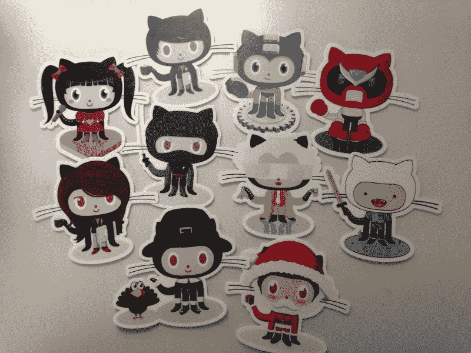
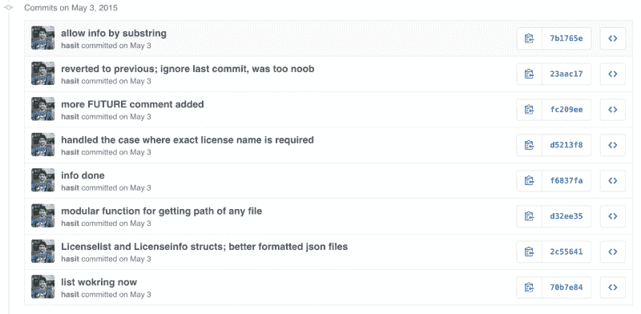
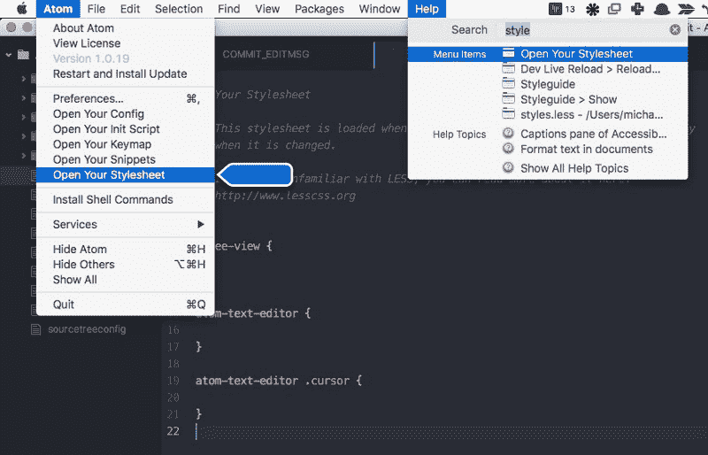
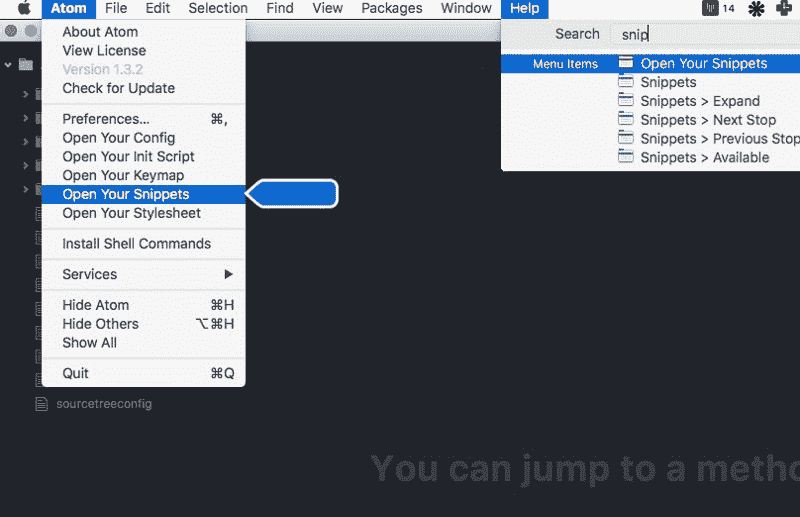

# 使用 Atom 获得更好的 Git 提交消息

> 原文：<https://www.freecodecamp.org/news/towards-better-git-commit-messages-using-atom-6dbda5e14984/>

作者:hasitmisty

# 使用 Atom 获得更好的 Git 提交消息



最近，我看到了两篇关于编写更好的 Git 提交消息的启发性文章。这些帖子给出了结构良好的提交消息应该是什么样子的建议，并提供了清晰的示例。

*   [最好用. gitmessage 模板提交消息](https://robots.thoughtbot.com/better-commit-messages-with-a-gitmessage-template)作者[马修·萨默](http://appallingfarrago.com/)
*   [如何编写 Git 提交消息](http://chris.beams.io/posts/git-commit/)作者 [Chris Beams](http://chris.beams.io/)

这两篇博客文章让我回到我的资料库，阅读我的提交信息。老实说，当时我对自己的过去感到有点羞愧。

您可能会问，“为什么提交消息如此重要？”如果你发现自己在问这个问题，你就像年轻一周的我。

为了让您有个概念，图 1 显示了来自我的项目 [licensethis](https://github.com/hasit/licensethis/) 的一些提交消息。我保证代码比提交消息好得多。



Figure 1\. [licensethis](https://github.com/hasit/licensethis/) commit messages from earlier this year.

不足为奇的是，这些提交消息实际上很少告诉我关于我过去的工作。那是因为我没把写它们当回事。

为了真正理解每个提交带来了哪些变化，我必须进入每个提交并逐行读取这些变化。这至少可以说是乏味的。

在创作这些提交消息时，我总是脱口而出当时对我有意义的任何内容，而没有考虑我或其他任何人在以后会如何理解文本。

首先，让我们综合一下我们从上述博客文章中吸收的所有信息。然后我会给出一些工作技巧，告诉你如何使用 Atom 为自己和其他有兴趣的人编写更好的提交消息。

注意，我不打算写*如何*写一个好的提交消息。 [Chris Beams](http://chris.beams.io/) 关于[如何编写 Git 提交消息的精彩帖子](http://chris.beams.io/posts/git-commit/)解释了这一点，以及七条规则中的更多内容。

在我们开始之前，让我们看一下下面的文本块，以了解什么被认为是结构正确、有目的和编写良好的提交消息:

```
# Subject in (preferably) less than 50 charactersThis is the subject of this commit message
```

```
# Body in greater detailThis is the body of this commit message. The body is written after the subject line with one blank line in between. The blank line is used by various tools (such as 'git log', 'git show', etc.) to differentiate subject from body. Further paragraphs are also separated by blank lines.
```

```
Explain the problem being solved by this commit. More importantly, explain why these changes are being made, as opposed to how. The 'why' part is your responsibility, the 'how' part is code's responsibility.
```

```
- You can also use bullets like this.- Or, like this.
```

可以在 [GitHub](https://github.com/) 上的 [Linux](https://github.com/torvalds/linux) 和 [Git](https://github.com/git/git) 仓库中找到这种提交消息的一些很好的例子。

现在，可以理解的是，并不是每次提交都会给存储库带来大的变化。有些提交是为了修复打字错误，有些是为了改变行的顺序或缩进。在这种情况下，主题行本身就足够了。

Atom 是我用来做任何事情的文本编辑器！我用它在课堂上记笔记，在 [Markdown](https://daringfireball.net/projects/markdown/) 中完成写作作业(除非我绝对需要 MS Word 的超级能力)，以及日常的编程项目。

每次我学习新东西的时候，我都会一点一点地调整 Atom，看着我的配置文件慢慢变大很有趣。

因此，让我们从将 Atom 设置为 git 的默认提交编辑器开始，并在您的终端中使用以下命令检查是否正确发生了同样的情况:

```
git config --global core.editor "atom --wait"
```

```
git config --get core.editor
```

```
# Which should give you the output: atom --wait
```

#### 根据主题线的长度更改其颜色

首先，我们将设置 Atom，如果长度超过 50 个字符，它将主题行的颜色改为橙色，如果长度超过 65 个字符，它将主题行的颜色改为红色。你可以在 [git Integration](http://blog.atom.io/2014/03/13/git-integration.html) 阅读更多关于 Atom 的 Git 集成。

打开 Atom 的 styles.less 文件，它位于“Atom”菜单选项下:



将以下代码行写入 Atom 的 styles.less 文件:

```
atom-text-editor::shadow { .git-commit.invalid.deprecated.line-too-long {  color: @text-color-warning;  text-decoration: none; }
```

```
 .git-commit.invalid.illegal.line-too-long {  color: @text-color-selected;  background: @background-color-error;  opacity: 0.9; }}
```

一旦您完成了更改并保存了文件，Atom 将如图 2 所示。


Figure 2\. Commit message subject line behaviour in Atom.

#### 编写提交消息结构的代码片段

其次，我们将为提交消息编写一小段代码。该代码片段将为主题行和正文提供占位符，可以使用 TAB 键导航。



将以下代码行写入 Atom 的 snippets.cson:

```
'.text.git-commit':  'commit-message':    'prefix': 'comm'    'body': """      ${1:Subject < 50 chars}
```

```
 ${2:Body in detail}    """
```

在您做出更改并保存代码片段文件之后，下次您打开提交消息时，您只需要键入 **comm** 并按 TAB 键来展开您的代码片段。

片段展开后，您可以再次按 TAB 键将光标从“主题行”跳转到“正文”。图 3 显示了这个片段的运行情况。


Figure 3\. ‘comm’ snippet in action.

这些小代码片段确实改进了我的 git 提交工作流，我相信它们也能改进你的工作流。

如果您有任何其他在 Atom 中使用的与提交相关的代码片段，请务必张贴出来。我很想看一看，也许把它们纳入我的工作流程。

另外，出于好奇，这里有一个我在上面的图中使用的主题和包的列表:

*   UI 主题— [核暗](https://atom.io/themes/nucleus-dark-ui)
*   语法主题— [原子暗聚变](https://atom.io/themes/atom-dark-fusion-syntax)
*   对 Atom — [语言的 Git 编辑支持—git](https://atom.io/packages/language-git)