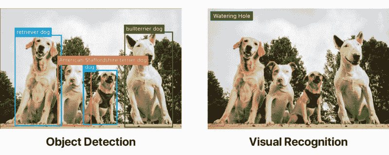
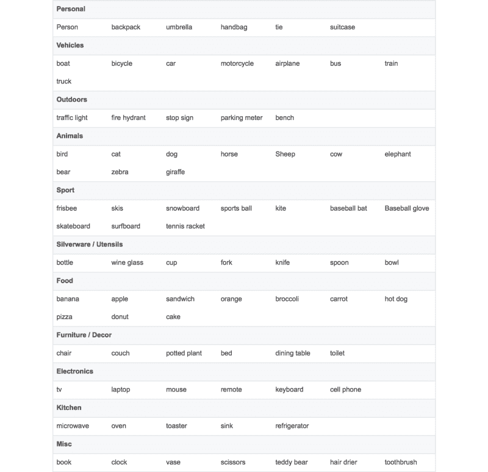
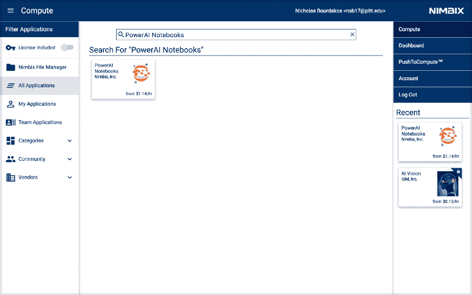
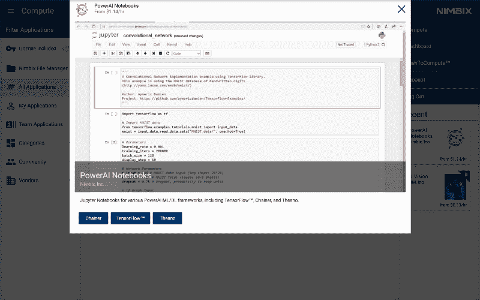
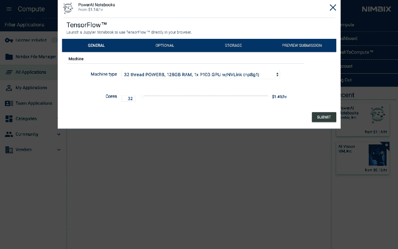
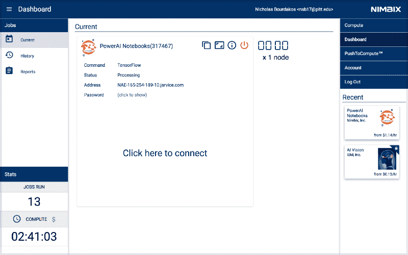
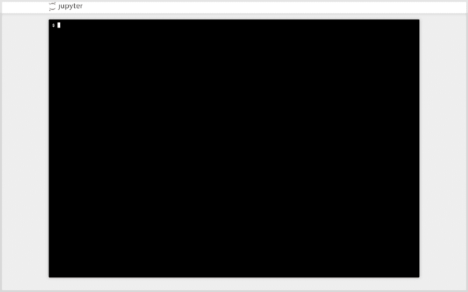
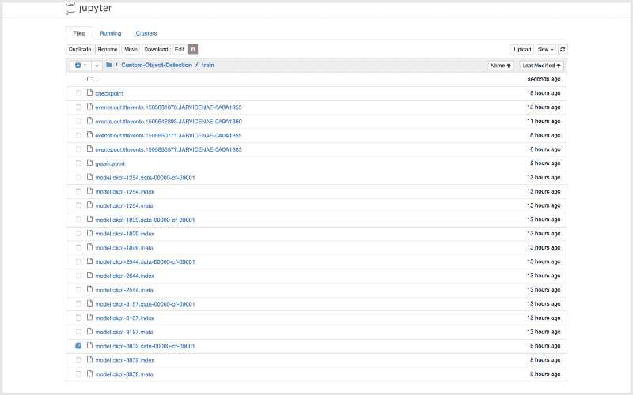

# 用 TensorFlow 追踪千年隼

> 原文：<https://www.freecodecamp.org/news/tracking-the-millenium-falcon-with-tensorflow-c8c86419225e/>

尼克·布尔达科斯

# 用 TensorFlow 追踪千年隼

在写这篇文章的时候，大多数大型科技公司(如 IBM、Google、Microsoft 和 Amazon)都有易于使用的视觉识别 API。一些较小的公司也提供类似的服务，比如 Clarifai。但是它们都不提供物体检测。

> **更新:** IBM 和微软现在都有可定制的对象检测 API。

以下图像均使用相同的[沃森视觉识别](https://www.ibm.com/watson/services/visual-recognition/)默认分类器进行标记。然而，第一个已经首先通过对象检测模型运行。



[Get started with Watson](https://ibm.biz/Bdjh2m)

物体检测本身可以远远优于视觉识别。但是如果你想检测物体，你就必须让你的手有点脏。

根据您的使用情况，您可能不需要自定义对象检测模型。 [TensorFlow](https://www.tensorflow.org/) 的对象检测 API 提供了一些不同速度和精度的模型，这些模型基于 [COCO 数据集](http://cocodataset.org/#home)。

为了方便起见，我整理了一份 COCO 模型可以探测到的物体的完整列表:



如果你想检测这个列表中没有的标志或其他东西，你必须建立你自己的自定义对象检测器。我希望能够探测到千年隼和一些钛战机。这显然是一个极其重要的用例，因为你永远不知道…

### 为您的图像添加注释

训练你自己的模型是一项很大的工作。此时，你可能会想，“哇，哇，哇！我不想做很多工作！”如果是这样的话，你可以看看我的另一篇文章关于使用提供的模型。这是一个更平稳的旅程。

你需要收集大量的图片，并对它们进行注释。注释包括指定对象坐标和相应的标签。对于有两个 Tie 战斗机的图像，注释可能如下所示:

```
<annotation>    <folder>images</folder>    <filename>image1.jpg</filename>    <size>        <width>1000</width>        <height>563</height>    </size>    <segmented>0</segmented>    <object>        <name>Tie Fighter</name>        <bndbox>            <xmin>112</xmin>            <ymin>281</ymin>            <xmax>122</xmax>            <ymax>291</ymax>        </bndbox>    </object>    <object>        <name>Tie Fighter</name>        <bndbox>            <xmin>87</xmin>            <ymin>260</ymin>            <xmax>95</xmax>            <ymax>268</ymax>        </bndbox>    </object></annotation>
```

对于我的星球大战模型，我收集了 308 张图片，每张图片包含两到三个物体。我建议试着为每件物品找出 200-300 个例子。

“哇，”您可能会想，“我必须浏览数百张图片，并为每张图片编写一堆 XML？”

当然不是！有很多注释工具，比如 [labelImg](https://github.com/tzutalin/labelImg) 和 [RectLabel](https://rectlabel.com) 。我用的是 [RectLabel](https://www.freecodecamp.org/news/tracking-the-millenium-falcon-with-tensorflow-c8c86419225e/undefined) ，但是只针对 macOS。相信我，还有很多工作要做。我花了大约三四个小时不间断的工作来注释我的整个数据集。

> **更新:**我最终构建了自己的工具来注释图像和视频帧。这是一个名为云注释的免费在线工具，你可以在这里查看。

如果你有钱，你可以付钱给其他人，比如实习生，让他们来做这件事。或者可以用[机械土耳其人](https://www.mturk.com/mturk/welcome)之类的。如果你像我一样是一名破产的大学生，或者觉得做几个小时单调的工作很有趣，那你只能靠自己了。

在运行脚本为 TensorFlow 准备数据之前，我们需要做一些设置。

### 克隆回购

从克隆我的回购开始[这里](https://github.com/bourdakos1/Custom-Object-Detection)。

> **更新:**这个回购有点过时，我推荐去[看看这个](https://github.com/cloud-annotations/training)更好的时机:)

> **注:**下面的说明也过时了，我劝你看看[的新穿越](https://cloud-annotations.github.io/training/object-detection/cli/)。

目录结构需要如下所示:

```
models|-- annotations|   |-- label_map.pbtxt|   |-- trainval.txt|   `-- xmls|       |-- 1.xml|       |-- 2.xml|       |-- 3.xml|       `-- ...|-- images|   |-- 1.jpg|   |-- 2.jpg|   |-- 3.jpg|   `-- ...|-- object_detection|   `-- ...`-- ...
```

我已经包括了我的训练数据，所以你应该能够运行这个开箱即用。但是如果您想用自己的数据创建一个模型，您需要将您的训练图像添加到`images`，将您的 XML 注释添加到`annotations/xmls`，更新`trainval.txt`和`label_map.pbtxt`。

`trainval.txt`是一个文件名列表，允许我们查找并关联 JPG 和 XML 文件。下面的`trainval.txt`列表会让我们找到`abc.jpg`、`abc.xml`、`123.jpg`、`123.xml`、`xyz.jpg`和`xyz.xml`:

```
abc123xyz
```

**注意:**确保您的 JPG 和 XML 文件名匹配，但不包括扩展名。

是我们试图探测的物体的列表。它应该是这样的:

```
item {  id: 1  name: 'Millennium Falcon'}
```

```
item {  id: 2  name: 'Tie Fighter'}
```

### 运行脚本

首先，安装 Python 和 pip，安装脚本要求:

```
pip install -r requirements.txt
```

将`models`和`models/slim`添加到您的`PYTHONPATH`中:

```
export PYTHONPATH=$PYTHONPATH:`pwd`:`pwd`/slim
```

**重要提示:**这必须在每次打开终端时运行，或者添加到您的`~/.bashrc`文件中。

运行脚本:

```
python object_detection/create_tf_record.py
```

一旦脚本运行完毕，您将得到一个`train.record`和一个`val.record`文件。这是我们用来训练模型的。

### 下载基本模型

从头开始训练一个物体探测器可能需要几天时间，即使使用多个[GPU](http://www.nvidia.com/object/what-is-gpu-computing.html)。为了加快训练速度，我们将采用在不同数据集上训练的对象检测器，并重用它的一些参数来初始化我们的新模型。

你可以从这个[模型动物园](https://github.com/bourdakos1/Custom-Object-Detection/blob/master/object_detection/g3doc/detection_model_zoo.md)下载一个模型。每个型号的精确度和速度都不同。我用了`faster_rcnn_resnet101_coco`。

提取并移动所有的`model.ckpt`文件到我们回购的根目录。

您应该会看到一个名为`faster_rcnn_resnet101.config`的文件。它将与`faster_rcnn_resnet101_coco`型号一起工作。如果你使用了另一个模型，你可以在这里找到相应的配置文件。

### 准备训练

运行下面的脚本，它应该开始训练了！

```
python object_detection/train.py \        --logtostderr \        --train_dir=train \        --pipeline_config_path=faster_rcnn_resnet101.config
```

**注意:**用配置文件的位置替换`pipeline_config_path`。

```
global step 1:global step 2:global step 3:global step 4:...
```

耶！起作用了！

10 分钟后。

```
global step 41:global step 42:global step 43:global step 44:...
```

*电脑开始冒烟。*

```
global step 71:global step 72:global step 73:global step 74:...
```

这东西要运行多久？

我在视频中使用的模型跑了大约 22，000 步。

等等，什么？！

我用的是斑点 MacBook Pro。如果你在类似的东西上运行这个程序，我会假设你大约每 15 秒钟走一步。以这种速度，需要连续跑三到四天才能得到一个像样的模型。

这太蠢了。我没时间做这个？

PowerAI 来救援了！

### PowerAI

PowerAI 让我们用 P100 GPU fast 在 IBM Power 系统上训练我们的模型！

训练一万步只用了一个小时左右。然而，这只是用一个 GPU。PowerAI 的真正力量来自于跨数百个 GPU 以高达 95%的效率进行分布式深度学习的能力。

在 PowerAI 的帮助下，IBM 刚刚创下了 7 小时 33.8%准确率的图像识别新纪录。它超过了微软之前创下的行业纪录——10 天内 29.9%的准确率。

WAYYY 快！

由于我不是在数百万张图片上训练，我肯定不需要那些资源。一个 GPU 就可以了。

#### 创建 Nimbix 帐户

Nimbix 在 PowerAI 平台上为开发者提供了一个拥有十小时免费处理时间的试用账户。可以在这里注册[。](https://www.nimbix.net/cognitive-journey/)

**注意:**此流程不是自动进行的，因此可能需要 24 小时进行审查和批准。

一旦获得批准，您应该会收到一封电子邮件，说明如何确认和创建您的帐户。它会问你一个促销代码，但留空白。

您现在应该可以在这里登录[。](https://mc.jarvice.com)

#### 部署 PowerAI 笔记本应用程序

从搜索`PowerAI Notebooks`开始。



点击它，然后选择`TensorFlow`。



选择`32 thread POWER8, 128GB RAM, 1x P100 GPU w/NVLink (np8g1)`的机器类型。



启动后，将显示以下仪表板。当服务器`Status`变为`Processing`时，服务器准备好被访问。

点击`(click to show)`获取密码。

然后，点击`Click here to connect`启动笔记本。



使用用户名`nimbix`和之前提供的密码登录。


#### 开始训练

点击`New`下拉菜单并选择`Terminal`，获得一个新的终端窗口。


迎接你的应该是一张熟悉的面孔:



**注意:**终端可能无法在 Safari 中工作。

培训步骤与我们在本地运行时的步骤相同。如果您正在使用我的培训数据，那么您可以通过运行以下命令来克隆我的 repo(如果没有，就克隆您自己的 repo):

```
git clone https://github.com/bourdakos1/Custom-Object-Detection.git
```

然后将 cd 放入根目录:

```
cd Custom-Object-Detection
```

运行这个代码片段，它将下载我们之前下载的预训练的`faster_rcnn_resnet101_coco`模型。

```
wget http://storage.googleapis.com/download.tensorflow.org/models/object_detection/faster_rcnn_resnet101_coco_11_06_2017.tar.gztar -xvf faster_rcnn_resnet101_coco_11_06_2017.tar.gzmv faster_rcnn_resnet101_coco_11_06_2017/model.ckpt.* .
```

然后我们需要再次更新我们的`PYTHONPATH`,因为这在一个新的终端中:

```
export PYTHONPATH=$PYTHONPATH:`pwd`:`pwd`/slim
```

然后我们终于可以再次运行训练命令了:

```
python object_detection/train.py \        --logtostderr \        --train_dir=train \        --pipeline_config_path=faster_rcnn_resnet101.config
```

#### 下载您的模型

我的模型什么时候准备好？这取决于你的训练数据。数据越多，需要的步骤就越多。我的模型在接近 4500 步时相当坚固。然后，在大约 20，000 步时，达到峰值。我甚至还走了下去，训练了 20 万步，也不见好转。

我建议每 5000 步左右下载一次你的模型，并对其进行评估，以确保你在正确的道路上。

点击左上角的`Jupyter`标志。然后，导航文件树到`Custom-Object-Detection/train`。

下载编号最高的所有 model.ckpt 文件。

*   `model.ckpt-STEP_NUMBER.data-00000-of-00001`
*   `model.ckpt-STEP_NUMBER.index`
*   `model.ckpt-STEP_NUMBER.meta`

**注意:**一次只能下载一个。



**注意:**完成后，请务必点击机器上的红色电源按钮。否则，时钟将无限期地走下去。

#### 导出推理图

为了在我们的代码中使用这个模型，我们需要将检查点文件(`model.ckpt-STEP_NUMBER.*`)转换成一个冻结的[推理图](http://deepdive.stanford.edu/inference)。

将您刚刚下载的检查点文件移动到您一直使用的 repo 的根文件夹中。

然后运行以下命令:

```
python object_detection/export_inference_graph.py \        --input_type image_tensor \        --pipeline_config_path faster_rcnn_resnet101.config \        --trained_checkpoint_prefix model.ckpt-STEP_NUMBER \        --output_directory output_inference_graph
```

记住 *`export PYTHONPATH=$PYTHONPATH:`pwd`:`pwd`/slim`。*

您应该会看到一个新的`output_inference_graph`目录和一个`frozen_inference_graph.pb`文件。这是我们需要的文件。

#### 测试模型

现在，运行以下命令:

```
python object_detection/object_detection_runner.py
```

它将在`test_images`目录中的所有图像上运行在`output_inference_graph/frozen_inference_graph.pb`找到的对象检测模型，并在`output/test_images`目录中输出结果。

### 结果呢

这是我们在《星球大战:原力觉醒》的这个片段中运行我们的模型时得到的结果。

感谢阅读！如果您有任何问题，请随时联系 bourdakos1@gmail.com，通过 [LinkedIn](https://www.linkedin.com/in/nicholasbourdakos) 与我联系，或者通过 [Medium](https://medium.com/@bourdakos1) 和 [Twitter](https://twitter.com/bourdakos1) 关注我。

如果你觉得这篇文章很有帮助，给它点掌声会很有意义？并分享出来帮别人找！并欢迎在下方发表评论。