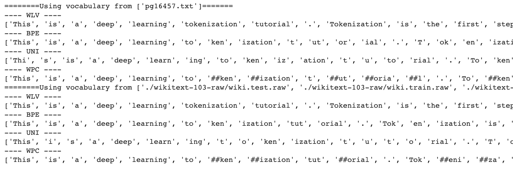
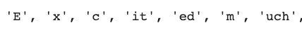
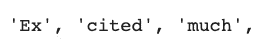
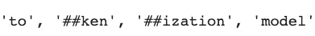
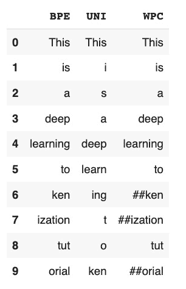
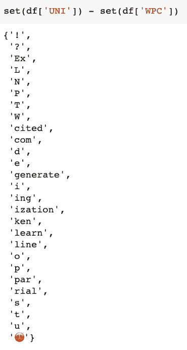
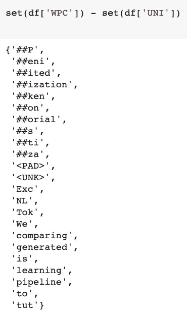

# 如何使用拥抱脸从零开始训练 BPE、单词和单字分词器

> 原文：<https://www.freecodecamp.org/news/train-algorithms-from-scratch-with-hugging-face/>

如果你有一些 NLP 的经验，你可能知道标记化是任何 NLP 管道的掌舵人。

标记化通常被认为是自然语言处理的一个子领域，但是它有自己的发展历程。现在，它支撑着许多最先进的自然语言处理模型。

这篇文章是关于利用**humping Face 的 tokenizers 包从头开始训练 tokenizers 的。**

在我们开始训练和比较不同的记号赋予器的有趣部分之前，我想给你一个算法之间的关键区别的简要总结。

主要区别在于对要合并的字符对的**选择和**这些算法中的每一个用来生成最终令牌集的合并策略**。**

## BPE 算法——基于频率的模型

字节对编码使用子字模式的频率将它们列入合并的候选名单。

使用频率作为驱动因素的缺点是，最终可能会产生模糊的最终编码，这对新的输入文本可能没有用。

但是在生成明确的令牌方面，它仍然有改进的余地。

## 单字算法——一种基于概率的模型

接下来，我们有一个 Unigram 模型，它通过计算每个子词组合的可能性来解决合并问题，而不是选择最频繁的模式。

它计算每个子词标记的概率，然后根据损失函数将其丢弃，这在本研究论文的[中有所解释。](https://arxiv.org/pdf/1804.10959.pdf)

基于损失值的某个阈值，您可以触发模型丢弃底部 20-30%的子词标记。

Unigram 是一种完全概率算法，它根据概率选择字符对，并最终决定在每次迭代中合并(或不合并)。

## 单词块算法

随着 2018 年 BERT 的发布，出现了一种新的子词标记化算法，称为 WordPiece，可以被认为是 BPE 和 Unigram 算法的中介。

WordPiece 也是一种贪婪算法，它利用似然性而不是计数频率来合并每次迭代中的最佳配对，但配对字符的选择是基于计数频率的。

因此，在选择要配对的字符方面，它类似于 BPE，在选择要合并的最佳字符对方面，它类似于 Unigram。

考虑到算法上的差异，我尝试实现这些算法中的每一个(不是从头开始)，以比较它们各自生成的输出。

## 如何训练 BPE、单字和单词块算法

现在，为了对输出进行公正的比较，我不想使用预先训练的算法，因为这会将数据集的大小、质量和内容带入图像中。

一种方法是使用研究论文从头开始编写这些算法，然后测试它们。为了真正理解每个算法的工作原理，这是一个很好的方法，但是你可能会花费数周的时间来做这件事。

相反，我使用了[humping Face 的 tokenizers](https://huggingface.co/docs/tokenizers/python/latest/quicktour.html) 包，它提供了所有当今最常用的 tokenizers 的实现。它还允许我在我选择的数据集上从头开始训练这些模型，然后标记我自己选择的输入字符串。

### 如何训练数据集

我选择了两个不同的数据集来训练这些模型。一个是来自古腾堡的免费书籍，作为一个小数据集，另一个是 516M 文本的 [wikitext-103](https://blog.einstein.ai/the-wikitext-long-term-dependency-language-modeling-dataset/) 。

在 Colab 中，您可以先下载数据集并解压缩(如果需要):

```
!wget http://www.gutenberg.org/cache/epub/16457/pg16457.txt
```

```
!wget https://s3.amazonaws.com/research.metamind.io/wikitext/wikitext-103-raw-v1.zip
```

```
!unzip wikitext-103-raw-v1.zip
```

### 导入所需的模型和训练器

浏览文档，你会发现这个包的主要 API 是类`Tokenizer.`

然后，您可以用您选择的模型(BPE/ Unigram/ WordPiece)实例化任何记号化器。

在这里，我导入了主类，所有我想测试的模型，以及它们的训练器，因为我想从头开始训练这些模型。

```
## importing the tokenizer and subword BPE trainer
from tokenizers import Tokenizer
from tokenizers.models import BPE, Unigram, WordLevel, WordPiece
from tokenizers.trainers import BpeTrainer, WordLevelTrainer, \
                                WordPieceTrainer, UnigramTrainer

## a pretokenizer to segment the text into words
from tokenizers.pre_tokenizers import Whitespace
```

### 如何自动化培训和令牌化

因为我需要为三个不同的模型执行有些相似的过程，所以我将这些过程分成三个函数。我只需要为每个模型调用这些函数，我的工作就完成了。

那么，这些功能是什么？

#### 步骤 1 -准备记号赋予器

准备记号赋予器要求我们用我们选择的模型实例化记号赋予器类。但是由于我们有四个模型要测试(我还添加了一个简单的单词级算法)，我们将编写 if/else 案例来用正确的模型实例化标记化器。

为了在小型和大型数据集上训练实例化的分词器，我们还需要实例化一个训练器，在我们的例子中，这些训练器是 **[`BpeTrainer`](https://huggingface.co/docs/tokenizers/python/latest/api/reference.html#tokenizers.trainers.BpeTrainer) `, WordLevelTrainer, WordPieceTrainer, and UnigramTrainer.`**

实例化和训练将需要我们指定一些特殊的令牌。这些是未知单词和其他特殊单词的标记，我们以后需要使用它们来添加到我们的词汇表中。

您也可以在这里指定其他训练参数的词汇大小或最小频率。

```
unk_token = "<UNK>"  # token for unknown words
spl_tokens = ["<UNK>", "<SEP>", "<MASK>", "<CLS>"]  # special tokens

def prepare_tokenizer_trainer(alg):
    """
    Prepares the tokenizer and trainer with unknown & special tokens.
    """
    if alg == 'BPE':
        tokenizer = Tokenizer(BPE(unk_token = unk_token))
        trainer = BpeTrainer(special_tokens = spl_tokens)
    elif alg == 'UNI':
        tokenizer = Tokenizer(Unigram())
        trainer = UnigramTrainer(unk_token= unk_token, special_tokens = spl_tokens)
    elif alg == 'WPC':
        tokenizer = Tokenizer(WordPiece(unk_token = unk_token))
        trainer = WordPieceTrainer(special_tokens = spl_tokens)
    else:
        tokenizer = Tokenizer(WordLevel(unk_token = unk_token))
        trainer = WordLevelTrainer(special_tokens = spl_tokens)

    tokenizer.pre_tokenizer = Whitespace()
    return tokenizer, trainer
```

我们还需要添加一个预标记器来将我们的输入拆分成单词，因为没有预标记器，我们可能会得到重叠几个单词的标记:例如，我们可以得到一个 **`"there is"`** 标记，因为这两个单词经常相邻出现。

> 使用预标记器将确保没有标记大于预标记器返回的单词。

这个函数将返回 tokenizer 和它的 trainer 对象，我们可以用它们来训练数据集上的模型。

这里，我们对所有模型使用相同的预标记器(`Whitespace`)。你可以选择用[其他](https://huggingface.co/docs/tokenizers/python/latest/api/reference.html#module-tokenizers.pre_tokenizers)来测试。

#### 步骤 2 -训练分词器

准备好记号赋予者和训练者之后，我们就可以开始训练过程了。

这里有一个函数，它将获取我们打算用来训练我们的标记器的文件以及算法标识符。

*   `‘WLV’` -单词级算法
*   `‘WPC’` -工件算法
*   `‘BPE’` -字节对编码
*   `‘UNI’` - Unigram

```
def train_tokenizer(files, alg='WLV'):
    """
    Takes the files and trains the tokenizer.
    """
    tokenizer, trainer = prepare_tokenizer_trainer(alg)
    tokenizer.train(files, trainer) # training the tokenzier
    tokenizer.save("./tokenizer-trained.json")
    tokenizer = Tokenizer.from_file("./tokenizer-trained.json")
    return tokenizer
```

这是我们在训练分词器时需要调用的主要函数。它将首先准备记号赋予器和训练器，然后用提供的文件开始训练记号赋予器。

训练之后，它将模型保存在一个 JSON 文件中，从该文件中加载它，并返回经过训练的标记器，开始对新输入进行编码。

#### 步骤 3 -对输入字符串进行标记

最后一步是开始对新的输入字符串进行编码，并比较每个算法生成的标记。

这里，我们将编写一个嵌套的 for 循环，首先在较小的数据集上训练每个模型，然后在较大的数据集上训练，并标记输入字符串。

**输入字符串-** “这是一个深度学习的记号化教程。标记化是深度学习 NLP 管道的第一步。我们将比较每个令牌化模型生成的令牌。很兴奋吗？！😍"

```
small_file = ['pg16457.txt']
large_files = [f"./wikitext-103-raw/wiki.{split}.raw" for split in ["test", "train", "valid"]]

for files in [small_file, large_files]:
    print(f"========Using vocabulary from {files}=======")
    for alg in ['WLV', 'BPE', 'UNI', 'WPC']:
        trained_tokenizer = train_tokenizer(files, alg)
        input_string = "This is a deep learning tokenization tutorial. Tokenization is the first step in a deep learning NLP pipeline. We will be comparing the tokens generated by each tokenization model. Excited much?!😍"
        output = tokenize(input_string, trained_tokenizer)
        tokens_dict[alg] = output.tokens
        print("----", alg, "----")
        print(output.tokens, "->", len(output.tokens))
```

这里是输出:



## 输出分析:

查看输出，您将看到令牌生成方式的差异，这反过来又导致生成不同数量的令牌。

*   一个简单的**单词级算法**创建了 35 个标记，不管它是在哪个数据集上被训练的。
*   **BPE** 算法在较小数据集上训练时创建了 55 个令牌，在较大数据集上训练时创建了 47 个令牌。这表明，当在更大的数据集上训练时，它能够合并更多的字符对。
*   **Unigram 模型**用两个数据集创建了相似(68 和 67)数量的标记。但是您可以看到生成的令牌之间的差异:



对于更大的数据集，合并更接近于生成更适合于编码我们经常使用的真实世界英语单词的标记。



在较小的数据集上训练时，WordPiece 创建了 52 个令牌，在较大的数据集上训练时，创建了 48 个令牌。生成的令牌有两个##，表示使用令牌作为前缀/后缀。



当在更大的数据集上训练时，这三种算法都生成了更差和更好的子词标记。

## 如何比较代币

为了比较标记，我将每个算法的输出存储在一个字典中，并将它转换成一个数据帧，以便更好地查看标记的差异。

由于每个模型生成的令牌数量不同，我添加了一个<pad>令牌来使数据呈矩形并适合一个数据帧。</pad>

<pad>基本上是数据帧中的 nan。</pad>

```
import pandas as pd

max_len = max(len(tokens_dict['UNI']), len(tokens_dict['WPC']), len(tokens_dict['BPE']))
diff_bpe = max_len - len(tokens_dict['BPE'])
diff_wpc = max_len - len(tokens_dict['WPC'])

tokens_dict['BPE'] = tokens_dict['BPE'] + ['<PAD>']*diff_bpe
tokens_dict['WPC'] = tokens_dict['WPC'] + ['<PAD>']*diff_wpc

del tokens_dict['WLV']

df = pd.DataFrame(tokens_dict)
df.head(10)
```

**下面是输出:**



您还可以使用集合来查看标记的差异:



要查看代码，请前往这个 [Colab 笔记本。](https://colab.research.google.com/drive/10gwzRY55JqzgeEQOX6nwFs6bQ84-mB9f?usp=sharing)

## 结束语和后续步骤

根据生成的标记的种类，WPC 似乎确实生成了在英语中更常见的子词标记——但是不要让我坚持这种观点。

这些算法彼此略有不同，但在开发一个像样的 NLP 模型方面做得有些类似。但是，大部分性能取决于您的语言模型的用例、词汇量、速度和其他因素。

我们对标记化算法的研究到此结束。深入研究的下一步是理解什么是嵌入，标记化如何在创建这些嵌入中发挥重要作用，以及它们如何影响模型的性能。

这些算法的进一步发展是[句子片断算法](https://arxiv.org/pdf/1808.06226.pdf),这是一种解决整个标记化问题的有益方法。但是这个问题在很大程度上被 HuggingFace 缓解了，甚至更好——他们在一个 GitHub repo 中实现了所有的算法。

### 参考文献和注释

如果你对我的分析或我在这篇文章中的任何工作有疑问，我强烈建议你查看这些资源，以准确理解每个算法的工作原理:

1.  [子词正则化:用多个候选子词改进神经网络翻译模型](https://arxiv.org/pdf/1804.10959.pdf)作者多久·工藤
2.  [具有子词单元的稀有词的神经机器翻译](https://arxiv.org/pdf/1508.07909.pdf) -讨论基于 BPE 压缩算法的不同分割技术的研究论文。
3.  [拥抱脸的 tokenizer 包。](https://huggingface.co/docs/tokenizers/python/latest/quicktour.html)

### 与我联系

如果你正在寻找数据科学或 ML 领域的入门课程，请查看我关于数据科学基础的课程[****&****](https://www.wiplane.com/p/foundations-for-data-science-ml)。

如果你想看到更多这样的内容，并且你不是订阅者，可以考虑订阅[我的简讯](https://dswharshit.substack.com/)。

如有任何补充或建议，您可以通过以下方式联系我:

*   [YouTube](https://www.youtube.com/channel/UCH-xwLTKQaABNs2QmGxK2bQ)
*   [推特](https://twitter.com/dswharshit)
*   [LinkedIn](https://www.linkedin.com/in/tyagiharshit/)