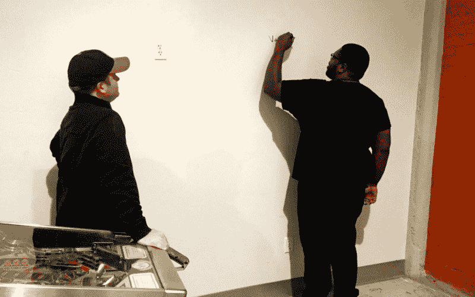

# 超越技术面试

> 原文：<https://www.freecodecamp.org/news/transcending-the-technical-interview-53de65feaafc/>

海梅·j·里奥斯

# 超越技术面试

Solving whiteboard problems at [Free Code Camp Fresno’s](http://www.meetup.com/Free-Code-Camp-Fresno/) “Whiteboard Interview Challenges” event.

*“哇。那是多么痛苦和可耻的经历啊。”*

这是我完成第一次技术面试后的第一反应。

在这次令人谦卑的经历之后，我很快认识到，知道如何编写好的代码是一回事，但阐明编写代码背后的思维过程是完全不同的另一回事。

我清楚地记得面试前我是多么自信。但当我被赋予向面试官展示我的解决方案的任务时，我的信心就像胡迪尼魔术一样消失了。

我很快意识到口头解释你的代码比听起来要困难得多。

在面试过程中，我几次愣住了。我结巴了。实际上，有一次我不得不要求我的面试官向我介绍我自己的代码。

不用说，这是一次令人哭笑不得的经历。

令人痛苦的是，我需要在面试场景中练习口头解释我的代码。

我设法安排了另一次技术面试。这一次，我知道我需要找一个地方来提高我和其他程序员的技术面试技巧。

你瞧，一个朋友偶然提到了我所在的加州弗雷斯诺市的一个[免费代码营](https://www.freecodecamp.com/)小组。那时我没有什么可失去的，所以我决定努力参加他们的一个活动。

在这次活动中，我立即注意到我周围都是乐于合作、思想开放、积极向上的人，他们和我一样对编码充满热情。他们也愿意帮助解决我向他们提出的任何问题。

我立刻意识到我发现了一个无价的资源。参加这个小组有助于加强我的学习，增强我的信心，并帮助我超越技术面试。

最近，我们当地的自由代码营组织者举办了一场可以说是今年迄今为止最好的活动。该活动名为“白板面试挑战”

如题所示，我们练习了技术面试中经常被问到的白板问题。

让这次特别的活动成为一次精彩的经历的是我们从所有到场的程序员那里得到的巨大支持和建设性的反馈。

太不可思议了！实际上，我们有从贝克斯菲尔德(离弗雷斯诺有两个小时的路程)远道而来参加活动的编码员。我认为看到 Bakersfield 和 Fresno 编码社区走到一起互相帮助、指导和支持是一件令人难以置信的事情。

Free Code Camp Bakersfield members helping Fresno members solve whiteboard interview problems.

事件始于我们下载了一个包含技术采访问题的 Github repo。然后，与典型的讲座式环境相反，每个人都分成小组进行合作，解决回购中分配的问题。

我们回顾的问题之一是实现一种叫做“平方和”的算法这需要接受一个数字数组，对数组中的每个数字求平方，然后返回这些数字的和。

在白板上(或者在我们的例子中是墙板)解决了算法之后，我们还练习口头解释我们的解决方案和我们实现背后的逻辑思维过程。

在白板上写下解决方案还不错。我觉得我过得很好。虽然一开始谈到我的代码时我很纠结，但是我们有很多经验丰富的程序员在整个过程中指导我们。

当我开始谈论我的递归解决方案时，我觉得口头解释它，以及讨论围绕我的实现的方法和原因要舒服得多。

One of my implementations for “sum of squares” (I’m on the right).

我不能过分强调我从这个事件中获得的教育价值和信心，以及从整个自由代码营中获得的。

这是作为一名软件工程师进入科技行业的一大步。

如果我能给那些在技术面试中挣扎的人一些建议，请帮你自己一个忙，合作，不要疏远。

你会发现通过合作，提高你的编码技能的机会是无限的。

**感谢**纳尔逊·埃斯帕尔扎、里克·格麦兹和托马斯·克莱因阅读本文的草稿。

**感谢**到 [Bitwise](http://bitwiseindustries.com/job-opportunities/) (位于弗雷斯诺市中心)为[弗雷斯诺免费代码营](http://www.meetup.com/Free-Code-Camp-Fresno/)提供举办如此精彩的代码活动的空间！

如果你喜欢这个故事和我在这里提出的一些观点，请在脸书和推特上分享这篇文章。

最后但同样重要的是，请随意单击？以便其他人可以在媒体上看到这个故事。谢谢收听。

