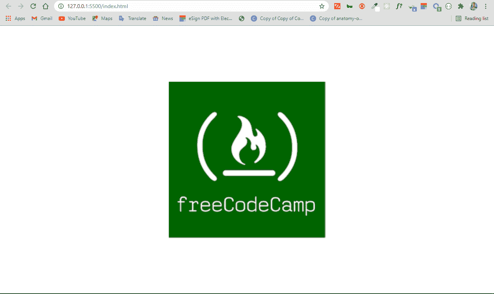
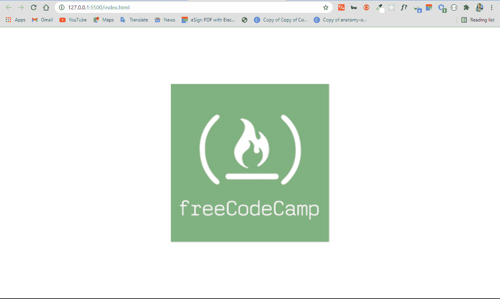
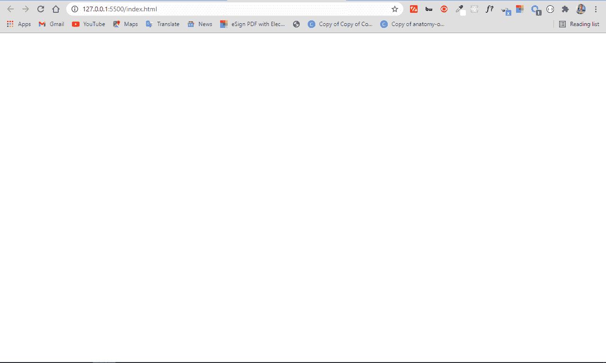
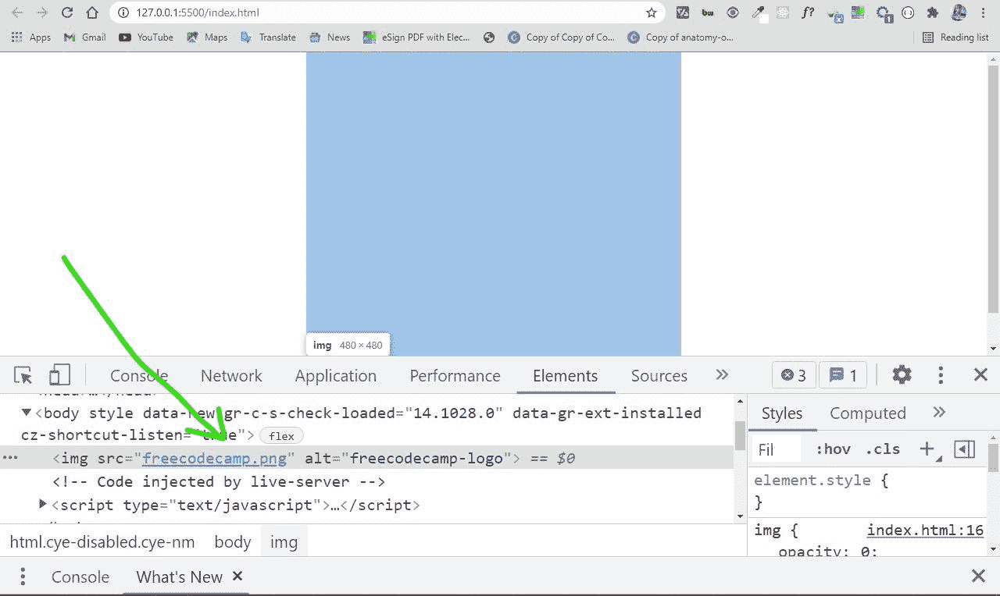
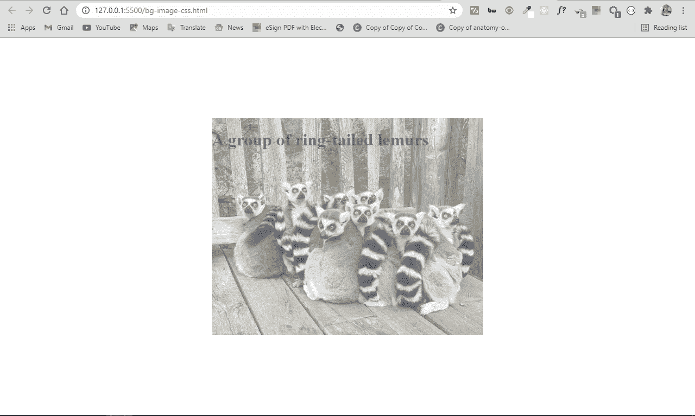
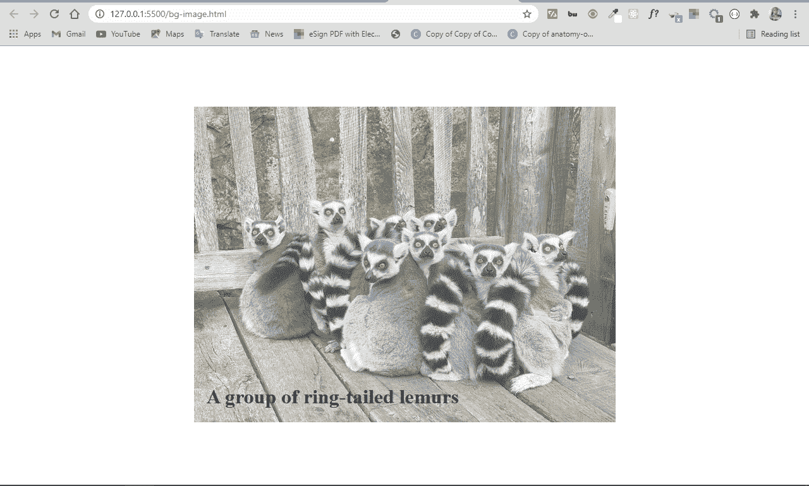

# 透明背景–CSS 和 HTML 中的图像不透明

> 原文：<https://www.freecodecamp.org/news/transparent-background-image-opacity-in-css-and-html/>

透明度在前端开发中起着重要的作用。它允许您选择网页上元素的透明度。

你可以用几种方法调整透明度——当然，在 CSS 中，有多种方法可以做同样的事情。

CSS `opacity`属性是你想到的第一种改变透明度的方法。但是这个属性并不能一直帮助你，尤其是当你想把一个背景图片中的文字变成透明的时候。

因此，在这篇文章中，我将向您展示调整透明度的各种方法，以便您可以开始在您的编码项目中实现它。

## 具有 CSS 不透明度属性的图像透明度

要使图像透明，你可以使用 CSS `opacity`属性，正如我上面提到的。下面的代码片段显示了 opacity 属性的基本语法:

```
selector {
          opacity: value;
      } 
```

不透明度属性采用从`0.0`到`1.0`的值，其中`1`是所有元素的默认值。值越低，越透明。因此，如果一个元素被赋予了`0`的不透明度，它将是不可见的。

您可以在下面的代码片段中找到不同不透明度值的示例:

```
 
```

我添加了一些 CSS 来使页面上的所有内容居中:

```
body {
        display: flex;
        align-items: center;
        justify-content: center;
        margin: 0 auto;
        height: 100vh;
      }

 img {
        opacity: 1;
      } 
```

默认不透明度值为`1`，因此图像显示如下:


```
img {
     opacity: 0.5;
   } 
```

这段代码给了我们 50%的不透明度，你可以看到徽标已经褪色了一点:



```
img {
        opacity: 0;
      } 
```

不透明度为`0`时，图像是 100%透明的，因此它变得不可见:



确定图片在页面上的唯一方法是用你的浏览器 devtools 检查它:



您可以使用这个不透明度值做很多事情，例如，您可以使用它在网站上的英雄图像上包含文本。

您可能想知道为什么要用不透明度值 0 使内容不可见。嗯，它在动画中很有用，在构建 HTM + CSS + JavaScript 游戏中也很有用。

你肯定想使用 CSS 定位来帮助你对齐东西。我将在文章的下一部分讨论这一点。

## HTML 和 CSS 中的背景图像透明度

CSS 提供了一种用`background-image`属性为容器元素设置背景图像的方法，所以你不必用 CSS 来做这件事。这意味着您也可以在容器中放置文本。

```
<div class="showcase">
      <h1>A group of ring-tailed lemurs</h1>
</div> 
```

```
body {
      display: flex;
      align-items: center;
      justify-content: center;
      margin: 0 auto;
      height: 100vh;
    }
    .showcase {
      background-image: url("ring-tailed-lemurs.jpeg");
      height: 400px;
      width: 500px;
      background-position: center;
      background-repeat: no-repeat;
      background-size: cover;
      opacity: 0.6;
    } 
```

这种方法的缺点是不透明度是为图像和文本所在的容器设置的。因此，不透明度不仅影响图像，也影响文本。这很可能不是你想要的！



### 解决方案

默认情况下，当您对容器应用不透明度时，后代也会继承它。

这种情况下的解决方法是在 HTML 中设置背景图像。这使得只对图像应用不透明度变得容易，而不是在 CSS 中为容器设置背景图像。

这一次，图像和文本将被分开，因此文本将不会继承为`opacity`设置的值。

这意味着您还必须使用 CSS 定位来对齐图像中的文本。

```
<div class="showcase">
   

   <h1 class="bg-img-title">A group of ring-tailed lemurs</h1>
</div> 
```

```
body {
      display: flex;
      align-items: center;
      justify-content: center;
      margin: 0 auto;
      height: 100vh;
    }
    .showcase {
      position: relative;
    }

    .bg-image {
      opacity: 0.7;
    }

    .bg-img-title {
      position: absolute;
      top: 420px;
      left: 20px;
    } 
```

在上面的 CSS 代码片段中，我使用`flexbox`将页面上的所有内容居中。

类别为`showcase`的容器`div`元素被放置在`relative`中，因此您可以将`h1`文本`absolute`放置在其中。这将把`h1`文本推到图像的左上角。然后使用`top`和`left`属性将文本推到图像的左下角。

如果您想知道什么是`top`和`left`属性，它们是您在使用 display 属性时可以访问的属性。

除了这两个，您还可以访问`right`和`bottom`属性。它们允许你在任何地方放置一个元素。

最终图像不透明，文字不受影响:


## 结论

在本文中，您学习了如何使用 CSS 的不透明属性使图像透明。

由于 CSS 仍然有些棘手和古怪，将不透明度属性与其他 CSS 功能(如定位)结合起来以便正确使用是很有帮助的。

除了 CSS 定位之外，你还可以将`opacity`属性用于 CSS 伪元素，比如`::before`和`::after`，这是一种不太好的做法。

感谢阅读，继续编码。