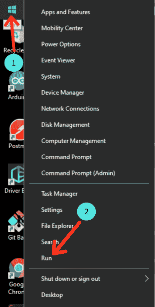
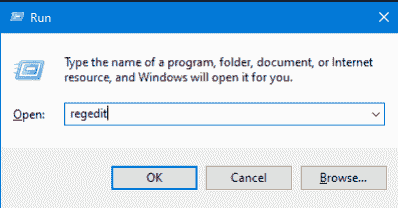
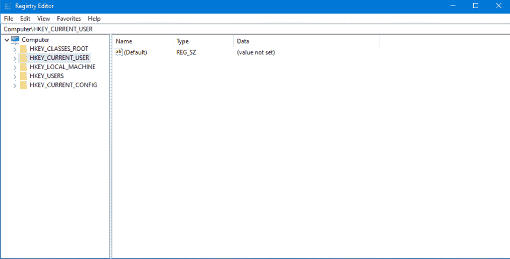
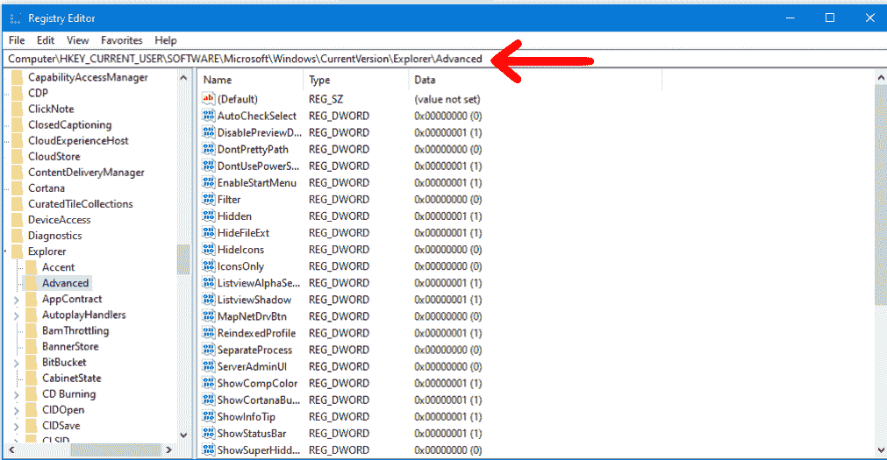
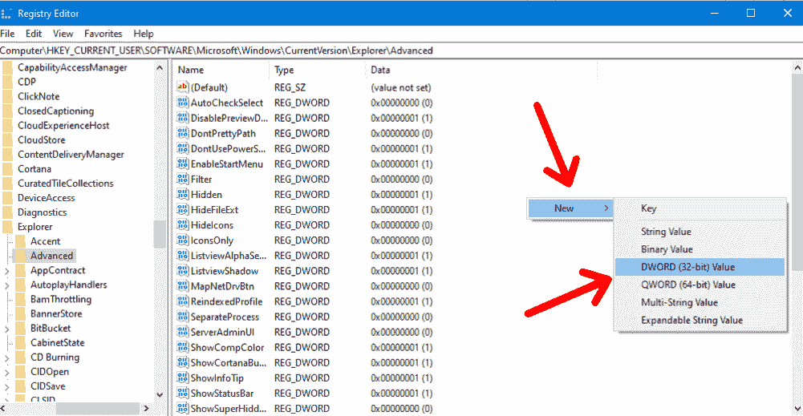
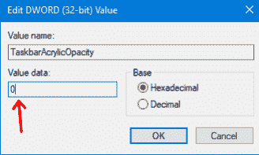
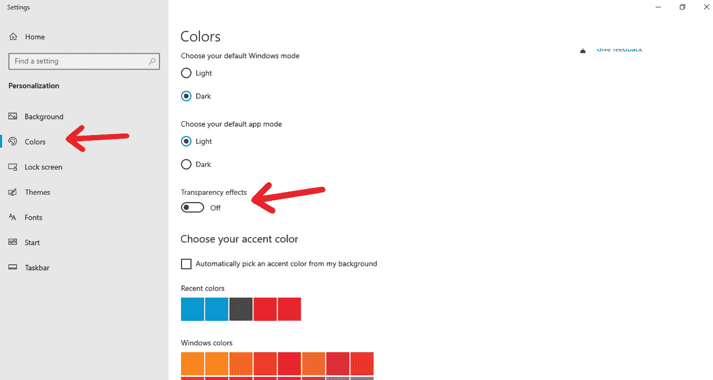
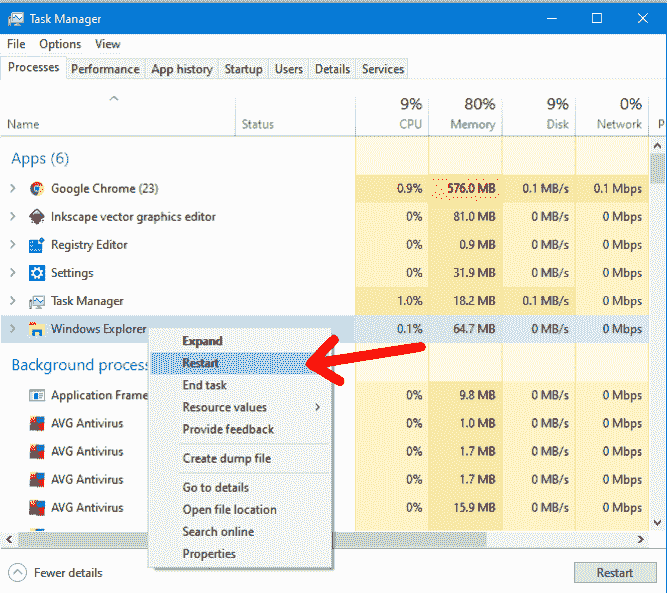

# 透明任务栏–如何在 Windows 10 PC 中使任务栏透明

> 原文：<https://www.freecodecamp.org/news/transparent-taskbar-how-to-make-a-task-bar-transparent-in-windows-10-pc-2/>

让你的 Windows 任务栏透明是一件很酷的事情。它看起来很棒，也是少数几种可以个性化任务栏的方式之一。

一些关于这个主题的资源需要你安装不同的软件来完成。但在本教程中，我们将看到如何使任务栏完全透明，无需任何安装。

## 如何使你的 Windows 任务栏透明

### 步骤 1 -使用 Run 命令打开注册表编辑器程序

“运行”命令允许您通过键入程序名称来打开 PC 上的各种程序。我们将使用的程序叫做注册表编辑器。

要使用运行命令，您可以使用快捷键 **Win + R** (Windows 按钮+ R)或者您可以**右键单击 Windows 图标上的**并点击“运行”。



### **步骤 2 -输入注册表**

点击运行后，会弹出一个窗口，你可以输入你想打开的程序的名字。键入“regedit ”,然后按 OK。这将打开注册表编辑器。



点击确定后，应弹出如下窗口:



### **步骤 3 -浏览文件夹**

第一个要展开的文件夹是`HKEY_CURRENT_USER`文件夹。向下滚动并展开`SOFTWARE`文件夹。

之后，找到`Microsoft`文件夹并将其展开。接下来，向下滚动并展开`Windows`文件夹。

在`Windows`文件夹中，展开`CurrentVersion`文件夹，然后展开`Explorer`文件夹。最后，点击`Advanced`文件夹。

如果您发现上面的步骤令人困惑，那么您可以使用以下路径作为指南:

```
Computer\HKEY_CURRENT_USER\SOFTWARE\Microsoft\Windows\CurrentVersion\Explorer\Advanced
```

粘贴上面的路径并按下回车键应该会自动把你带到我们当前的位置。



### **步骤 4 -创建一个新文件**

右键单击并悬停在“新建”选项上方。

然后点击 **DWORD (32 位)值**:



点击 **DWORD (32 位)值**后，你会看到一个空白处，你应该在这里输入新文件。将文件命名为`TaskbarAcrylicOpacity`。创建文件后，双击该文件并将**值数据**输入设置为 0(零)并点击确定。



### **步骤 5 -启用透明效果**

转到桌面并右键单击。点击个性化。

点击“颜色”选项卡，将透明效果切换为 **`On`** :



在这之后，你应该有一个透明的任务栏。

如果最后一步对你不起作用，那么继续下一步。

### **步骤 6 -使用任务管理器重新启动 Windows 资源管理器**

在打开任务管理器之前，请确保您的文件资源管理器已经在运行。然后按照以下步骤操作:

*   右键单击任务栏。
*   点击任务管理器。
*   右击应用程序下的文件浏览器。
*   点击重启



完成最后一步后，你应该有一个完全透明的任务栏。

## 结论

在本教程中，我们在 Windows 10 中不安装任何软件的情况下，将任务栏透明化。我希望这对你有用。

感谢您的阅读！