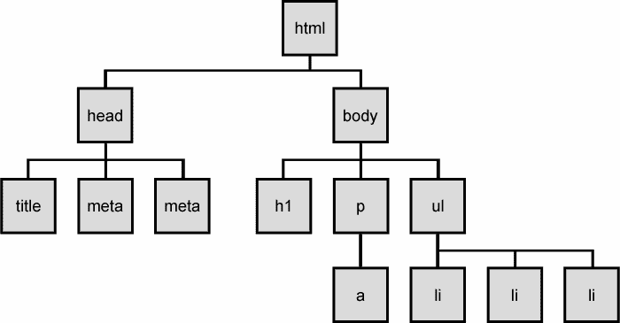
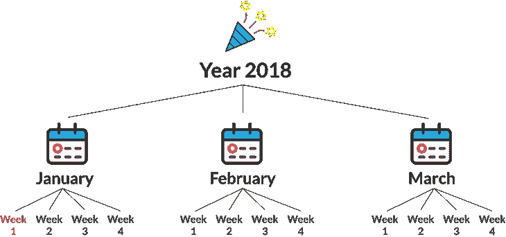
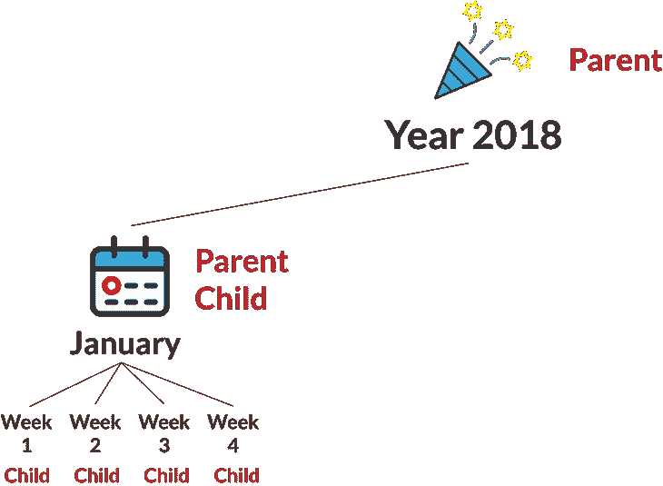
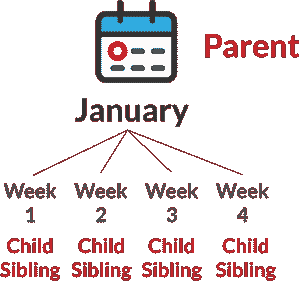
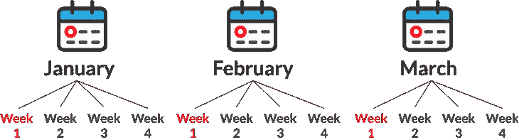

# 遍历 DOM 就像创建个人日程表一样

> 原文：<https://www.freecodecamp.org/news/traversing-the-dom-is-just-like-creating-your-personal-schedule-30dacb1bebf0/>

凯文·科诺年科


# 遍历 DOM 就像创建个人日程表一样

#### 如果你使用日历来计划你的一天，那么你就能理解 DOM 的基础。

回想一下你第一次学习 HTML 的时候。

有人(或一些软件)必须解释不同的元素如何一起工作，这样你才能建立你的第一个网页。

他们可能把它描述为“盒中盒…盒中盒…在盒子里…”


这种基本的理解实际上可以很好地帮助你前进！但是，一旦你熟悉了 CSS 并开始使用 JavaScript……那么，盒子里的盒子不再有用了。

### JavaScript 迫使你更深入地理解 DOM

一接触到 JavaScript 和 jQuery，就需要了解文档对象模型( **DOM** )。DOM 是一个应用程序编程接口(API ),允许您使用 JavaScript 对 HTML 进行更改。

它是构建动态网站和在前端链接 JavaScript 和 HTML 的关键。

通常，DOM 被称为 **DOM 树。**这类作品解释了基本思想，因为人们理解树枝的概念和这些树枝的无限层次。



但是，这种类比仍然非常基本，以至于你很难理解 DOM 中元素之间的不同关系。

我想找到一种方法来解释 DOM 中的两个关键概念:

1.  **包含:**父元素包含子元素。这些子元素包含它们的子元素。
2.  **顺序:** DOM 元素有一个明确的顺序，您可以对其进行操作。

我发现个人日历的概念在显示 DOM 中元素之间的复杂关系方面做得更好。下面是如何使用日历来理解 DOM 的直观解释。

为了理解本教程，你只需要理解类和如何建立一个 HTML 文档。


### 遍历 DOM 的基础知识

下面是 2018 年前三个月的快速图表。



在这种情况下，**年**包含三个**月，**包含四个**周**。

这是 HTML 中完全相同的概念:

每个月都是一个`div`，它不仅有`month`的类，还有一个具有该月特定`name`的类。这是因为有将近无限的年数，所以每一类都有很多情况。在 1 号线`year`级的`div`上使用了相同的结构。

此外，除了`week`类之外，星期没有任何特定的标识符。你马上就会明白为什么了。

除了使用类和 id 通过 DOM 访问元素，我们还可以使用元素之间的关系。现在你需要知道三个——孩子、父母和兄弟姐妹。

### 子元素

**子元素:**包含在另一个元素中的元素

示例—一月的**分区是一年 **2018** 的**子**。**


### 父元素

**父元素:**包含其他元素的元素。

例:年份 **2018** 为父母。但是**一月**也是父母，因为它包含 4 **周**！



### 兄弟元素

**兄弟元素:**与其他元素具有相同直接父元素的元素。

示例:在**1 月**内的所有 **4 周**都是彼此的兄弟姐妹。



你可能会问，DOM 和实际的 HTML 有什么区别呢？

嗯，想想你使用个人日历的方式。它只是你一天中所做事情的记录。不是实际活动！换句话说，它是白天发生的事情的模型。

HTML 是你一天的实际内容。HTML 元素构成了网页，而 DOM 是一个可访问的界面来指导更改。

这里有几个例子可以展示这些概念的实际应用。

### 例 1:每周踢一次足球

好的，我们将展示如何在 DOM 中表示一些真实世界的习惯。场景是这样的:你想在一月份每周踢一次足球。

用 HTML 术语来说，这意味着我们需要获得一月份的 4 周，并将它们的内容更改为:“踢足球”。

这听起来像是一个愚蠢的反问句，但是你知道这 4 个 div 和 class `week`有什么共同之处吗？

*答案:*他们都是`january`班 div 的**孩子**！

因此，我们可以在 JavaScript 中使用下面的语句来获得带有类`january`的 div:

```
document.getElementsByClassName('january');
```

然后，我们需要该 div 的所有子元素。我们可以用`*childNodes*`属性更新前面的语句:

```
document.getElementsByClassName('january').childNodes;
```


最后，我们需要使用`*nodeValue*`属性来改变每个元素的文本。而且，我们需要使用 for 循环来访问 childNodes 中的元素，因为这将返回一个元素数组。所以我们需要遍历这个列表。

```
let weeks = document.getElementsByClassName('january').childNodes;
```

```
for(let i = 0; i< weeks.length; i++){    weeks[i].nodeValue = "Play soccer";}
```

以下是 HTML 格式的最终结果:

我们在这里做了两件事:

1.  **遍历 DOM**——这意味着我们使用了一系列选择器来获取我们需要的元素:4 个`week`div
2.  **操纵 DOM**–我们实际上改变了 HTML 元素中的文本内容！

### 例子 2:支付你的信用卡账单

下面是第二个场景:您需要在每个月的第一周支付信用卡账单(在本例中总共有三个月)。

用 HTML 术语来说，这意味着我们需要用类**月**获取每个 div 的**第一个子元素**。然后，您需要将该值更改为 **Bill payed** 。



让我们像上次一样开始。我们需要用类`month`获取每个 div。

```
document.getElementsByClassName('month');
```

接下来，JavaScript 实际上有一个`firstChild`属性。所以我们可以用类`month`获取每个 div 的第一个子元素。

```
document.getElementsByClassName('month').firstChild;
```

看起来是这样的:


现在，就像上次一样，我们需要立刻将所有这些`week`div 的值更改为`Bill payed`的值。

```
document.getElementsByClassName('month').firstChild.nodeValue = "Bill payed";
```

顺便说一句，只要有一个分号，JavaScript 语句在两行上并不重要。

最终 HTML:

看看我们如何根据类名大规模更新元素？相当强大。

### 例 3:去度假一周

情况是这样的。假设这是您的工作日历，您希望表明您将在二月的第二周休假，与家人一起度假。

用 HTML 术语来说，这意味着您需要选择**二月** div 的第二个子元素，并将值更改为**假期**。


上次，我们使用了 JavaScript 中的`firstChild`属性。但是没有二胎财产！相反，我们将使用`childNodes`属性，就像第一个例子一样。

`childNodes`返回父元素所有子元素的*数组*。如果你还不熟悉数组，[点击这里查看我的指南](https://medium.freecodecamp.org/javascript-arrays-and-objects-are-just-like-books-and-newspapers-6e1cbd8a1746)。好消息是，您可以使用括号`[ ]`选择特定的元素，就像任何其他数组一样。

因为数组的索引是 0，所以我们需要选择索引为 1 的元素，这是第二项。

```
document.getElementsByClassName('february').childNodes[1];
```

然后我们只需要改变这个值。

```
document.getElementsByClassName('february') .childNodes[1].nodeValue= 'Vacation';
```

以及最终的 HTML。

简单地将你可能已经知道的数组结构应用到 DOM 上，这样你就可以操作 HTML 了。

### 行动呼吁

你喜欢这个吗？如果你想在我发布使用类比的未来教程时得到通知，请在这里注册。