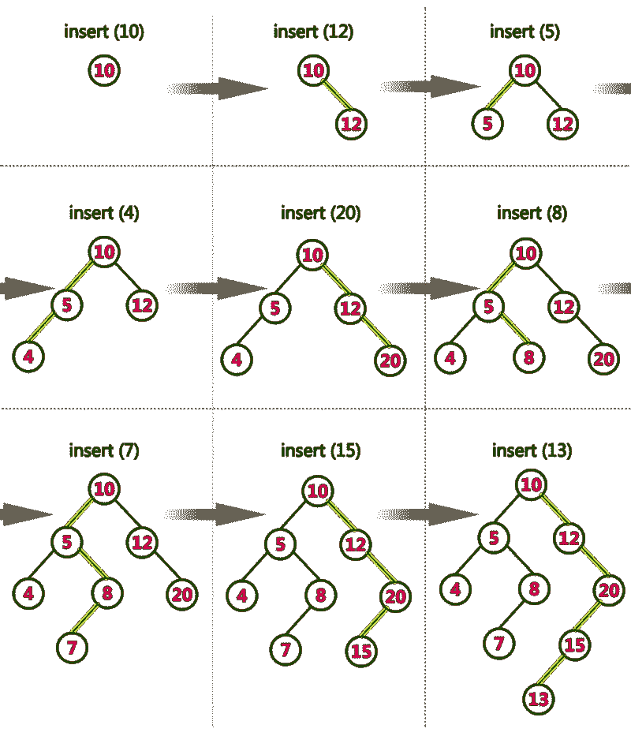
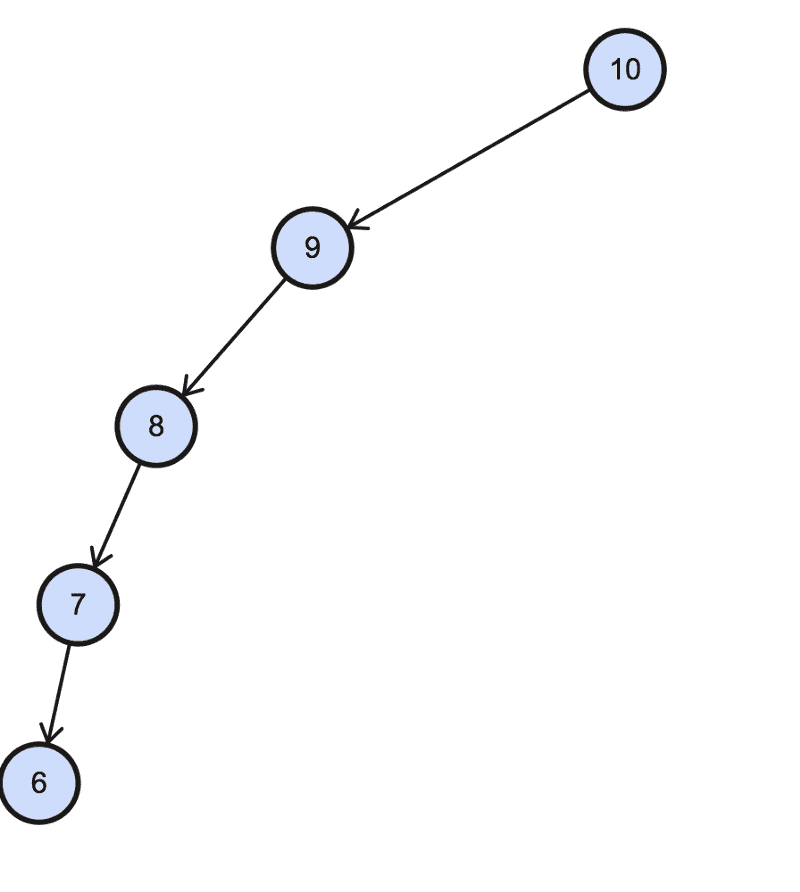
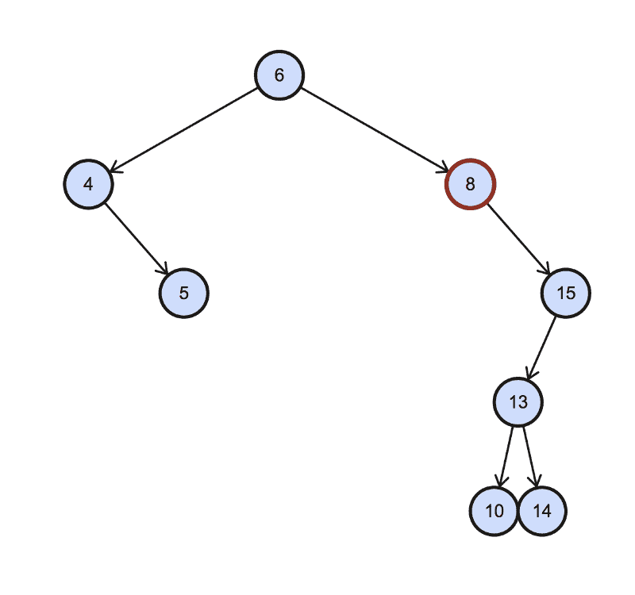
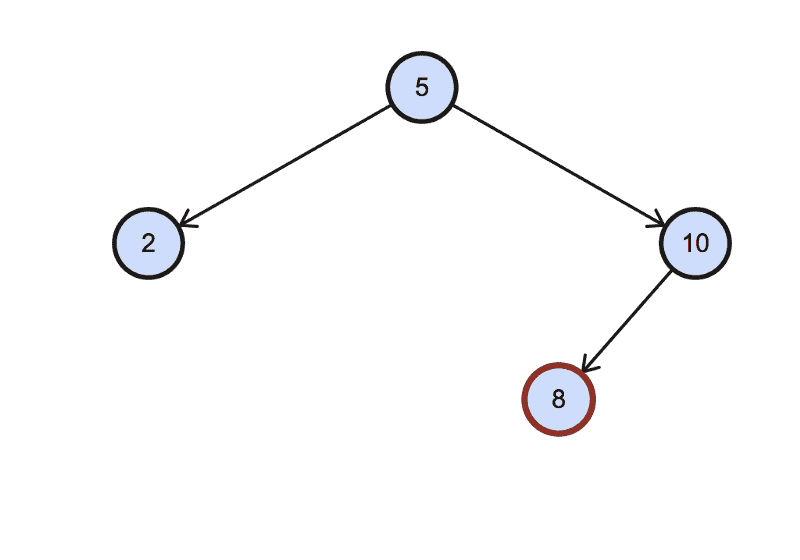
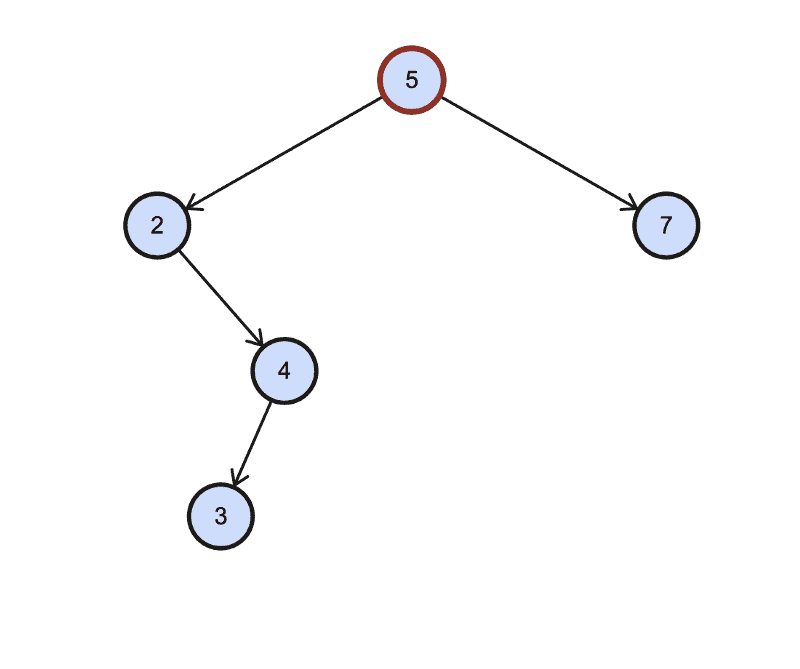
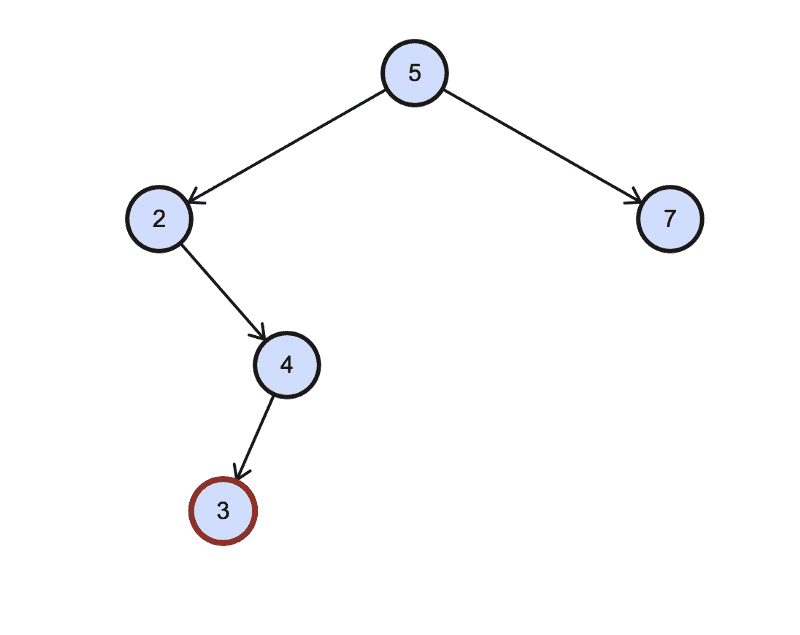

# Tree Traversals 解释说:他们就像一群试图在考试中作弊的懒惰学生

> 原文：<https://www.freecodecamp.org/news/tree-traversals-explained-theyre-like-a-class-of-lazy-students-trying-to-cheat-on-their-exam-b46563211427/>

作者:Sachin Malhotra

# Tree Traversals 解释说:他们就像一群试图在考试中作弊的懒惰学生

[http://blog.noplag.com/wp-content/uploads/2017/01/cheating-on-a-test-clip-art-red-cheating-on-blues-test.png](http://blog.noplag.com/wp-content/uploads/2017/01/cheating-on-a-test-clip-art-red-cheating-on-blues-test.png)

想象一下，你在世界上最负盛名的大学之一上数学课。

你很快就要考试了。显然，你想在考试中表现出色。

这所大学的问题在于它有一群笨拙的教授。所以出轨真的很简单。你可以很容易地模仿坐在后面和前面的人，而不会被抓住。

为了控制这个问题，教授们提出了两个解决方案:

*   一个班的学生人数从来都不是固定的。参加考试的人坐在一个班级里，从一个考试到另一个考试。
*   座位安排在考试前五分钟公布。座位是按字母顺序排列的。但是由于学生从来都不是固定的，可能会随机增加新学生或从班级中删除旧学生，所以必须明确发布安排，让学生知道他们必须坐在哪里。

假设你是一个想作弊的懒惰学生，不顾后果。考前五分钟座位安排出炉，如何最快发现谁坐在前面，谁坐在后面？

不事先和这两个人谈一谈，运筹帷幄，就不会出轨了吧？

### 座位安排

因此，教授们公布了首次以这种方式进行的测试的座位安排。假设它有 N 个学生。如果这些学生在不同的测试中保持不变，那么作弊就很容易了，对吗？因为座位总是按字母顺序排列的。

因此，教授们不断地从一个测试到另一个测试添加或删除学生，并且只在每次测试之前发布这些修改。这样一来，学生们永远无法在考试前确定地知道谁会坐在他们的前面或后面。

让我们从算法的角度来考虑这个问题。我们得到了一个包含 N 个元素的列表，这里的元素是学生的名字。该列表从一个检查到另一个检查不断变化，使得新元素可以被添加到列表中或者现有元素可以从列表中移除。

给定在任意给定时间 T 的修改列表和名称 N，我们需要确定元素 B 和 A，如果要对列表进行排序，那么 B 将紧接在 N 之前，A 将紧接在 N 之后。

现在让我们看看什么样的数据结构对我们是可用的，什么样的数据结构最适合这个问题。

### 哦阵列，我的老朋友，你会帮助我吗？

使用数组似乎是一种相当简单的方法。

*   我们可以简单地把所有的名字放在一个数组中。
*   然后我们按字典顺序对所有的名字进行排序(发布的名字列表可能是随机排列的)
*   然后我们可以通过二分搜索法程序在名单中找到我们的名字。这将为我们提供前任和继任者。

这似乎是解决这个问题的可行方法。然而，眼下的问题是，学生们从一个考试到另一个考试从来都不是一成不变的。所以第一次考试公布的名单会随着新生的加入和老学生的离开而动态变化。

我们可以第一次对列表进行排序，然后继续添加新元素并相应地删除旧元素。

然而，从数组中添加或移除元素的复杂度大约是`O(n)`。由于学生的数量可能非常大，我们不知道在一些新的测试之前会有多少修改，这将花费很多时间，并且在我们能够解决问题之前测试将会开始。记住修改是在测试前五分钟发布的。

那么我们还有什么其他的数据结构可以非常快速地插入和删除呢？

### 嗯，也许链表毕竟是我真正的朋友

就链表而言，在处理这种情况时，它有自己的一套问题。最初，我们需要按字典顺序对元素列表进行排序。因为这是一次性操作，因为它只是为了第一次考试而做的，所以这里所花的时间并不重要。

从下一次考试开始，只发布修改内容。如果我们知道链表中元素的位置，那么从链表中添加或删除元素是一个持续时间的操作。

在链表中寻找一个元素是一个线性时间操作——需要`O(n)`。我知道有像[跳过列表](https://en.wikipedia.org/wiki/Skip_list)这样的概念，但是当我们可以通过使用另一种类型的数据结构以更好的方式解决这个问题时，为什么要钻研这样的东西呢？

### 镇上的新成员二分搜索法·特里斯出场了

让我们看看如何使用二叉查找树(BST)对数据建模。然后，我们将看到 BST 如何帮助我们解决我们最初要解决的问题。

二叉查找树基本上是一棵二叉树，具有特殊的节点排序方式。

**对于键为 *k* 的节点，左子树中的每个键都小于 *k* ，右子树中的每个键都大于 *k* 。**

在我们的例子中，关键字是学生的名字。

请考虑下面的示例，了解二叉查找树是如何构建的。这将使数据结构更加清晰。

[http://btechsmartclass.com/DS/images/BST%20Construction.png](http://btechsmartclass.com/DS/images/BST%20Construction.png)

建造一个二叉查找树是不够的。我们需要确保它是平衡的。我们说二叉查找树需要平衡的原因是，如果它不平衡，那么我们可能会有这样的情况:

A left skewed binary search tree.

这就是所谓的倾斜二叉查找树。如果这样的事情发生了，那么 BST 基本上就变成了一个链表，这对我们没有任何用处。因此，我们有保持 BST 平衡的概念，这样我们就不会遇到这个问题。

不同的方法对平衡的概念有不同的定义，比如红黑树或 AVL 树。对这些树的进一步解释超出了本文的范围。

回到在平衡的 BST 中安排我们的数据:BST 的关键字是学生的名字，词典匹配将用于确定 BST 的结构。

假设有一百万学生参加考试。如果我们的二叉查找树是平衡的，那么执行任何操作的复杂度都是以`O(log(n))`为上限的。**因此，对于 100 万个节点，要扫描的最大节点数将仅为 14。**

仅仅通过以某种方式排列数据，复杂性就大大降低了。这就是在一个**平衡的**二叉查找树中表示数据的好处。

基于数组的方法的主要问题是我们不能有效地从数组中插入或删除元素。链表方法的问题是，我们没有有效的方法在链表中找到一个元素，即使它已经排序了。

对于平衡二叉查找树，插入、删除或搜索一个元素的时间复杂度都受`O(log(n))`限制。这正是这种数据结构非常令人兴奋的地方。

然而，我们仍然没有解决我们最初的问题。给定一个学生的名字，我们想找出坐在他们正前方和正后方的学生。这归结为在给定的二叉查找树中找到**有序的继任者和前任。**

### BST 中的有序遍历和排序顺序

二分搜索法树的一个有趣的特性是，我们可以通过对二叉查找树进行有序遍历来按排序的顺序(甚至相反)检索元素。

因此，节点 X 的有序后继是在给定 BST 上的有序遍历中紧跟在 X 之后的元素。对于我们的作弊问题，这个有序的继任者将是坐在我们前面的学生。

节点 X 的有序前任是在给定 BST 上的有序遍历中紧接在 X 之前的元素(或在**反向**有序遍历中紧接在 X 之后的元素)。对于我们的作弊问题，这个有序的前任将是坐在我们后面的学生。

### BST 中的有序后继者

在 BST 中查找一个节点的有序后继节点时，我们需要处理两种不同的情况。

**第一种情况**是当我们试图寻找其有序后继的节点存在正确的子节点时。考虑下面的例子。

在这里，我们希望找到突出显示的节点 8 的有序后继节点。因为它有一个右子节点，**有序后继节点将是树中最左边的节点，有一个右子节点，或者 15 作为根节点**。所以在这种情况下，节点应该是 10。

**第二种情况**是没有合适的孩子的时候。

在这种情况下，有序继任者有两种可能性:

1.  一种是所考虑的节点是其父节点的左子节点。在这种情况下，有序后继者将是父代本身。所以对于我们给定的例子，有序后继者将是 10。
2.  第二种情况是当前节点是其父节点的右子节点。它没有一个合适的孩子。因此它是 BST 中最右边的节点，并且没有按顺序的后继节点。

对于二叉查找树来说，处理第一种情况相当简单。对于第二种情况，给定节点没有正确的子节点(或任何父指针)，我们将不得不依靠我们良好的 ol '递归机制，进行有序遍历，直到我们找出给定节点的父节点。

因此，如果发生上述情况，最坏情况的复杂度可以是 O(n)。

使用这种算法，我们可以很快找出考试中坐在我们正前方的学生。

### BST 中的有序前身

这与前一种情况正好相反。

同样，在 BST 中查找一个节点的有序前身时，我们需要处理两种不同的情况。看下面的图表，试着把这里提到的两个案例联系起来。

这是节点有一个左子节点的情况。我们需要找到以这个左边的孩子为根的树的最右边的孩子——以 2 为根的树的最右边的节点。

没有留下孩子。所以我们需要找到父母。

如果你仔细观察，我只是颠倒了遍历的顺序，剩下的代码和以前一样。(注意:当我们想要找到有序前趋的节点没有左子节点时，使用这个代码)。

**有序前任成为反向有序继任者。**

好了，现在你知道你应该如何安排班级座位安排表，去做一些实实在在的标记吧？？？。开个玩笑！！作弊是不好的——永远不要作弊！

希望您已经理解了数据结构不同用法背后的主要思想，以及如何在 BST 中找到有序的后继者和前任者。

编辑:感谢 Divya Godayal 指出初稿中的一系列重大错误，并确保文章流畅:)