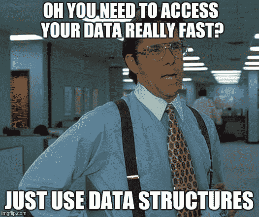
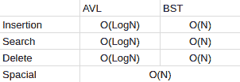
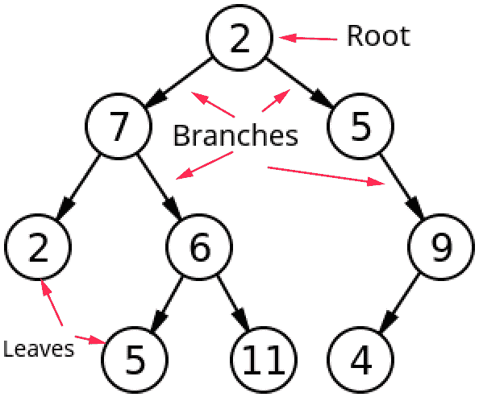
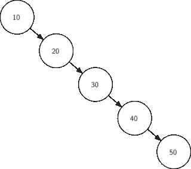
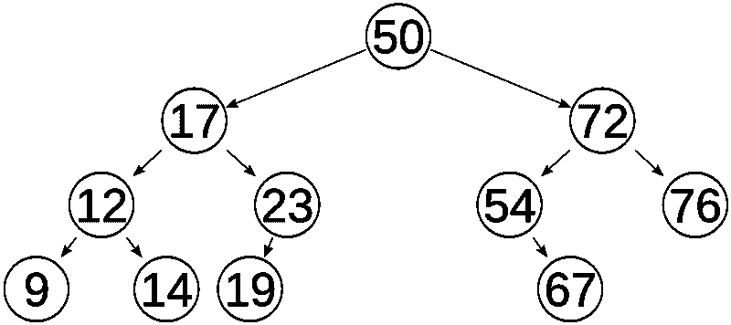
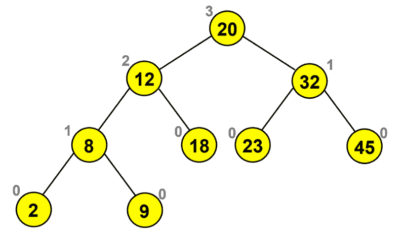
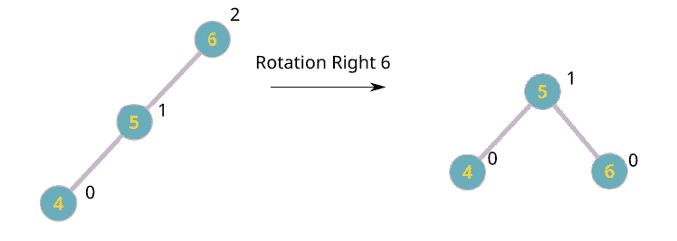
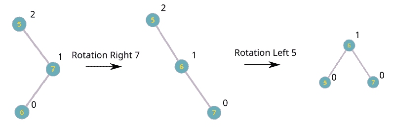

# 编程中的树介绍:高效编码的氧气

> 原文：<https://www.freecodecamp.org/news/trees-in-programming-the-oxygen-of-efficient-code-6c7c11a3dd64/>

由安特卫普

# 编程中的树介绍:高效编码的氧气


很多时候，您希望将信息保存在程序中并多次访问它。你通常会把它存储在一个非常简单的数据结构中:一个数组。而且经常效果真的很好！但是有时候完成需要很长时间。

因此，为了优化这类程序，许多聪明人开发了一些奇怪的东西，我们称之为**数据结构**。今天我将讨论这个主题的一些基础知识，并且我将讨论一个在编码面试中经常被问到并且让每个人都疯狂的特定结构:树。

我不会深入研究代码，只深入研究一切是如何工作的理论。网上有数百万个代码示例，所以在理解了树是如何工作的之后，只需看一看其中一个就可以了！



Yeah… Which one?

### 那么什么是真正的数据结构呢？

根据维基百科:

> “**数据结构**是一种数据组织和存储格式，支持[高效的](https://en.wikipedia.org/wiki/Algorithmic_efficiency)访问和修改”

这基本上意味着它只不过是为创建一种存储数据的复杂方式而编写的代码。您可以实现许多数据结构，每种结构都有特定的任务。它们可以从非常简单的结构(如链表)到非常复杂的结构(如图形)。

树足够复杂，以至于它们做事情的速度非常快，但也足够简单，以至于它们可以被理解。他们真正擅长的一件事是用最少的内存来寻找值。

### 但是如何衡量一个数据结构的效率呢？

你见过网上有人用的 O(n)之类的奇怪符号吗？这就是所谓的大 O 符号，它是评估结构和算法性能的标准方法。我们使用的大 O 是最坏情况的代表:有一个 O(n)的东西(其中 **n** 是里面元素的数量)意味着在最坏的情况下需要时间 **n** ，这真的很好。

在括号内，我们写下了 **n** ，这相当于写下了表达式`y = x →`。它按比例缩放。但有时我们有不同的表达方式:

*   O(1)
*   O(log(n))
*   O(n)
*   O(n)
*   O(n)
*   O(n！)
*   O(e^n)

函数的结果越低，结构越有效。树木有多种类型。我们将讨论具有不同属性的 BST(二分查找树)和 AVL 树(自动平衡树):



As you can see AVL trees are much more efficient, but much more complex!

### 好的，你谈到了所有这些奇怪的符号…那么树是如何工作的呢？

树这个名字来源于它的真实表示法:它有根、叶和枝，通常是这样表示的:



Notice how 6 isn’t a leaf because it is not at the end of a branch!

有几个我们使用的名称，即父母和孩子，它们有着独特的关系。如果 **x** 是 **y** 的父代，那么 **y** 是 **x** 的子代。在此图中，2 是 5 的父级，那么 5 是 2 的子级。每个节点(每个位置都有一个值)只能有 1 个父节点和 2 个子节点。

但是除此之外，没有一种模式可以遵循，所以这棵树并不真正有用…所以我们应该增加一些规则来创建一个好的数据结构。

#### 二分搜索法树

这就是二分搜索树的用武之地！它们不是随机放置子节点，而是遵循特定的顺序:

*   如果没有节点，那么输入的第一个值将成为树的根。
*   如果有节点，那么插入将采取以下步骤:从根开始，如果输入的值小于当前节点，则通过左边的分支，否则通过右边的分支。如果你在一个空旷的地方，那就是你的价值所在！

这在开始时可能会有点混乱，但是让我们写一些伪代码来简化它:

```
//This code won't compile in any language (that I know of) and only serves to demonstrate how the code would look like
```

```
def insert(Node n, int v) {    if n is NULL:        return createNode(v)    else if n.value < v:        n.right = insert(n.right, v)    else:        n.left = insert(n.left, v)    return n}
```

现在这里发生了什么？首先我们检查我们现在所在的地方是否是空的。如果是，我们用函数`createNode`在那个地方创建一个节点。如果它不是空的，那么我们必须看到我们应该在哪里放置我们的节点。

该演示展示了它的工作原理:


Source is: [http://www.mathwarehouse.com/programming/gifs/binary-search-tree.php](http://www.mathwarehouse.com/programming/gifs/binary-search-tree.php)

这样，我们可以在树中搜索任何值，而不必遍历所有节点。太好了！

但它并不总是像上面的 gif 那样顺利。如果我们得到这样的东西呢？



Oops, worst case scenario!

在这种情况下，树的行为使您遍历所有节点。这就是为什么 BST 的最差效率是 O(n ),这使得它很慢。
从 BST 中删除也很容易:

*   如果一个节点没有子节点→删除该节点
*   如果一个节点有一个子节点→将父节点连接到它的孙节点并删除该节点
*   如果一个节点有两个子节点→用该节点替换其最大的子节点(最右边的子节点)→见下图


Remotion of number 12 happens by substitution of 12 by 9

所以现在你知道了你所需要的关于 BST 的一切。很酷吧？

### 但是如果你想总是拥有一棵高效的树呢？你会怎么做？

如果你有这个必要，AVL 树可以很好地为你做到这一点。作为交换，它们比 BST 复杂数百万倍，但遵循和以前一样的组织。

AVL 树是一种自平衡树，具有特定的操作(称为旋转),允许树保持**平衡。**这意味着树中的每个节点在其两个子分支之间将有一个最大值为 1 的**高度差**。

这样，树的高度将总是 log(n) (n 是元素的数量)，这允许您以一种非常有效的方式搜索元素。



There are 11 elements and height is 4\. So that means that the program would make at most 4 searches down! That’s really efficient as each level down hold the double the number of elements of its upper level

所以现在你看到平衡的树有多好了。但如何制造它们才是真正的问题。我之前提到过**深度**这个词，先了解一下。



A leaf has height 0 and a non-leaf node has a height of the max of its children plus 1

高度让我们明白我们的树是否平衡。有了它，我们就能确定问题出在哪里，并应用平衡功能:**旋转**。这些都是非常简单的功能，包括互相交换节点，以消除高度差异，但它们可能乍一看真的很奇怪。

有 4 个操作:

*   向左旋转
*   向右旋转
*   左右旋转
*   从右向左旋转



The node where the children’s height was bigger than 1 suffers a rotation (imagine a blank place with a height of -1, if you calculate it: balance(6) = 1 - -1 = 2)

### 哇，太奇怪了…旋转是如何工作的？

旋转一开始很奇怪，我建议看一些它们工作的动画。

在这个网站上试试你自己的树:[https://www.cs.usfca.edu/~galles/visualization/AVLtree.html](https://www.cs.usfca.edu/~galles/visualization/AVLtree.html)

它可以让你动态地看到旋转发生，是一个伟大的工具！只有四种情况，所以理解它们会很容易。



Rotation Right-Left. It’s nothing more than 2 basic rotations!

### 暂时就这样吧！

树很容易理解，通过练习，你可以很容易地使用它们。在你的代码中应用它们是让你的程序更加高效的关键。

如果您有任何不理解、不同意或想要建议的问题，请随时通过 [Twitter](https://twitter.com/tm_antunes) 或电子邮件联系我！

电子邮件:tiago.melo.antunes [at]技术人员 ulis SBA[dot]pt