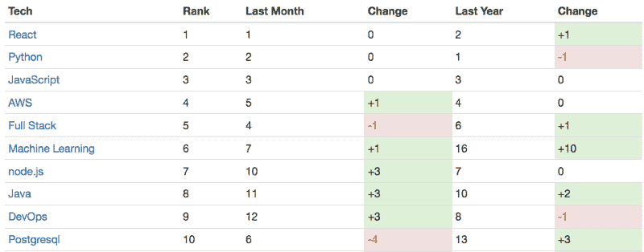
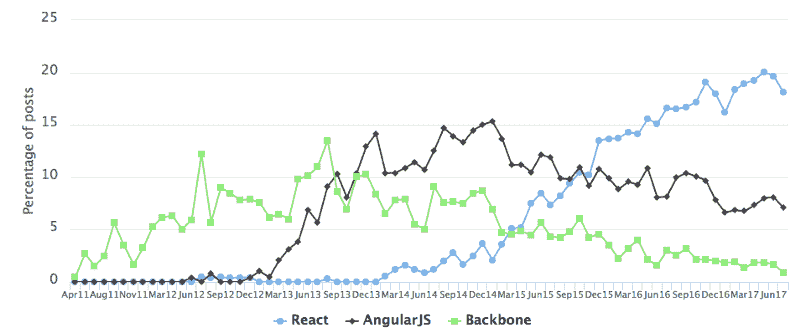
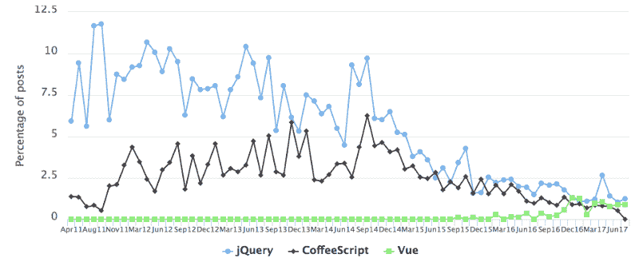
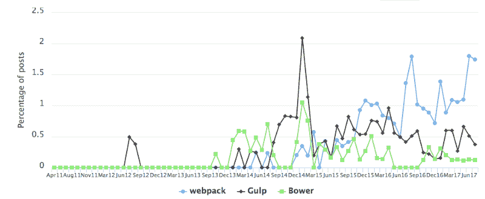
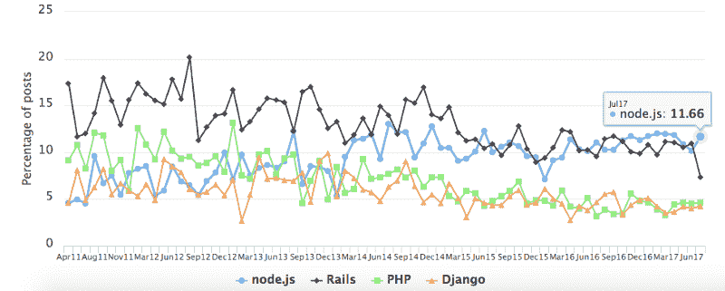
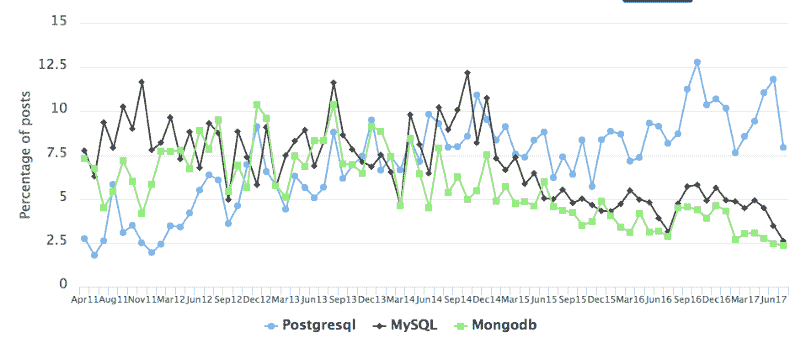
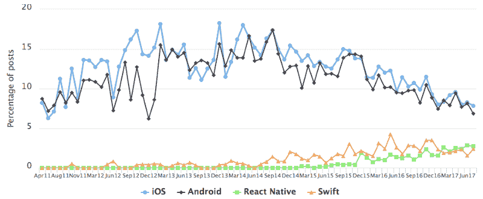
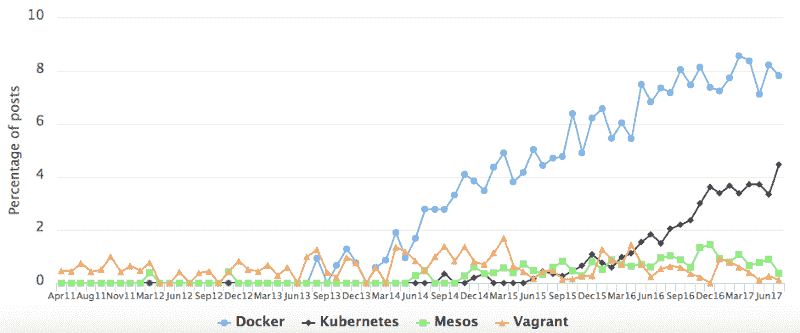
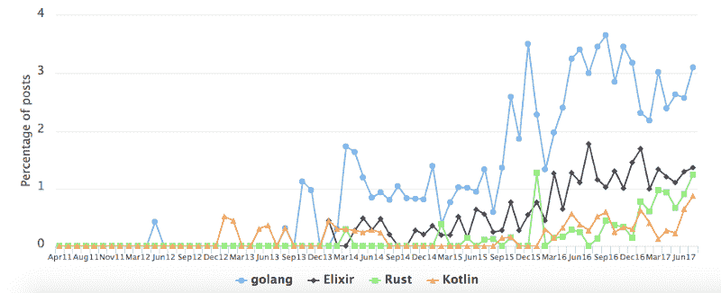
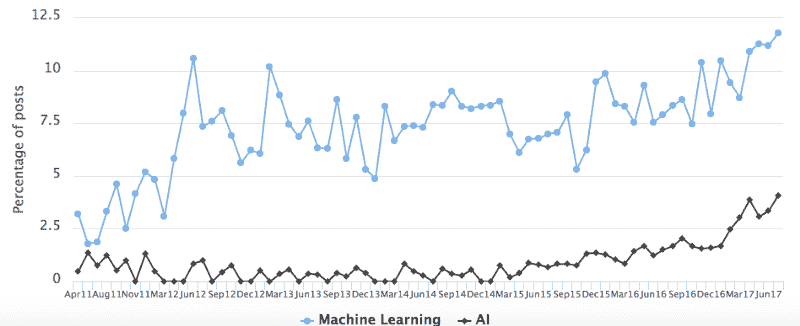

# 趋势开发者技能，基于我对“问 HN:谁在招聘？”

> 原文：<https://www.freecodecamp.org/news/trending-developer-skills-based-on-my-analysis-of-ask-hn-whos-hiring-26c02a3ca1fd/>

作者:瑞恩·威廉姆斯

# 趋势开发者技能，基于我对“问 HN:谁在招聘？”

HN Hiring Trends Top 10 (July 2017)

对于学习编码的人和有经验的软件开发人员来说，变化是持续的。总是有新的东西要学。这包括编程语言、web 框架、DevOps 自动化、移动设备、前端和后端开发、SQL 和 NoSQL 数据库等等。

我已经发展了 18 年。就在我写这篇文章的时候，我正在学习自然语言处理、工程管理、Elixir、Docker 等等。它永远不会结束。

但是话说回来，这可能是你最初对编码感兴趣的事情之一。正是那最初的“你好世界”的匆忙让你同时感到有创造力和强大。当我们与新技术合作时，一次又一次地感受到这一点是令人兴奋的。

作为一个自学成才、热爱学习新技术的 web 开发人员，软件开发的这一方面一直让我着迷。

几年前，我开始对识别新兴技术和预测它们感到好奇。所以我创造了[黑客新闻招聘趋势](https://www.hntrends.com/)，简称 HN 招聘趋势。[黑客新闻](https://news.ycombinator.com/)是最受程序员欢迎的论坛之一。它也是发现新技术的最佳地点之一。每个月《黑客新闻》都会主办一个名为“问 HN:谁在招聘？”用户也可以在这个帖子上发布他们公司的工作机会。

事实上，这些工作机会每月公布一次，而且大多数来自初创企业(新技术通常是在初创企业中创造或使用的)，这使得这成为收集数据的理想环境。可用于发现趋势的数据。

虽然已经有跟踪编程语言趋势的项目，如 TIOBE 的编程语言指数和 T2 的编程语言排名，但是还缺少一些东西。焦点完全集中在编程语言上。如今，创建软件涉及的内容如此之多，编程语言只是众多选择之一。[谷歌趋势](https://trends.google.com/trends/?hl=en)是另一个灵感来源。但它的范围是整个互联网。同样，HN 的帖子每个月都会呈现一个集中的数据集。

现在，让我们深入了解最新的趋势。

#### React 的快速崛起

July 2017 top 5 terms

目前是一个反应激烈的世界。它声称在 2017 年 6 月和 7 月的排名中都名列前茅。React 是一个由脸书创建的流行的 JavaScript 库，可能不需要向 freeCodeCamp 社区介绍，它在四年前才开源。它已经爬到了图表的顶端。虽然这是过去几个月中最引人注目的，但这也是一个已经明显存在了一段时间的趋势。2016 年 6 月，React 排名第二，而且越来越火。它在 2016 年 11 月首次排名第一。

#### 一个 JavaScript 开发者的困境

JavaScript developers embracing change

React 上升的速度令人着迷。这也说明了 JavaScript 社区的大趋势。JavaScript 开发人员比软件开发中其他领域的开发人员更乐于接受变化。当我们开始追踪数据时，AngularJS 的采用在图表上飞速上升，前所未有。但是 AngularJS 没能保持它的速度。在过去的三年里，它一直在下降。同样没落的还有曾经炙手可热的 JavaScript 框架和库。这也包括 [Backbone.js](http://backbonejs.org/) 、 [jQuery、](https://jquery.com/)和 [CoffeeScript](http://coffeescript.org/) 。CoffeeScript 在 2017 年 7 月的帖子中完全消失了。

Goodbye CoffeeScript, hello Vue.js?

历史对 JavaScript 框架和库并不友好。但是哪里有不断的变化，哪里就有开发者的机会。我们看到，相对较新的公司 [Vue.js](https://vuejs.org/) 继续保持这一势头，开始在排行榜上攀升。

此外，随着前端开发变得更加专业和复杂，出现了一套全新的工具来将现代 JavaScript 应用程序的不同部分粘合在一起。这些出现在潮流中的例子有 [webpack](https://webpack.github.io/) 、 [Gulp](https://gulpjs.com/) 和 [Bower](https://bower.io/) 。

#### 服务器端之战

Latest trends for server-side frameworks

虽然 JavaScript 社区提供了最多的亮点，但许多其他趋势也值得关注。在服务器端的竞争中， [Node.js](https://nodejs.org/) 和 [Ruby on Rails](http://rubyonrails.org/) 已经竞争多年。他们的来回竞争很激烈。2017 年 7 月，我们看到 Node.js 取得了重大胜利，而 Rails 在 2017 年 6 月表现强劲。所以这一次离结束还远着呢。

#### PostgreSQL 显然是数据库的赢家

Latest trends of database systems

选择一种数据库技术是最安全的选择。有很多成熟的选择。数据库，尤其是像 MySQL 和 T2 这样的关系数据库已经存在很久了。它们通常比应用程序中的其他层更持久。尽管如此，PostgreSQL 显然是这些排名中的赢家。它现在不仅统治了 MySQL，而且还击败了 [MongoDB](https://www.mongodb.com/) 。以同样的差距。令我惊讶的是，Heroku 推出了以 PostgreSQL 作为主要数据库引擎的 PaaS。

说到 MongoDB，它的受欢迎程度似乎屈指可数。我怀疑 PostgreSQL 是否从 NoSQL 革命中拯救了关系数据库。还是因为开发者回到了更安全的选择，这个概念已经燃尽了？

#### 手机的演变

Native to hybrid mobile development

就在不久前，确切地说是 2016 年 11 月[日，iOS 成为十大招聘术语之一。一直在前 20 名中，iOS 和 Android 仍然是招聘经理寻找的重要开发技能。但是，在](https://www.hntrends.com/2016/november.html) [React Native](https://facebook.github.io/react-native/) 的带领下，出现了从原生移动开发到混合开发的强烈转变。最近几个月，React Native 已经超过了本地 iOS 开发的主要编程语言 [Swift](https://www.swift.com/) 。

#### DevOps 中的容器采用

DevOps 是近年来另一个热门领域。这也是招聘广告中排名前十的术语，集装箱推动了这一增长。说到集装箱，大多数人会想到码头工人 T1，它正在迅速崛起，接近前 10 名。但是，也有 [Kubernetes](https://kubernetes.io/) 。已经出了两年，已经逼近前 20 了。随着容器的兴起，管理配置和部署变得更加容易，虚拟机受到了冲击。这可以从[流浪者](https://www.vagrantup.com/)作为开发环境工具的人气下降中看出。

#### 框架来来去去，但是语言永远不会消亡

当然，编程语言驱动着我们作为开发人员的大部分工作。但在 2017 年 7 月的前 20 个术语中，只有 5 个是编程语言:

Python (#2)

JavaScript (#3)

Java (#8)

红宝石(#13)

C++ (#20)

但是这些语言从一开始就在图表的顶端。2013 年 6 月发布的第一份报告显示，JavaScript、Python、Java 和 Ruby 位列前十。现在，因为有少数语言仍然在顶部，这并不意味着什么都没有发生。过去几年中引入的几种语言正在加速发展，例如 Go、Elixir、Rust 和 Kotlin。

#### 下一件大事

如果没有人工智能和机器学习，今天的趋势分析会是什么样的？在过去的几年里，我们已经看到大多数大型科技公司开始实施重大的人工智能计划。从无人驾驶汽车到家庭助手，这些应用正在进入我们的生活。但是作为开发者，这意味着什么呢？

让我们来看看。机器学习在 2017 年 7 月排名第六，现在有 12%的帖子提到了它。从趋势来看，你可以看到机器学习和人工智能都经历了显著的上升。这意味着我需要打开一些新标签页。

[黑客新闻雇佣趋势](https://www.hntrends.com/)每月发布。[订阅](http://ryan-williams.us7.list-manage.com/subscribe?u=ad800d1f3e83280d9d18b9b58&id=851bc5c555)，你会收到最新动态。有你认为缺少的语言、框架或库吗？请在下面留言或在推特上留言[。此外，查看](https://twitter.com/ryanwi) [ScoutZen](https://www.scoutzen.com/) 跟踪趋势并分析技术社区。