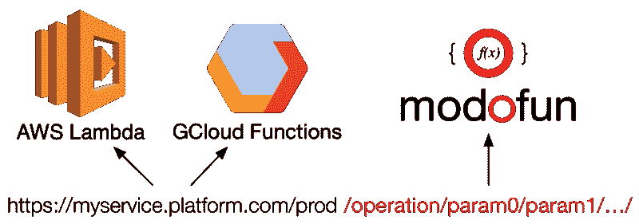
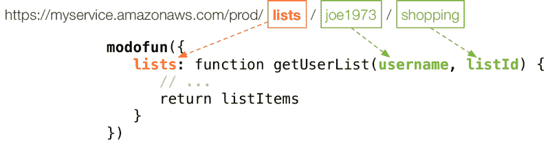

# 无服务器节点:构建下一代微服务的快速、廉价方式

> 原文：<https://www.freecodecamp.org/news/true-er-functional-programming-on-serverless-nodejs-e532079b40d/>

菲利普·塔瓦雷斯

# 无服务器节点:构建下一代微服务的快速、廉价方式


我爱 [Node.js](https://nodejs.org) 。通过它我重新发现了 Javascript，我再也不回去了。

它的轻量级特性、非阻塞特性和快速开发体验在微服务中大放异彩。

我也喜欢[Express](http://expressjs.com)——它让编写服务器应用程序变得如此简单。其基于 [Connect](https://github.com/senchalabs/connect) 的中间件堆栈方法使得扩展应用程序变得简单而有趣。再加上 Docker，前途无量。或者，更好的是，没有服务器。

### 比小更小…


首先，他们给了我们服务器，所以我们建立了面向服务的架构。

然后他们给了我们容器，所以我们建立了微服务。

现在他们给了我们**无服务器事件处理器**，所以我们将构建**函数**。

我们的托管平台已经变得更适合部署更小的单元。我们的应用程序也被分解成更小的软件包。这有很多原因，是否是好事众说纷纭。

但是，如果我们回头看看云计算背后的最初概念，人们曾梦想让代码无限分布在一个由连接的计算节点组成的网络中。随着无服务器平台的出现，我们越来越近了。

另外:它们允许我们无限扩展*，同时只为我们使用的东西付费。*

### *…但不要太小*

*计算步骤(过程)序列需要共享内存来有效执行。我们将它们包装在一个函数定义中，该函数定义了其输入和输出的契约。并且这允许具有其他这种功能的组合。*

*这种方法在 Unix 架构中非常成功，这也是它经久不衰和无处不在的原因之一。我并不是说 Web 应用应该遵循一个类似的基于云的共享生态系统(尽管[一些](https://stdlib.com/)正在尝试)。但是我们可以从构建 Web 应用程序时应用类似的原则中受益。*

*除了函数定义，我们还将密切相关的函数分组到模块中。一个例子是给定域中的数据的 CRUD 操作，比如用户管理。这些往往共享代码，如数据模型、解析逻辑和格式。因此，当我们将单个功能部署到无服务器环境中时，我们最终会得到大量重复的代码。*

*当前的无服务器环境鼓励单一功能部署。但是，当应用于微服务时，会导致难以管理的混乱堆栈。*

**

*但是让我们假设我们不介意重复的代码部署。毕竟，我们可以在我们的代码库中处理它。但是，我们仍然希望共享临时资源，比如数据库连接。我们还希望确保将同一个域的所有操作作为一个单元进行部署和管理。我们最好管理**功能模块**。*

*它非常符合[单一责任原则](http://programmer.97things.oreilly.com/wiki/index.php/The_Single_Responsibility_Principle):*

> *把那些因同一原因而改变的东西集合在一起，把那些因不同原因而改变的东西分开。*

### *走向无服务器*

*所以，Node.js 非常适合微服务。而且对于编写更小的功能模块也很棒。Express 非常适合在 Node.js 中构建 Web 应用程序。*

*然而，大多数无服务器环境已经处理了许多现成的通用 Web 服务器功能。对于这些提供少量功能的**纳米服务**，我们不应该为复杂的网络服务器逻辑的开销而烦恼。我们必须利用 HTTP，因为它是 Web 服务之间无处不在的传输机制。但是我们应该用一种更 [RPC](https://en.wikipedia.org/wiki/Remote_procedure_call) (远程过程调用)的方式来做。*

**

*这是当前大多数框架提供大锤来敲碎坚果的地方。如果有什么不同的话，我认为无服务器让我们从框架中解放出来，转而专注于构建更纯粹的 T2 功能。*

*然而，在纳米服务中需要基本的路由，以将传入的请求映射到适当的处理函数。此外，由于这些商业无服务器环境的专有性质，我们可以建立某种程度的抽象，将我们的功能从执行它们的平台的细节中分离出来。*

*应用于无服务器部署的函数式编程可能会出现在更多的应用程序中。我对此充满希望，因为感觉这是朝着正确方向迈出的一步。我们仍然需要解决许多现实世界中的问题，比如延迟、性能和内存使用。但就像微服务一样，我们将找到一套正确的工具和实践，使其不仅实用，而且在现实世界的应用中具有高性能。*

### *云函数中的模块*

*我编写了一个小的 Node.js 包来满足这些需求。叫做[莫多芬](https://modofun.js.org)。*

**

*它没有额外的依赖性，因为我们希望我们的部署尽可能小。它添加了最少的功能来简化无服务器平台上功能模块的部署。它还允许通过现有的中间件进行扩展，比如身份验证、日志记录等等。以下是它的一些特点:*

*   *功能的基本路由*
*   *参数解析*
*   *自动 HTTP 响应构建*
*   *支持 ES6 承诺(或任何其他当时可能的承诺)*
*   *类似连接/快速的中间件支持*
*   ***谷歌云功能***
*   ***AWS Lambda** (带有 AWS API 网关事件)*
*   *自动错误处理*

*对 Azure 功能的支持即将推出。*

### *使用 Modofun*

*Modofun 使得将函数公开为无服务器云请求处理程序变得很容易:*

**

*简单的路由器将传入的请求映射到功能。它将 URL 路径的尾部组件作为函数参数。其他请求数据也可用作函数调用的上下文( *this* )。*

*我们可以指定将为每个传入请求运行的中间件。或者有选择地将它应用到单独的功能中(更多细节在[文档](https://modofun.js.org/#configuration)中)。Modofun 为无服务器平台生成的事件返回适当的处理程序。*

*用 [npm](https://www.npmjs.com/package/modofun) 得到它:*

```
*`npm install modofun`*
```

*欲了解更多示例和详细文档，请访问[官方网站](https://modofun.js.org)。你也可以在 [GitHub](https://github.com/modofunjs/modofun) 上找到完整的源代码。*