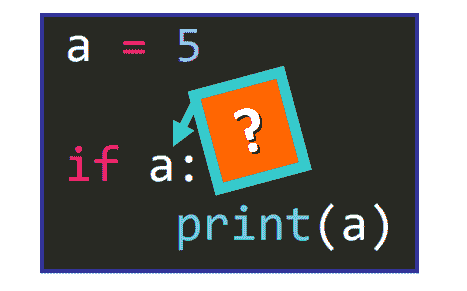
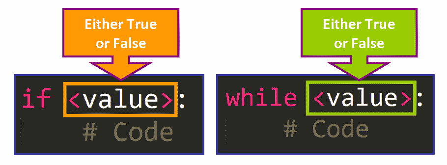
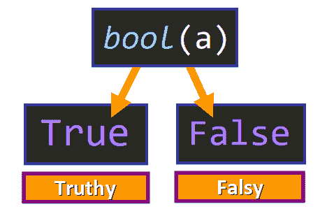

# Python 中的真值和假值:详细介绍

> 原文：<https://www.freecodecamp.org/news/truthy-and-falsy-values-in-python/>

## 欢迎

在本文中，您将了解到:

*   什么是真值和假值。
*   什么使一个价值成为真或假。
*   如何使用`bool()`函数来确定一个值是真还是假。
*   如何使用特殊方法`__bool __`从用户定义的类 truthy 或 falsy 中生成对象。

让我们开始吧！✨

## 🔹真值与真值和伪值

让我通过将它们与我们通常使用的值`True`和`False`进行比较，向您介绍这些概念。

带有操作数和运算符的表达式计算结果为`True`或`False`，它们可用于`if`或`while`条件，以确定代码块是否应该运行。

这里我们有一个例子:

```
# Expression 5 < 3
>>> if 5 < 3:
	print("True")
else:
	print("False")

# Output
False
```

在这个例子中，一切都如我们预期的那样工作，因为我们使用了一个带有两个操作数和一个操作符`5 < 3`的表达式。

但是如果我们尝试运行这段代码，你认为会发生什么？

```
>>> a = 5

>>> if a:
	print(a)
```

注意，现在我们在关键字`if`旁边没有典型的表达式，只有一个变量:



令人惊讶的是，输出是:

```
5
```

如果我们把`a`的值改成零，像这样:

```
>>> a = 0

>>> if a:
	print(a)
```

没有输出。

我相信你现在一定在问这个问题:**是什么让代码成功运行的？**

变量`a`不是一个典型的表达式。它没有操作符和操作数，那么为什么它根据它的值计算为`True`或`False`？

答案在于真值和假值的概念，它们本身不是真值，但它们评估为`True`或`False`。

## 🔸真值和假值

在 Python 中，单个的**值**可以计算为`True`或`False`。它们不一定要成为更大表达式的一部分来计算真值，因为它们已经有一个由 Python 语言的规则确定的真值。

基本规则是:

*   评估为 **`False`** 的值被视为`**Falsy**`。
*   评估为 **`True`** 的值被视为`**Truthy**`。

根据 [Python 文档](https://docs.python.org/3/library/stdtypes.html#truth-value-testing):

> 任何对象都可以测试真值，用于 [`if`](https://docs.python.org/3/reference/compound_stmts.html#if) 或 [`while`](https://docs.python.org/3/reference/compound_stmts.html#while) 条件，或作为下面布尔运算(与、或、非)的操作数。

### 🔹布尔上下文

当我们使用一个值作为一个更大表达式的一部分，或者作为一个`if`或`while`条件时，我们是在一个**布尔上下文**中使用它。

您可以将布尔上下文视为代码的一个特定“部分”，它需要一个值为`True`或`False`才有意义。

例如，(见下文)`if`关键字之后或`while`关键字之后的条件必须评估为`True`或`False`:



💡**提示:**该值可以存储在一个变量中。我们可以在关键字`if`或`while`后面写变量的名字，而不是值本身。这将提供相同的功能。

现在你知道了什么是真值和假值，以及它们在布尔上下文中是如何工作的，让我们看一些真值和假值的真实例子。

### 🔸虚伪的价值观

**序列和集合:**

*   空列表`[]`
*   空元组`()`
*   空字典`{}`
*   空集`set()`
*   空字符串`""`
*   空范围`range(0)`

**数字**

*   任何数值类型的零。
*   整数:`0`
*   浮动:`0.0`
*   复杂:`0j`

**常数**

*   `None`
*   `False`

在我们最初的例子中，当`a`的值为零时，Falsy 值是没有输出的原因。

值`0`为 falsy，因此`if`条件将为`False`，并且该条件将不会在本例中运行:

```
>>> a = 0
>>> if a:
	print(a)

# No Output 
```

### 🔹真实价值

根据 [Python 文档](https://docs.python.org/3/library/stdtypes.html#truth-value-testing):

> 默认情况下，一个对象被认为**真**。

**真值包括:**

*   非空序列或集合(列表、元组、字符串、字典、集合)。
*   非零的数值。
*   `True`

这就是为什么在我们最初的例子中输出了值`a`,因为它的值是 5(真值):

```
>>> a = 5

>>> if a:
	print(a)

 # Output
 5
```

### 🔸内置的 bool()函数

您可以使用内置的`bool()`函数检查一个值是真还是假。

根据 [Python 文档](https://docs.python.org/3/library/functions.html#bool)，这个函数:

> 返回一个布尔值，即`True`或`False`之一。 *x(自变量)*使用标准真值测试程序进行转换。



您只需要将值作为参数传递，就像这样:

```
>>> bool(5)
True
>>> bool(0)
False
>>> bool([])
False
>>> bool({5, 5})
True
>>> bool(-5)
True
>>> bool(0.0)
False
>>> bool(None)
False
>>> bool(1)
True
>>> bool(range(0))
False
>>> bool(set())
False
>>> bool({5, 6, 2, 5})
True
```

💡提示:你也可以传递一个变量作为参数来测试它的值是真还是假。

### 🔹真实的例子

使用 truthy 和 falsy 值的好处之一是，它们可以帮助您使代码更加简洁，可读性更好。这里我们有两个真实的例子。

**示例:**
我们有一个函数`print_even()`，它将包含数字的列表或元组作为参数，只打印偶数的值。如果参数为空，它将打印一条描述性消息:

```
def print_even(data):
	if len(data) > 0:
		for value in data:
			if value % 2 == 0:
				print(value)
 	else:
 		print("The argument cannot be empty")
```

注意这一行:

```
if len(data) > 0:
```

我们可以用真值和假值使条件更简洁:

```
if data:
```

如果列表为空，`data`将计算为`False`。如果不为空，它将评估为`True`。我们用更简洁的代码获得了相同的功能。

这将是我们最后的功能:

```
def print_even(data):
	if data:
		for value in data:
			if value % 2 == 0:
				print(value)
 	else:
 		print("The argument cannot be empty")
```

例如:
当传递给函数的参数无效时，我们也可以使用 truthy 和 falsy 值来引发一个异常(错误)。

```
>>> def print_even(data):

	if not data:
		raise ValueError("The argument data cannot be empty")

	for value in data:
		if value % 2 == 0:
			print(value)
```

在这种情况下，通过使用`not data`作为`if`语句的条件，我们得到了`if`条件的`data`的相反真值。

让我们更详细地分析一下`not data`:

如果`data`为空:

*   这将是一个假值，所以`data`将计算为`False`。
*   `not data`将等同于`not False`，也就是`True`。
*   条件将是`True`。
*   将引发异常。

如果`data`不为空:

*   这将是一个真值，所以它将计算为`True`。
*   `not data`将等同于`not True`，也就是`False`。
*   条件将是`False`。
*   不会引发该异常。

## 🔸使自定义对象具有真值和假值

如果您熟悉类和面向对象编程，您可以向类中添加一个特殊的方法，使您的对象表现得像 are 和 falsy 值。

### __bool __()

使用特殊的方法`__bool__()`，你可以设置一个“定制的”条件，该条件将决定你的类中的一个对象何时将评估为`True`或`False`。

根据 [Python 文档](https://docs.python.org/3/library/stdtypes.html#truth-value-testing):

> 默认情况下，除非对象的类定义了返回`False`的 [`__bool__()`](https://docs.python.org/3/reference/datamodel.html#object.__bool__) 方法或返回零的 [`__len__()`](https://docs.python.org/3/reference/datamodel.html#object.__len__) 方法，否则对象被视为真。

例如，如果我们有这个非常简单的类:

```
>>> class Account:

	def __init__(self, balance):
		self.balance = balance
```

您可以看到没有定义特殊的方法，所以您从这个类中创建的所有对象将总是计算为`True`:

```
>>> account1 = Account(500)
>>> bool(account1)
True
>>> account2 = Account(0)
>>> bool(account2)
True
```

我们可以通过添加特殊方法 [`__bool__()`](https://docs.python.org/3/reference/datamodel.html#object.__bool__) 来定制这种行为:

```
>>> class Account:
	def __init__(self, balance):
		self.balance = balance

	def __bool__(self):
		return self.balance > 0
```

现在，如果帐户余额大于零，对象将评估为`True`。否则，如果帐户余额为零，对象将评估为`False`。

```
>>> account1 = Account(500)
>>> bool(account1)
True
>>> account2 = Account(0)
>>> bool(account2)
False
```

💡**提示:**如果`[__bool__()](https://docs.python.org/3/reference/datamodel.html#object.__bool__)`没有在类中定义，但是`__len__()`方法定义了，这个方法返回的值将决定对象是真还是假。

## 🔹概括起来

*   真值是在布尔上下文中评估为`True`的值。
*   假值是在布尔上下文中评估为`False`的值。
*   Falsy 值包括空序列(列表、元组、字符串、字典、集合)、每个数字类型中的零、`None`和`False`。
*   真值包括非空序列、数字(除了每个数字类型中的`0`),以及基本上每个不为假的值。
*   它们可以用来使你的代码更加简洁。

我真的希望你喜欢我的文章，并觉得它很有帮助。现在您可以在 Python 项目中使用 truthy 和 falsy 值了。[查看我的在线课程](https://www.udemy.com/user/estefania-cn/)。在[推特](https://twitter.com/EstefaniaCassN)上关注我。⭐️