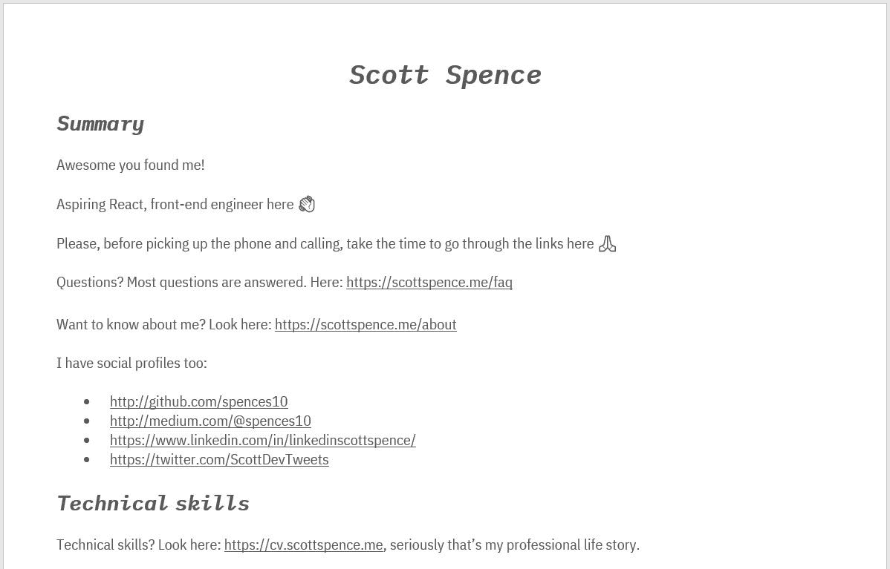

# 将求职变成一个开发项目

> 原文：<https://www.freecodecamp.org/news/turning-a-job-hunt-into-a-dev-project-2018/>

## cliffs/TL；速度三角形定位法(dead reckoning)

我在我的个人网站上为招聘人员制作了一个招聘人员常见问题集，并创建了一个 T2 在线简历。

## 序文

如果这篇文章给人的感觉是有权有势或言辞激烈，我先道歉，我敢肯定很多人会不同意我的做法。

我会尽我最大的努力不要在这里变得太愤世嫉俗，所以，首先让我们从这里开始。我觉得技术招聘的状态非常不好！已经有很长一段时间了(至少从 2010 年开始)。

让我们称之为求职/人才寻找疲劳，因为我们作为开发人员在其他领域也有疲劳，然而这不是我们自己造成的。

开始找工作，把你的简历放在那里，会有很多电话打来，简历上最不相关的关键词会给你带来不必要的电话，这些电话有时看起来像是绝望的招聘者。

急需招聘职位:团队领导，6 年以上工作经验-立即开始，每天 900 英镑，3 个月合同。

好吧，这话有点刺耳！这是事实，露丝！这一切现在听起来也有点老套。

作为一名开发人员，我开始注意到我接到的每个电话的模式，同样的问题被一遍又一遍地问。同样作为一名开发人员，我想保持事情[干燥](https://en.wikipedia.org/wiki/Don%27t_repeat_yourself)以节省我自己(和招聘人员)的一点时间。

为此，我决定在我的个人文件夹中添加一个 [FAQ](https://scottspence.me/faq) 部分，这是我之前在许多电话中被问到的所有问题的列表，因此，与其让招聘人员让我在电话中呆十分钟只是为了证明我有资格担任这个角色，他们可以用提供的 [FAQ](https://scottspence.me/faq) 做*的大部分*工作，几乎就像一个反向的工作规范，他们所要做的就是阅读 [FAQ](https://scottspence.me/faq) ！然后从我已经提供的清单中检查出我想要的和需要的。

出于某种原因，很多招聘人员会坚持找我谈话，占用我一天的时间，然后他们会问其他招聘人员会问的同样的问题。这将使我觉得他们是不重视我的时间的人，他们会失去对我的信任。

所以，我做了一个网站，一个作品集，列出了你想知道的关于我的一切。我添加了 About，它涵盖了我的背景和编码历史，我是如何进入它的，以及我现在在哪里。还有一个 Now 部分和一个 Uses 部分。它们是我现在正在做的事情，在我的生活和我使用的东西，像代码编辑器和硬件。

作品集的页面都是由盖茨比生成的 markdown，所以当有人问了一个不在清单上的问题时，我可以很快地添加上去。使用 Netlify 使这变得更加简单，因为这是一个 Git 推送，更改将在几分钟内生效，

创建一个网站，这更适合未来的雇主，而不是招聘人员，虽然大多数招聘人员会和你交谈，好像他们正在考虑你的角色，但这只是一个漫长过程的第一步。

所以，让我们暂时忘掉招聘人员，集中精力在你找工作时需要拿出的一件主要东西上，那就是你的简历。

做了一个简历后，我努力用我最喜欢的技术栈**做了一个基本的网站。** 我使用 [JSONresume](https://jsonresume.org/) 工具详细描述了我担任的所有角色，然后使用 JSONresume 作为我应该如何为 [CV](https://cv.scottspence.me/) 制作各个组件的指南。

如果你想开始你自己的 JSON 简历，你可以运行 npm 命令`npx resume-cli init`来启动你自己的。

请随意使用我的简历作为你自己的模板，你所需要做的就是生成你的简历并把它推送到 now.sh。

这是我完整的就业历史，而且相当长，当我在一个新的领域找工作时，绝大多数都与我的求职无关，这就是为什么我决定不到处公布我的简历，而是张贴招聘人员打电话给我时总是问我的问题的答案列表。因此，与其让他们在我几乎不相关的工作经历中爬行，不如让他们得到他们想要回答的问题的答案。T2 的简历就在那里，如果他们想要更多关于我的细节，他们所要做的就是阅读！

在我看来,[个人作品集](https://scottspence.me)和[简历](https://cv.scottspence.me/)网站很好地表明了我目前的造型技能水平和喜欢的发型，实际上只要好看就没人在乎，招聘人员更不在乎，因为它没有回答他们想问的问题。

尽管这不是梦的领域！那么，我如何让招聘人员访问我的页面呢？我没有用 MS Word 格式的简历来发布到我能找到的每一个工作网站上，而是在 MS Word 文档上有一个我的 [FAQ](https://scottspence.me/faq) 的链接！？

在 MS Word 文档中，我会在文档底部列出招聘人员会搜索的所有搜索术语，JavaScript、React、HTML、CSS 等等。最上面是一句问候:

这是一个友好的问候，不同于那些重复的问候。

我用谷歌分析的 [FAQ](https://scottspence.me/faq) 和 [CV](https://cv.scottspence.me/) 来看他们得到了多少流量， [FAQ](https://scottspence.me/faq) 比 [CV](https://cv.scottspence.me/) 多得多，因此，我可以从中收集到，招聘人员不必拿起电话就可以得到他们问题的答案。赢赢，对吧？

然而统计数据并不是很好，只有大约 3 秒的反弹率？你可以看到，绝大多数招聘人员宁愿拿起电话，也不愿阅读提供的信息。

> 你可以在我的博客上阅读其他类似的文章。