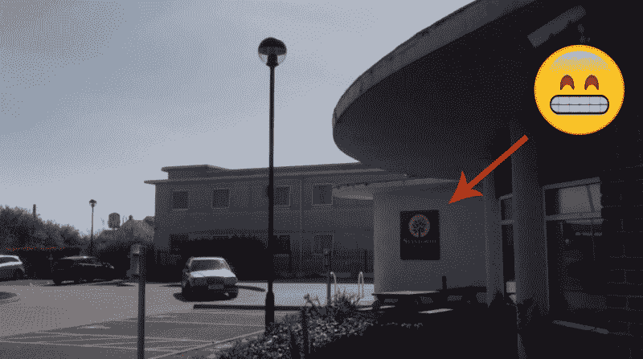
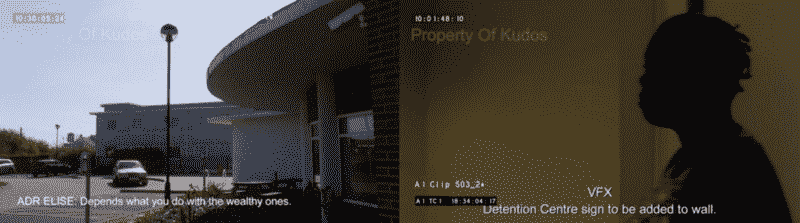
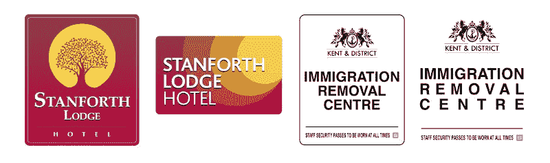
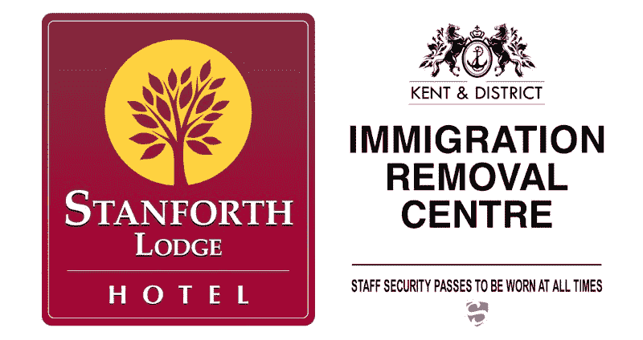
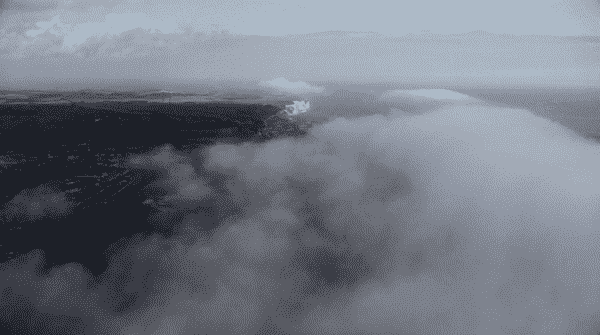
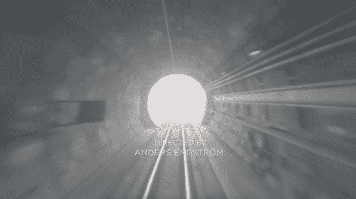

# 两天的工作换来了 11 秒钟的电视

> 原文：<https://www.freecodecamp.org/news/two-days-of-work-for-11-seconds-of-tv-238a3b25aa62/>

詹姆斯·巴纳德

# 两天的工作换来了 11 秒钟的电视

眨眼之间你就会错过它:一个两天的设计项目是如何在一瞬间过去的

我最近完成了天空大西洋系列*隧道*的一个短片项目，“一部英法犯罪剧”。随着《T2》第三季《复仇》即将上映，托比·韦尔奇(该剧的朋友兼制片人)找到了我。他需要帮助来填补后期制作中的一些空白

通常(至少在英国)，如果一个品牌被用在一个电视节目上，那么制造商已经获得了使用它的明确许可。我曾经遇到过一个平面设计师，他在一个知名的 ITV 肥皂剧中工作。他们的工作是为酒吧后面的所有烈酒制作假的饮料标签，因为使用真的标签会引起法律纠纷。

因此，当我们拍摄主角开车去酒店并在外面停车的外景时，我们不能显示酒店的真实名称。我们必须想出一个假的。拍摄节目时，为一面墙或一栋建筑的侧面制作真正的标志并不总是实用、及时或划算的。稍后在 post 中添加数字内容通常更便宜。

### 案情摘要

托比需要两个 VFX 团队的标志来叠加在两个不同的场景上。第一张是我们的主角开车去酒店并在外面停车的外景。他需要一个相当预算的标志，他会提供一个预先批准的酒店名称(由法律签署)。

Fill in the blanks. The spaces on the walls for post-production signage.

第二个是一个名为“*肯特&区移民遣返中心”的虚假机构。*这需要是一个简单的黑白风格，感觉像“政府”，并附有一个私人保安公司的徽章。这将被添加到女演员走过的内墙上。我得到了未经编辑的电影剪辑，并被要求提出一些选择。

这是一份非常酷的简报，结果比我原先想的要多。

### 研究

任何品牌项目的第一部分都是研究。对于酒店品牌，我试图找到一种调色板，这是许多路边酒店的融合，这些酒店在英国非常便宜。想喊‘预算’的品牌，往往是橙色的。然而，酒店通常试图用类似蓝色渐变的东西来伪装他们的奢华。

不想让自己听起来像一个自命不凡的、有创造力的工业工人，让设计看起来不太好是非常棘手的。你想提交给客户的东西说…

> “说实话，我是个好设计师！”

…但你不能，因为任何过于时尚或高档的东西在场景中都不太可信！

政府标志更容易一些。最困难的部分是选择一种写着“政府”的字体，而不实际使用 Gov.uk 网站上的字体，这是不允许的(我检查过了)。托比想出了一个像锚一样使用航海标志的主意，我查阅了肯特的徽章，那是一匹直立的马。

### 草案初稿

初稿完成后，我提交了一些选项…

V1.

…高管们对此反应相当积极。下一轮修正将(过于复杂的)树调整得更大胆一些。标志和相机之间的差距是一个因素，所以酒店的标志需要从远处突出。对任何品牌项目的好建议。

移民标志得到了认可，但蓝色的安全标志比我意识到的要重要得多。这需要做更多的工作，在对安全公司徽标进行另一轮研究后，我们最终选定了这些徽标:

The final versions submitted to the VFX team.

### 最后的场景

事实证明，白墙的场景对 VFX 的人来说太难跟踪了，所以他们最终在最后的场景中做了一个简单得多的改编。屏幕上有一片白色，没有参照系来跟踪相机的运动，团队在一块金属板上模拟了一个较短的版本。谢天谢地，我的公司安全标志保留了下来。

Stanforth Lodge Hotel: **Courtesy of Sky Atlantic**

*Immigration Removal Centre. Blink and you’ll miss it*: ***Courtesy of Sky Atlantic***

我觉得整个经历很迷人。来回花了两天时间，加上天知道 VFX 做了多少工作，才制作出出现在屏幕上总共不到 11 秒钟的标志。只是为了更好地讲述这个故事。

我认为这太棒了，我无法想象创作这样一部完整的电视剧会是一个多么复杂的过程。向托比和团队致敬。但愿我能得到更多这样的工作。电视和电影平面设计。这是一份理想的工作。