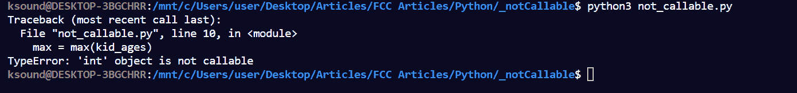
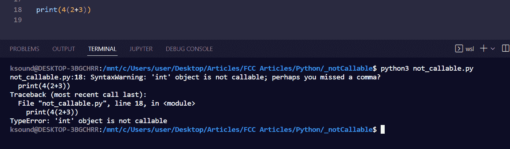

# 类型错误:int 对象不可调用–如何在 Python 中修复

> 原文：<https://www.freecodecamp.org/news/typeerror-int-object-is-not-callable-how-to-fix-in-python/>

在 Python 中，当在一个操作中使用不同的数据类型时，会出现“类型错误”。

例如，如果您试图将一个整数(数字)除以一个字符串，这会导致一个`typeerror`，因为整数数据类型与字符串不同。

其中一个类型错误是“int object is not callable”错误。

当你声明一个变量并用一个内置的函数名如`int()`、`sum()`、`max()`等来命名它时，就会出现“int object is not callable”错误。

当您在执行数学运算时没有指定算术运算符时，也会出现该错误。

在本文中，我将向您展示错误是如何发生的，以及您可以做些什么来修复它。

## 如何修复内置函数名中的 `Typeerror: int object is not callable`

如果你使用一个内置的函数名作为变量，并调用它作为一个函数，你会得到“int 对象是不可调用的”错误。

例如，下面的代码试图用 Python 的内置函数`sum()`计算一些孩子的总年龄。代码导致了一个错误，因为同一个`sum`已经被用作变量名:

```
kid_ages = [2, 7, 5, 6, 3]

sum = 0
sum = sum(kid_ages)
print(sum) 
```

下面的另一个例子展示了我如何试图用`max()`函数获取这些孩子中最大的孩子，但是我已经声明了一个`max`变量:

```
kid_ages = [2, 7, 5, 6, 3]

max = 0
max = max(kid_ages)
print(max) 
```

这两个代码示例都导致了终端中的错误:


要解决此问题，您需要更改作为内置函数命名的变量的名称，以便代码可以成功运行:

```
kid_ages = [2, 7, 5, 6, 3]

sum_of_ages = 0
sum = sum(kid_ages)
print(sum)

# Output: 23 
```

```
kid_ages = [2, 7, 5, 6, 3]

max_of_ages = 0
max = max(kid_ages)
print(max)

# Output: 7 
```

如果您去掉自定义变量，您的代码仍将按预期运行:

```
kid_ages = [2, 7, 5, 6, 3]

sum = sum(kid_ages)
print(sum)

# Output: 23 
```

```
kid_ages = [2, 7, 5, 6, 3]

max = max(kid_ages)
print(max)

# Output: 7 
```

## 数学计算中如何修正`Typeerror: int object is not callable`

在数学中，如果你做类似 4(2+3)的运算，你会得到正确的答案是 20。但是在 Python 中，这会导致`Typeerror: int object is not callable`错误。


要修复这个错误，您需要让 Python 知道您想要将括号外的数字与括号内的数字之和相乘。

为此，您可以在左括号前指定一个乘法符号(*):

```
print(4*(2+3))

#Output: 20 
```

Python 允许您在左括号前指定任何算术符号。

因此，您也可以在那里执行其他计算:

```
print(4+(2+3))

# Output: 9 
```

```
print(4-(2+3))

# Output: -1 
```

```
print(4/(2+3))

# Output: 0.8 
```

## 最后的想法

`Typeerror: int object is not callable`是 Python 初学者的一个错误，你可以用一种简单的方法避免。

如本文所示，通过不使用内置函数名作为变量标识符，并在必要的地方指定算术符号，可以避免这个错误。

感谢您的阅读。