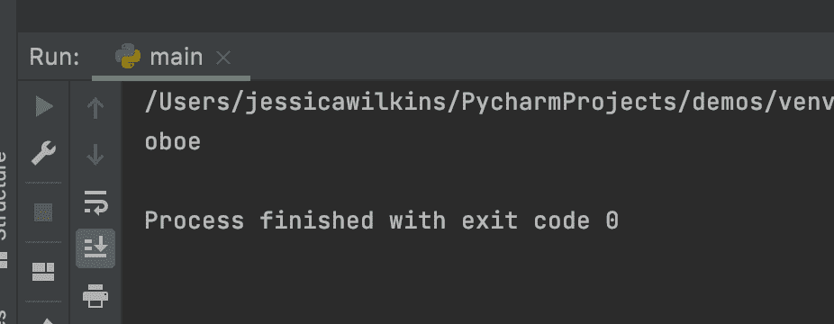
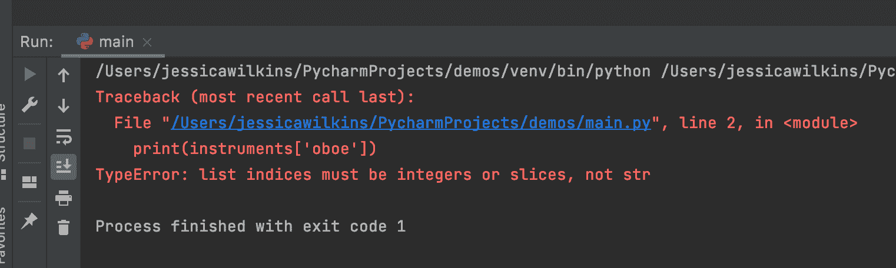
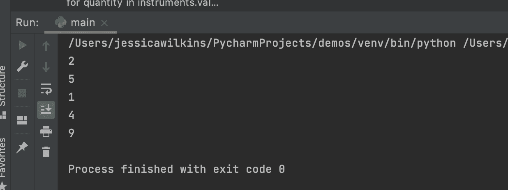
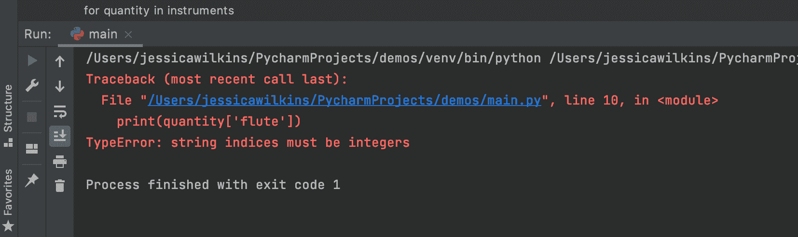
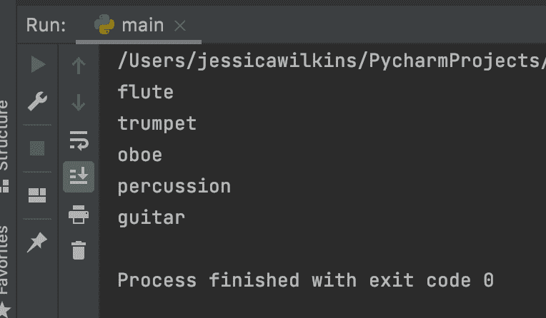
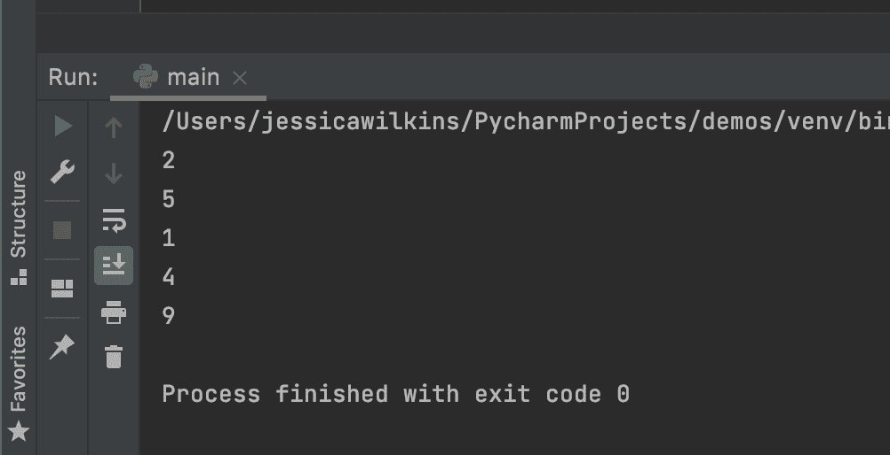

# TypeError 字符串索引必须是整数 Python 错误[已解决]

> 原文：<https://www.freecodecamp.org/news/typeerror-string-indices-must-be-integers-javascript-error-solved/>

如果您尝试使用字符串值而不是整数值来访问字典或 iterable 对象中的值，则会收到以下错误消息:

```
TypeError: string indices must be integers
```

在本文中，我将向您展示为什么您可能会收到此错误消息以及如何修复它的示例。

## 如何在 Python 中访问列表中的值

在本例中，我们有以下乐器列表:

```
instruments = ['flute', 'trumpet', 'oboe', 'percussion', 'guitar']
```

如果我们想要访问列表中的第三个仪器，我们将使用数字索引值 2:

```
instruments[2]
```

以下代码行将正确地打印出`oboe`的结果:

```
instruments = ['flute', 'trumpet', 'oboe', 'percussion', 'guitar']
print(instruments[2])
```



如果我试图访问同一个列表，但却使用了字符串索引`'oboe'`，那么就会产生一条错误消息:

```
instruments = ['flute', 'trumpet', 'oboe', 'percussion', 'guitar']
print(instruments['oboe'])
```



如果遇到此错误消息，请仔细检查以确保使用数字索引值而不是字符串值来访问元素。

## 如何用 Python 访问字典中的值

让我们修改前面的例子来创建一个工具和数量的字典。

```
instruments = {
    'flute': 2,
    'trumpet': 5,
    'oboe': 1,
    'percussion': 4,
    'guitar': 9
}
```

如果我们想打印出我们的`instruments`字典中的所有值，那么我们可以使用一个带有`.values()`方法的循环。

```
for quantity in instruments.values():
    print(quantity)
```



如果我们删除了`.values()`方法，并试图使用字符串索引来访问这些值，那么我们将会收到以下错误消息:

```
for quantity in instruments:
    print(quantity['flute'])
    print(quantity['trumpet'])
    print(quantity['oboe'])
    print(quantity['percussion'])
    print(quantity['guitar'])
```



如果你打印出`quantity`，那么你会看到它是一个字符串。

```
for quantity in instruments:
    print(quantity)
```



如果你试图写`quantity['flute']`，那么它会被翻译成`'flute'['flute']`，这在 Python 中是没有意义的。

解决这个问题的方法是引用我们的`instruments`字典，而不是使用`quantity`。

以下重构代码将产生正确的结果:

```
instruments = {
    'flute': 2,
    'trumpet': 5,
    'oboe': 1,
    'percussion': 4,
    'guitar': 9
}

print(instruments['flute'])
print(instruments['trumpet'])
print(instruments['oboe'])
print(instruments['percussion'])
print(instruments['guitar'])
```



我希望您喜欢这篇文章，并祝您的 Python 之旅好运。