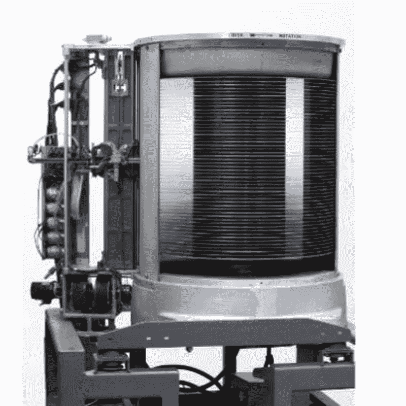

# 硬盘类型–SATA、PATA、SCSI 和 SSD

> 原文：<https://www.freecodecamp.org/news/types-of-hard-drives-sata-pata-scsi-and-more-2/>

硬盘是计算机上的非易失性硬件组件，用作所有数字内容的存储。它保存程序文件、文档、图片、视频、音乐等等。

硬盘的非易失性意味着即使断电，它们也不会丢失数据。因此，它们可以帮助计算机长期存储文件和其他数据——只要它们不被损坏或破坏。

自 1956 年 IBM 首次发布硬盘以来，硬盘已经从冰箱大小、存储容量仅为 5MB 发展到口袋大小、存储容量高达 4 TB。

在这篇文章中，我将涵盖不同类型的硬盘驱动器，以便您可以选择最适合您的计算机。

The first hard drive

## 硬盘类型

目前，硬盘分为 4 种主要类型:

*   平行高级技术附件(PATA)
*   串行高级技术附件(SATA)
*   小型计算机系统接口
*   固态硬盘(SSD)

这些名称来自它们连接到计算机的方式。在这篇文章中，我将尽可能简明地阐述每一种硬盘。

### 平行高级技术附件(PATA)

1986 年，康柏公司和西部数据公司首次将 PATA 硬盘推向市场。它们的容量高达 80GB，数据传输速度高达 133 MB/S。

它们被命名为并行高级技术附件，因为它们使用并行 ATA 接口连接到计算机。除了 PATA，它们也被称为集成驱动电子(IDE)和增强型集成驱动电子(EIDE)。

PATA 硬盘由机械运动部件组成，基于并行信号技术，这意味着它们可以同时传输多位数据。

### 串行高级技术附件(SATA)

最近，许多台式机和笔记本电脑都使用了 SATA 硬盘，因为它们在尺寸、功耗甚至更低的价格方面已经取代了 PATA 硬盘。

与计算机的连接方式与 PATA 相同，但他们使用串行信号技术，而不是并行信号技术进行数据传输。这意味着它们一次传输一位数据。

与 PATA 硬盘相比，SATA 硬盘的一个显著优势是数据传输速率为 150-300 MB/s。此外，它们的电缆更细，电缆长度限制为 1 米。

### 小型计算机系统接口

SCSI 硬盘是对 SATA 和 PATA 硬盘的升级，原因有很多，如全天候运行、速度、存储和其他几个方面。

对于连接，SCSI 硬盘使用小型计算机系统接口，这是连接打印机、扫描仪等外围设备的标准。

最重要的是，它们允许连接外围设备，如打印机、扫描仪和其他硬盘驱动器。此外，它们以 320 MB/S 的速度传输数据，您可以从内部或外部连接它们。

个人电脑上通过 SCSI 的连接现在已经被通用串行总线(USB)所取代。这意味着 SCSI 不再被用作消费类硬件。

### 固态硬盘(SSD)

在撰写本文时，SSD 硬盘是最新的硬盘技术之一。

与 SSD 硬盘之前的硬盘技术不同，它们不包含移动部件，也不使用磁性来存储数据。

相反，他们像第三代计算机一样使用集成电路。这使得它们更耐用，更快，更不容易损坏和腐败。

SSD 硬盘有一个显著的优势，可以以 550 MB/S 的速度传输数据，并且启动时间比之前的硬盘类型更快。

## 结论

本文向您展示了不同类型的硬盘，并对它们进行了详细说明，因此您可以了解更多有关硬盘的信息，并选择最适合您需求的硬盘。

从 PATA 到 SATA、SCSI 和 SSD，硬盘不断发展，制造更好硬盘的研究也在进行中。

事实上，有一种新的 SSD 硬盘，称为 NVMe(非易失性内存高速)SSD，其传输数据的速度高达 3.5 GB/S。这使它们成为视频编辑和高分辨率游戏的最佳选择，尽管它们比实际的 SSD 需要更多的功率。

感谢您的阅读。

如果你觉得这篇文章有帮助，不要犹豫，与你的朋友和家人分享。