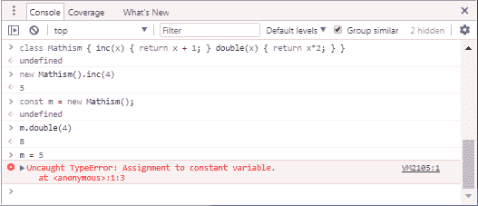
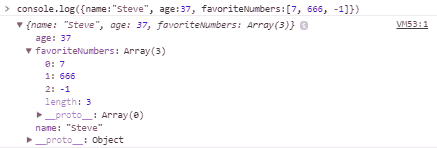

# 快速而深入地浏览 TypeScript 及其类型

> 原文：<https://www.freecodecamp.org/news/typescript-and-its-types-f509d799947d/>

大卫·皮格拉斯

# 快速而深入地浏览 TypeScript 及其类型

#### 联合类型、泛型、JSX、类型系统漏洞等等！


Photo by [Luis Villasmil](https://unsplash.com/photos/sGlwpgB7ENM?utm_source=unsplash&utm_medium=referral&utm_content=creditCopyText) on [Unsplash](https://unsplash.com/search/photos/types?utm_source=unsplash&utm_medium=referral&utm_content=creditCopyText)

这篇关于 TypeScript 的快速浏览主要面向对 JavaScript 有一定经验的人。

我还将解释一些关于 JavaScript 的令人惊讶的事实，以防你只是学习了一些模糊相似的东西，比如 Java 或 C#。如果你想知道如何建立一个 TypeScript 项目，请看我的[上一篇文章](https://medium.freecodecamp.org/how-to-set-up-a-typescript-project-67b427114884)。

TypeScript 基于 JavaScript。TypeScript 编译器(或基于它的其他工具，如`ts-node`或`ts-jest`)通过剥离所有类型信息将 TypeScript 翻译成普通的 JavaScript。

在这个过程中，执行类型检查是为了发现**类型错误**——您所犯的与类型有关的错误。当然，偶尔，它也会抱怨你故意做的违反了 TypeScript 规则的事情。

### 类型

类型可以附加到定义中带有冒号(:)的变量上，如下所示:

```
let z: number = 26;
```

然而，你通常不必**写下**类型。例如，如果您写道:

```
let z = 26;
```

TypeScript **推断**z 是一个数字。所以如果你写:

```
let z = 26;z = "Not a number";
```

你会在第二行得到一个错误。不过，TypeScript 最初确实采用了一个漏洞:任何变量都可以是`null`或`undefined`:

```
z = null;      // Allowed!z = undefined; // Allowed! 
```

如果你是 JavaScript 新手，你可能想知道`null`和`undefined`是什么，或者[为什么它们是两回事](https://stackoverflow.com/questions/5076944/what-is-the-difference-between-null-and-undefined-in-javascript)。

好吧，我答应给你讲讲 **TypeScript** 和`null` / `undefined`是 **JavaScript** 的东西。哈！

我个人不怎么用`null`。我发现始终使用`undefined`很方便，可以避免担心区别。`undefined`是调用者没有提供的新变量和函数参数的默认值。它是当你读取一个对象上不存在的属性时得到的值。相比之下，JavaScript 本身只是很少使用`null`，所以如果你自己不使用，就不会经常遇到。我敢肯定有些人恰恰相反，更喜欢`null`。

无论如何，有些人——包括我——认为允许**的每个**变量都是`null` / `undefined`是个坏主意。所以 TypeScript 2.0 [允许你用“tsconfig.json”中的`"strictNullChecks": true`编译器选项来取消那个权限](https://blog.mariusschulz.com/2016/09/27/typescript-2-0-non-nullable-types)。您可以使用`"strict": true` 进行最大类型检查。相反，你应该写:

```
let z: number | null = 26;
```

如果你**想让** `z`潜在地成为`null` (|的意思是“或”)。

#### 工会类型

TypeScript 能够理解可以有多种类型的变量。例如，下面是一些普通的 JavaScript 代码:

默认情况下，这在 TypeScript 中是允许的，因为`var y`(本身)赋予`y`一种类型的`any`，意味着任何东西。所以我们可以给`y`分配任何东西，比如值或对象。我们当然可以把它设置成一个字符串，或者一个数字，或者两个东西的数组。`any`是一种特殊的类型——它意味着“这个值或变量应该像 JavaScript 值或变量一样，因此，不会给我任何类型错误。”

我推荐`"strict": true`编译器选项。但是，在那种模式下，TypeScript 不允许使用`var y`——而是需要`var y: any`。

然而，TypeScript 允许我们更具体地说:

```
var y: string | number;
```

这意味着“变量 y 是一个字符串或一个数字”。如果以这种方式创建`y`，使用上面的例子，那么`if-else`部分是允许的。但是另一部分写着`y = [y, y]`是不允许的，因为`[y, y]`不是一个字符串，也不是一个数字。`y`是一个`number[] | string[]`类型的数组。这个特性，其中一个变量可以有两种(或多种)类型，被称为**联合类型**，它通常很有用。

**提示:**为了帮助你学习打字稿，[在操场上做实验](http://www.typescriptlang.org/play/)可能会有帮助。

为了帮助你了解更多关于 **JavaScript** 的知识，在 Chrome、Firefox 或 Edge 中按 F12，寻找控制台。在控制台中，您可以编写 JavaScript 代码，以了解一小段 JavaScript 代码的作用以及您编写的代码是否正确:



这个控制台太棒了，因为你可以用它在*任何*浏览器标签中运行实验——甚至是这个！由于 TypeScript 只是带有静态类型检查的 JavaScript，您可以使用控制台来帮助您了解 TypeScript 中*没有*静态类型的部分。在您的 TypeScript 文件中，您可以调用`console.log(something)`来打印浏览器控制台中的内容。在某些浏览器中，`log`可以显示复杂的对象。例如，试着写`console.log({name:"Steve", age:37, favoriteNumbers:[7, 666, -1]})`:



### 班级

如您所知，类是可以实例化为多个对象的函数和变量的组合。类中的函数可以引用类中的其他函数和变量，但是在 JavaScript 和 TypeScript 中，您必须使用前缀`this.`。典型的 JavaScript 类可能是这样的:

控制台输出是:

```
The big box is 10000 times larger than the small oneThe zero-size box has an area of 0.
```

JavaScript 有点挑剔。当你在一个类之外创建一个函数时，它前面会有单词`function`。但是，当你在一个`class`中创建一个函数时，**不允许**前面有单词`function`。

函数和方法是一回事，除了类中的方法可以访问`this`——对当前对象的引用，除了`static`方法。`static`方法被调用在`class`、本例中的`Box.ZeroSize`上，所以它们没有“当前对象”。(嗯，其实`ZeroSize`的当前对象是`Box`构造函数，它是*而不是*的一个`Box`实例。)

与 JavaScript 不同，TypeScript 类允许变量声明，例如本例中的`width`和`height`:

为了方便起见，TypeScript 允许您同时定义一个构造函数和它初始化的变量。所以不要

```
 width: number;  height: number;  constructor(width: number, height: number) {    this.width = width;    this.height = height;  }
```

你可以简单地写

```
constructor(public width: number, public height: number) {}
```

顺便说一句，对于阅读本文的任何 C#开发人员来说，它的工作方式与我的 C # LeMP 系统完全一样。

与 JavaScript 不同，TypeScript 具有在类外部不可访问的`private`(和`protected`)变量和函数:

变量允许你清楚地将类的一部分标记为“内部的”。该类的用户不能修改或读取这些内容。

### 接口

界面是描述对象“形状”的一种方式。这里有一个例子:

`IBox`指任何具有可读数字的`width`和`height`属性的类。`IArea`指任何具有可读`area`属性的东西。`Box`类满足这两个要求。`get area()`函数算作一个属性，因为调用它时没有使用`()`括号。所以我可以写:

```
let a: IBox = new Box(10,100);  // OKlet b: IArea = new Box(10,100); // OK
```

TypeScript 中的接口像 Go 编程语言中的接口一样工作，而不像 Java 和 C#中的接口。这是件好事。这意味着类**不需要**明确地说它们实现了一个接口。`Box`心照不宣地实现了`IBox`和`IArea`。

这意味着我们可以为最初不是为任何特定接口设计的类型定义接口。例如，我的`[BTree](https://www.npmjs.com/package/sorted-btree)` [包](https://www.npmjs.com/package/sorted-btree)定义了一个`IMap<Key,V` al >接口，它表示一个键值对字典。ES6 内置的 Th `e n` ew Map 类也符合这个接口，所以你可以在`to a` n IMap 变量中`put`一个地图。例如，你可以写一个带有 IMap 参数的函数，并且你可以将一个映射映射到这个函数，这个函数不需要知道或者关心它接收的是哪种类型。

`readonly`表示我们可以阅读，但不能改变:

```
console.log(`The box is ${a.width} by ${a.height}.`); // OKa.width = 2; /* ERR: Cannot assign to 'width' because it is a                      constant or a read-only property. */
```

TypeScript 不需要`readonly`来实现接口兼容性。例如，TypeScript 接受这段代码，即使它不起作用:

```
interface IArea {  area: number; // area is not readonly, so it can be changed}
```

```
let ia: IArea = new Box(10,100);ia.area = 5; // Accepted by TypeScript, but causes a runtime error
```

我把它看作是 TypeScript 中的一个 bug。

TypeScript 还有一个接口可选部分的概念:

```
interface Person {  readonly name: string;  readonly age: number;  readonly spouse?: Person;}
```

比如我们可以写`let p: Person = {name:'John Doe', age:37}`。由于`p`是一个`Person`，我们稍后可以引用`p.spouse.`，在这种情况下，它等于`undefined`，但是如果一个不同的对象被分配给它，它也可以是一个`Person`，它有一个`spouse`。

但是，如果您对`spouse`使用错误的数据类型`p = {name:'Chad', age:19, spouse:'Jennifer'}`，TypeScript 会响应为`Type string is not assignable to type Person *|* undefined` *。*

### 交叉点类型

交集类型是 union 类型不太为人所知的表亲。像`A | B`这样的联合类型意味着一个值可以是**A 或 B，但不能同时是 A 和 B。像`A & B`这样的交集类型意味着一个值同时是 A 和 B。例如，这个`box`既是`IBox`又是`IArea`，所以它拥有两个接口的所有属性:**

```
let box: IBox & IArea = new Box(5, 7);
```

如果混合使用联合和交集类型，可以使用括号来更改含义:

```
// either a Date&IArea or IBox&IArealet box1: (Date | IBox) & IArea = new Box(5, 7);// either a Date or an IBox&IArealet box2: Date | (IBox & IArea) = new Box(5, 7);
```

`&`的优先级高于`|`，所以`A & B | C`就是`(A & B) | C`的意思。

### 结构类型

在其他一些编程语言中，每种类型都有一个名字，比如`string`或`double`或`Component`。在 TypeScript 中，许多类型确实有名称，但更基本的是，大多数类型是由其结构定义的。换句话说，类型的名称(如果有的话)对于类型系统来说并不重要。下面是一个变量具有结构类型的示例:

```
var book1 = { title: "Adventures of Tom Sawyer",       year:1876 };var book2 = { title: "Adventures of Huckleberry Finn", year:1884 };
```

如果将鼠标悬停在 VS 代码中的`book1`上，其类型被描述为`{ title: string; year: number; }`。这是一个**结构**类型:这种类型完全由这样一个事实来定义:它有一个称为`title`的属性，即`string`，还有一个称为`year`的属性，即`number`。因此`book1`和`book2`具有相同的类型，你可以将一个分配给另一个，或者分配给不同的书。

```
book1 = book2; // allowedbook2 = { year: 1995, title: "Vertical Run" }; // allowed
```

一般来说，您可以将“更多内容”的值赋给类型包含“更少内容”的变量，但不能反过来:

```
var book3 = { title: "The Duplicate",               author: "William Sleator", year:1988 };var book4 = { title: "The Boy Who Reversed Himself" };book1 = book3; // allowedbool1 = bool4; /* NOT allowed. Here is the error message:    Type '{ title: string; }' is not assignable to type     '{ title: string; year: number; }'. Property 'year'     is missing in type '{ title: string; }'.  */ 
```

此外，如果我们有这样一个界面:

```
interface Book {  title: string;  author?: string;  year: number;}
```

然后我们可以给`book1`或者`book2`分配任意的`Book`值。但是在`book3`中`author`是必需的，而`Book`可能不包含作者。我们可以将任何 book 变量赋给一个类型为`Book`的新变量，当然除了`book4`。

显然，结构类型是奇妙的。在你花了几年时间使用没有它们的语言之后，这一点是显而易见的。例如，想象一下，如果阿尔弗雷德和芭芭拉两个人编写不同的模块`A`和`B`。它们都使用 X-Y 坐标来处理点。所以每个模块都包含一个`Point`接口:

```
interface Point {    x: number;    y: number;}
```

许多语言使用**名词性**类型而不是结构类型。在这些语言中，`A.Point`被认为是与`B.Point`完全不同的类型，尽管它们是相同的。所以`A`产生的任何积分都不能被`B`使用，反之亦然。这可能会令人沮丧，所以请花点时间和我一起庆祝 TypeScript 的结构类型化的奇迹。

结构类型可以用分号或逗号书写，例如`{ x: number, y: number }`和`{ x: number; y: number; }`是相同的。

### 基于流程的打字和感叹号

如果`s`是一个字符串，您可以编写`s.match(*/[0-9]+/*)`来查找该字符串中的第一组数字。`/[0-9]+/`是一个`RegExp`——一个可以使用[正则表达式](https://en.wikipedia.org/wiki/Regular_expression)来搜索字符串的对象。正则表达式是许多编程语言支持的字符串匹配系统，包括 JavaScript。

`match`返回字符串数组，如果`RegExp`与字符串不匹配，则返回`null`。例如，如果`s = "I have 10 cats and 2 dogs"`那么`s.match(/[0-9]+/)`返回`["10"]`，但是如果`s = "I have ten velociraptors and a weevil"`那么`match`返回`null`。

如果你在一个字符串中寻找数字，你会希望你的代码根据字符串是否有数字而有不同的行为，对吗？所以你可以使用一个`if`语句:

```
var found: string[]|null = s.match(/[0-9]+/);if (found) {  console.log("The string has a number in it: " + found[0]);} else {  console.log("The string lacks digits.");}
```

你可能知道，`if (found)`的意思是“如果发现是真的”。基本上就是`if (found != null && found != 0 && found != false)`的意思。

如果不检查`found !== null`，TypeScript 会给你一个错误:

```
var found = s.match(/[0-9]+/);console.log("The string has a number in it: " + found[0]);           // Error: Object is possibly 'null'  ^^^^^
```

那么为什么当你使用`if`语句时**不会**得到一个错误呢？这就是 TypeScript 基于流的类型化的神奇之处。

在`if`语句的第一个分支中，TypeScript 知道`found` **不能为空，因此`found` **的类型在该块**中发生变化以排除`null`。这样，它的类型就变成了`string[]`。同样，在`else {...}`块内部，TypeScript 知道`found` **不能**为`string[]`，所以`string[]`被排除，在那个区域`found`的类型变成了`null`。**

但是 TypeScript 有一个`!`操作符，用于避免某些错误消息。它的意思是“看，编译器，我知道你认为这个变量可能是`null`或`undefined`，但我向你保证它不是。所以如果`found`有类型`string[]|null`，那么`found!`有类型`string[]`

如果您确定`s`中有数字，您可以使用`!`来避免错误信息:

```
var found = s.match(/[0-9]+/);console.log("The string has a number in it: " + found![0]);
```

TypeScript 的基于流的类型化系统支持`typeof`和`instanceof`操作符，以及普通的比较操作符。如果从一个可能有多种类型的变量开始，可以使用以下任何一种运算符来缩小类型范围:

**注意:** JavaScript 区分**原语**和**装箱原语**类型，都是对象。比如`"yarn"`是一个原语，它的类型是`string`。不过还有一种**装箱**字符串类型叫做`String`，大写的 S，很少使用。你可以通过写`new String("yarn")`来创建一个`String`。要记住的是，这些是完全不同的类型。

`"yarn" instanceof String`是`false` : `"yarn"`是个`string`，不是`String`！

`"yarn" instanceof string`是**不是**假。相反，这是一个完全非法的表达式——`instanceof`的右边必须是一个**构造函数**而`string`没有构造函数。

JavaScript 提供了两种不同的操作符来测试原语和对象(非原语)的类型:

*   `[instanceof](https://developer.mozilla.org/en-US/docs/Web/JavaScript/Reference/Operators/instanceof)`检查[原型链](https://medium.freecodecamp.org/prototype-in-js-busted-5547ec68872)来发现一个值是否是某种对象。
*   检查某个东西是否是原始的，如果是，是哪一种。

正如您在上面的代码中看到的，`instanceof`是一个返回布尔值的二元运算符，而`typeof`是一个返回字符串的一元运算符。比如`typeof "yarn"`返回`"string"`，`typeof 12345`返回`"number"`。原语类型有`number`、`boolean`、`string`、`symbol`、`undefined`和`null`。所有不是原语的都是一个`Object`，包括函数。

但是`typeof` 特殊对待函数。比如`typeof Math.sqrt === "function"`，还有`Math.sqrt instanceof Object === true`。符号在 ES6 中是新的，尽管`null`是原语，`typeof null === "object"` [是错误的](http://2ality.com/2013/10/typeof-null.html)。

从上面的例子中可以看出，TypeScript 也将`Array.isArray`理解为检测数组的一种方式。但是，不支持 JavaScript 中检测类型的其他一些方法:

*   `if (thing.unshift)`有时用来区分字符串和其他东西，因为除了字符串几乎没有什么东西有`unshift`方法。这在 TypeScript 中不受支持，因为它不允许您读取可能不存在的属性。
*   `if (thing.hasOwnProperty("unshift"))`未被识别为类型测试。
*   `if (thing.constructor === String)`未被识别为类型测试。在 JavaScript 中，读取一个属性比如`constructor`会将`thing`提升到装箱状态，所以即使`thing`是一个*原语字符串*，它的`.constructor`也会是*非原语*。
*   `if ("unshift" in thing)`不起作用。“in”表达式的右侧必须是“any”类型、对象类型或类型参数(`in`反正要避免，因为慢。)

### 键入别名

`type`语句为一个类型创建一个新名称。例如在书写之后:

```
type num = number;
```

可以用`num`作为`number`的同义词。`type`类似于`interface`，因为你可以写这样的东西…

```
type Point = {    x: number;    y: number;}
```

…而不是`interface Point {...}`。但是，只有接口支持**继承。**例如，我可以创建一个新的接口，像 `Point`一样是**，但也有一个新成员`z`，就像这样:**

```
interface Point3D extends Point {    z: number;}
```

不能用`type`做继承。然而，如果用`type`定义了`Point`，你仍然可以用`interface`来扩展它。

### 功能类型

在 JavaScript 中，您可以将函数传递给其他函数，如下所示:

```
function doubler(x) { return x*2; }function squarer(x) { return x*x; }function experimenter(func){  console.log(`When I send 5 to my function, I get ${func(5)}.`);}experimenter(doubler);experimenter(squarer);
```

输出:

```
When I send 5 to my function, I get 10.When I send 5 to my function, I get 25.
```

在 TypeScript 中，你通常需要写下函数参数的类型——你需要知道如何表达`func`的类型。正如您在这里看到的，它的类型应该类似于`(param: number) => num` ber:

```
function doubler(x: number) { return x*2; }function squarer(x: number) { return x*x; }function experimenter(func: (param: number) =&gt; number){  console.log(`When I send 5 to my function, I get ${func(5)}.`);}experimenter(doubler);experimenter(squarer);
```

TypeScript 要求你给`func`的参数起一个**名**，但是这个名字是什么并不重要。我可以把它叫做`x`，或者`Wednesday`，或者`myFavoriteSwearWord`，这不会有任何区别。但是别想叫它`asshat`。编译器不会在意，但是你的老板呢？万无一失，这就是我能说的。

在 JavaScript 中，对象内部的一切都是属性——一种变量——包括函数。因此，这两个接口意味着相同的事情:

```
interface Thing1 {  func: (param: number) =&gt; number;}interface Thing2 {  func(param: number): number;}
```

所以这段代码是允许的:

```
class Thing {  func(x: number) { return x * x * x; }}let t1: Thing1 = new Thing();let t2: Thing2 = t1; 
```

TypeScript 在“普通”函数的返回类型前需要`:`，但它需要`=&`gt；你觉得奇怪吗？在函数变量的返回类型之前？反正就是这么回事。

### 仿制药，日期，等等

#### 日期

假设我写了一个函数，确保一个值是一个数组，就像这样:

```
function asArray(v: any): any[] {  // return v if it is an array, otherwise return [v]  return (Array.isArray(v) ? v : [v]);}
```

`asArray`函数可以工作，但是它丢失了类型信息。比如这个函数调用它怎么办？

```
/** Prints one or more dates to the console */function printDates(dates: Date|Date[]) {  for (let date of asArray(dates)) {      // SUPER BUGGY!      var year = date.getYear();      var month = date.getMonth() + 1;      var day = date.getDay();      console.log(`${year}/${month}/${day}`);  }}
```

TypeScript 编译器接受这段代码，但是它有两个错误。代码正确地将`1`添加到月份中，因为`getMonth()`为一月返回 0，为十二月返回 11。但是得到`year`和`day`的代码都是错的。然而，由于`asArray`返回`any[]`，类型检查和智能感知——本可以捕捉这些错误——在`date`被禁用。如果`asArray`是通用的，这些错误就可以避免:

```
function asArray<T>(v: T | T[]): T[] {  return Array.isArray(v) ? v : [v];}
```

这个版本的`asArray`做同样的事情，但是它有一个**类型参数**，我决定称之为`T`，以实现增强的类型检查。类型参数可以是任何类型，所以类似于`any`。但是它使函数能够描述参数`v`和返回值之间的**关系**。

具体来说，它说`v`和返回值有相似的类型。当您调用`asArray`时，TypeScript 编译器会找到一个值`T`，该值允许调用有意义。例如，如果您调用`asArray(42)`，那么编译器会选择`T=number`，因为可以使用 42 作为`asArray(v: number|number[]): number[]`的参数。选择`T=number`后，TypeScript 实现`asArray`返回一个数字数组。

在`printDates`中，我们调用了`asArray(dates)`，编译器发现`T=Date`在这种情况下工作得最好。选择`T=Date`后，TypeScript 实现`asArray`返回一个`Date`的数组。所以变量`date`有类型`Date`，然后它发现第一个 bug: `date.getYear`不存在！嗯，实际上它确实存在，但由于它的行为，它已经被否决了-它返回自 1900 年以来的年数-2018 年的 118 年。而是应该叫`getFullYear`。

TypeScript 本身并没有注意到第二个 bug。但是，当您键入`date.getDay`时，VS 代码会在一个小弹出框中通知您该函数“使用本地时间获取星期几”。星期几？你有**有**在跟我开玩笑！

多亏了泛型和 VS 代码，我们修改了代码来调用`date.getDate`。这并不是**而不是**返回不带时间的日期，而是当前月份的**日。与月份不同，日子**不是**从零开始计数。**

```
/** Prints one or more dates to the console */function printDates(dates: Date|Date[]) {  for (let date of asArray(dates)) {      var year = date.getFullYear();      var month = date.getMonth() + 1;      var day = date.getDate();      console.log(`${year}/${month}/${day}`);  }}
```

关于`Date`的一个好处是它们通常以 UTC——世界时区，或 GMT——存储。这意味着，如果用户改变他们计算机上的时区，程序中的`Date`对象继续表示相同的**时间点**，但是`.toString()`返回的字符串会改变。通常这是您想要的，尤其是在 JavaScript 中，您可能会在不同的时区运行客户机和服务器代码。

#### 无商标消费品

泛型的一个高级例子出现在我的 [simplertime 模块](https://www.npmjs.com/package/simplertime)中。在这种情况下，我有一个`timeToString`函数，它接受如下格式选项列表:

```
export interface TimeFormatOptions {  /** If true, a 24-hour clock is used and AM/PM is hidden */  use24hourTime?: boolean;  /** Whether to include seconds in the output (null causes seconds   *  to be shown only if seconds or milliseconds are nonzero) */  showSeconds?: boolean|null;  ...}
```

```
export function timeToString(time: Date|number,                              opt?: TimeFormatOptions): string {  ...}
```

`export`关键字用于将代码共享给其他源文件。例如，您可以使用`import {timeToString} from 'simplertime'`在自己的代码中导入`timeToString`(当然是在安装了`npm i simplertime`之后)。如果您想从**相同文件夹**的不同文件中导入内容，请在文件名前添加一个`./`前缀，例如`import * as stuff from './mystuff'`。

泛型也可以用在类和接口上。例如，JavaScript 有一个用于保存无序值集合的`Set`类型。我们可以这样使用它:

```
var primes = new Set([2, 3, 5, 7]);for (var i = 0; i < 10; i++)  console.log(`Is the number ${i} prime? ${primes.has(i)}`);
```

不过在 TypeScript 中，`Set`有一个类型参数，`Set<`；T >，意味着集合中的所有项目都有类型 t。在此代码中，TypeScript 推断出 `that T=`号，因此如果您`write primes.add("he` llo！”)您将得到一个类型错误。如果你想创建一个既能保存字符串又能保存数字的集合，你可以这样做:

```
var primes = new Set&lt;string|number>([2, 3, 5, 7]); 
```

您也可以创建自己的泛型类型。例如，我创建了一个名为`[BTree<K,](https://github.com/qwertie/btree-typescript)` V >的 [B+树](https://en.wikipedia.org/wiki/B%2B_tree)数据结构，这是一个键-值对的集合，按键排序，支持快速克隆。它有两个类型参数，K(一个键`)`和 V(一个值),它的定义大致类似于**这个**。注意:省略了函数体，因为我只想向您展示泛型类的样子:

### 文字作为类型

还记得当你写这个的时候有一个错误吗？

```
let z = 26;z = "Zed";
```

这个错误消息听起来有点奇怪:

```
Type '"Zed"' is not assignable to type 'number'
```

为什么说`"Zed"`是“类型”，而不是“值”或“字符串”？为了理解这一点，有必要理解 TypeScript 能够将值视为类型。`"Zed"`当然是一个`string`，但不止于此——它同时还有**另一个类型**，一个更具体的类型叫做`"Zed"`，代表*值* `"Zed"`。我们甚至可以创建一个这种类型的变量:

```
let zed: "Zed" = "Zed";
```

现在我们创建了一个完全无用的变量，叫做`zed`。我们可以将这个变量设置为`"Zed"`，但不能设置其他变量:

```
zed = "Zed"; // OKzed = "ZED"; // Error: Type '"ZED"' is not assignable to type '"Zed"'.
```

默认情况下，我们可以将`zed`设置为`null`并将`undefined.`设置为`"strictNullChecks": true`，幸运的是，通过`"strictNullChecks": true`选项，我们可以堵住这个漏洞，这样这个变量就永远不会是除了“Zed”之外的任何值。感谢上帝，这是我唯一能说的。

那么这些文字类型有什么用呢？有时候一个函数只允许某些特定的字符串。例如，想象一下，如果你有一个函数，它只允许你`turn("left")`或`turn("right")`，而不允许你做其他事情。这个函数可以用文字类型声明:

```
function turn(direction: "left"|"right") { … }
```

### 固定长度数组

这是另一个难题:类型`number[]`和`[number]`之间有什么区别？第一个是数字数组，第二个是只包含一个元素的数组，这个元素是一个数字。

类似地,`[string,number]`表示一个长度为 2 的数组，第一个元素是一个字符串，第二个是一个数字。另外，数组有一个属性`length: 2`，即它的**类型**是`2`，而不仅仅是`number`。这些固定长度的数组称为元组类型。

### 高级泛型

那么，还记得我说过的`simplertime`模块吗？它还导出一个保存了`timeToString`格式选项默认值的`defaultTimeFormat`对象。我想定义一个特殊的函数，允许我写类似于`get(options, 'use24hourTime')`的东西，如果`options.use24hourTime`存在，就检索它的值，如果不存在，就检索`defaultTimeFormat.use24hourTime`的值。

在许多语言中，不可能写出这样的函数，但在 JavaScript 这样的“动态”语言中是可能的。下面是 JavaScript 中的`get`函数:

```
function get(opt, name) {  if (opt === undefined || opt[name] === undefined)    return defaultTimeFormat[name]  return opt[name];}
```

在 JavaScript 和 TypeScript 中，`thing.property`可以写成`thing["property"]`，如果属性不存在，结果就是`undefined`。但是在方括号版本中，我们可以使用一个**变量**，这样问题“我们正在使用哪个属性？”可以通过位于别处的代码来回答。

通过一个名为`keyof`的特性，将它转换成 TypeScript 是可能的，但是它**非常**棘手。以下是翻译:

```
function get<;K extends keyof TimeFormatOptions>(         opt: TimeFormatOptions|undefined, name: K):          TimeFormatOptions[K]{  if (opt === undefined || opt[name] === undefined)    return defaultTimeFormat[name]  return opt[name];}
```

这里，类型变量`K`有一个附加的**约束**，`K extends keyof TimeFormatOptions`。它是这样工作的:

1.  `keyof X`将`X`的属性转换成属性名称的联合类型。例如，给定前面的`Book`接口，`keyof Book`表示`"title" | "author" | "age"`。同样，`keyof TimeFormatOptions`是`TimeFormatOptions`中的任何属性名。
2.  “扩展”约束`X extends Y`意味着“X 必须是 Y，或者是 Y 的子类型”。比如`X extends Object`意味着`X`一定是某种`Object`，也就是说它可以是数组或者`Date`甚至是函数，都被认为是对象，但不能是`string`或者`number`或者`boolean`。同样`X extends Point`表示`X`是`Point`或者是比`Point`更具体的类型，比如`Point3D`。
3.  `B extends keyof Book`是什么意思？这意味着`B`是`"title" | "author" | "age"`的**子类型**。请记住，我们在这里讨论的是**类型**，而不是**值。字符串文字`"title"`有值`"title"`，但它也有类型`"title"`，这是一个不同的概念。类型由 TypeScript 类型系统处理，值由 JavaScript 处理。当程序运行时，`"title"`类型不再存在，但是`"title"`值仍然存在。现在，`B`可以被赋给类似`"title"`或`"title" | "age"`的类型，因为类型`"title" | "age"`(或`"title"`)的每个值都可以被赋给类型`keyof Book`的变量。但是`B`不能是`string`，因为有些字符串不是“标题”、“作者”或“年龄”。**
4.  类似地，`K`被约束为具有`keyof TimeFormatOptions`的子类型，比如`"use24hourTime"`。
5.  type `X[Y]`表示“X 的 Y 属性的类型，其中 Y 是一个数字或字符串文字”。比如*型的*T1 就是`string | undefined`。

把这些放在一起，当我写`get(options, 'use24hourTime')`的时候，编译器决定`K='use24hourTime'`。因此，`name`参数的类型为`"use24hourTime"`，返回类型为`TimeFormatOptions["use24hourTime"]`，即`boolean | undefined`。

### 活字系统中的漏洞

由于 TypeScript 是建立在 JavaScript 之上的，所以由于各种原因，它接受了其类型系统中的一些缺陷。前面我们看到了其中的一个缺陷，即这段代码是合法的:

```
class Box {  constructor(public width: number, public height: number) {}  get area() { return this.width*this.height; }}
```

```
interface IArea {  area: number; // area is not readonly}
```

```
let ia: IArea = new Box(10,100);ia.area = 5; // Accepted by TypeScript, but causes a runtime error
```

以下是其他一些有趣的漏洞:

#### 您可以将派生类分配给基类

A `Date`是一种`Object`,所以你自然可以写:

```
var d: Object = new Date();
```

因此，我们也可以将这个`D`接口分配给这个`O`接口，这是有道理的，对吗？

```
interface D { date: Date }interface O { date: Object }var de: D = { date: new Date() };    // okay...var oh: O = de;                      // makes sense...oh.date = { date: {wait:"what?"} }   // wait, what?
```

嗯，不，不是真的，因为 TypeScript 现在认为`de.date`是一个`Date`，而它实际上是一个`Object`。

#### 可以将[A，B]赋值给(A|B)[]

有意义的是，一个包含两个项目的数组，一个`A`后跟一个`B`，也是一个`A|B`的数组，对吗？实际上，不，不是真的:

```
var array1: [number,string] = [5,"five"];var array2: (number|string)[] = array1;   // makes sense...array2[0] = "string!";                    // wait, what?
```

TypeScript 现在认为`array1[0]`是一个`number`，而实际上它是一个`string`。这是一个更普遍问题的例子，数组被视为协变的，但它们**并不是**真正的协变，因为它们是可编辑的。

#### 数组？有龙。

在推荐的`strict`模式中，你不能把`null`或`undefined`放在数字数组中…

```
var a = [1,2,3];a[3] = undefined; // 'undefined' is not assignable to type 'number'
```

这意味着当我们从一个数字数组中得到一个值时，它是一个数字，对吗？实际上，不，不是真的:

```
var array = [1,2,3];var n = array[4];
```

TypeScript 现在认为`n`是一个`number`，而实际上它是`undefined`。

一个更明显的漏洞是，您可以分配一个有大小的数字数组…其中没有数字:

```
var array = new Array<number>(2); // array of two "numbers"var n:number = array[0];
```

#### 覆盖时，函数参数是二元的

与其他具有静态类型的语言不同，TypeScript 允许用协变参数进行重写。**协变参数**意味着，随着类变得更具体(A 到 B)，参数也变得更具体(对象到日期):

```
class A {    method(value: Object) { }}
```

```
class B extends A {    method(value: Date) { console.log(value.getFullYear()); }}
```

```
var a:A = new B();a.method({}); // Calls B.method, which has a runtime error
```

这是不安全的，但奇怪的是这是允许的。相比之下，用**逆变**参数覆盖(相对)安全，如下所示:

```
class A {    method(value: Date) { }}class B extends A {    method(value: Object) { console.log(value instanceof Date); }}
```

协变返回类型也是安全的:

```
class A {    method(): Object { return {} }}class B extends A {    method(): Date { return new Date(); }}
```

TypeScript 正确地拒绝了逆变返回类型:

```
class A {    method(): Date { return new Date(); }}class B extends A {    // Property 'method' in type 'B' is not assignable to     // the same property in base type 'A'.    //   Type '() => Object' is not assignable to type '() => Date'    //     Type 'Object' is not assignable to type 'Date'    method(): Object { return {} }}
```

#### 类认为它们是接口(但它们不是)

TypeScript 允许您将类视为接口。例如，这是合法的:

```
class Class {  content: string = "";}
```

```
var stuff: Class = {content:"stuff"};
```

Stuff 不是一个真正的`Class`，但是 TypeScript 认为它是，如果你在程序的其他地方使用`instanceof Class`,就会导致运行时`TypeError`:

```
function typeTest(x: Class|Date) {  if (x instanceof Class)    console.log("The class's content is " + x.content);  else    console.log("It's a Date in the year " + x.getFullYear());}
```

```
typeTest(stuff);
```

#### 不一定是你想的那样

`this`是 JavaScript 的漏洞，不是 TypeScript。每当一个函数使用`this`时，它可能会访问一些完全意想不到的对象，其类型与您想象的不同:

```
class Time {  constructor(public hours: number, public minutes: number) { }  toDate(day: Date) {    var clone = new Date(day);    clone.setHours(this.hours, this.minutes);    return clone;  }}
```

```
// Call toDate() with this=12345Time.prototype.toDate.call(12345, new Date());
```

TypeScript 唯一的罪过是它不会试图阻止你这样做。

说到`this`，JavaScript 开发者应该知道的一件事是**箭头函数**像`x =>` x+1 的工作方式与匿名函数 li `ke function(x) {return x` +1}略有不同。

**箭头**函数从它们所在的外部函数继承`this`的值。**正常的**函数从调用者那里接收一个新的值`this`。所以，如果`f`是一个箭头函数，`f.call(12345, x)`不改变`this`，就像调用`f(x)`一样。这通常是件好事，但如果你写:

`var obj = { x: 5, f: () => this.` x }

你要意识到`obj.f()`**不是**返回`obj.x`。

#### 课程

为了避免这些漏洞，您需要:

*   **Not** 将一个**对象**视为一个“基础”类型(例如，不要将`D`视为一个`O`)，除非你确定基础类型不会以违反类型系统的方式被修改。
*   **不**将**数组**视为“baser”类型(例如，不要将`D[]`视为`O[]`，或者将`[A,B]`视为`(A|B)[]`)，除非您确定 baser 类型不会以违反类型系统的方式被修改。
*   注意不要在数组中留下任何未定义值的“漏洞”。
*   注意不要使用越界数组索引。
*   **Not** 用协变参数覆盖基类方法。
*   **避免**将类`K`视为接口，除非你确定没有代码会用`instanceof`检查类型。
*   **避免使用`.call(...)`中的**，并小心处理对函数的引用。

TypeScript 过去实际上有[多个](https://github.com/Microsoft/TypeScript/issues/9765) [漏洞](https://github.com/Microsoft/TypeScript/issues/3410#issuecomment-111646030)，现在已经被堵住了。

### JSX

React 引入了 JSX 码的概念。或者， [Hyperscript](https://github.com/hyperhype/hyperscript) 引入了它，随后 React 很快复制了这个想法。无论如何，JSX **看起来**像 HTML/XML 代码。但是你不是在制作 DOM 元素，而是在制作普通的 JavaScript 对象，我们称之为“虚拟 DOM”。比如. jsx 或者中的`实际上是`means React.createElement("img", { src: image` Url })。tsx 文件。

如果 JSX 是一个 React 事物，为什么我在打字稿部分谈论它？因为对 JSX 的支持内置于 TypeScript 编译器中。要在任何类型脚本文件中获得 JSX 支持，只需将文件的扩展名从`.ts`改为`.tsx`。

JSX 可以在与普通表达式相同的地方使用:你可以将 JSX 代码传递给一个函数…

```
ReactDOM.render(<h1>I'm JSX code!</h1>, document.body);
```

你可以把它存储在一个变量里…

```
let variable = <h1>I'm JSX code!</h1>;
```

你可以从一个函数中返回它…

```
return <h1>I'm JSX code!</h1>;
```

因为`<h1>I'm JSX code`！< /h1 >真的 `just means React.createElement("h1", null, "I'm` JSX 码！").

JSX 标签是否以大写字母开头很重要——如果以大写字母开头，它被翻译成不同的 TypeScript(或 JavaScript)**。例如:**

*   **`<div class="foo` "/ > `means React.createElement('div', {"class":"` foo"})，但是**
*   **`<Div class="foo` "/ > `means React.createElement(Div, {"class":"` foo"})(不带引号 a `rou` nd Div)。**

**使用 JSX 的提示:**

*   **JSX 是类 XML 的，所以所有的标签都必须是封闭的:写`<b`r/>t<br>。**
*   **JSX 只支持字符串属性和 JavaScript 表达式。在 TypeScript 中写数值属性时，使用`<input type="number" min={0} max={100` }/ >，be `cause m` ax=100 是语法错误`r and max`=“100”是类型错误。**
*   **在 React/Preact 中，可以在任何需要子元素列表的位置使用元素数组。比如代替`return <p>Ann<br/>Bob`<br/>Cam&l`t;/p>, you can write let x = [<br/>, 'Bob', &`lt；br/>]；返回< p >安{ x }凸轮< /p >。这具有相同的效果，因为 React/Preact“展平”子列表中的数组。**
*   **在 React 中，由于某种原因，`class`属性不被支持。用`className`代替。**
*   **JSX 教本身不支持选择性财产或子女。例如，假设你写了`<Foo prop={` x} >但是你想在 `x is und`定义的时候省略`t th` e prop 。嗯，JSX 本身并不支持这样的事情。然而，大多数组件将定义的属性视为丢失的属性，因此它通常是有效的。JSX 也不支持可选子元素，但是你可以用空数组得到同样的效果:因为数组是被 React/Pr`eact, <Foo>`{[]}</Foo>has t`he same eff`EC`t as <Foo></F`oo>“折叠”的。<Foo>{ undefined }</Foo>在单个子代等于 undefined 的情况下没有此效果 `(you end`。)**
*   **如果你有一个类似于`obj = {a:1, b:2}`的对象，并且你想使用该对象的所有属性作为一个组件的属性，你可以写`<Component {...obj` }/ >。圆点总是不允许出现在`ired; <Componen`/>上。**

**在文件的顶部，`@jsx` pragma 可以控制被调用来翻译 JSX 元素的“工厂”函数。比如你用`/** @jsx h */`那么`<b>th`就是< /b > tr `anslates to h('b', n` ull，" this") `instead of React.createElement('b', n` ull，" this ")。一些 preact 应用程序使用 t `h` is pragma (h 是创建元素的 Preact 函数)，但你不需要在 thi `s tutorial (c` reateElement 是 h 的一个`s` ynonym)中使用它。此外，在“tsconfig.json”中，您可以获得相同的`effect with "jsxF`factory ": `"h" in the com`pile options。**

### **请参见**

**[TypeScript 发展](https://blog.mariusschulz.com/series/typescript-evolution)更详细地解释了最新的 TypeScript 特性。你可能也想在 TypeScript 的手册中看到[高级类型](https://www.typescriptlang.org/docs/handbook/advanced-types.html)。**

### **在你走之前…**

**如果你喜欢这篇文章，别忘了鼓掌或发微博！如果你想学习 React，请继续阅读我的下一篇文章。**