# 如何掌握高级打字稿模式

> 原文：<https://www.freecodecamp.org/news/typescript-curry-ramda-types-f747e99744ab/>

皮埃尔-安托万·米尔斯

# 如何掌握高级打字稿模式

#### 了解如何为 curry 和 Ramda 创建类型

Photo by [sergio souza](https://unsplash.com/photos/2jXkA7GAz9M?utm_source=unsplash&utm_medium=referral&utm_content=creditCopyText) on [Unsplash](https://unsplash.com/?utm_source=unsplash&utm_medium=referral&utm_content=creditCopyText)

尽管 curry 的流行和函数式编程(以及 TypeScript)的兴起，今天使用 curry 并进行适当的类型检查仍然是一个麻烦。甚至像 Ramda 这样著名的库也没有为它们的 curry 实现提供泛型类型(但是我们会提供)。

然而，您不需要函数式编程背景来遵循本指南。该指南是关于 currying，但它只是我选择的一个主题，教你先进的打字技巧。您只需要稍微练习一下 TypeScript 的基本类型。在本演练结束时，您将成为一名真正的 TS 向导？。

如果你是一个函数式程序员，你可能已经在使用 currying 来创建强大的组合和部分应用程序…如果你有点落后，是时候进入函数式编程了，开始脱离命令式范式，更快、更轻松地解决问题，并促进代码库中的可重用性。

在本指南结束时，你将知道如何创建**强大的类型**，如:

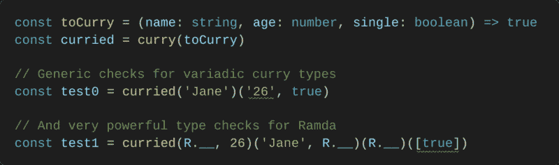

事实上，拉姆达对库里确实有某种平庸的类型。这些类型不是通用的，**硬编码的**，限制了我们一定数量的参数。从 0.26.x 版本开始，它只遵循最多 6 个参数的**，并且不允许我们在 TypeScript 中非常容易地使用其著名的**占位符**特性。为什么？这很难，但我们一致认为我们已经受够了，我们要解决这个问题！**

**

Source: [Giphy](https://giphy.com/gifs/glitch-falling-JWXIa2DAQNoQg)** 

#### **什么是 currying？**

**但是在我们开始之前，让我们确保你对 curry 有一个非常基本的了解。Currying 是将一个接受多个参数的函数转换成一系列一次接受一个参数的函数的过程。理论上是这样的。**

**比起文字，我更喜欢例子，所以让我们创建一个接受两个数字并返回它们相加结果的函数:**

**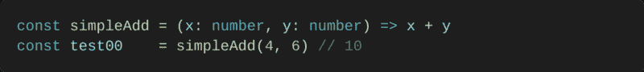**

**`simpleAdd`的简化版应该是:**

**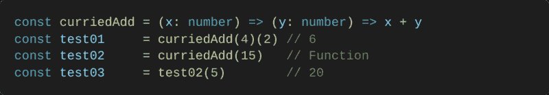**

**在本指南中，我将首先解释如何创建与标准 curry 实现一起工作的 TypeScript 类型。**

**然后，我们将把它们进化成更高级的类型,允许 curried 函数接受 0 个或更多参数。**

**最后，我们将能够使用“差距”来抽象出这样一个事实，即我们没有能力或不愿意在某个时刻提供一个论点。**

****TL；博士**:我们将创建“经典咖喱”&“高级咖喱”(拉姆达)的类型。**

### **元组类型**

**在我们开始学习最先进的 TypeScript 技术之前，我只想确保您了解**元组**。元组类型允许您表达一个数组，其中固定数量的元素的类型是已知的。让我们看一个例子:**

**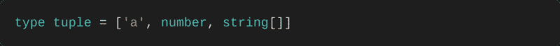**

**它们可用于强制固定大小数组中的值的种类:**

**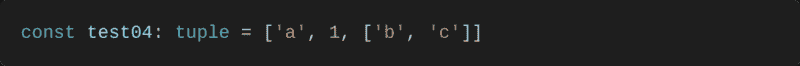**

**也可用于 rest 参数(或析构)的组合:**

**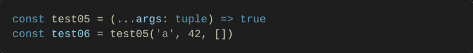**

**但是在开始制作我们的咖喱菜肴之前，我们要做一点热身。我们将创建我们需要的第一个工具来构建一个最基本的咖喱类型。我们继续吧。**

**也许你能猜到……我们会经常使用元组类型。一旦我们从“原始的”curried 函数中提取了参数，我们就会使用它们。为了举例，让我们创建一个基本函数:**

**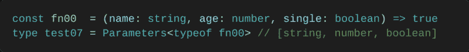**

**由于`Parameters`的魔力，我们从`fn00`中提取了参数类型。但是当你重新编码时，它就不那么神奇了:**

**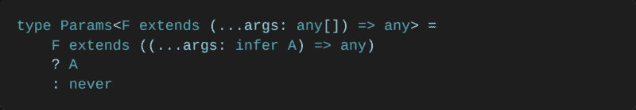**

**让我们来测试一下:**

**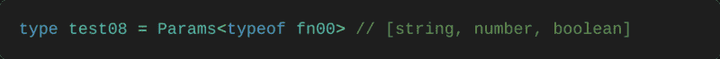**

**很好，它就像`Parameters`一样工作。不要怕`infer`，它是建筑类型最厉害的关键词之一。我们再练习一会儿后，我会更详细地解释它:**

#### **头**

**早些时候，我们了解到一个“经典的 curried”函数一次只接受一个参数。而且我们也看到，我们可以以元组类型的形式提取参数类型，非常方便。
所以`Head`接受一个元组类型`T`并返回它包含的第一个类型**。这样，我们就能知道一次必须采用什么类型的参数。****

**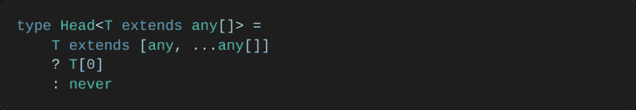**

**让我们来测试一下:**

**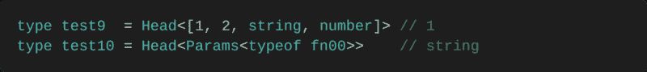**

#### **尾巴**

**一个“经典的”函数一个接一个地消耗参数**。这意味着当我们消耗了`Head<Params&`lt；F > >，我们需要以某种方式将 **e 转移到尚未消耗的 ne** xt 参数上。这是 Tail 的 `pur`姿势，它方便地删除一个元组可能包含的第一个条目。****

****从 TypeScript 3.4 开始，我们不能“简单地”删除元组的第一个条目。因此，我们将通过使用一个非常有效的技巧来解决这个问题:****

****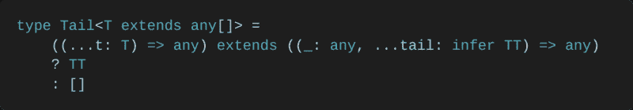****

****使用**函数类型**，我们能够告诉 TypeScript 推断出我们想要的元组。如果你还不明白，这不是问题，这只是热身，记得吗？****

****让我们来测试一下:****

********

#### ****哈斯塔尔****

****一个可定制的函数将返回一个函数，直到它的所有参数都被**消耗**。当我们调用`Tail`足够多次，以至于没有尾巴留下，没有东西留下来消耗时，就达到了这个条件:****

****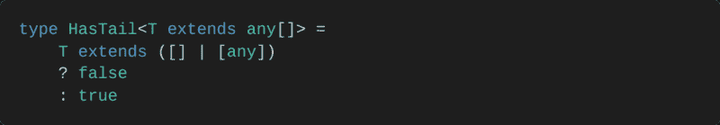****

****让我们来测试一下:****

****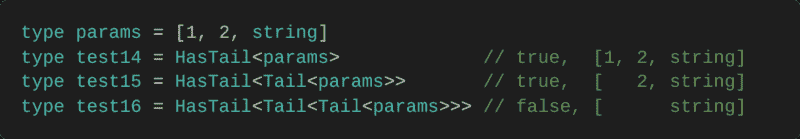****

### ****重要关键词****

****你遇到了三个重要的关键词:`**type**`、`**extends**`和`**infer**`。对于初学者来说，它们可能非常令人困惑，所以这些是它们传达的思想:****

*   ****`**extends**` :
    为了简单起见，你可以把它想象成我们亲爱的老
    JavaScript 的`**===**`。当你这样做的时候，你可以把一个`extends`语句看作一个简单的三元组，这样理解起来就简单多了。在这种情况下，`extends`被称为**条件类型**。****
*   ****`**type**` :
    我喜欢把一个类型想象成一个**函数**，但是对于类型来说。它有一个输入和一个输出，输入是类型(称为**泛型**)。输出取决于一个类型的“逻辑”，而`extends`就是那个逻辑块，类似于一个`if`子句(或三元)。****
*   ****`**infer**` :
    它是打字稿的放大镜，一个漂亮的检查工具，可以**提取困在不同种类结构里的类型**！****

****我认为你对`extends` & `type`都理解得很好，这就是为什么我们要多练习一下`infer`。我们将提取包含在不同泛型类型中的类型。你应该这样做:****

#### ****从对象中提取属性的类型****

****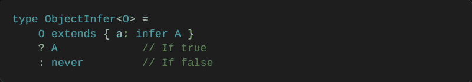****

****让我们来测试一下:****

****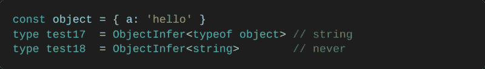****

******从函数类型中提取内部类型******

****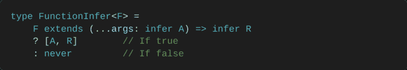****

****让我们来测试一下:****

****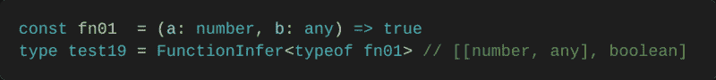****

******从类或接口中提取泛型******

****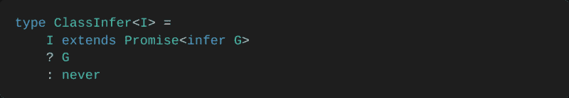****

****让我们来测试一下:****

****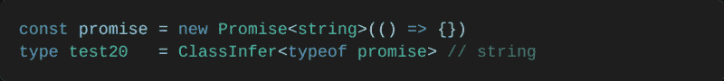****

******从数组中提取类型******

****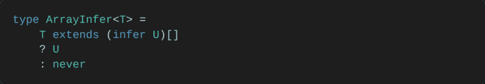****

****让我们来测试一下:****

****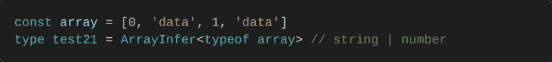****

******从元组中提取类型******

****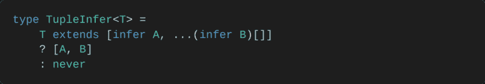****

****让我们来测试一下:****

********

****我们试图将元组的**剩余部分的类型推断为类型`B`，但是它没有像预期的那样工作。这是因为 TypeScript **缺少**一个允许我们**将一个元组解构为另一个元组的特性。有一个积极的提议可以解决这些问题，你可以期待未来元组操作的改进。这就是为什么`Tail`是这样构造的。********

**`infer`非常强大，它将是你**进行类型操作的主要工具**。**

**

Source: [Giphy](https://giphy.com/gifs/cheezburger-see-5K3Vw3jUqwV56)** 

### **咖喱 V0**

**热身？结束了，你也有了打造“经典咖喱”的知识。但是在我们开始之前，让我们(再次)总结一下它必须能够做什么:**

**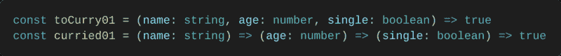**

**我们的第一个 curry 类型必须接受一个包含**参数** `P`和一个**返回**类型`R`的元组。**随** `P`的**长度变化的**递归**函数类型:****

**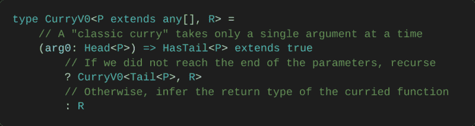**

**如果`HasTail`报告了`false`，则意味着**所有的**参数都被**消耗掉了**，是时候**从原始函数返回**返回类型`R`了。否则，还有参数**要消耗**，我们**在我们的类型中递归**。递归？是的，`CurryV0`描述了一个函数，只要有一个`Tail` ( `HasTail
 extend` s 为真)，该函数的返回类型就是`CurryV0`。**

**这就这么简单。下面是证据，没有任何实现:**

**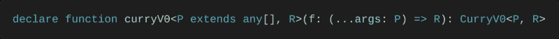****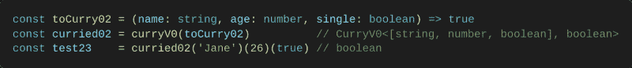**

**但是让我们一步一步地想象上面发生的递归:**

**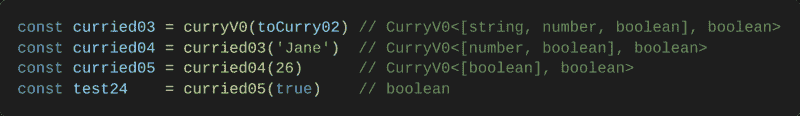**

**当然，类型提示适用于数量**无限**的参数？：**

**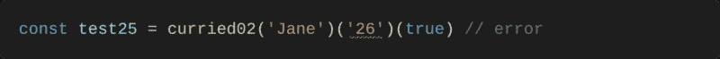**

### **咖喱 V1**

**很好，但是我们忘记了处理传递一个 **rest 参数**的场景:**

**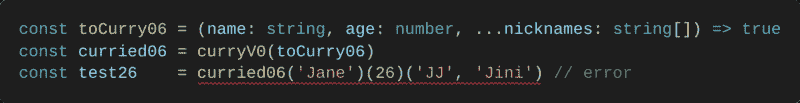**

**我们试图使用 rest 参数，但是它不起作用，因为我们实际上期望一个**单个**参数/自变量，我们之前称之为`**arg0**`。所以我们希望至少有一个参数`arg0`，并且我们希望在一个名为`rest`的 rest 参数中接收任何额外的(可选的)参数。让我们通过使用`Tail` & `Partial`升级来启用休息参数:**

**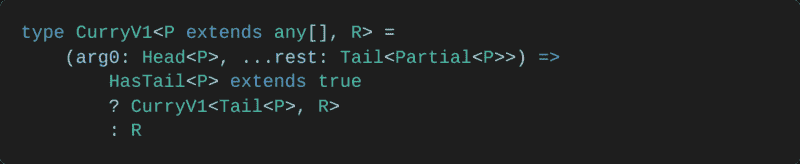**

**让我们来测试一下:**

**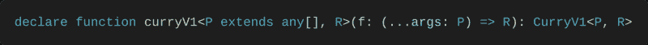****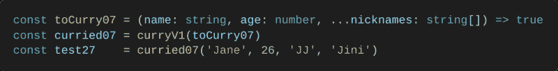**

**但是我们犯了一个可怕的错误:论点被消耗得很厉害。根据我们所写的，这不会产生一个 TS 错误:**

**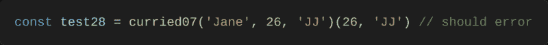**

**事实上有一个很大的**设计问题**，因为我们说过我们会强制采用单个`arg0`。不知何故，我们将需要**跟踪**每次**消耗**的参数。因此，我们将首先去掉`arg0`,并开始跟踪消耗的参数:**

**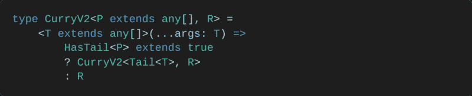**

**在那里，我们使用了一个名为`**T**`的**受约束的**泛型，它将**跟踪**任何获取的参数。但是现在，它完全被打破了，不再有类型检查，因为我们说过我们想要跟踪`**any[]**`类参数(约束)。不仅如此，`Tail`是完全无用的，因为它只在我们一次接受一个论点时有效。**

**解决办法只有一个:**再来点工具**？。**

### **递归类型**

**以下工具将用于确定接下来要使用的参数。怎么会？通过用`T`跟踪消耗的参数，我们应该能够**猜测剩下的**。**

**系好安全带！你将要学习另一种强大的技术？：**

#### **最后的**

**花点时间去理解这种复杂而又非常简短的类型。这个
示例将一个元组作为参数，并提取它的最后一个条目:**

**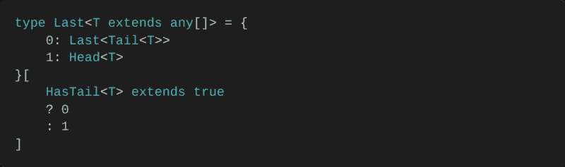**

**让我们来测试一下:**

**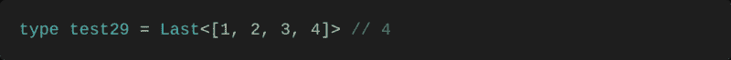**

**这个例子展示了条件类型在用作索引类型的**访问器**时的强大功能。一个什么？以命令行方式访问类型内部类型的条件类型。更直观的解释是:**

**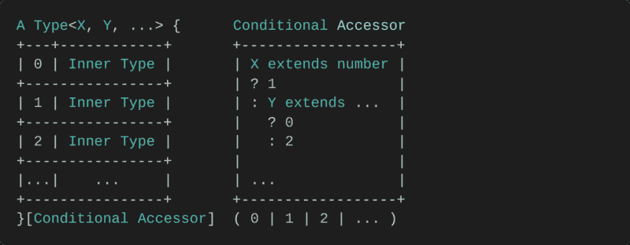**

**这种技术是一种理想的方法，也是像我们刚刚做的那样进行 T2 递归的安全方式。但是它不仅仅局限于递归，它是一种很好的、可视化的方式来组织复杂的条件类型。**

### **基本工具#1**

**我们说到哪了？我们说过我们需要工具来**追踪论点**。这意味着我们需要知道我们可以接受哪些参数类型，哪些已经被使用，哪些是下一个要使用的。让我们开始吧:**

#### **长度**

**为了进行上面提到的分析，我们需要对元组进行**迭代**。作为 TypeScript 3.4.x 的
，没有这样的迭代协议可以让我们自由迭代(像`for`)。映射类型可以从一种类型映射到另一种类型，但是对于我们想要做的事情来说，它们太有限了。所以，理想情况下，我们希望能够操纵某种**计数器**:**

**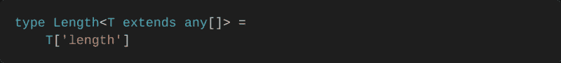**

**让我们来测试一下:**

**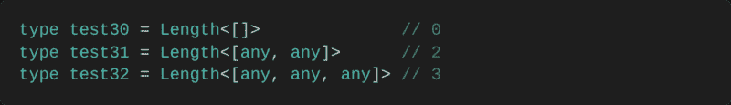**

**通过用`any`给添加一个元组，我们创建了一个类似于可以被**递增**的变量。然而，`Length`只是给出一个元组的大小，所以它也适用于任何其他类型的元组:**

**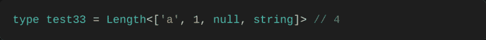**

#### **预先考虑**

**它通过使用我们的第一个 TS 技巧在元组`T`的**顶部**添加了一个类型`E`:**

**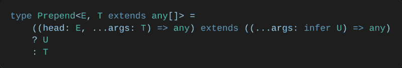**

**让我们来测试一下:**

**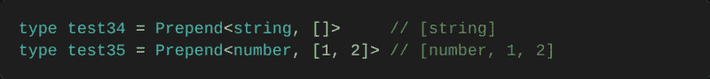**

**在`Length`的例子中，我们手动增加了一个计数器。所以`Prepend`是成为**计数器**底座的理想候选。让我们看看它是如何工作的:**

**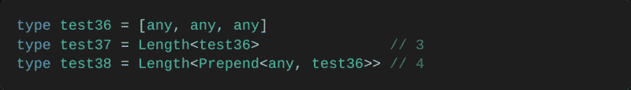**

#### **滴**

**它接受一个元组`T`并丢弃第一个`N`条目。为此，我们将使用我们在`Last`使用的相同技术和我们全新的计数器类型:**

**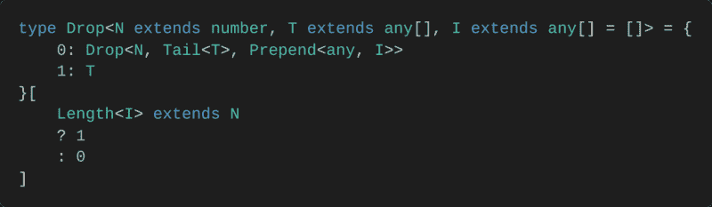**

**让我们来测试一下:**

**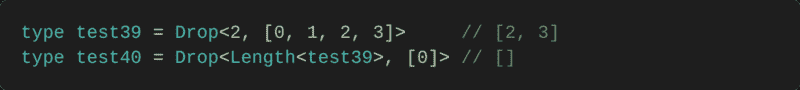**

**发生了什么事？**

**`Drop`类型将递归直到`Length<`；我看到了我们经过的 N 的 T2 值。换句话说，`i`index 0 的类型由条件存取器选择，直到满足该条件。而我们 `used Prepend&l`t；any，I>so**we**可以像在`loop. Thu` s 中一样增加一个计数器，Length < I >被用作递归计数器，这是一种自由迭代 TS 的方法。**

### **咖喱 V3**

**这是一条漫长而艰难的路，干得好！对你有奖励？。**

**现在，假设我们追踪到咖喱消耗了 2 个参数:**

**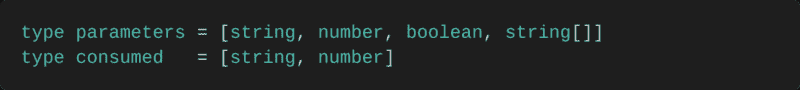**

**因为我们知道被消耗的参数的数量，所以我们可以猜测哪些参数还没有被消耗。多亏了`Drop`的帮助，我们才能做到这一点:**

**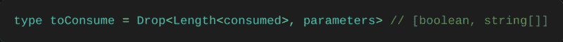**

**看来`Length`和`Drop`是珍贵的工具。所以让我们修补一下我们之前的库里版本，那个有一个坏了的`Tail`:**

**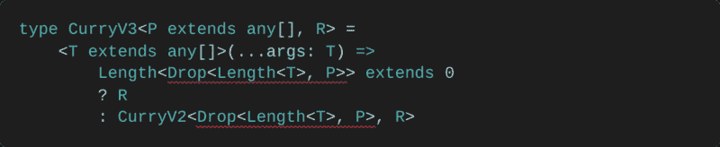**

**我们在这里做了什么？**

**首先，`Drop<Length<` T >，P >意味着我们去掉了消耗掉的参数。
那么，如果 th`e length of Drop&l`t；长度< T > `,` P >不等于 0 **，我们的 curry type h** as 继续用被丢弃的参数 **rs** 递归，直到……最后，当参数`ters w`的所有**被消耗完，被丢弃的参数的长度等于 0，，返回类型为 r****

**

Source: [Giphy](https://giphy.com/gifs/ice-goat-LumJYWwnr6fSg)** 

### **咖喱 V4**

**但是我们在上面得到了另一个错误:TS 抱怨我们的`Drop`不是类型`any[]`。有时候，TS 会**抱怨**a 型不是你期待的那种，但你知道它就是！因此，让我们向集合中添加另一个工具:**

#### **铸造**

**它要求 TS**针对类型`Y`重新检查** a 类型`X`，类型`Y`只有失败才会被执行。通过这种方式，我们能够停止 TS 的投诉:**

**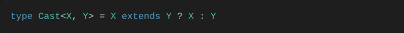**

**让我们来测试一下:**

****

**这是我们以前的咖喱，但这次没有任何抱怨:**

****

**还记得之前，当我们因为开始用`T extends any[]`跟踪消耗的参数而失去类型检查时吗？它已经通过铸造`T`到`Partial<`被固定；P >。我们添加了一个约束`t withCast<T,Pa`rtial
！**

**让我们来测试一下:**

************

### **库里 V5**

**也许你认为我们可以获取静止参数。嗯，我非常抱歉地通知你，我们还没有到那一步。这就是为什么:**

****

**因为 rest 参数可以**无限**，TS 最好的猜测是我们的 tuple 的长度是一个`number`，有点巧！所以，我们**在处理 rest 参数时不能**利用`Length`。别难过，没那么糟:**

****

**当所有非剩余参数消耗完后，`Drop<Length<`；T >，P >可以 `only ma` tch […any[]]。感谢 T2[any，…any]作为结束递归的条件。**

**让我们来测试一下:**

************

**一切都像魔咒一样管用？。你刚刚得到了一个聪明的，通用的，T2 式的咖喱。你很快就可以玩它了……但是在你玩之前，如果我告诉你我们的类型会变得更棒呢？**

### **占位符**

**有多牛逼？我们将让我们的类型能够**理解**的**部分应用**的任何论点组合，在任何立场上。根据 Ramda 的文档，我们可以通过使用名为`_`的**占位符**来实现。它指出，对于任何定制的函数`f`，这些调用都是等价的:**

****

**占位符或“空白”是一个抽象的事实，即我们没有能力或不愿意在某个时刻提供一个论点。让我们从定义什么是占位符开始。我们可以直接从拉姆达拿一个:**

****

**前面，我们已经学习了如何通过增加元组的长度来进行第一次类型迭代。事实上，在我们的计数器类型上使用`Length`和`Prepend`有点混乱。为了使**更清晰**，从现在开始我们将把那个计数器称为**迭代器**。以下是一些专门用于此目的的新别名:**

#### **位置**

**用它来查询迭代器的位置:**

****

#### **下一个(+1)**

**它提升了迭代器的位置:**

****

#### **上一个(-1)**

**它降低了迭代器的位置:**

****

**让我们来测试一下:**

****

#### **迭代程序**

**它在由`Index`定义的位置创建一个迭代器(我们的计数器类型),并且能够通过使用`From`从另一个迭代器的位置开始:**

****

**让我们来测试一下:**

****

### **基本工具#2**

**很好，那我们接下来做什么？每当占位符作为参数传递时，我们都需要**分析**。从那里，我们将能够判断一个参数是否被“跳过”或“推迟”。以下是更多用于此目的的工具:**

#### **反面的**

**信不信由你，我们仍然缺少一些基本的工具。会给我们所需要的自由。由于我们全新的迭代类型，它接受一个元组`T`并把它反过来变成一个元组`R`:**

****

**让我们来测试一下:**

****

#### **串联**

**而从`Reverse`，`Concat`就诞生了。它简单地获取一个元组`T1`，并将其与另一个元组`T2`合并。这有点像我们在`test59`所做的:**

****

**让我们来测试一下:**

****

#### **附加**

**由`Concat`、`Append`启用，可以在一个元组`T`的末尾添加一个类型`E`:**

****

**让我们来测试一下:**

****

### **差距分析**

**我们现在有足够的工具来执行**复杂类型检查**。但是距离我们讨论这个“gap”特性已经有一段时间了，它又是如何工作的呢？当一个间隙被指定为一个参数时，它的匹配参数是**结转**到下一步(待执行)。因此，让我们定义理解差距的类型:**

#### **加波夫**

**它在元组`T1`中迭代器`I`描述的位置检查占位符。如果找到，匹配类型为**，在`T2`的相同位置**采集，并通过`TN`结转(保存)到下一步:**

****

**让我们来测试一下:**

****

#### **的间隙**

**不要被这个打动。它通过`T1` & `T2`调用`Gap`，并将结果存储在`TN`中。完成后，它将来自`TN`的结果连接到留下来的参数类型(用于下一个函数调用):**

****

**让我们来测试一下:**

****

#### **缺口**

**这个难题的最后一块将被应用于被跟踪的参数`T`。我们将利用**映射类型**来解释用**占位符**替换任何参数是可能的:**

****

**一个映射类型允许一个人迭代和**改变另一个类型的属性**。在这种情况下，我们修改了`T`,这样每个条目都可以是占位符类型。感谢`?`，我们解释了`T`的每个条目都是可选的。这意味着我们不再需要在被跟踪的参数上使用`Partial`。**

**让我们来测试一下:**

****

**呃，我们从没说过我们可以带`undefined`！我们只是希望能够省略掉`T`的一部分。这是使用`?`运算符的一个**副作用**。但也没那么糟糕，我们可以通过用`NonNullable`重新映射来解决这个问题:**

****

**所以让我们把两者结合起来，得到我们想要的:**

****

**让我们来测试一下:**

****

### **咖喱 V6**

**我们已经为我们的咖喱制作了最后的工具。现在是时候把最后的碎片拼在一起了。提醒你一下，`Gaps`是我们对`Partial`的新替代，`GapsOf`将取代我们之前的`Drop`:**

****

**让我们来测试一下:**

****

**为了确保一切按预期运行，我将强制 curried 示例函数采用的值:**

********

**只是有一个小问题:看起来我们有点领先于 Ramda！我们的类型可以理解非常复杂的占位符用法。换句话说，当与 rest 参数结合使用时，Ramda 的占位符**不起作用**？：**

********

**然而，即使这看起来完全正确，也会导致完全崩溃。这是因为 Ramda 的 curry 实现没有很好地处理**占位符和 rest 参数**的组合。这就是为什么我和 Ramda 在 Github 上开了一张票，希望我们刚刚创建的类型有一天能和库和谐地工作。**

**

Source: [Giphy](https://giphy.com/gifs/jess-3osxYciDsUpfwZXZV6)** 

### **咖喱菜肴**

**这很可爱，但是我们还有最后一个问题要解决:**参数提示**。我不知道你，但是我经常使用参数提示。知道您正在处理的参数的名称是非常有用的。上面的版本不允许这种提示。解决方法如下:**

****

**我承认，这太糟糕了！然而，我们得到了 **Visual Studio 代码**的提示。我们在这里做了什么？我们只是替换了以前分别代表参数类型和返回类型的参数类型`P` & `R`。取而代之的是，我们使用了**函数类型** `F`，从中我们提取了与`Parameters<`等价的`P`；F>T5 和 R `with ReturnT`型< F >。因此，TypeScript 能够保留参数的名称，即使是在 currying 之后:**

****

**只有一点:当使用 gap 时，我们会丢失参数的名称。**

**只给 IntelliJ 用户一句话:你将无法从适当的提示中获益。我建议您尽快切换到 Visual Studio 代码。它是社区驱动的，免费的，更快，并且支持 IntelliJ 用户的键绑定。:)**

### **临终遗言**

**最后，我想告诉你，目前有一个关于[可变类型](https://github.com/Microsoft/TypeScript/issues/5453)的提议。你在这里学到的东西不会过时——这个提议旨在简化最常见的**元组类型操作，所以这对我们来说是一件非常好的事情。在不久的将来，它将实现更简单的元组连接，如我们已经构建的`Append`、`Concat`和`Prepend`，以及析构和描述可变函数参数的更好方法。****

**就是这样。我知道一下子要消化很多东西，所以这就是为什么我发布了这篇文章的一个[开发者版本](https://github.com/pirix-gh/medium/blob/master/types-curry-ramda/src/index.ts)。可以克隆它，测试它，用 TypeScript 3.3.x 及以上版本修改它。把它放在身边，并从中学习，直到你对不同的技术更加适应？。**

****击掌？如果你喜欢这篇指南，请继续关注我的下一篇文章！****

****编辑:** [适用于 Ramda 0.26.1](https://github.com/DefinitelyTyped/DefinitelyTyped/pull/33628)**

****感谢阅读**。如果您有任何问题或意见，欢迎您
留下您的评论。**