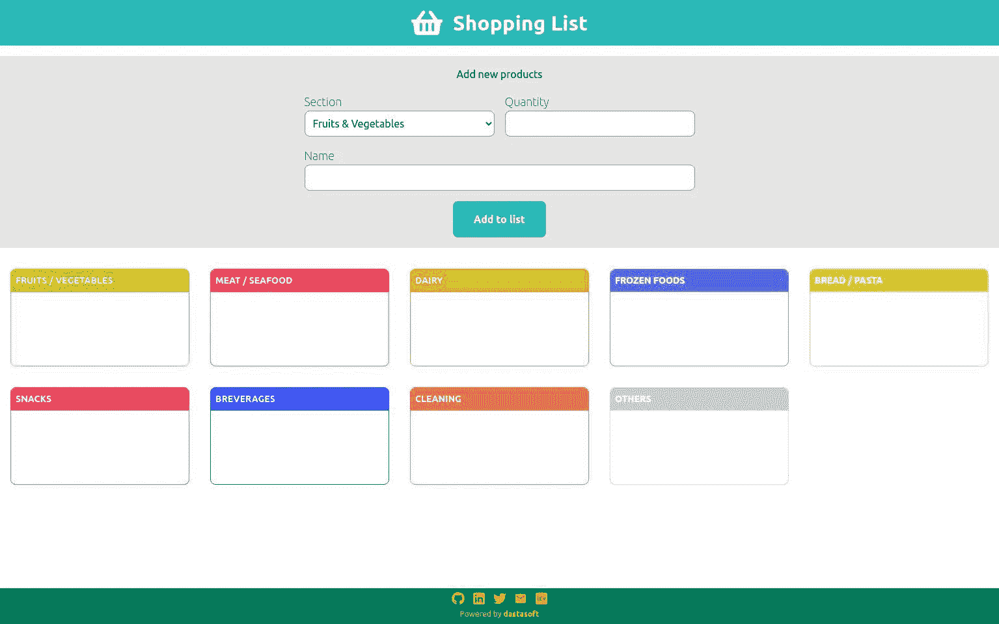
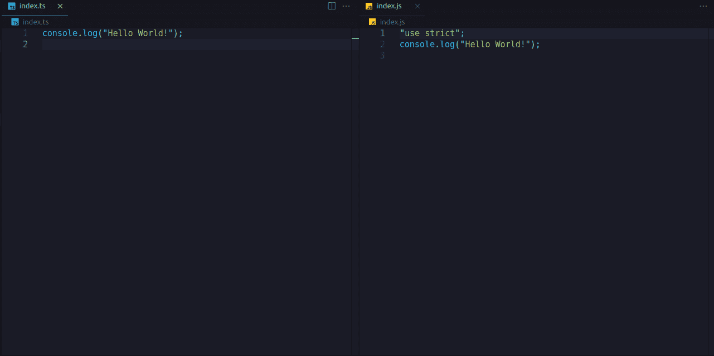
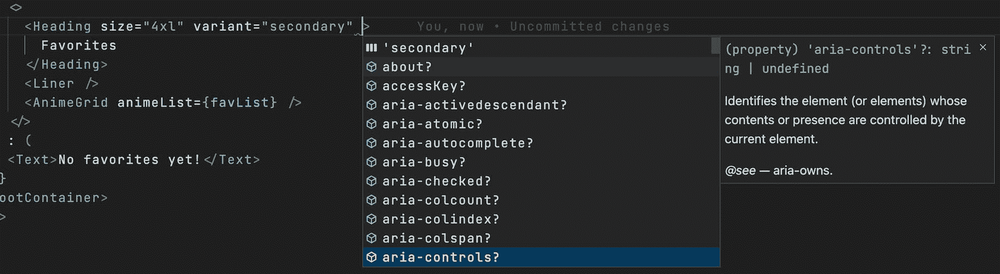
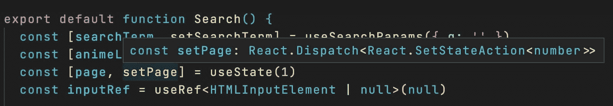

# 面向 React 开发人员的 TypeScript——为什么 TypeScript 有用以及它是如何工作的

> 原文：<https://www.freecodecamp.org/news/typescript-for-react-developers/>

如果您使用 React 已经有一段时间了，您可能已经注意到 JavaScript 的自由和野性有时会对您不利(并不是因为 JS😄).如果你在团队中工作，这一点尤其明显。

你可能不知道，但是你需要 TypeScript——或者至少，你需要测试它。

让我说清楚，我喜欢 JavaScript 和它提供的自由。事实上，很长一段时间我都“反对”打字稿。

所以我想一起踏上一段旅程，弄清楚 TypeScript 到底是值得使用还是只适合不知道如何正确编码的人(这是很久以前我团队里的一个内部笑话！).

这篇文章背后的想法是通过基本的 TS 和理解的好处。这将帮助你决定是否想要这些好处。然后在本文的第二部分，我将用 React 介绍 TS 的细节。

## 目录

*   [资源](#resources)
*   [为什么要用 ESLint，beautiful，Husky？](#whyuseeslintprettierandhusky)
*   [什么是 TypeScript？](#whatistypescript)
*   [为什么要费心处理 TS？](#whybotherdealingwithts)
*   [如何设置打字稿](#howtosetuptypescript)
*   [样本购物清单项目](#sampleshoppinglistproject)
    *   [打字脚本模块](#typescriptmodules)
    *   [打字稿类型](#typescripttypes)
        *   [打字稿中的推断](#inferenceintypescript)
        *   打字稿中的 [`any`和`unknown`](#anyandunknownintypescript)
        *   [TypeScript 中的数组](#arraysintypescript)
        *   [打字稿中的对象](#objectsintypescript)
        *   [打字稿中的别名](#aliasesintypescript)
    *   [打字稿中的函数](#functionsintypescript)
        *   [类型脚本中的可选参数](#optionalparametersintypescript)
    *   [打字稿列举](#typescriptenums)
    *   [类型脚本泛型](#typescriptgenerics)
    *   [类型脚本中的元组](#tuplesintypescript)
    *   [类型脚本中的类](#classesintypescript)
    *   [类型脚本中的接口](#interfacesintypescript)
    *   [TypeScript 中的 DOM 操作](#dommanipulationintypescript)
*   [如何组合 React + TypeScript](#howtocombinereacttypescript)
    *   [设置](#setup)
    *   [打字组件道具](#typingcomponentprops)
        *   [反应内置类型](#reactbuiltintypes)
        *   [反应组件的返回类型](#returntypeofareactcomponent)
        *   [与模板文字的组合](#combinationswithtemplateliterals)
        *   [如何使用`Exclude`](#howtouseexclude)
        *   [自定义 HTML 组件](#customhtmlcomponents)
    *   [打字挂钩](#typinghooks)
        *   [使用状态挂钩](#usestatehook)
        *   [useReducer 挂钩](#usereducerhook)
        *   [使用上下文](#usecontext)
        *   [useRef hook](#userefhook)
    *   [转发参考](#forwardingref)
    *   [如何在 React 中使用 TypeScript 泛型](#howtousetypescriptgenericsinreact)
    *   [键入自定义的 useFetch 挂钩](#typingacustomusefetchhook)
*   [结论](#conclusion)

## 资源

以下是一些小样本:

*   [创建 React App + TypeScript + ESLint +更漂亮的样板文件](https://github.com/dastasoft/react-boilerplate/tree/cra-typescript)
*   [Vite+TypeScript+ESLint+beauty 样板文件](https://github.com/dastasoft/react-boilerplate/tree/vite-typescript)

如果你喜欢编程游戏，试试 [PhaserJS](https://phaser.io/) 。你可以用 TypeScript 为浏览器制作游戏，这是一种有趣的学习方式。

也一定要查看 TS 的官方手册[。它有大量有用的文档和例子。](https://www.typescriptlang.org/docs/handbook/intro.html)

此外，我们将查看两个示例项目，以便您可以参考一些真实的代码并测试真实的实现。他们在这里:

### 购物清单项目



这是一个测试 TypeScript 开发人员体验的简单项目，没有 Webpack、React 或任何其他附加组件——只是将普通的 TypeScript 转换为 JavaScript。

*   [工作实例](https://shopping-list.dastasoft.com/)
*   [源代码](https://github.com/dastasoft/shopping-list)

### 动漫培训项目


为了集成 TypeScript 和 React，我构建了另一个示例项目。这是一个虚拟的应用程序，感谢 [JikanAPI](https://jikan.moe/) ，它提供了一个动画列表和基本信息来观看你最喜欢的动画的最新预告片。

*   [工作实例](https://animetrailers.dastasoft.com/)
*   [源代码](https://github.com/dastasoft/animetrailers)

## 为什么要用 ESLint，beautiful，Husky？

在样板文件上，我倾向于使用 Airbnb 的 ESLint 规则、appellite 的推荐规则和 Husky 的预提交操作。这非常有用，尤其是在团队环境中，你需要每个人都遵循相同风格的代码。但是你也可以作为一个单独的开发者或学习者而受益。

Airbnb 的规则有时可能很奇怪，但它们提供了很好的解释和例子。这样你就可以决定这个规则对你是否有意义。如果没有，您可以在`.eslintrc`文件中禁用它。

我发现，对于初级开发人员或刚开始学习 JS 或 TS 的人来说，这些规则非常有用。所以我建议你至少试着把它们包含在一个项目中，并检查结果。😉

## 什么是 TypeScript？

TypeScript 或 TS 是由微软开发和维护的开源语言。以下是关于 ts 的一些其他事实:

*   它是一种多范式语言(像 JavaScript 一样)。
*   它是 JavaScript 的替代品(更准确地说，是一个超集)
*   它允许使用静态类型
*   它有额外的特性(泛型、接口、元组等，这些将在下面详细解释)
*   它允许逐步采用(也就是说，uou 可以通过逐个更改文件，将现有项目变成 TS 项目，这不是一个大变革)。
*   你可以用它进行前端和后端开发(就像 JS 一样)

浏览器不理解 TS 代码。必须是*转码*成 JS。JS 有一个动态类型映射值，而 TS 有静态类型，不太容易出错。

在 React 中，你已经用[巴别塔](https://babeljs.io/)对 JS 进行了*转译，所以现在不得不*转译*代码并不是一个额外的不便。*

## 为什么要费心处理 TS？

这就是问题所在——当你对 JS 很满意，一切都很好的时候，为什么还要为 TS 烦恼呢？不久前，正如我之前所说的，我们有一个关于带类型的 TS 等语言的内部笑话(顺便说一下，我当时正在做 Java)。我的团队开玩笑说，如果你不知道如何正确编码，你就需要类型。

TypeScript、Java 和许多其他语言都有**静态类型**来定义与变量相关的类型。将在编译时检查该类型。一旦你将某个东西定义为一个*字符串*或者一个*布尔值*，你就不能改变它的类型。

另一方面，JavaScript 有**动态类型**。这意味着你可以把一个字符串赋给一个变量，然后把它转换成一个布尔值、一个数字或者任何你想要的东西。该类型将在运行时动态分配。

但是当你在网上看 TS 代码的时候，你可以看到...


所以回到我的团队的老笑话，的确是正确的**:如果你确切地知道你在做什么，你不需要有人不断地告诉你这是一个字符串，只是一个字符串，如果在某个时候它变成了一个布尔值或其他什么....我知道我在做什么！**

 **但事实是我们并不完美，事情会发生:

*   匆忙工作。
*   今天过得很糟糕。
*   星期五留下一个想法，当你星期一回来时，你对情况没有同样的了解。
*   在团队中工作，并不是每个人都有相同的水平和/或视野。

出于同样的原因，我们使用 IDE、IDE 扩展、语法高亮和 linters 来代替记事本应用程序。TypeScript 可以适合这些辅助工具。


### 一些常见错误的例子

让我们看看等式中有和没有 TS 的一些基本示例:

#### 拜托，我知道我在用什么

```
// App.js
import { MemoryRouter as Router } from 'react-router-dom'

import Routes from './routes'

export default function App() {
  return (
    <Router basename="/my-fancy-app">
      <Routes />
    </Router>
  )
} 
```

你在上面的代码中发现什么异常了吗？如果是的话，恭喜你自己。

这个文件在我的样板文件里放了很长时间。这不是一个错误，但...`MemoryRouter`根本不需要任何`basename`。发生这种情况是因为在过去的某个时候使用了`BrowserRouter`，这实际上需要一个`basename`属性。

使用 TS，您将被告知`No overload matches this call`,它告诉您没有具有该属性的组件的签名。

TypeScript 不仅仅是静态类型，它还能帮助你更好地理解其他库的需求。我所说的其他人是指来自第三方或您的同事的组件和功能。

是的，我能听到答案——你必须正确地知道你正在使用的库，是的，你是对的。但是，假设参与项目的每个人都知道每个“外部”库和版本的细微差别可能是一项艰巨的任务。

#### 魔鬼的旗帜

```
let isVerified = false;
verifyAmount();

// isVerified = "false"
if (isVerified) proceedPayment(); 
```

这个错误我见过很多次了。我没有确切的代码，每次都有不同的细微差别，但你可以得到要点。你有一个 boolean 变量，负责让一些代码运行或不运行，在某个时候，其他人(或者你自己出错了)把 boolean 变量转换成一个字符串，一个非空的字符串是一个真值。

使用 TypeScript，您可能会遇到错误:`The type 'string' is not assignable to the type 'boolean'`。即使您的应用程序当时没有运行，这个错误也会在编译时发生。因此，错误出现在生产中的几率非常小。

同样，我们可以像以前一样应用同样的规则——如果你编码正确，这不会发生。如果你遵循干净代码的规则，并且小心你正在做的事情，这也是可以避免的。TypeScript 并不意味着允许我们懒惰和无组织——但它可以是一个很好的盟友,因为语法高亮可以帮助避免一些错误或检测未使用的变量。

#### 我以为这只猫在盒子里是活的

```
const MONTH_SELECT_OPTIONS = MONTHS.map((month) => ({
  label: getMonthName(month),
  value: month,
}))

export default function PaymentDisplayer() {
  const [currentMonthFilter, setCurrentMonthFilter] = useState(
    MONTH_SELECT_OPTIONS[0]
  )

  const onChangeHandler = option => {
    setCurrentMonthFilter(option.value)
  }

  return (
    <select onChange={onChangeHandler}>
      {MONTH_SELECT_OPTIONS.map(({ label, value }) => (
        <option key="value" value={value}>
          {label}
        </option>
      ))}
    </select>
  )
} 
```

改变一个状态的类型是非常常见的(也许不推荐)。有时这是故意的，比如设置一个`isError`标志，然后突然将它从布尔值 false 更改为错误消息字符串(同样完全不推荐！).但在其他情况下，这是错误的，就像上面的例子。

最初写这个的人认为在`currentMonthFilter`中他们会存储选择的实际选项，一个带有标签和值的`HTMLOptionElement`。后来，同一个人在另一天(或者可能是另一个开发人员)制定了`changeHandler`，并设置了值而不是完整的选项。

上面的例子是可行的，为了便于学习，对它进行了简化。但是在大范围内想象一下，特别是在那些动作作为道具在下面传递的组件中。

这里，TypeScript 将在两个方面帮助我们:

*   当试图将`currentMonthFilter`的类型从`{label: string, value: number}`更改为`number`时，静态类型会抛出一个错误。
*   编写调用服务的下一步代码的人将通过 *IntelliSense* 知道他们将从状态中获得什么类型，以及它是否匹配服务需要的类型。

因此，TypeScript 还允许我们从 IDE 中检查第三方库的不同功能、参数和文档以及我们的同行的组件。

通过这些例子(老实说可能不太具有代表性)，我们可以得出结论，TypeScript 试图在 React 环境中帮助我们:

*   在类型上是一致的，并且与静态类型一致
*   提供可用可能性的文档和*智能感知*
*   尽早发现漏洞

## 如何设置 TypeScript

在本文中，我们将使用全局安装。这是因为我认为最好先孤立地研究一下 TypeScript，不要有任何 Webpack、React 或任何其他变量，看看它是如何工作的，它解决了什么问题。

### 如何全局安装 TypeScript

```
npm install -g typescript

#or

yarn install --global typescript 
```

### TypeScript 编译器的工作原理(tsc)

一旦在您的系统上安装了 TypeScript 或上面提到的任何其他选项，您就可以使用 TypeScript 编译器，使用`tsc`命令。

让我们用最低配置测试编译器:

*   创建一个新的空文件夹
*   放置一个内部有基本 HTML5 结构的`index.html`。
*   在与`index.html`相同的级别创建一个空的`index.ts`文件。
*   打开一个终端并键入`tsc --init`(假设您已经安装了 global TypeScript)这将为您创建一个`tsconfig.json`(我们将在下一节详细查看该文件)。

你会得到这样的东西:

```
- index.html
- index.ts
- tsconfig.json 
```

```
<!DOCTYPE html>
<html lang="en">
  <head>
    <meta charset="UTF-8" />
    <meta http-equiv="X-UA-Compatible" content="IE=edge" />
    <meta name="viewport" content="width=device-width, initial-scale=1.0" />
    <title>Document</title>
  </head>
  <body></body>
</html> 
```

现在您需要在 HTML 中包含 TS 文件。但是浏览器不理解 TypeScript，它们理解 JavaScript，所以您可以将您的`index.html`修改为:

```
<!DOCTYPE html>
<html lang="en">
  <head>
    <meta charset="UTF-8" />
    <meta http-equiv="X-UA-Compatible" content="IE=edge" />
    <meta name="viewport" content="width=device-width, initial-scale=1.0" />
    <title>Document</title>
  </head>
  <body></body>
  <script src="./index.js"></script>
</html> 
```

打开一个新的终端，输入`tsc`。您的`index.ts`文件将被转换成浏览器可以读取的`index.js`。

不用每次想把 TS 文件编译成 JS 文件时都键入`tsc`命令，可以用`tsc -w`把 TypeScript 置于监视模式。

现在我的建议是你同时打开 TS 和 JS 文件。然后在`index.ts`文件中键入常规的 JS，并测试输出是什么。(我们将在下一节中大量使用这一点来测试 TS 生成了什么)。



### `tsconfig.json`里有什么

如果您正在阅读本文，那么您已经用`tsc --init`命令创建了这个文件。它创建了带有一些默认配置和一堆注释的`tsconfig.json`,这些都是很好的开始。

让我们看看一些可能对您有帮助的属性:

*   是我们要将 TS 代码转换成的 JS 版本。根据您想要支持的浏览器，您可能需要设置一些旧版本。这也是一个很好的学习资源——尝试使用不同的版本，看看会生成什么样的 JS 代码。
*   定义你将为模块使用什么样的语法。`commonjs`也就是默认使用`require/module.exports`，现代 JS (ES6+)使用`import/export`。如果您想使用`import/export`，您需要将`target`更改为 ES6 或更高版本。在示例项目中，我们将使用这种语法，因此请查看本文的其余部分。
*   你需要它来指定你将在你的项目中使用的额外的库，并检查额外的类型，例如 DOM related。
*   在 React 中，你至少需要将它设置为`preserve`。这种模式假设另一个工具将编译该部分(在这种情况下是 Babel ),但是 TSC 将进行类型检查。您可以将该属性设置为`react`或`react-native`。如果您想让 TSC 将您的 JSX 代码编译成常规的 JS 代码，您可以使用它。在大多数情况下，我们会把这个属性留给`preserve`,它会像普通的 JSX 一样发送文件，Babel/Webpack 会完成剩下的工作。
*   `outDir`编译后文件将被放在哪里，例如在大多数 React 项目中，它将被放在一个`build`文件夹中。
*   `rootDir`文件将被编译到哪里。在大多数 React 项目中，这将是`./src`。
*   `strict`启用一组类型检查规则，这将导致对被认为“正确”的内容进行更强有力的检查/我建议您在学习时从 on false 开始。然后当你足够自信时，打开它，检查你有什么新的危险信号。但是请记住，启用此选项后，您将获得 TS 的全部潜力。此选项还会启用下面所有严格的选项，您可以单独禁用这些选项。
*   `include`要编译的文件夹，例如`src`文件夹
*   `exclude`您希望阻止编译的文件夹，例如`node_modules`文件夹。

在本文的示例项目中，我们将从`./src`中取出文件`rootDir`,并将它放在`public`文件夹中的`outDir`。

## 示例购物清单项目

示例项目是非常基本的东西:您可以在购物清单的不同部分插入不同的项目及其数量。然后你可以在购物的时候把它们拿掉，检查下一步要买什么。

这个示例项目背后的想法是习惯于 TypeScript 和一般的工作流。一旦您进入 React 环境，Webpack 或任何其他捆绑软件就会为您完成许多神奇的事情。所以我认为重要的是了解最基本的东西，然后享受捆绑工为你做的工作。

让我们看看我们可以从 TS 中得到什么，以获得一个更好的、更少出错的代码库。

### 类型脚本模块

如果您想使用 ES6 `import/export`模块，您必须配置`tsconfig`:

*   **目标** : es6 或更高
*   **模块** : es2015 或更新版本

在`index.html`文件中，您必须像这样添加模块类型:

```
<script type="module" src="app.js"></script> 
```

但是请记住，使用模块有两个缺点:

*   不太可能与旧浏览器兼容。
*   生产中的文件将被分割，因此您将对每个文件有多个请求(这可以通过使用 Webpack 之类的捆绑器来解决)。

### 类型脚本类型

在 JavaScript 中，类型是在运行时分配的。当解释器看到你的变量和值时，它决定它是什么类型。这意味着我们可以这样做:

```
let job = "Warrior"; // string
let level = 75; // number
let isExpansionJob = false; // boolean

level = "iLevel" + 75 
// now it's an string 
```

在 TypeScript 中，类型是在编译时分配的。因此，一旦类型被定义，它将受到该签名的保护。

```
let job: string = "Samurai";
let level: number = 75;
let isExpansionJob: boolean = true;

level = "iLevel" + 75 
// Error, Type string cannot
// be assign to type number! 
```

#### 打字稿中的推理

事实上，没有必要明确说明您希望变量是什么类型。TS 可以通过它的值来推断类型。

```
let job = "Samurai";
let level = 75;
let isExpansionJob = true;

level = "iLevel" + 75 
// Error, Type string cannot 
// be assign to type number! 
```

在 React 中，我们将在本文的第二部分详细讨论，你也将看到推论——例如在`useState`中

```
const [currentMonthFilter, setCurrentMonthFilter] = useState("January")

useEffect(() => {
   setCurrentMonthFilter(1) 
   // Error, Type number cannot 
   // be assign to type string!
}, []) 
```

#### 打字稿中的`any`和`unknown`

我一直说 TS 有静态类型，但是这种说法有细微差别。

```
let level: any = 10;

level = "iLevel" + 125; 
// OK, still type any

level = false; 
// OK, still type any 
```

欢迎回到 JavaScript！`any`是一个动态类型，当你不知道这个变量将来会是什么类型时——但是它在某种程度上逆转了 TS 提供的所有优势。

```
let level: any = 10;

level = "iLevel" + 125;

level = false;

let stringLevel: string = level;
console.log(typeof stringLevel);
stringLevel.replace("false", "true"); 
```

当你将`level`赋值给`string`类型的`stringLevel`时，它不会变成一个字符串，它仍然是一个布尔值。所以`replace`函数不存在，代码在运行时失败。你会得到`Uncaught TypeError: stringLevel.replace is not a function`。

为此，我们有另一种类型，它是`any`类型的安全对应物:

```
let level: unknown = 10;

level = "iLevel" + 125;

level = false;

let stringLevel: string = level; 
// Error 
```

使用`unknown`，你可以像在`any`中一样分配任何类型，但是这一次当你试图分配给另一个类型时，编译器会得到错误。所以如果你不知道它会是什么类型，试着用`unknown`代替`any`。

#### TypeScript 中的数组

```
let job = "Red Mage";
let level = 75;
let isExpansionJob = false;
let jobAbilities = ['Chainspell', 'Convert'];

jobAbilities.push('Composure'); // OK
jobAbilities.push(2); // Error
jobAbilities[0] = 2; // Error 
```

在上面的例子中，我们声明了一个字符串数组`jobAbilities`。我们可以添加更多的字符串，但不能添加其他类型或将当前值更改为其他类型的值。这是因为在声明中我们已经做出了类型`string[]`的推断。

```
let job = "Red Mage";
let level = 75;
let isExpansionJob = false;
let jobAbilities = ['Chainspell', 'Convert'];
let swordSkill = ["B", 5, 144, 398]; 

swordSkill.push("B+"); // OK
swordSkill.push(230); // OK

swordSkill[1] = "C"; 
// OK, the type is not position related

swordSkill.push(true); // Error 
```

和前面的例子一样，类型推断是在声明中完成的。我们现在为`swordSkill`声明一个字符串和数字的数组。

如果您想显式声明我们在示例中看到的数组的类型:

```
let jobAbilities: string[] = ['Chainspell', 'Convert'];
let swordSkill: (string | number)[] = ["B", 5, 144, 398]; 
```

对了，`|`是做一个不同类型的`union`。

#### 类型脚本中的对象

让我们回到这个例子，但现在是以一个对象的形式:

```
let job = {
  name: "Summoner",
  level: 75,
  isExpansion: true,
  jobAbilities: ["Astral Flow", "Elemental Siphon"]
};

job.name = "Blue Mage"; // OK
job.level = "Four" // Error
job.avatars = ["Carbuncle"]; // Error 
```

*   无法完成，因为我们无法更改属性的类型。属性也有静态类型。
*   `job.avatars = ["Carbuncle"]`–我们不能添加新属性，因为`job`对象已经有一个已定义结构的类型。

```
let job = {
  name: "Summoner",
  level: 75,
  isExpansion: true,
  jobAbilities: ["Astral Flow", "Elemental Siphon"]
};

job = {
  name: "Blue Mage",
  level: 4,
  isExpansion: true,
  jobAbilities: ["Azure Lore", "Burst Affinity"]
}; // OK

job = {
  name: "Corsair",
  level: 25,
  isExpansion: true
}; // Error 
```

我们可以分配另一个对象，因为我们将对象定义为`let`，但它必须是完全相同的形式。

花点时间想一想:在没有任何类似检查的情况下，你在前端重复了多少次对象结构？有多少次你输入`data.descrption`时打错了，几天后你发现了错误？如果没有，我可以向你保证，这将是迟早的事。

让我们检查一下示例的显式类型:

```
let job: {
  name: string;
  level: number;
  isExpansion: boolean;
  jobAbilities: string[];
} = {
  name: "Summoner",
  level: 75,
  isExpansion: true,
  jobAbilities: ["Astral Flow", "Elemental Siphon"]
}; 
```

正如你所看到的，对于一个简单的对象来说，这个变得有点大，所以在这种情况下我们可以使用`type aliases`。

#### TypeScript 中的别名

```
type Job = {
  name: string;
  level: number;
  isExpansion: boolean;
  jobAbilities: string[];
};

let Summoner: Job = {
  name: "Summoner",
  level: 75,
  isExpansion: true,
  jobAbilities: ["Astral Flow", "Elemental Siphon"]
};

let BlueMage: Job = {
  name: "Blue Mage",
  level: 4,
  isExpansion: true,
  jobAbilities: ["Azure Lore", "Burst Affinity"]
}; 
```

使用类型别名，我们可以定义一个通用类型来重用。在 React、DOM 和其他库中，您会发现许多现成的已定义类型。

### 类型脚本中的函数

函数的语法与 JS 非常相似，但是您可以指定参数的类型和返回的类型。

```
type Enemy = {
  name: string;
  hp: number;
  level: number;
  exp: number;
};

let attack = (target: Enemy) => {
  console.log(`Attacking to ${target.name}`);
};

attack = "Hello Enemy"; // Error 
```

我使用了一个箭头函数，但是你也可以使用常规的函数声明。JS 和 TS 在功能上有两个主要区别:

*   您指定传递给函数的参数的类型，就像我们的`target: Enemy`。
*   变量`attack`被赋予了函数返回的类型，所以你不能在之后改变它的类型。

该函数的类型描述如下:

```
let attack = (target: Enemy): void => {
  console.log(`Attacking to ${target.name}`);
}; 
```

当返回类型为 nothing 时使用`void`类型，也不需要显式设置类型:

```
// let attack = (target: Enemy): number => {
let attack = (target: Enemy) => {
  return target.hp - 2;
}; 
```

与`any`一样，`void`类型也有一些细微差别:

```
let attack = (target: Enemy): void => {
  console.log(`Attacking to ${target.name}`);
};

attack = (target: Enemy): number => {
  return target.hp - 2;
};

// lizard has 200hp
console.log(attack(lizard)); // 198 
```

上面的例子没有错误——即使你认为你已经把`attack`从`(target: Enemy) => void`变成了`(target: Enemy) => number`，它仍然是`void`。

如果你先用`number`定义函数，看看会发生什么。

```
let attack = (target: Enemy) => {
  return target.hp - 2;
};

attack = (target: Enemy) => {
  console.log(`Attacking to ${target.name}`);
}; // Error

let attackResult = attack(lizard); 
```

`Type '(target: Enemy) => void' is not assignable to the type '(target: Enemy) => number'`。`Type 'void' is not assignable to the type 'number'`。因此，`void`在这个场景中充当`any`。

对于`attackResult`，类型将为`number`。没有必要指定它——TS 将从函数的返回类型中推断类型。

#### TypeScript 中的可选参数

您可以使用`?`在函数中定义可选参数。

```
let heal = (target: Player | Enemy, spell: Spell, message?: string) => {
  if (message) console.log(message);
  return target.hp + spell.power;
};

heal(player1); // Error
heal(player1, cure, "Healing player1"); // OK
heal(skeleton, cure); // OK 
```

第一个调用不行，因为我们至少需要传递两个参数，但是第二个和第三个就可以了。`message`是可选参数。当未通过时，它将作为`undefined`被接收。

如果将最后一个例子与一个简单的 JS 函数进行比较:

```
let heal = (target, spell, message) => {
  if (message) console.log(message);
  return target.hp + spell.power;
};

heal(player1); // Error
heal(player1, cure, "Healing player1"); // OK
heal(skeleton, cure); // OK 
```

基本的行为是一样的，但是不同的是错误会在运行时出现，因为在第一次调用中你不能从一个未定义的值调用`power`。

从这些例子中可以看出，在 TS 中使用函数更安全，因为您不需要依赖外部发生的事情。你知道什么参数必须到达，它们采取什么形式。

使用你的函数的人也是一样:他们会确切地知道需要什么参数，形式，以及他们将从函数中得到什么。

### 类型脚本枚举

使用枚举，我们可以定义一个常量集合。

```
enum BattleMenu {
  ATTACK,
  MAGIC,
  ABILITIES,
  ITEMS,
  DISENGAGE
}

enum Equipment {
  WEAPON = 0,
  HEAD = 1,
  BODY = 2,
  HANDS = 3,
  LEGS = 4
}

console.log(BattleMenu.ATTACK, Equipment.WEAPON); 
// 0 0 
```

默认情况下，枚举是自动索引的——上例中的两个语句是等效的。

枚举也可以存储字符串。例如，在 React 中，我经常使用枚举来存储路径:

```
enum Routes {
  HOME = "/",
  ABOUT = "/about",
  BLOG = "/blog"
} 
```

### 类型脚本泛型

```
const getPartyLeader = (memberList: Player[]) => {
  return memberList[0];
};

const partyLeader = getPartyLeader(partyA); 
```

我们想实现一个`getPartyLeader`函数，它返回数组中第一个团队的领导组。

如果我们想支持除了`Player`以外的其他类型怎么办？我们现在可以想出这个解决方案:

```
const getPartyLeader = (memberList: Player[] | Enemy[]) => {
  return memberList[0];
};

const partyLeader = getPartyLeader(partyA); 
// Player[] | Enemy[] 
```

好了，现在我们可以通过一个`Player`群或者一个`Enemy`群，但是我们的`PartyLeader`常数可以是任意一个。所以类型检查是`Player[] | Enemy[]`。

如果我们想精确地分配类型，一种方法是使用泛型:

```
const getPartyLeader = <T>(memberList: T[]) => {
  return memberList[0];
};

const partyLeader = getPartyLeader(partyA); // Player 
```

由于`partyA`充满了`Player`类型，`partyLeader`将成为`Player`类型。但是让我们检查一下语法:

*   `T`是定义泛型的常见方式，但是您可以随意称呼它。

现在的问题可能是，和`any`一样，T 接受一切。因此，我们可以调整我们希望能够传递给该函数的内容:

```
type Player = {
  name: string;
  hp: number;
};

type Enemy = {
  name: string;
  hp: number;
};

type Spell = {
  name: string;
  power: number;
};

const getPartyLeader = <T extends { hp: number }>(memberList: T[]) => {
  return memberList[0];
};

const playerPartyLeader = getPartyLeader(partyOfPlayers); // Ok
const enemyPartyLeader = getPartyLeader(partyOfEnemies); // Ok
const whatAreYouTrying = getPartyLeader(spellList); // Error 
```

我们现在只能传递包含`hp`属性的类型。

### TypeScript 中的元组

正如我们之前看到的，数组可以包含不同的类型，但不限于位置。元组类型只是为了涵盖这一点:

```
type Weapon = {
  name: string;
  damage: number;
};

type Shield = {
  name: string;
  def: number;
};

const sword: Weapon = {
  name: "Onion Sword",
  damage: 10
};

const shield: Shield = {
  name: "Rusty Shield",
  def: 5
};

let equipment: [Weapon, Shield, boolean];

equipment = [sword, shield, true]; // OK
equipment[2] = false; // OK

equipment = [shield, sword, false]; // Error
equipment[1] = true; // Error 
```

我们现在有了一个类似数组的类型，它关心类型放在哪里。

### TypeScript 中的类

在 ES6 中，类被添加到 JavaScript 中。所以 JS 类和 TS 类没有太大区别。

```
class Job {
  public name: string;
  private level: number;
  readonly isExpansion: boolean;

  constructor(name: string, level: number, isExpansion: boolean) {
    this.name = name;
    this.level = level;
    this.isExpansion = isExpansion;
  }
}

const whiteMage = new Job("White Mage", 75, false);

console.log(whiteMage.name); // "White Mage"
console.log(whiteMage.level); // Error
console.log(whiteMage.isExpansion); // false

whiteMage.name = "Blue Mage"; // Ok
whiteMage.level = 50; // Error
whiteMage.isExpansion = true; // Error 
```

在 TS 类中，类的属性有访问修饰符:

*   **public** -属性和方法将可以从所有位置访问。这是默认的值。
*   **private** -你只能访问同一等级内的属性。
*   **protected** -限制对类和子类的访问。
*   **readonly** -将属性标记为不可变。

### TypeScript 中的接口

类似于我们在`type aliases`中看到的，我们可以通过`interface`定义一个类型。

```
interface Enemy {
  name: string;
  hp: number;
}

let attack = (target: Enemy): void => {
  console.log(`Attacking to ${target.name}`);
}; 
```

所以，好像和`type aliases`一样吧？在那里用哪一个？两者都在不同版本的 TS 上获得了能力，它们之间的细微差别现在已经很小了。

你应该遵守这些规则:

*   如果你写面向对象的代码，使用接口。如果编写函数代码，请使用类型别名。
*   使用公共 API 库的接口和组件、状态、JSX 等的类型。

出于这个原因，我在样板文件中包含了 ESLint 自动将接口固定到类型。

如果你想更深入地了解这些区别，你可以阅读 TS 手册中的[这篇文章，但是现在大多数出现在接口中的特性都是在一个类型中，反之亦然。](https://www.typescriptlang.org/docs/handbook/2/everyday-types.html#differences-between-type-aliases-and-interfaces)

### TypeScript 中的 DOM 操作

在 React 中，我们不会(直接)使用很多 DOM 操作。但我认为了解它的工作原理是很有用的。

#### 如何从 DOM 中检索元素

```
// HTMLFormElement | null
const form = document.querySelector("form");

// HTMLElement | null
const otherForm = document.getElementById("myFancyForm");

// HTMLSelectElement
const select = document.createElement("select"); 
```

当我们执行`document.querySelector("form")`时，我们的常数`form`是用类型`HTMLFormElement`或`null`推断出来的。但是在第二个例子中，我们通过它的 ID 获得一个表单。TS 不知道它到底是什么 HTML 元素，所以它给出了一个更通用的类型`HTMLElement`。

```
const form = document.querySelector("form");

form.addEventListener("submit", (e: Event) => {
  e.preventDefault();
  console.log(e);
}); // Error 
```

TS 不知道它是否会在 HTML 中找到任何关于查询选择器的内容，所以它不能将`addEventListener`函数赋给一个可能的空类型。有三种方法可以解决这个问题。

我向你保证你会找到那个元素:

```
// HTMLFormElement
const form = document.querySelector("form")!; 
```

用`!`你告诉 TS 不要担心，它会找到的，不可能是`null`。

只有当它不为空时才这样做:

```
const form = document.querySelector("form");

form?.addEventListener("submit", (e: Event) => {
  e.preventDefault();
  console.log(e);
}); 
```

你可能已经看过 [JS 可选链接操作符](https://developer.mozilla.org/en-US/docs/Web/JavaScript/Reference/Operators/Optional_chaining)的`?`

它的类型铸造时间:

```
const otherForm = document.getElementById("myFancyForm") as HTMLFormElement;

otherForm.addEventListener("submit", (e: Event) => {
  e.preventDefault();
  console.log(e);
}); 
```

你告诉 TS 当它找到那个元素时会得到什么类型。有了这个，你就确保是`HTMLFormElement`而不是`null`。

## 如何结合 React + TypeScript

让我们从本文的第二部分开始。记住，第一部分是关于为什么要使用 TypeScript，如何使用它，以及这种语言的概述。

在第二部分中，您可以仔细了解如何在 React 中使用 TypeScript，以及如何解决在尝试使用 React 和 TypeScript 开发应用程序时将面临的不同挑战。

### 设置

#### 创建 React 应用

对于 [CRA](https://create-react-app.dev) 用户，您只需要指定模板:

```
npx create-react-app my-awesome-project --template typescript 
```

#### 轻快地

使用 [Vite](https://vitejs.dev) 创建 TypeScript 项目就像使用 CLI 并选择 TypeScript 模板一样简单。

```
npm create vite@latest my-awesome-project 
```

#### 添加到现有项目

如果您想将 TypeScript 添加到 JavaScript 中的项目，只需将 TypeScript 作为开发依赖项添加即可。

```
npm install -D typescript 
```

我应该警告您，如果这是您第一次接触 TypeScript，我不建议您在已经构建的项目上尝试使用它。这是因为你的经历将是不断地认为你有工作，而这只是更多的工作没有任何意义。但是这与 TypeScript 的真正好处相去甚远。

### 打字组件道具

在 React 项目中使用 TypeScript 时，第一个也是最常见的场景是为组件编写 props。

为了正确地编写组件属性，您需要指定您在组件上接受什么属性、类型，以及是否需要它。

```
// src/components/AnimeDetail/Cover/index.tsx

type CoverProps = {
  url: string
}

export default function Cover({ url }: CoverProps) {
  // ...
} 
```

我们只使用一个`url`道具，它是一个`string`并且是一个强制道具。

另一个有更多道具和选项的例子:

```
// src/components/AnimeDetail/StreamingList/PlatformLink/index.tsx

type PlatformLinkProps = {
  name: string
  url?: string
}

export default function PlatformLink({ name, url }: PlatformLinkProps) {
  // ...
} 
```

我们用`?`表示它是一个可选参数，因此 TypeScript 知道在这种情况下`url`的类型将是`string`或`undefined`。此外，如果这个组件的消费者没有向组件传递一个`url`属性，他们也不会得到一个错误。

让我们看最后一个更复杂的例子:

```
// src/components/AnimeDetail/Detail/index.tsx

type AnimeType = 'TV' | 'Movie'

type DetailProps = {
  liked: boolean
  toggleFav: () => void
  title: string
  type: AnimeType
  episodeCount: number
  score: number
  status: string
  year: number
  votes: number
}

export default function Detail({
  liked,
  toggleFav,
  title,
  type,
  episodeCount,
  score,
  status,
  year,
  votes,
}: DetailProps) {
  // ...
} 
```

这次您可以看到无数的类型，包括一个`function`和一个自定义类型`AnimeType`。

因此，总结一下，写道具对以下方面很有用:

*   从消费者的角度实际验证道具类型。
    *   不再猜测组件需要什么。
    *   不再需要打开组件的源代码来检查它对数据做了什么。
*   自动完成和记录
    *   通过自动完成直接从消费者那里知道需要什么道具和值，而不需要事先知道。



当然，这绝对会在复杂组件和第三方组件上大放异彩，这些组件来自您在项目中使用的花哨的库。

#### 反应内置类型

有了 React 和许多库，您会发现大量预构建的类型可以减轻您作为开发人员的体验。例如，在 React 中，具有以下组件是很常见的:

```
// src/components/Layout/index.tsx

type LayoutProps = {
  children: React.ReactNode
}

export default function Layout({ children }: LayoutProps) {
  // ...
} 
```

接收其他元素作为子元素自定义 React 组件。对于这些情况，您将把`children`定义为一个`ReactNode`类型。

##### 关于反应的警告。FC &&反应。功能组件

您可以找到使用以下语法声明组件属性的代码:

```
type PlatformLinkProps = {
  name: string
  url?: string
}

const PlatformLink: React.FC<PlatformLinkProps> = ({ name, url }) => {
  // ...
} 
```

这段代码使用`React.FC`或者它的更长版本`React.FunctionComponent`工作。但是您应该知道它有一些缺点，这就是我们在本文中不使用它的原因:

*   必须使用函数表达式，不能使用函数声明。这是次要的一点，但我是故意用函数声明来构建所有组件的。
*   你不能使用泛型(我们稍后会看到)。
*   在过去，这导致你的道具间接地接受了`children`属性，而在这个组件中你不使用它。这在 18 年以前是正确的，现在不适用了。

#### React 组件的返回类型

拼图的最后一块，组件返回什么？可以使用 React 的内置类型`React.ReactElement`、`React.ReactNode`和`JSX.Element`:

```
export default function Favorites(): JSX.Element {
  // ...
} 
```

总结一下本节的答案:**让 TypeScript 自动推断返回类型**。如果你需要这三种类型区别的详细列表，我建议你[看看这个 SO 帖子](https://stackoverflow.com/questions/58123398/when-to-use-jsx-element-vs-reactnode-vs-reactelement)

#### 与模板文字的组合

在 [AnimeTrailers](https://animetrailers.dastasoft.com/) 里面，我包含了一个简单的自定义用户界面，这将有助于演示这样的情况。您可以在`src/components/UI`中查看不同的简单组件，但大多数组件将在本指南中解释。

让我们来看看`Position`定制组件:

```
// src/components/UI/Position/index.tsx

import React from 'react'

import { StyledPosition } from './StyledPosition'

type VPosition = 'top' | 'bottom'
type HPositon = 'left' | 'right'

export type PositionValues = `${VPosition}-${HPositon}`

type PositionProps = {
  children: React.ReactNode
  position?: PositionValues
}

export default function Position({
  children,
  position = 'top-right',
}: PositionProps) {
  return <StyledPosition position={position}>{children}</StyledPosition>
} 
```

Position 是一个简单的组件，可与任何其他具有绝对位置的组件一起使用，并将其放置在带有`top-left`、`top-right`、`bottom-left`和`bottom-right`的四条边中的任何一条边上。

如果您已经在 JavaScript 中使用了模板文字，那么使用模板文字创建新类型就不是秘密了。这里的巧妙之处在于，当您将模板文字`${VPosition}-${HPositon}`与联合类型`top` | `bottom`组合在一起时，就像上面的例子一样，TypeScript 将生成两者的所有可能组合。这让我们可以生成我们需要的四个不同的值。

#### 如何使用`Exclude`

让我们以前面的例子为例，向联合中添加更多的值:

```
type VPosition = 'top' | 'middle' | 'bottom'
type HPositon = 'left' | 'center' | 'right'

export type PositionValues = `${VPosition}-${HPositon}` 
```

这个模板文字将生成所有可能的联合组合，所以我们将有`"top-left" | "top-center" | "top-right" | "top-left" | "center-left" | "center-right" | "bottom-left" | "bottom-center" | "bottom-right"`。

有一个案例有点奇怪，`middle-center`。在这种情况下，你可能想简单地输入`center`，在这种情况下`Exclude`非常有用。

```
type PositionValues =
  | Exclude<`${VPosition}-${HPositon}`, 'middle-center'>
  | 'center' 
```

现在`PositionValues`会生成`"center" | "top-left" | "top-center" | "top-right" | "middle-left" | "middle-right" | "bottom-left" | "bottom-center" | "bottom-right"`。

使用 exclude，您可以删除`middle-center`，然后使用 union 添加`center`。

#### 自定义 HTML 组件

如果您想创建一个行为类似于`input`的组件，但是您不想编写输入 HTML 的每一个属性和函数，您可以使用:

```
// src/components/UI/Input/index.tsx

import React from 'react'

import styles from './StyledInput.module.css'

type InputProps = React.ComponentProps<'input'>

const Input = React.forwardRef(
  (props: InputProps, ref: React.Ref<HTMLInputElement>) => {
    return <input {...props} className={styles.StyledInput} ref={ref} />
  }
)

export default Input 
```

使用`React.ComponentProps`,你可以指定你的新类型基于哪个元素，并获得一个真正的 HTML 输入所拥有的一切来创建一个定制的 UI 组件。但是，当您想要覆盖其中一些属性或禁止使用它们时，会发生什么情况呢？

##### 省略

让我们来看看`Tag` UI 组件:

```
// src/components/UI/Tag/index.tsx

import React from 'react'

import { StyledTag } from './StyledTag' // aka a styled span

type TagProps = {
  variant?: 'solid' | 'outlined'
  text: string
} & Omit<React.ComponentProps<'span'>, 'children'>

export default function Tag({ text, variant = 'solid' }: TagProps) {
  return <StyledTag variant={variant}>{text}</StyledTag>
} 
```

在这种情况下，这个组件显式地传递一个`text`来显示为组件的`children`。您可能不希望这个组件的消费者使用原来的`children`，所以您可以从`React.ComponentProps`给出的集合中省略该属性。

### 打字钩

现在让我们深入研究如何在 React 中编写每个最常用的钩子。

#### 使用状态挂钩

在大多数情况下，键入`useState`不需要您做任何事情，因为 TypeScript 会尝试推断类型。在其他情况下，例如当初始值不同于未来值时，您需要直接指定它。

```
// src/pages/Search.tsx

export default function Search() {
  const [animeList, setAnimeList] = useState<Anime[] | null>(null)
  const [page, setPage] = useState(1)
  // const [page, setPage] = useState<number>(1)
  // ...
} 
```

从状态`page`中，类型被推断为基于所提供的初始值的数字。会和评论版一模一样。同样，状态设置器被自动类型化为`React.Dispatch<React.SetStateAction<number>>`，而`number`被推断/指定的类型所取代。

另一方面，没有任何显式类型的`animeList`将只有`null`。这在组件获得必要的数据之前是正确的，但是最终将包含一个`Anime`类型的集合，对于这个集合，您必须使用两个可能类型的联合显式设置类型。

除了在 useState 中将初始控件状态的类型设置为 null 之外，还有其他类似的解决方案，例如:

```
export default function Search() {
  // const [animeList, setAnimeList] = useState<Anime[] | null>(null)
  const [animeList, setAnimeList] = useState<Anime[]>([])
  const [anime, setAnime] = useState<Anime>({} as Anime)
  // ...
} 
```

仔细观察`anime, setAnime`线很重要。在这种情况下，它可以工作，因为它不是一个集合，而是一个单独的元素。

这些额外的解决方案的主要区别是，你不是 100%诚实的编译器。你假设这个形状会有一个值，这有一个隐含的风险。

```
export default function Search() {
  const [anime, setAnime] = useState<Anime>({} as Anime)
  // ...

  return <div>{anime.coverURL}</div>
} 
```

如果没有为该选项提供正确的值，它可能会在运行时爆炸。

##### 如何通过状态作为道具

通常情况下，您可能需要在 hirearchy 中向下传递状态，并在状态被读取或设置时委托给子对象。您将需要在考虑状态类型的情况下为该组件编写道具。

```
type FancyComponentProps = {
  anime: Anime,
  setAnime: React.Dispatch<React.SetStateAction<Anime>>
}

const FancyComponent = ({anime, setAnime}: FancyComponentProps) => {
  // ...
} 
```

最好能明白自己需要传什么类型。但是如果你对此有困难，你可以检查当前的状态变量，IDE 会告诉你需要传递什么。



#### useReducer hook

至此，您已经拥有了正确定义`useReducer`类型的所有工具。

对于下面的例子，我在这里对它进行了简化，我们将在泛型部分讨论实际的代码。

```
// src/hooks/useFetch.ts

const enum ACTIONS {
  LOADING,
  FETCHED,
  ERROR,
}

type State = {
  data?: Anime[]
  loading: boolean
  error?: Error
}

type Action =
  | { type: ACTIONS.LOADING }
  | { type: ACTIONS.FETCHED; payload: Anime }
  | { type: ACTIONS.ERROR; payload: Error }

const initialState: State = {
  loading: true,
  error: undefined,
  data: undefined,
}

const fetchReducer = (state: State, action: Action): State => {
    switch (action.type) {
      case ACTIONS.LOADING:
        return { ...initialState }
      case ACTIONS.FETCHED:
        return { ...initialState, data: action.payload, loading: false }
      case ACTIONS.ERROR:
        return { ...initialState, error: action.payload, loading: false }
      default:
        return state
    }
  }

const [state, dispatch] = useReducer(fetchReducer, initialState) 
```

和往常一样，当你提供一个`reducer function`和一个`initial state`时，你会从`useReducer`那里得到一个`status`和一个`dispatch`。您不需要在 useReducer 本身中做任何事情，但是您必须编写`state`和`actions`，因为这将定义状态和分派的行为方式。

##### 初始状态

对于`initial state`，你可以简化流程。不要创建一个`State`类型，只要需要基于初始状态定义一个类型，就可以使用`typeof initialState`。

```
const initialState: State = {
  loading: true,
  error: undefined,
  data: undefined,
}

const fetchReducer = (state: typeof initialState, action: Action) => {
  // ...
} 
```

这个版本的缺点是不控制`data`和`error`的未来值。当类型总是相同时，这可能行得通，但这里不是这样，所以你可以使用一个定制的`State`类型。

##### 行动

您必须指定缩减器能够处理哪些操作，您可以通过联合来完成。枚举部分完全是可选的，但是它比在几个地方编写字符串更不容易出错。

##### 减速器功能

您只需要指定传递给函数的参数的类型，这些类型实际上是您在前面的步骤中创建的。

##### 作为道具传递

同样，如果您想从 useReducer 传递一些东西作为道具，您将不得不相应地编写消费者道具。

*   `state`将是您在`initialState`中定义的类型和/或自定义的`State`类型，如上例所示。
*   `dispatch`将是`React.Dispatch<Action>`，其中`Action`是动作的自定义类型。

#### 使用上下文

示例项目中的上下文用于管理您喜欢的动画列表，并在应用程序的不同点切换状态。在这一点上`useContext`应该不会给你带来任何麻烦，因为它只是你到目前为止所看到的内容的简单组合，但是让我们来看一个例子:

```
// src/context/FavContext.tsx

type FavContextType = {
  favList: Favorite[]
  // setFavList: React.Dispatch<React.SetStateAction<Favorite[]>>
  toggleFav: (id: number, favorite: Favorite) => void
}

export const FavContext = createContext({} as FavContextType)

export const FavContextProvider = ({ children }: FavContextProviderProps) => {
  const [favList, setFavList] = useState<Favorite[]>([])

  const toggleFav = (id: number, favorite: Favorite) => { /* ... */ }

  // ...

  return (
    <FavContext.Provider value={{ favList, toggleFav }}>
      {children}
    </FavContext.Provider>
  )
} 
```

`useContext`遵循与`useState`相同的打字规则。在这种情况下，初始值将为 null，但我们在`createContext`上用`as`欺骗了 TypeScrpt，并定义了一个包含一个`favourite animes`数组和一个要切换的函数的对象。

评论说你有典型的 setter 场景，以备不时之需。

对于代码的其余部分，您已经在前一节中学习了`useState`,所以没什么新的。使用`Favorite`类型，useState 将确定必要的类型，这些类型将在消费者端直接可用。

```
// src/components/AnimeDetail/index.tsx

const { favList, toggleFav } = useContext(FavContext) 
```

#### useRef hook

您可以以两种不同的方式使用`useRef`,因此在每种情况下的键入都会略有不同。

##### DOM 引用

`useRef`的用途之一是保存对 DOM 元素的引用。

在示例项目中，您会发现这是通过引用动画列表中最后一个项目的可观察值来实现无限滚动的。这让您知道用户何时在视窗中查看该项，并触发新的获取。

让我们看一个更短的例子，useRef 作为 DOM 参考，但是您可以[查看 useRef + observer 的完整版本](https://github.com/dastasoft/animetrailers/blob/main/src/components/AnimeList/index.tsx):

```
 const myDomReference = useRef<HTMLInputElement>(null)

  useEffect(() => {
    if(myDomReference.current) myDomReference.current.focus()
  }, []) 
```

一个典型的例子可能是当页面加载时，您希望自动聚焦于输入。只需指定被引用的 DOM 元素的类型，在本例中为`HTMLInputElement`。

关于上述代码的一些注意事项:

*   钩子将返回一个只读的`current`属性。
*   不需要手动写`current`。React 在这种情况下会通过`React.RefObject<HTMLInputElement>`来处理。
*   如果 DOM 元素总是存在，您可以将初始值设置为`null!`并避免 If 检查。

##### 可变引用

`useRef`的第二个用途是当你想在渲染之间保持可变值的时候。例如，如果您需要为组件的每个实例提供一个唯一的变量，该变量在渲染之间存在，并且不会触发重新渲染。

```
const isFirstRun = useRef(true)

useEffect(() => {
  if(isFirstRun) {
    // ...
    isFirstRun.current = false
  }
}, []) 
```

与前面的示例相比，您会注意到一些注意事项:

*   您现在可以改变`current`中的值。
*   React 规定`React.MutableRefObject<boolean>`现在是`MutableRefObject`而不是`RefObject`。

### 转发参考

如果在某些时候你需要像在`useRef`部分那样传递一个对 HTML 元素的引用，那么为那个组件编写 props 将会略有不同:

```
// src/components/AnimeGrid/Card/index.tsx

const Card = React.forwardRef(
(
  { id, coverURL, title, status, score, type, year }: CardProps,
  ref: React.Ref<HTMLImageElement>
) => {
  // ...
}) 
```

要传递引用，您需要用`React.forwardRef`包装您的组件。这将与组件的常规属性一起注入`ref`(它将是包装在`React.Ref`类型中的任何 HTML 元素)。

在这种情况下，我们知道要转发的 HTML 元素的类型，但是如果不是这样，这可能是使用泛型的好时机。

### 如何在 React 中使用 TypeScript 泛型

假设我们想要创建一个定制的 UI 组件，方法是包装现有的 HTML 元素，但像大多数组件库一样给它一组定制属性。

这些库中的大部分还提供了灵活性来决定哪个 HTML 元素最终用一个`as`属性呈现——这正是`Text` UI 组件的情况。

这个文本 UI 组件用于显示具有一组大小和颜色的任何文本。此外，我们希望允许用户选择他们需要的任何 HTML 元素，而不是局限于一个单独的`p`或`span`。

在这种情况下，您不知道消费者将向您的组件传递什么元素，所以您需要使用泛型来推断它们传递给哪个元素的类型。

因此，组件的道具类型将是:

```
// src/components/UI/Text/index.tsx

type TextOwnProps<T extends React.ElementType> = {
  size?: 'xs' | 'sm' | 'md' | 'lg' | 'xl'
  variant?: 'base' | 'primary' | 'secondary'
  as?: T | 'div'
}

type TextProps<T extends React.ElementType> = TextOwnProps<T> &
  React.ComponentPropsWithoutRef<T>

export default function Text<T extends React.ElementType = 'div'>({
  size = 'md',
  variant = 'base',
  children,
  as = 'div',
}: TextProps<T>) {
  // ...
} 
```

让我们详细检查一下上面的例子中发生了什么:

*   我们在这里使用`T`表示泛型，但是您可以使用任何您想要的名称。
*   t 从`React.ElementType`扩展而来，它是 HTML 元素最通用的类型。因此，我们知道传递给组件的任何内容都是基于 HTML 元素的，而不是基于所有可能的 HTML 元素的手动类型化联合。
*   第二种类型`TextProps`用于两件事:
    *   根据 HTML 元素的类型，我们需要额外的属性。当消费者使用文本组件作为`label`时，我们希望检查并建议与它作为`span`时不同的属性。为此，我们需要使用`React.ComponentProps`。在这种情况下，我们不需要引用，所以我们显式地使用类型`ComponentPropsWithoutRef`。
    *   `React.ComponentProps`还提供了`children`道具，这样你就不需要包含在`TextOwnProps`里了。
    *   不需要处理`Omit`或其他排除技术，因为`children`没有被任何`TextOwnProps`道具修改或覆盖。

在这个例子中，我们有一个类型正确的非常灵活的组件，并提供了良好的开发人员体验。

在示例项目中，您可以检查不同的定制 UI 组件，以检查遵循相同模式的实现。

### 键入自定义的 useFetch 挂钩

在示例项目中，我包含了一个简单的钩子来获取数据，并使用`localStorage`作为临时缓存，以免超出 API 限制。这没什么大不了的，但我认为这是本文中解释的所有内容的完整示例。

让我们来看看这个钩子的一些部分——但是我鼓励你去看真正的文件,并试着通过本文中解释的不同部分来理解一切。

```
// src/hooks/useFetch.ts

type State<T> = {
  data?: T
  loading: boolean
  error?: Error
}

function useFetch<T = unknown>(
  url?: string,
  { initialFetch, delayFetch }: Options = { initialFetch: true, delayFetch: 0 }
): State<T> {
// ...
} 
```

*   钩子接收一个泛型类型，你不能预先知道它将处理什么样的数据。
*   钩子接受`url`关于在哪里进行获取，以及决定钩子是否进行初始获取以及获取之间是否有延迟的选项。
*   如果没有提供任何内容，`options`对象具有默认值。
*   钩子返回消费者通过泛型指定的类型的`State`。
*   状态类型定义了如果出错，可选地返回由消费者提供的类型的数据、加载标志或错误。

让我们检查一下消费者端的使用情况:

```
// src/pages/AnimeDetail.tsx

const { data, loading, error } = useFetch<JikanAPIResponse<RawAnimeData>>(
    getAnimeFullById(Number(id))
  ) 
```

*   `getAnimeFullById`返回该端点的 URL。
*   在这种情况下，`useFetch`将返回一个`JikanAPIResponse`类型的`data`，它也有不同的可能性，在这种情况下是`RawAnimeData`。

## 结论

在本文中，您已经看到了使用 TypeScript 可以帮助解决的最常见的问题。当你和别人一起工作时，完全理解你需要使用的每个组件、钩子和上下文的来龙去脉是特别有用的。

使用 TypeScript 意味着投资于更可靠、文档更完善、可读性更强的代码。它也不容易出错，更易于维护。

编码不仅仅是制作一个高效的算法。你将和其他人一起工作(即使你是一个单独的开发者，在某些时候你可能会发布你的作品，寻求合作或帮助)。在这些情况下，成员之间的良好沟通是关键。

我喜欢把 TypeScript 看作是人类的巴别塔:你可以用巴别塔为 CPU 优化你的代码，但是你需要一些东西来扩展和指导别人围绕你的想法，反之亦然。

只剩下一个问题，**什么时候应该使用 TypeScript** ？

*   如果你和更多的人一起工作或者计划发布你的代码，你很可能希望代码尽可能的具有可读性并且代表你的想法。
*   如果你在做一个大项目。

每个大项目都是从小项目开始的，所以要小心这种只在“大”项目上使用它的说法。

这无疑是一篇很长的文章。如果你已经到了这一步，我真的要感谢你的努力和热情。我最初的想法不是很宽泛，但我想解释一下原因。

我希望你喜欢这篇文章。如果你已经从 JS 转换到 TS，正在使用两者，正在考虑，在某个时候想过但不喜欢它或任何其他情况—**我想看看你的经历**。**