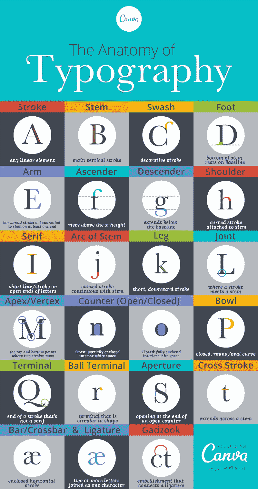

# 印刷术-字体剖析

> 原文：<https://www.freecodecamp.org/news/typography-anatomy-of-letterforms/>

字体的剖析描述了在一种字样中构成印刷字母的不同元素。下图显示了字体中字母的不同部分:

Source: [https://en.wikipedia.org/wiki/Typeface_anatomy](https://en.wikipedia.org/wiki/Typeface_anatomy)

根据[“字体解剖学”](https://en.wikipedia.org/wiki/Typeface_anatomy)，一个字形的排版部分如下:

> 1) x 高度；2)上升线；3)顶点；4)基线；5)上升器；6)横杆；7)梗；8)衬线；9)腿；10)碗；11)计数器；12)衣领；13)循环；14)耳朵；15)平局；16)单杠；17)手臂；18)竖条；19)瓶盖高度；20)下行线

一般来说，字体由三个主要部分组成:

1.  中风
2.  终端
3.  空间

### 中风

笔画是指字体的主体。它们可以是直的，如字母 *l* 、 *z* 、 *k* 、 *v* 或弯曲的，如字母 *c* 或 *o* 。笔画的不同部分如下所示:

*   大多数角色所在的假想线被称为**b**a 线**T3【4】。**
*   **基线(4):** 大多数字符所在的假想线
*   **Capline (19):** 另一条规定所有大写字符高度的假想线。这有时被称为**帽高**
*   标志小写字母顶端的假想线
*   **X-height (1):** 小写 *x* 字符的高度，代表基线到中线的距离。
*   字体的主要笔画，通常是垂直的或斜的
*   **横线(6):** 这些是连接大写字母中两条线的笔画，如 *A* 和 *H* ，或者小写字母中的横线 *t*
*   **上升器(5):** 当小写字母的笔画超过中线时，如 *l*
*   **一条**上升线**** **(2):** 描绘基线与上升线顶端之间距离的假想线
*   **下行:**当小写字母的笔画低于基线时，如 *g*
*   **D **下行线**** **(20):** 描绘基线与下行线底部之间距离的假想线
*   **肩:**有时也称为**拱**，这是一种弯曲的拱形笔画，类似于 *R* 顶部的笔画，也见于 *h* 、 *n* 和 *m*
*   **碗(10):** 像 *d* 、 *b* 、 *R、*D 和 *B* 中的那些弯曲、闭合的冲程
*   **腿(9):** 向下斜划，如 *K* 和 *R*
*   **横杠:**字母中不越过垂直线的短横杠，如 *e* 的中心， *E* 和 *F* 的中间笔画
*   **臂(17):** 像 *E* 和 *F* 中一个字顶部或底部的长横线
*   上面的圆点就像是 *i* 或 *j* 中的那个。这有时被称为**点**或**点**
*   在某些字体中，双层的底部开口或闭合的部分

### 终端

终端是笔画的结束，可以是**s**erif**或**sa**ns-**s**erif**。****

有螺纹的端子边缘有突起，可以描述为楔形、球状、泪珠状或平板状。另一方面，无衬线终端在笔画末端没有任何这些特征。

现在，无衬线被用于数字显示器，因为它们有更好的易读性，特别是在低分辨率显示器上，衬线终端很难描绘。

### 空间

空格指的是字母之间以及字母内部的空白，如带有闭环的 *o* 和 *p* 。

下面是一些基本定义，帮助你理解如何描述和测量类型。

## 描述和测量类型

### 字样与字体

这些术语通常可以互换使用。但是在排版的情况下，还是有差别的，不管多小。

字样是一组字形或字符，包括字母、数字和标点符号，具有独特的风格。常见的例子有 Arial、Times New Roman 和 Roboto。

字体是字样的一个小的、特定的子集，描述了字样是如何呈现的。例如，粗体 Roboto 8pt 是一种字体，而斜体 Roboto 12pt 是另一种不同的字体。

Source: [https://www.canva.com/learn/typography-terms/](https://www.canva.com/learn/typography-terms/)

### 类型系列

给定字体的不同选项，其中大多数至少包括粗体、斜体和罗马体。字体系列的其他示例包括浓缩粗体、浓缩黑色、超轻、浅色、常规、超轻斜体、浅色斜体、常规斜体等。

### 磅值

点是用来测量字体大小的。一点等于 1/72 英寸。当字符被称为 12pt 时，描述的是文本块(例如可移动类型的块)的整个高度，而不仅仅是字符本身。因此，根据字符在块中的位置以及字符填充块的多少，相同磅值的两种字体可能显示为不同的大小。

### 异嗜症

文本行通常是如何测量的。一个十二点活字等于 12 点，六个十二点活字等于页面或屏幕上的一英寸。

### 跟踪/字母间距和字距调整

这些元素控制字符之间的距离，并可用于调整易读性。

字距，或字母间距，是整个文本块(如杂志文章)中字符之间的间距。

字距是单个字符之间的间距。如果你曾经在编辑器中键入一个单词，并认为它看起来很差——字母要么靠得太近，要么离得太远——这可能是一个字距调整问题。

### 主要的

这是指文本行之间的垂直距离，从一条基线到下一条基线测量。