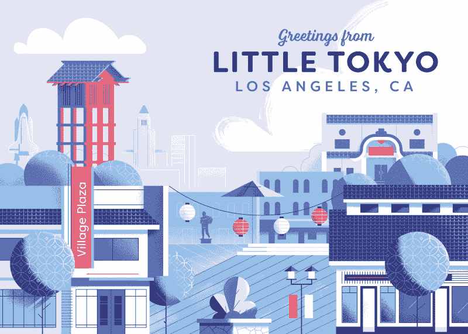
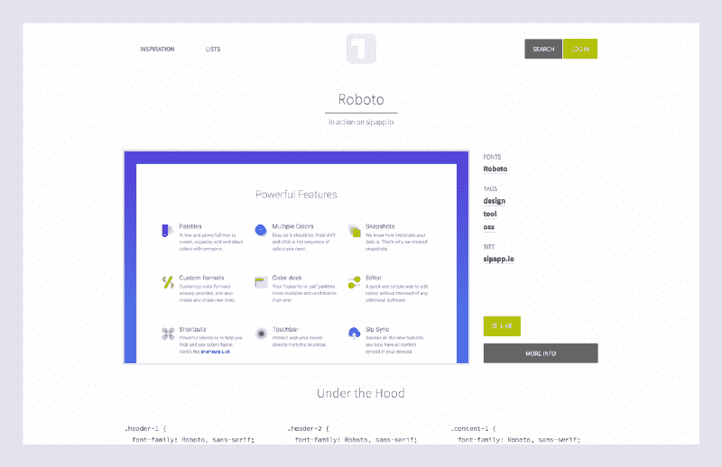
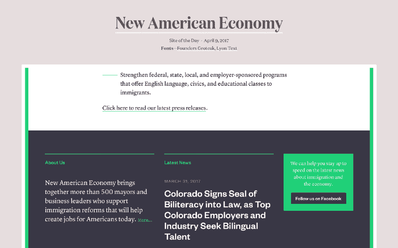
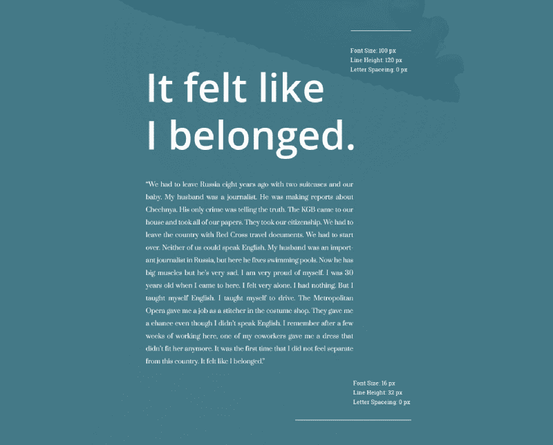
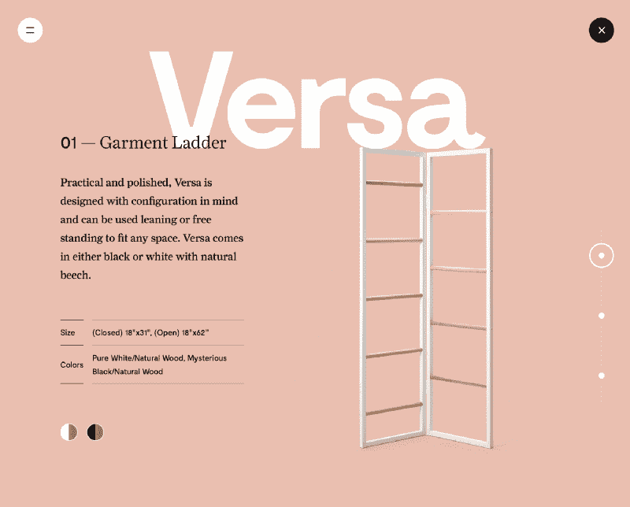
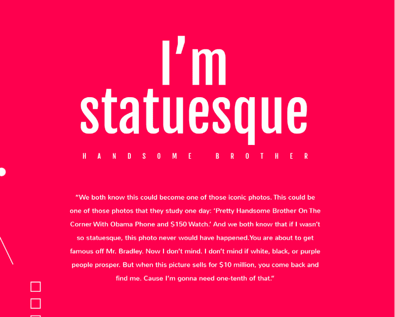
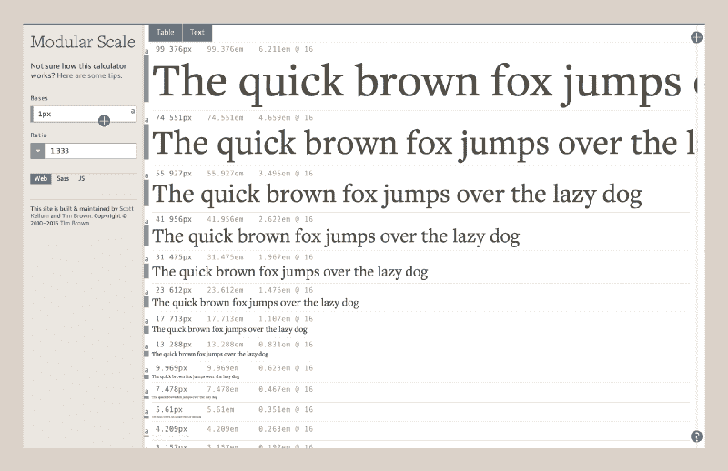
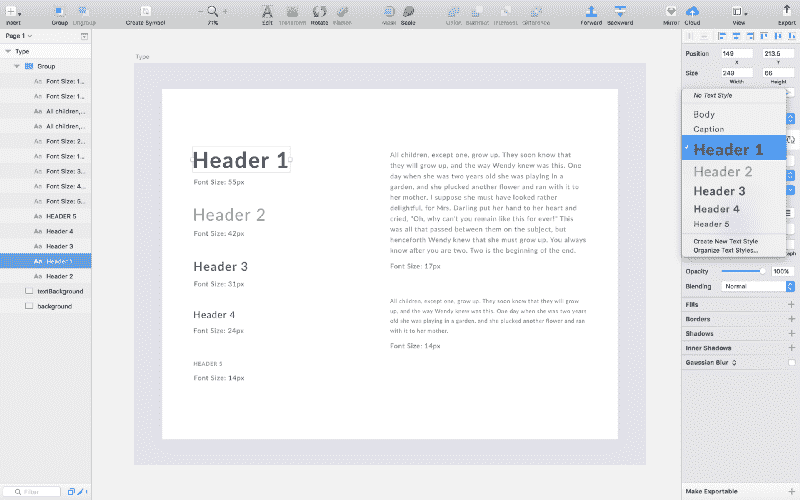
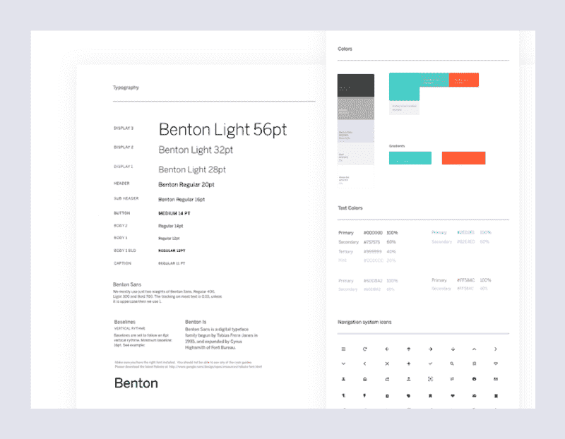

# 字体设计可以成就你的设计，也可以毁掉你的设计:选择字体的过程

> 原文：<https://www.freecodecamp.org/news/typography-can-make-your-design-or-break-it-7be710aadcfe/>

作为设计师，你能学到的最重要的技能之一就是如何选择字体。这是因为文本是设计师与用户交流的主要方式之一。字体设计可以成就一个设计，也可以毁掉一个设计。

印刷术有一种美感和复杂性。有些人把他们的整个职业生涯都献给了打字。谢天谢地，他们的工作有据可查，所以我们有大量的在线排版资源。

本文旨在作为帮助您学习如何为设计选择字体的起点。这将鼓励你去探索那些你不熟悉的字体和字体组合。

### 确定你的目标

在你做任何事情之前，首先确定你设计的目的。你想传达什么信息？你设计的媒介是什么？

好的设计会将排版与其目的相结合。这是因为版式是设计中设定情绪、基调和风格的关键。

例如，如果你正在设计一张插图很重的贺卡，选择一种适合你的插图风格的字体。使你的字体和你设计的其他部分协调一致。



[Choose a font that suits the style of your illustration](https://dribbble.com/shots/3403715-Little-Tokyo-Los-Angeles/attachments/743158)

如果你正在设计一个图片驱动的登陆页面，选择一个简单的字体，不会影响你的图片。使用类型作为一种强调信息来传达意思的方式。


[If images are the focus of your design, choose simple fonts so that the images stand out](https://dribbble.com/shots/3416904-Stripe-Atlas)

### 确定你的受众

确定设计目的后，确定你的受众。这一步至关重要，因为年龄和兴趣会影响你的字体选择。

在阐明你的设计目的后，确定你的受众。这一步至关重要，因为关于你的用户的信息，如年龄、兴趣和文化背景，可能会影响你对你的类型的决定。

比如有些字体比较适合孩子。在学习阅读时，儿童需要字体清晰、字体形状大方。一个很好的例子就是[沙宣初选](https://www.myfonts.com/fonts/mti/sassoon/)。《沙宣小学》是由[罗斯玛丽·沙宣](https://en.wikipedia.org/wiki/Rosemary_Sassoon)开发的，基于她对儿童觉得什么样的字母容易阅读的研究。


[Sassoon Primary was developed Rosemary Sassoon](http://www.sassoonfont.co.uk/aboutsassoon.html)

其他字体比较适合学长。高级友好字体使用可读的大小，高对比度的颜色，避免脚本和装饰风格。

选择类型时，要考虑你的听众和他们的需求。简单来说，**与你的用户**产生共鸣。

### 寻找灵感

看看其他设计师的作品。试着理解他们是如何决定字体的。

#### 字体灵感

关于字体的灵感，CreativeBloq 的《100 种最好的免费字体》是一篇很好的文章，可以帮助你正确选择字体。在文章中，CreativeBloq 解释了每种字体背后的动机。

另一个有用的资源是 Awwwards 的 2015 年 100 种最棒的免费字体。

Invision 还整理了一个[巨型的排版资源回购](http://blog.invisionapp.com/free-typography-resources/?imm_mid=0ef3cd&cmp=em-web-na-na-newsltr_20170322)。你会在那里找到很多灵感来源。



[Typ.io curates font inspiration from around the web](http://typ.io/)

要从实际网站中获得灵感，请查看 [Typ.io](http://typ.io/) 。该网站从网络上收集字体灵感。此外，该网站在每个灵感样本的底部提供 CSS 字体定义。

除了看专门的字体灵感网站，访问你最喜欢的网站，看看他们用什么字体。一个很好的工具就是 [WhatTheFont](https://chrome.google.com/webstore/detail/whatfont/jabopobgcpjmedljpbcaablpmlmfcogm?hl=en) 。WhatTheFont 是一个 Chrome 扩展，可以让你通过鼠标悬停来检查网络字体。

#### 配对灵感

除了字体，还要看看字体配对的灵感。字体配对和字体本身一样重要。良好的字体搭配有助于建立视觉层次，提高设计的可读性。



[Font pairing is just as important as the fonts themselves](https://www.typewolf.com/site-of-the-day/new-american-economy)

要获得灵感，先从 [Typewolf](https://www.typewolf.com/) 说起。Typewolf 从不同网站收集字体配对灵感。除此之外，他们还有字体推荐和深入的排版指南。这是印刷工人的宝库。

[FontPair](http://fontpair.co/) 还策划字体配对灵感，专门针对[谷歌字体](https://fonts.google.com/)。您可以按类型样式组合排序，如无衬线和衬线，或衬线和衬线。



最后，设计师在网上创建了大量的字体配对集合。例如[排版:谷歌字体组合](https://www.behance.net/gallery/35768979/Typography-Google-Fonts-Combinations)和[排版:谷歌字体组合第二卷](https://www.behance.net/gallery/41054815/Typography-Google-Fonts-Combinations-Volume-2)。在像 [Behance](https://www.behance.net/) 和 [Dribbble](https://dribbble.com/) 这样的网站上搜索“字体配对”就可以了。

### 选择你的字体

有了研究和灵感，你就可以选择你的类型了。在选择字体时，请记住以下原则:**可读性、易读性和目的性**。



[Before choosing a font, research into its intended purpose](https://www.typewolf.com/site-of-the-day/kvell)

选择常规且易读的字体。避免装饰性很强的字体，选择简单实用的字体。此外，要注意字体的用途。例如，有些字体更适合作为标题，而不是正文。

因此，在选择字体之前，先研究一下它的预期目的。



[Pair fonts that contrast one another](https://www.behance.net/gallery/41054815/Typography-Google-Fonts-Combinations-Volume-2)

在字体配对方面，保持简单，最多三种不同的字体。此外，将彼此形成对比的字体配对。这样做有助于引导读者的视线，首先是标题，然后是正文。您还可以使用不同的字体大小、颜色和粗细来营造视觉对比。

对于网页字体，可以使用[谷歌字体](https://fonts.google.com/)、 [Typekit](https://typekit.com/) 和[字体松鼠](https://www.fontsquirrel.com/)。谷歌字体是免费的，Typekit 和字体松鼠有免费和付费字体。

### 确定字体大小

确定字体组合后的下一步是确定大小。一个很好的工具是 Adobe 排版主管[蒂姆·布朗](https://twitter.com/timbrown?lang=en)的[模块标度](http://www.modularscale.com/)。模块标度是一种系统，用于识别历史上令人愉快的比率，以创建标度来确定字体大小。



[Modular Scale is a system for identifying historically pleasing ratios to create scales to determine type sizes](http://www.modularscale.com/)

例如，您可以使用基于黄金比例的比例。以下是您的前五个计算字体大小选项:

```
Golden Ratio (1:1.618)
```

```
1.000 x 1.618     = 1.6181.618 x 1.618     = 2.6182.618 x 1.618     = 4.2364.236 x 1.618     = 6.8546.854 x 1.618     = 11.089
```

你可能遇到的一个问题是你的比率太大了。看看我们基于黄金比例的音阶的后期间隔会发生什么。

```
Golden Ratio (1:1.618)
```

```
...11.089 x 1.618    = 17.94217.942 x 1.618    = 29.0329.030 x 1.618    = 46.97146.971 x 1.618    = 75.99975.999 x 1.618    = 122.966
```

如你所见，数字之间的间隔开始变得太大。对于大多数接口，您需要更小的间隔。谢天谢地，[模块音阶](http://www.modularscale.com/)有各种基于几何、自然和音乐的比例。

```
Minor Second    15:16 Major Second    8:9Minor Third     5:6Major Third     4:5...
```

因此，你可以不用黄金分割比率，而是使用一个产生更小间隔的比率，比如完美的四分之一。

```
Perfect Fourth (3:4)
```

```
...9.969  x 1.333     = 13.28813.288 x 1.333     = 17.71317.713 x 1.333     = 23.61223.612 x 1.333     = 31.47531.475 x 1.333     = 41.95641.956 x 1.333     = 55.927
```

一旦你确定了一个规模，你可以从你的列表中挑选字体大小，并四舍五入到最接近的小数。

```
Font Sizes
```

```
Header 1: 55pxHeader 2: 42pxHeader 3: 31pxHeader 4: 24pxHeader 5: 14px
```

```
Body: 17pxCaption: 14px
```

模块化比例方法使用数学精度来生成字体大小。然而，这只是一个指南。使用这种方法作为起点，然后用眼睛调整尺寸。

### 创建版式样式指南

该过程的最后一步是为您的排版创建一个样式指南，以帮助您在设计中标准化字体。



Shared styles in Sketch

在像 [Sketch](http://sketchapp.com/) 这样的程序中，您可以创建共享的文本样式来快速插入已经应用了指南样式的文本。

在这一步中，你可以调整和最终确定你的文本属性，比如颜色、粗细和大小。

关于颜色的一句话:选择颜色时，考虑你的调色板。为你的类型选择与你的调色板相协调的颜色。



[Use styleguides to standardize type across your designs](https://dribbble.com/shots/2641393-Organizer-UI-Styleguide)

在你的风格指南中，确保至少包括以下内容:字体定义、字体大小、字体颜色和示例用法。

谷歌的材料设计排版指南是一个很好的例子，说明了在样式指南中应该包含什么。其他几个例子包括 [Mailchimp](https://ux.mailchimp.com/patterns/typography) 、 [Apple](https://developer.apple.com/ios/human-interface-guidelines/visual-design/typography/) 和 [Focus Labs](https://dribbble.com/shots/2909744-UI-Kit) 的排版指南。

### 印刷术是关于实验的。这既是科学也是艺术

我向你挑战，打破你的舒适区，在你的设计中探索类型。

你最喜欢的字体是什么？给我留言或者在 Twitter 上给我发一条 [tweet](https://twitter.com/jonathanzwhite) 。

如果你喜欢这篇文章，你可能也会喜欢用阿芙罗狄蒂写的 Javascript 中的 CSS，阿芙罗狄蒂是汗学院的一个库。

[**Javascript 中的 CSS:基于组件的样式化的未来**](https://medium.com/@JonathanZWhite/css-in-javascript-the-future-of-component-based-styling-70b161a79a32)
[*本周，我想向大家介绍可汗学院的《阿芙罗狄蒂与 Javascript》中 CSS 的概念。阿芙罗狄蒂让……*medium.com](https://medium.com/@JonathanZWhite/css-in-javascript-the-future-of-component-based-styling-70b161a79a32)

你可以在我每周发表文章的媒体上找到我。或者你可以在 Twitter 上关注我，在那里我会发布一些关于设计、前端开发和虚拟现实的无聊言论。

如果你喜欢这篇文章，如果你点击？并与朋友分享。

