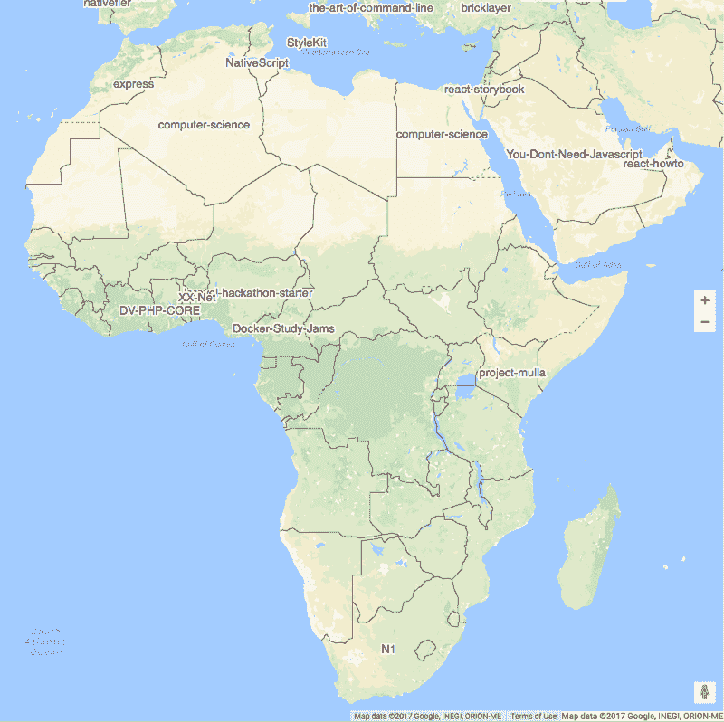

# 字体设计可以成就你的设计，也可以破坏它

> 原文：<https://www.freecodecamp.org/news/typography-can-make-your-design-or-it-can-break-it-c7cd50ca198c/>

这里有三个值得你花时间的链接:

1.  字体设计可以成就你的设计，也可以破坏它
2.  我一直听说的 GraphQL 是什么？( [12 分钟读数](http://bit.ly/2pqamdH))
3.  你应该相信谁的电影评级？IMDB、烂番茄、Metacritic 还是 Fandango？一名数据科学家调查( [12 分钟读数](http://bit.ly/2ovNhZI))

额外收获:《闯入初创公司》采访了我，内容是关于免费代码营的起源，以及为什么每个人都应该学习编码，如果他们想充分参与 21 世纪的经济( [56 分钟聆听](http://bit.ly/2omyw9z))

### 想到这一天:

> “程序。或者被编程。”道格拉斯·拉什科夫

### 每日一图:

除了昨天的分析之外，谷歌工程师费利佩·霍法[写了一篇后续文章](http://bit.ly/2oUYpQO)，提供了关于非洲最受欢迎的开源项目的更多信息。

在控制了前 75 个项目之后，以下是在 GitHub 上拥有至少 500 名开发人员的每个非洲国家最受欢迎的开源项目:

### 今日学习小组:

达卡自由代码营

编码快乐！

–昆西·拉森，自由代码营的老师

如果你从这些邮件中获得了价值，请考虑[支持我们的非营利组织](http://bit.ly/donate-to-fcc)。