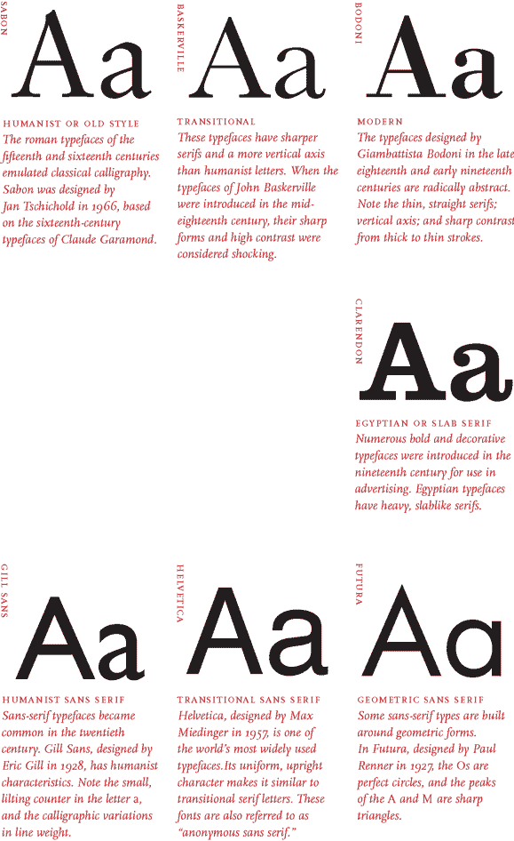

# 印刷术—字体系列、分类和组合字体

> 原文：<https://www.freecodecamp.org/news/typography-type-families-classifications-and-combining-typefaces/>

## **类型科**

字体系列是字体设计的范围。每个家族都是一种基本字母的变体。有数百甚至数千种字体系列。

参考样式:

### **历史**

当字体第一次被发明的时候，字体的概念还没有形成，所有的字体都是罗马字体。在 16 世纪早期，草书字体被引进。草书也被称为斜体，以意大利命名，这种想法在意大利很流行。罗马体是一种字体，斜体是另一种，就像衬线和无衬线一样，而且仍然没有字体家族。

### **标点符号**

标点赋予字体情感，并指示何时停止、放慢等等。

### **有七种字体系列**

*   旧历法
*   过渡期的
*   现代的
*   平板衬线
*   无衬线字体
*   装饰的
*   手写草书

## **组合字体**

### 字体配对基础

哪些字体搭配起来好看，哪些不好看？如果你曾经纠结于这个问题，你并不孤单。通过熟悉这些巧妙的组合，学习如何搭配不同的字体和风格！

### 逐一尝试这些步骤

*   将常规字体和粗体字体配对，形成微妙的对比
*   用粗体字平衡字体
*   将高字体和短字体配对，创造视觉趣味
*   将不同粗细的字体配对，形成强烈的对比
*   将常规字体和斜体字配对，以强调重点

选择字体没有严格的规则，但是你可以通过设计现有字体的样式来创建视觉层次，从而避免选择新字体。当有疑问时，保持简单。

设计师遵循不同的理念来决定何时以及如何组合字体。

### **主播或角色字样**

如果您的项目包含大量文本，请为正文文本选择一种锚点字体。这种锚字体将指导你的设计选择，因为你对不同的锚字体组合进行不断的测试和改进。

### **对比字体**

对于轻文本项目来说，字体层次角色的清晰并不像视觉效果那样重要。配对对比字体，如衬线加无衬线。设计师经常分享他们最喜欢的字体对，所以搜索和试验，直到你创造一个令人满意的结果。

### **字体系列**

许多铸造厂生产的字体具有大量的额外功能，如多重字体、装饰性字形、衬线字体和无衬线字体等。您可以使用像这样的单一字体系列来确保一致的设计，同时创造性地使用那些额外的功能来提供额外的强调或装饰，否则可能需要另一种字体。字体系列通常是视觉一致性和排版灵活性的巨大妥协。

## **类型分类**

几乎所有的字体都属于这一类或那一类。这种字体分类系统发展于 19 世纪。每种字体都有自己的视觉结构、影响、意图和历史意义。

字体的基本分类如下:

*   ****衬线**** :这些字体有小的延伸，修饰一个字体的基本结构。衬线字体从印刷术开始就存在了。它们在旧风格和人文主义风格的衬线中可见，如 Garamond。巴斯克维尔，另一种衬线字体属于过渡时代。Bodoni 和 Rockwell 是现代和平板衬线(埃及)风格字体的一部分。
*   ****Sans-serif**** : Sans 表示没有。这些字体没有那些小的扩展，因此没有衬线。比如具有人文主义内涵的《吉尔桑》和具有过渡特征的《Helvetica》等。
*   ****手写体**** :与人类笔迹发展密切相关的字母形式为手写体。它们在本质上是灵活的，具有不同的笔画宽度。例如:Bistro Script、Shelly、Minstral 等。
*   **:文艺复兴时期大量使用的一种粗体书法风格。例如:Fraktur**
*   ****:不属于其他类别的字体，本质上是装饰性的。专为主要由标题、海报等组成的特定用例而构建。****

****此外，对应于艺术和文学中不同时期的三种主要类型分类如下:****

*   ********人文主义者**** 书信形式属于 15 世纪左右的文艺复兴时期&16 世纪。他们密切模仿书法和人手的动作。旧衬线遵循人文主义的字母形式。人文主义类型的例子有:萨邦，半人马，阿杜卜简森，吉尔桑斯等。****
*   ******过渡性**** 字母形式是巴洛克时代的一部分。它们代表了从旧式人文主义字体到现代字体的过渡。例子有:巴斯克维尔，时代罗马，Helvetica 等。**
*   ******现代的**** 字母形式，是 18-19 世纪左右启蒙运动时期的一部分。它们描绘了从传统印刷到更抽象设计的彻底转变。例如:Bodoni、Futura 等。**

**

Source: [Thinking with Type](http://thinkingwithtype.com/) by Ellen Lupton**